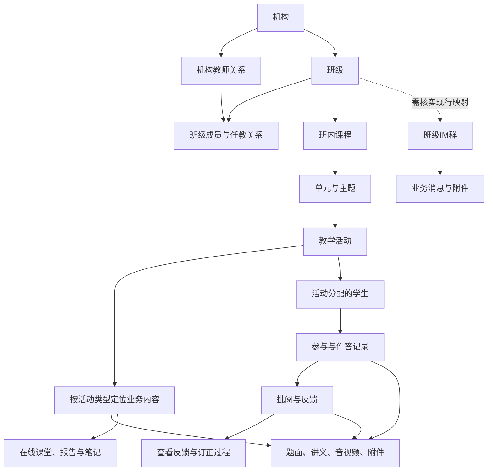

# ClassIn 教学数据地图

**ClassIn 已有较完整的教学对象、参与过程和反馈数据结构，可以据此系统地定义 Copilot 的可问范围。** 本轮把这些结构整理成业务地图和字段字典，标明关联关系、状态、内容载体及未确认部分。接住老师的开放问题，需要能找到、读懂并引用相应证据；不要求每次对话都把整个班级的数据一次性塞给模型，也不能承诺每个问题一定有业务答案。

本轮只读核验 **55 张原始业务表、23 张数仓视图，共 78 个表/视图、1,381 个字段条目**。原始和数仓会重复承载同一事实，数字不是独立教学概念数量。已逐列列出本范围的字段；没有宣称覆盖 ClassIn 全库，尚未穷举 JSON 内部属性、所有报告服务和全部业务规则。

## 1. 与用户行为深度研究的关系

| 研究 | 主要回答 | 交付方式 |
| --- | --- | --- |
| [V2 活跃课程教学链路研究](../../../classin-ai-harness-v2/docs/01-research/CLASSIN-ACTIVE-COURSE-TEACHING-CHAIN-ANALYSIS-2026-09-13.md) | 有多少课程配置活动、学生是否使用、教师是否批阅、反馈是否被查看 | 特定观察窗、样本总体、分母、比例和使用落差 |
| 本数据地图 | 一门课及其教学过程可以知道哪些事实，字段如何解释，哪些内容能支持老师的问题 | 业务对象关系、逐字段字典、证据链与回答边界 |
| [通用提问设计清单](../04-specs/features/workbuddy-im-collaboration/COPILOT-GENERAL-QUESTION-GUIDANCE-CONTENT-DRAFT.md) | 如何让老师知道能问什么 | 面向老师的问法、预期回答、追问及页面引导候选 |

三者可以相互引用：数据地图定义“可寻找什么”，样本和统计验证“实际记录得怎么样”，产品设计决定“怎样向老师表达”。前两者不能省略为一张字段列表，也不能把总体使用比例写成当前班级事实。

### 本轮证据层级

| 层级 | 已完成什么 | 尚不能证明什么 |
| --- | --- | --- |
| 结构 | 在线字典检索＋实际 describe；关键基础表另核对联合键及元数据注释 | 字段都有值、所有班级都使用、任意教师都有权读取 |
| 语义 | 已登记含义、状态、类型、时间及主要关系；冲突另列 | 未定义枚举、全部 JSON schema、所有版本规则 |
| 内容 | 引用独立的[测试 API 原文样本](./COPILOT-GENERAL-QUESTIONS-API-EVIDENCE-2026-09-15.md)和[DW 业务样本](./COPILOT-GENERAL-QUESTIONS-DW-EVIDENCE-2026-09-15.md) | 本轮没有新增全班业务行采集，不能把不同教师样本拼成同一班级 |
| 产品 | 对照原版/V2现有读取边界并映射可问问题 | 新字段已接入原版、真实模型已完成端到端回答 |

原始库的元数据权限与业务记录权限分别管理。本轮成功取得原始结构，没有因此读取未经授权的原始业务行；数仓是延迟数据，实际可用日期、刷新及保留周期需要逐表核对。

## 2. 全局业务结构

实线表示数据字典中的主要业务关联，不代表数据库外键或本轮已经验证了所有业务行的关联命中率。单元可为“无主题单元”；图中的纵向层级不能替代对实际归属字段的核对。

### 七个必须分清的对象

| 对象 | 业务意义 | 数据识别方式与边界 |
| --- | --- | --- |
| 机构 | 当前教师所服务的组织 | 机构主表 uid 对应各表 school_uid；同一人可有多机构关系 |
| 教师 | 有机构身份，并在班级/课节中承担角色的人 | 全局 teacher_uid 与机构教师 st_id 分开；创建人、班主任、活动老师、课节主讲/助教不是同一关系 |
| 班级 | 成员共同学习、多门课程所在的组织容器 | 多数业务表 course_id 实际表示班级，不是下一级课程 |
| 班内课程 | 班级下的课程分类，如数学、物理 | lms_category.id；活动的 category_id；不同于班级主表的外部 category_id |
| 单元 | 课程内内容组织与排序 | lms_unit.id；单元可能包含多种、多次活动，不自动等于一讲或一节课 |
| 教学活动 | 一次课堂、一份作业、一次测验等 | lms_activity.id；通过 biz_type＋biz_id 下钻，两个ID不能互换 |
| 学生与活动关系 | 这项活动具体分配给谁，以及他做了什么 | activity_id＋student_uid；不能用全班当前人数统一代替所有应到、应交、应考人数 |

### 关联核验规则

1. 先确认教师的机构与可访问班级，再定位班内课程、活动和学生；班级成员身份、实际任课关系与服务端访问权限分别验证。
2. 活动按类型确定业务主键：课堂 biz_id→class_id，作业→homework_id，测验→exam_id等。相同数字在不同类型中不是同一对象。
3. 子表没有机构/班级键时，从已确认活动取得业务ID再下钻；跨表保留来源，不凭学生姓名或活动标题拼接。
4. 当前成员、历史成员、某次活动分配名单和当时有效名单分别处理。跨活动人次不可当作去重学员数。
5. 课堂到课程需经过LMS课堂活动；关联未命中时保留已知班级和课节，不推断其没有班级。参见[V2关联复核](../../../classin-ai-harness-v2/docs/01-research/CLASSIN-CLASSROOM-COURSE-RELATION-REVIEW-2026-09-14.md)。
6. 同单元、同一周的作业可能与课堂相关，但不是已验证的“这节课布置的作业”。逐课配套需显式关系或可核验正文。

## 3. 数据字典入口与覆盖

进一步理解教学活动的类型、关键参数、老师操作、学生参与与反馈时，阅读[教学活动业务下钻](./CLASSIN-TEACHING-ACTIVITY-BUSINESS-DEEP-DIVE-2026-09-15.md)。它覆盖 15 类活动，另附[作业、测验与答题卡规则分册](./CLASSIN-TEACHING-ACTIVITY-ASSESSMENT-RULES-2026-09-15.md)，区分字段已经明确的业务事实与尚需真实页面/接口核验的操作流程。

| 分册 | 范围 | 已核验结构 |
| --- | --- | --- |
| [组织、成员、班级与课程](./CLASSIN-TEACHING-DATA-FOUNDATION-DICTIONARY-2026-09-15.md) | 机构、机构师生、班级、成员、用户展示信息、课程分类、单元 | 8张原始表202列＋1张班级数仓视图39列 |
| [活动内容、学生参与与批阅](./CLASSIN-TEACHING-DATA-ACTIVITIES-DICTIONARY-2026-09-15.md) | 活动壳、分配、扩展、附件、各类活动业务主表与学生明细/日志 | 42张原始表649列＋12张数仓视图238列 |
| [课堂、报告、参与与消息](./CLASSIN-TEACHING-DATA-CLASSROOM-DICTIONARY-2026-09-15.md) | 课节、应到关系、停留/出入、互动、点评、回放、IM关系和消息、AI会话 | 5张原始表84列＋10张数仓视图169列 |

每个字段列出名称、类型、业务意义；原始表还包含可空与键标记。状态枚举、单位、缺失解释及不可靠字段就地说明。结构分册是带核验日期的研究成果；后续正式查数仍应检索在线最新字典并核对实际元数据。

### 教学活动全景

| 类型 | 可以定位的内容和结果 | 当前结构覆盖或缺口 |
| --- | --- | --- |
| 1 课堂 | 排课、应到师生、实际出入、互动、点评、回放 | 核心表已核验；完整课堂题目、报告正文及转写仍需补映射 |
| 2 作业 | 要求、答案、学生提交、批阅、打回、订正、过程日志 | 主表/学生/日志已核验；图文与日志版本需实际解析 |
| 3 测验 | 发布、试卷、题库来源、学生结果、客观/主观作答 | 新旧试卷与题源分开；逐题和满分换算需实际对账 |
| 4 录播 | 视频配置、学生状态、逐视频观看时长和进度 | 累计时长、有效时长、播放位置不同；完播规则待核 |
| 5 学习资料 | 资料内容/附件、分配、首次查看与次数 | 可说明查看，不自动说明读完或理解 |
| 6 讨论 | 活动目录及可能的扩展内容 | 本次未定位完整讨论正文/回复结构，列为缺口 |
| 7 答题卡 | 题目配置、答案、客观/主观学生结果、选项分析 | 是否包含完整题干、题号与实际题目的关系需核验 |
| 8 打卡 | 频率、应打天数、按日记录、提交与反馈 | 提交次数≠天数；补卡、订正和完成规则独立 |
| 9 SCORM | 课件、学习状态、通过/完成、报告载体 | 具体课件报告格式及进度单位需解析 |
| 10–15 英语/语文学科活动 | 跟读/口语卡、背诵、听写、朗读；题目、音频、AI/教师评测 | 共用表族；不同类型状态适用性、评测量纲和JSON版本待核 |

机构计费、登录设备、财务、CRM和全平台运营指标不属于本轮教学问答地图主体。机构表中与教学无关的列为结构完整性保留，但不进入教师教学上下文。

## 4. 反推能够承载的问题

下表表达数据条件满足后的能力，不是当前原版功能已可用的承诺。每个问题先按当前教师、班级、课程和时间范围取证，再给结论。

| 老师的问题 | 最小证据链 | 可以给出的结果 | 关键限制 |
| --- | --- | --- | --- |
| 我们班有哪些课，接下来学什么？ | 班级→课程分类→单元→已发布计划 | 分课程进度与后续安排 | 计划顺序不代表实际讲完或学生掌握 |
| 这个班有多少孩子？这份作业布置给谁？ | 当前成员＋活动分配 | 分别给在班人数、分配人数、名单差异 | 不使用有争议的累计人数列代替 |
| 我准备的资料学生看得到吗？ | 课程/单元/活动可见性＋分配＋访问规则 | 草稿、隐藏、发布及对象范围 | 已发布不自动等于所有学生可见 |
| 第三讲具体要做哪几页，怎么交？ | 作业正文＋附件＋提交配置 | 原文页码、题号、提交方式、截止日期 | 看见图片引用还不等于理解题面 |
| 谁没交，哪些交了还没批？ | 活动名单＋有效学生提交＋批阅状态 | 未交、待批、打回、已批列表 | 草稿、补交、重交和删除记录分别处理 |
| 他上次提交后，老师怎么反馈的？ | 学生作业ID→操作日志→对应文字/附件 | 按时间引用提交、反馈、订正 | 日志操作人可能是老师，不能只按学生UID筛日志 |
| 哪些同学还没看我的反馈？ | 有效批阅＋批阅后查看事件/状态 | 有依据的已查看/未观察到查看 | 需验证时间顺序和协议，不等于学生没有理解 |
| 这份测验主要考什么？ | 试卷题序、题源、题干、答案与解析 | 考点、方法与讲解建议 | 这是内容分析，不是已发生的班级错题统计 |
| 哪道题错得最多，谁卡在哪一步？ | 原题＋有效作答＋逐题判定/批阅＋分母 | 错题分布和过程分析 | 未作答不是答错；整体分数不是逐题正确率 |
| 这位学生比上次进步了吗？ | 两次可比任务＋口径一致的结果/过程 | 具体可比变化及依据 | 不同难度、量纲、未评分记录不可直接比较 |
| 谁没到，谁中途离开了？ | 本课应到名单＋计划/实际时间＋进出明细 | 截至某时点的出入与停留 | 数仓不回答此刻实时缺勤；离开原因不能猜 |
| 最近课堂参与怎么样？ | 多课节互动事件＋动作解释＋参与机会 | 观察到的举手、答题、上台等 | 次数不是注意力或理解程度 |
| 录播还差哪一段没看？ | 分配＋逐视频有效观看片段/状态 | 未开始、已看片段、待看片段 | 最大播放位置≠连续看完 |
| 学习资料大家看过了吗？ | 分配＋学生首次查看/次数 | 已观察到的查看记录 | 不说“都学会了” |
| 本周打卡漏了哪天，能补吗？ | 活动频率＋有效日期＋学生按日记录＋补卡设置 | 缺失日期与可补规则 | 一次提交不能完成整周期 |
| 英语哪些词值得再练？ | 题目＋学生音频＋逐项评测＋教师反馈 | 有出处的练习建议 | AI评测与教师批阅分清；无转写不编造发音原话 |
| 这节课讲了什么，帮我整理回顾 | 可读笔记/课件/板书/报告/转写 | 有来源范围的知识点与课堂回顾 | 课名、截图数量或报告存在性不足以完整回顾 |
| 群里上次布置了什么？ | 现行班级群映射＋授权历史消息＋消息协议/附件 | 引用原消息和要求 | 撤回、编辑、保留期限及msgdata解析尚需核验 |
| 把刚才的情况整理成通知 | 对话中已确认事实＋接收对象＋消息意图 | 教师可审阅的消息正文 | 查信息不自动转消息；发送仍由教师确认 |

这些证据能够扩充五组通用引导，尤其是“反馈是否查看”“订正过程”“录播片段”“打卡”“学科评测”“群消息追溯”。不必为每一种数据库表新增一个UI入口；按老师的任务组织问题，后台按事实关系取数。

## 5. 内容理解需要再走一层

| 已取得的数据 | 能确信什么 | 要回答教学内容还需要什么 |
| --- | --- | --- |
| 标题、数量、状态 | 有此对象、数量或状态记录 | 具体正文和有效对象范围 |
| 文字正文 | 原文表达了什么 | 归属、版本、可见性；引用原文与AI解释分开 |
| JSON/HTML | 有结构化载体 | 按类型/版本解析题序、答案、公式和资源；未知键保留未解析 |
| 图片/PDF引用 | 有资源指针 | 授权获取、OCR或视觉理解、页码/区域定位；识别失败需可见 |
| 音视频与观看记录 | 有录制或观看事实 | 字幕/转写/多模态内容与时间片段；观看事实不能替代授课内容 |
| 报告存在标志 | 报告可能已生成 | 报告正文、生成时间、作者/模型来源和所用数据范围 |

对每次用于回答的事实，建议保留：**所属对象、来源记录、发生时间、查询/快照时间、原文位置、解析版本、完整性、可见范围**。这些是未来取数结果需要携带的说明，不是已实现的新数据库字段，也不需要全部展示给老师。正常回答显示必要日期与可引用出处；有缺口时说明影响。

## 6. 不能省略的口径与缺口

| 优先项 | 本次发现 | 需要核验后才能做的承诺 |
| --- | --- | --- |
| 角色和人数 | 成员实测user_id；student_num人数/容量含义冲突；部分历史学情累计列被标不可靠 | 当前全班人数、应到/应交分母、老师所有可见班级 |
| 状态分离 | 发布、时间进展、学生提交、教师批阅分别有字段；作业某is_done枚举与直觉相反 | “结束=完成”“已发布=学生可见”等统一状态映射 |
| 学科活动版本 | state/is_done适用范围：105.7写11–15，010写10–15 | 全类型统一完成判断 |
| 评分口径 | 原始作业字典已补5=分数，旧数仓注释只到4；不同rate/score单位不同 | 正确率、跨作业排名、进步趋势；补上5不代表百分制已验证 |
| 时间与历史 | 计划、实际、最后提交、首次提交、批阅时间和入仓时间不同 | 首次迟交、截止瞬间未交、实时缺勤、历史名单 |
| 字段差异 | 原始活动passing_score、录播部分观看设置、朗读answer_ext没有出现在对应数仓视图 | 用数仓字段全集替代业务API完整语义 |
| IM数据 | 3个视图可describe；用户群关系实测27列，与旧字典“待创建37列”不符 | 群消息全文理解、精确已读、可靠现行班级群映射 |
| 正文与资源 | 讨论回复、报告全文、板书/课堂逐字稿映射未完整；IM正文协议存在冲突 | “掌握班里所有教学内容” |
| 权限 | 数据可查询、老师可访问、学生可查看答案、允许发到群里是不同规则 | 跨课程/学生/群聊自动共享内容 |

“没有记录”“尚未发生”“无访问权限”“接口失败”“只取到一部分”“解析失败”“已核实为0”必须分别表达。对开放问题可以给可确认的部分和下一步；不要求老师反复补充系统本可自动读取的材料，也不在缺证据时编出流畅答案。

### 把结构转成可用问答的推进顺序

1. **确认字段语义**：将上述冲突交给对应业务/数据负责人核准，建立逐字段的有效版本与口径；现有结构字典可直接作为核对底稿。
2. **验证一条完整取数链**：选获授权教师及班级，取课程、单元、活动、分配、提交、批阅、资源和消息；记录空值、缺页、关联不匹配和内容解析结果。统计研究的“活跃”筛选不作为问答排除未开课/零参与课程的条件。
3. **验证代表性回答**：先完成“作业要求→提交→反馈”“资料原文→解释→消息”“课节→参与→回顾”三条链；每条都校验同义问法、追问对象、时间范围和出处。
4. **再扩大边界**：多课程、多教师、旁听/离班、重交、跨日、隐藏/撤回、订正、图片/音视频和无数据场景。
5. **最后投影到产品引导**：只将当前班级证据足够的问题作为具体示例；其他主题仍可自由问，按实际覆盖回答。新交互与接入行为另走PRD/Spec/Tickets，不在这份研究里宣称已实现。

## 7. 本次完成与来源

已完成教学主结构、78个表/视图的完整列清单、主要关系与枚举解释、原始/数仓差异、可问问题映射、内容解析和业务验证缺口。三个分册分别记录在线知识库来源与2026-09-15元数据核验范围。

主要一手依据为在线数仓知识库的业务术语、全局查询指南、基础业务、课堂、LMS各子活动、AI应用及IM聊天字典，以及实际只读元数据返回。已有API内容研究提供限范围原文证据；V2行为统计与关联复核提供研究背景，不替代本轮结构核验。

本轮未修改应用代码、模拟数据、V2项目或服务端口，未读取或提交个人业务原文、密钥与凭据。字段清单不代替正式业务API合同；完整率、可解析率、权限和端到端回答仍待后续取数验收。
