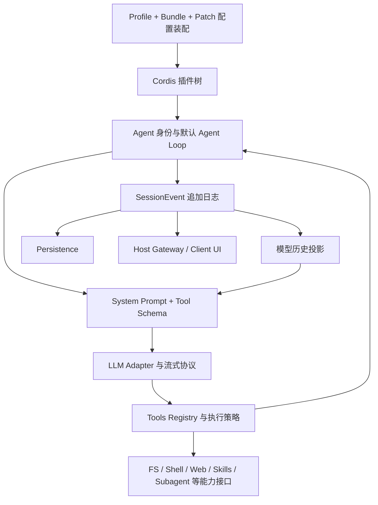

# DeepSeek Harness 上游框架与演进盘点

日期：2026-09-05。状态：研究记录 / RECOMMENDATION；不改变 LOCKED 决策。

范围：只核对官方源码、官方文档与项目运行配置。Write Set 仅本文件；不更新 vendor、不修改运行配置、不调用收费模型。此盘点不代表本轮完成运行时或生产验收。

## 1. 版本与命名

官方名称是 **DeepSeek Harness**，CLI 简称 **dsh**。本轮检查的官方 README 没有将 DVC Harness / DBC Harness 定义为别名，因此不据此拆成多个框架。[官方仓库](https://github.com/deepseek-ai/deepseek-harness)

| 对象 | 本轮核验结果 | 证据 |
| --- | --- | --- |
| 本地 vendor | `0.1.1-rc.2`，commit `b150a551b8d465e31e418e1b2eaf5e79bbb7d28e`，提交时间 2026-08-21 20:03:37 +08:00 | `git -C vendor/deepseek-harness rev-parse HEAD`、`git log -1`、本地 package.json |
| vendor 工作树 | 本轮 `git status --short` 无输出 | 仅说明 vendor，无关父仓库已有修改 |
| 上游 HEAD 快照 | `d347e703908d0406b7a7ef80e3a0e594d86b2215`，root package 版本 `0.1.3-alpha.1` | `git ls-remote origin HEAD` 与该 commit 的官方 raw package.json |
| 发布稳定性 | 官方仍标明 developer preview，会有不兼容变更 | 官方 README |

上游 HEAD 不等于 npm 稳定版，也不等于本项目已经升级。本轮未逐条比较两个 commit 间所有改动，不推断新版修复了哪些本地问题。[本地固定版本对应官方源码](https://github.com/deepseek-ai/deepseek-harness/tree/b150a551b8d465e31e418e1b2eaf5e79bbb7d28e)、[上游 HEAD 的 package.json](https://github.com/deepseek-ai/deepseek-harness/blob/d347e703908d0406b7a7ef80e3a0e594d86b2215/package.json)

## 2. 框架基本结构

下表为**本地固定版本**的源码事实，主要依据 [architecture.md](../../vendor/deepseek-harness/docs/architecture.md)、[subsystems 索引](../../vendor/deepseek-harness/docs/subsystems/README.md) 与 [capability seams](../../vendor/deepseek-harness/docs/capability-seams.md)。模块存在不表示教师现在可以使用。

| Module | 作用 | 主要 Interface / 替换点 |
| --- | --- | --- |
| Cordis / boot / bundles | 装配插件、服务依赖、事件和随插件卸载撤销的注册；不是只能扩展工具的固定内核 | 插件 Context、配置行、Profile/Bundle |
| core/agent + agent-loop | 前者定义 Agent 身份、状态和事件；后者驱动一轮内的模型与工具循环 | `ctx.agents`、`ctx.agentLoop`、`agent/*` |
| core/session | 追加会话事实；从日志重建模型历史和 UI | `ctx.sessions`、`SessionEventMap`、`deriveMessages()` |
| system-prompt + scope | 组合提示词和工具 Schema，并把注册限制到对应 Agent 作用域 | `ctx.systemPrompt`、Agent Context |
| llm | 统一消息、流式 chunk、Provider 调用边界 | `ctx.llm`；DeepSeek、其他 Adapter、Replay |
| tools | 工具发现、参数 Schema、执行拦截和结果回传 | `ctx.tools`、`tools/pre-execute` 等事件 |
| persistence / storage | 前者负责 Session 日志持久化；后者提供非 Session 数据存储接口 | JSONL / SQLite 等 Provider，不能混为业务数据库 |
| compaction / token-meter / spill | 压缩历史、测量上下文、外置长文本结果；压缩也是可选能力 | `ctx.compaction` 等；策略可以独立替换 |
| skills / web / filesystem / subprocess / shell / terminal | 任务知识装载与外部操作能力 | 每个能力的服务定义、Provider、消费者工具 |
| approval / sandbox / credentials | 人工批准、进程和文件策略、凭据解析 | 各自的服务与 Provider；不同责任不能仅靠 Prompt 代替 |
| subagent / jobs / workflow / goal / schedule | 子任务、后台工作、流程、目标和提醒 | 独立能力 Interface；实验性 Agent Teams 是显式 opt-in |
| host / client / Typert | Host 调用网关、类型化远程边界和浏览器投影 | Host 服务、Client 模块和会话事件 |
| telemetry / feedback / invariants | 运行记录出口、反馈和可检查运行不变量 | Sink / redaction / invariant 注册接口 |
| extensions | 版本化动态 Cordis 插件、Host/Client 激活、生命周期与审批 | 动态包注册和运行接口 |

上游一轮执行并非“一次调用模型”：一个 turn 可以包含多个 step，每个 step 包含一次模型请求和其工具调用。工具结果需要继续处理时，进入下一 step；流式事件与最终消息进入 Session 日志。上游设计要求模型可见内容能够从日志重建。[固定版本架构与执行流程](../../vendor/deepseek-harness/docs/architecture.md)

## 3. 配置扩展与 TeachBuddy 的实际边界

Profile 决定 Bundle 顺序；Bundle 提供插件行。配置按 Bundle、Profile patch、Home patch、CLI patch 的顺序叠加。**patch 替换一整行 config，不做深合并**，因此局部改字段时必须保留需要继续生效的其他字段。[固定版本 base bundle](../../vendor/deepseek-harness/packages/bundle/base/README.md)

本项目在 [cordis.patch.yml](../../runtime/harness/cordis.patch.yml) 禁用原 agent-presets 行，插入 TeachBuddy preset 和教学草稿插件；切到 native tools，禁用 code-runtime 与 file-reference-local；配置 localhost 服务、read-only sandbox 和 ask approval。[TeachBuddy Persona](../../runtime/harness/presets/teachbuddy/agent.cordis.yml) 明确不承诺真实 ClassIn 数据、联网、Shell 或其他 Agent。

最关键的代码边界是 [teaching-tools.mjs](../../runtime/harness/teaching-tools.mjs)：`teachingToolGuard` 仅放行 `create_teaching_draft`，通过 `ctx.tools.guard` 安装。该工具支持 Markdown / HTML / TXT / JSON 草稿。保存草稿不是课程发布或业务写回。

应区分三个层级：**源码有这个包 → 配置装载了服务 → 当前任务允许调用并有产品入口**。例如 base bundle 中有 Skills、Subagent、压缩等包，不能据此声称 TeachBuddy 已开放多 Agent 或 Skill 执行；同样，工具受限不等于后台压缩等全部服务都被卸载。base telemetry 也写明默认禁用，不能把已装载 Sink 解释为已向外发送。[base 配置](../../vendor/deepseek-harness/packages/bundle/base/cordis.patch.yml)

## 4. 可持续演进建议

以下是基于现有 Seam 的建议，尚未作为项目决策锁定。

| 优先方向 | 放在哪里 | 验证什么 |
| --- | --- | --- |
| 教学任务能力逐条扩展 | 新教学 Tool + 对应业务 Adapter，避免修改 Agent Loop | 输入约束、草稿质量、拒绝越权、幂等与失败恢复 |
| 教学 Context 检索与压缩 | Context 构建层、Prompt 注册、Compaction Provider | 来源可追溯、事实保真、长对话目标保持、成本与延迟 |
| 模型及推理策略调整 | LLM Adapter / 请求策略 | 相同教学案例集上的产出质量、工具参数正确率、响应耗时 |
| 真实 ClassIn 连接 | 项目业务 Interface，显式 ProposedAction / Approval / Receipt | 教师授权、对象版本、执行幂等、部分失败和恢复 |
| 后台与并行工作 | Jobs / Subagent Provider，按具体任务启用 | 父子任务取消、预算、结果合并、重复执行和权限继承 |
| 更强观测与评价 | 事件投影、Feedback、脱敏后的 Telemetry Sink | 以任务成功率与教学质量衡量，不能只统计 Token |
| 生产运行基础设施 | Persistence / Sandbox / Credentials Provider 和服务部署层 | 多用户隔离、恢复、迁移、限流；上游接口存在不代表已具备生产能力 |

模型协议也是升级边界。例如当前 DeepSeek 官方文档对带 tools 的思考模式请求要求完整回传相关 `reasoning_content`，缺失可能触发 400；这类协议差异应由 Adapter 与契约检查覆盖，避免业务 UI 自己拼消息。[DeepSeek 官方 Thinking Mode](https://api-docs.deepseek.com/guides/thinking_mode/)

建议升级流程：固定候选 commit → 比较配置行与 Interface → 在隔离环境重建 → 跑现有运行契约、草稿幂等、取消恢复与产品场景检查 → 确认存储兼容 → 才替换当前固定版本。可借用上游已有 runtime invariant、snapshot/replay、类型/文档一致性检查方法；这些检查工具的存在不等于本项目已经全部启用。[上游固定版本 package scripts](../../vendor/deepseek-harness/package.json)、[runtime invariants](../../vendor/deepseek-harness/docs/subsystems/invariants.md)

## 5. 验证与局限

- 已核对本地固定 commit、vendor 工作树、关键架构文档、base 配置、TeachBuddy patch/preset/tool guard，以及在线官方 HEAD 和根版本。
- 未读取凭据内容，未改动配置，未启动另一个 Harness 实例，未执行模型或业务操作。
- 本轮不证明实际启动进程使用的配置完全等同于静态文件；需要时应检查该进程对应的有效配置与运行事件。
- 未完成新版全量差异评审，也未核验 npm dist-tag，不能称上游 HEAD 为最新稳定版。
- 文件基于本轮源码快照；已有的父仓库未提交修改作为当前现场保留。后续实现改变时应重新核对实际启用清单。
