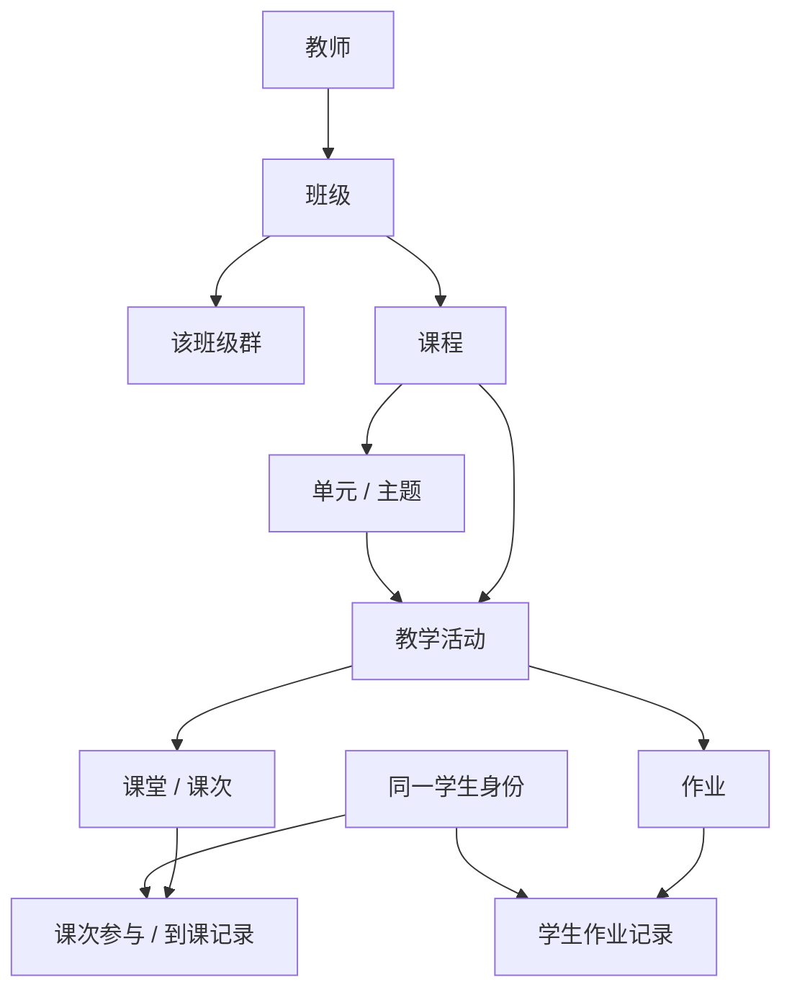

# IM Copilot 班级与课程业务映射核验

## 1. 结论与适用范围

用户本轮明确的结构为“教师 → 多班级 → 每班多课程 → 各课程的课次、作业与学生完成状态”；一个班级对应一个班级群，同一学生可以参与同班不同课程。

在线业务术语明确支持这一结构：ClassIn 6.0 后，底层命名中的 `course` 表示**班级**，LMS 的 `category` 表示**班级内部的课程**。不能将英文 `course_id` 直接翻译成产品课程，也不能把一个班级群复制成多个课程群。[R1]

本次核验形成三个不同层面的结论：

| 层面 | 已确认 | 保留边界 |
| --- | --- | --- |
| 业务结构 | 班级下可有多课程，课程下通过单元和活动组织课堂、作业等内容 | 不从类名、数据库英文名推断产品层级 |
| 已有真实底稿 | 已选两班的课次、作业都能经活动唯一关联到各自的一个课程引用 | 本次冻结范围没有同班多课程实例，不能把它称为完整多课程真实样本 |
| 原型扩展 | 保留第一课程的真实来源关联，另加独立标注的第二课程及相关场景，可验证同班跨课程任务 | 第二课程不是本次数据库查询取得的事实；课程名称与完整目录仍有数据缺口 |

本文只保留本项目核验结论、匿名数量和引用信息，不保存知识库全文、SQL 参数、真实身份映射或凭据。原始采集范围仍由[首轮采集记录](./IM-COPILOT-DW-SOURCE-COLLECTION-REPORT.md)拥有。

## 2. 产品对象与数据关系

图中的课程直达活动表示活动自身也记录课程引用，不表示可以忽略单元关联校验。单元可以是无主题单元；没有用户可见主题标题，不等于活动没有课程归属。[R2]

| 产品对象 | 核验后的技术对应 | 使用时的限制 |
| --- | --- | --- |
| 班级 | 班级主数据 `eeo_course` 的 `course_id` | 不将班级主表中的外部分类 `category_id` 当作内部课程 |
| 班级群 | 班级群的 `ClusterID` 对应该班级的 `course_id` | 此对应只适用于班级群；好友私聊群有另一套标识关系 |
| 课程 | `lms_category.id`，以其 `course_id` 归属班级 | 课程名称、删除状态和完整目录应由该对象确认；下游外键存在不等于课程目录已取齐 |
| 单元 / 主题 | `lms_unit.id`；同时包含班级与课程引用 | 校验活动与单元的班级、课程一致；不按主题名猜归属 |
| 教学活动 | `lms_activity.id`；同时包含班级、课程、单元及业务类型/业务对象引用 | `biz_id` 必须与 `biz_type` 联合解释；未关联的业务 ID 不能当有效对象 |
| 课堂 / 课次 | 活动类型 1 的业务 ID 对应 `eeo_course_class.class_id` | 课次表的 `teach_id` 是课程体系引用，不是本次产品课程 ID |
| 作业 | 活动类型 2 的业务 ID 对应 `eeo_course_homework.homework_id` | 同课程的作业与课次不天然存在“本讲布置”的直接关系 |
| 学生完成状态 | 课次参与/到课，或特定作业下的学生记录 | 按实际活动/作业保存，不把一个课程的完成状态覆盖到同学生另一课程 |

以上映射分别由在线术语、LMS 结构、课堂与作业字典交叉支持。[R1–R4] 本次实测元数据确认了课程分类、单元、活动、课次和作业的关键字段与关联入口。部分旧 DDL 仍将单元/活动的 `course_id` 注释为“课程 ID”；该旧注释与在线术语的 6.0 后口径不同，必须按班级语义解释。

教师与班级的关系、教师与课次/活动的任教关系也应分别保留。课程分类的创建人不自动等于该课程的任课教师；同班课次中可能有其他任课教师，不能只凭班级可见就推导所有课程的执行权限。[R1、R3]

## 3. 已有冻结底稿能恢复到哪一层

核验使用冻结版本 `im-copilot-source-2026-09-09-v1` 的活动、单元、课次与作业关系，以及 M1 已有两班匿名映射。未修改原始文件。

在本次已采集的 **29 个存在有效活动的班级**中，排除已删除活动后，每班都只引用 **1 个非零课程分类 ID**。这说明当前底稿没有已取得的“同班两个有效课程”实例，**不说明这些班级真实目录永远只有一个课程**：没有活动的课程、未纳入采集范围的对象与已删除目录状态，均不能凭活动外键排除。

| 匿名班级 | 有效活动 | 有效单元 | 活动与单元的课程关系一致 | 已采集课次唯一归入课程 | 已采集作业唯一归入课程 |
| --- | --- | --- | --- | --- | --- |
| 秋季学习一班 | 75 | 17 | 75 / 75 | 14 / 14 | 7 / 7 |
| 秋季学习二班 | 98 | 20 | 98 / 98 | 16 / 16 | 2 / 2 |

每班的活动课程引用、单元课程引用一致；全部已采集课次和作业经对应业务类型的活动匹配到唯一课程，没有本次核验发现的缺失或跨课程歧义。上述课次数包含所选范围内其他任课教师的课次，不能将其全部计为当前教师的主讲课次。

可以据此把已有第一课程关系从“完全未知”提升为“冻结活动关系已确认”。课程名称仍应使用独立的展示化名，保留真实名称未取回的状态。不能把匿名名称写成原始课程名称。

## 4. 本次在线验证与未取得内容

本次按 DW 技能完成组件自检、在线术语/指标检索、查询指南、数据字典和元数据验证。知识库可读；查询连接鉴权有效。

| 验证项 | 结果 |
| --- | --- |
| 课程分类主表是否存在，是否有班级/名称/来源/删除字段 | 元数据实测确认 |
| 班级限定查询是否有相应索引入口 | 元数据确认存在以班级引用开头的索引 |
| 单元、活动、课次、作业的关键关联字段 | 五张相关主表元数据实测确认 |
| 两班课程目录/名称的原始业务读取 | 当前角色不具备原始业务库数据查询权限；执行计划请求即被拒绝，未继续执行数据 SELECT |
| 有权限数仓中是否找到可核验的同源课程目录入口 | 在线数仓 LMS 字典全文与语义检索未找到该课程分类主表的对应视图登记，未猜测表名或发起扫描 |
| 学生在两个真实课程下的参与交集 | 当前取得的活动每班仅一个课程引用，不能实证；原型第二课程独立模拟 |

原始业务读取受限不是令牌失效。元数据可读也不等于数据内容可读。本次未修改权限、未重装组件、未要求再次提供令牌，未执行全表扫描。[R5]

数仓 LMS 字典已登记活动和单元的同源数据，能解释既有底稿中的课程外键，但没有本次检索可证实的课程分类目录表入口。这里只记录“未在本次在线知识依据中定位”，不宣称该表在整个数仓不存在。[R6]

## 5. 对 M1 / M2 的直接约束

1. **场景显式包含课程层。** 保留教师、班级、课程、课次、作业的独立引用；同一班级的多个课程共用班级群。
2. **第一课程沿用真实关联。** 对已核验活动引用使用稳定匿名映射；不要把原本可恢复的全部关系都降为模拟。
3. **第二课程独立构造。** 当前样本不足以提供第二真实课程，应记录模拟来源及其与班级、学生、活动的新增关系；不改写冻结来源，也不将模拟目录计入真实课程数。
4. **学生身份复用，参与事实独立。** 同学生不因课程不同复制为新人；每项课次/作业的参与名单与完成状态分别保存。模拟课程可选择同批学生验证跨课程切换，但不能据此断言生产中的所有课程名单完全相同。
5. **卡片与任务要指出具体课程。** 班级群仍是当前交流容器，提醒对应的课程、课次或作业作为业务对象呈现；对象明确时自动选择，存在多个同类候选时只补问必要业务问题。
6. **计数与去重保留对象范围。** 不以学生 ID 或班级 ID 单独去重所有提醒；同学生在不同课程的不同作业可以各有待办，同份作业的催交与待批改仍按既定动作/事项口径计数。
7. **任务恢复和发送复核使用原始目标。** 切课程或切群后不能把任务对象替换成当前页面默认课程；交付目的地与任务来源独立保存，群来源的个体反馈继续送对应学生私聊。
8. **同课程不等于本讲作业。** 同课程关系只能缩小候选，不能证明作业由某一节课布置；原型中新增的课次—作业关联继续标明模拟来源。

## 6. 核验依据与追溯

以下是本次实时取得的在线知识依据，仅登记来源与采用位置，完整内容不写入仓库或长期 Agent 记忆。

| 引用 | 在线知识文档 | 本次采用位置 |
| --- | --- | --- |
| R1 | `011-业务术语.md`，更新于 2026-09-08 | §1.1 班级/课程、§1.4 两类分类、§2 角色、§3.2 单元、§6.1/6.4 引用体系、§8.6 班级群关系 |
| R2 | `105.7-原始数据-LMS活动-LMS基础信息.md`，更新于 2026-09-04 | §1 活动、§2 单元、§3 课程分类、§4 学生活动关系 |
| R3 | `104-原始数据-课堂-课节.md`，更新于 2026-09-04 | 课次及教师/学生参与关系 |
| R4 | `105.8-原始数据-LMS活动-作业.md`，更新于 2026-09-04 | 作业对象和学生提交/批阅状态 |
| R5 | `010-全局查询指南.md`，更新于 2026-08-16；`102-原始数据-业务场景查询指南.md`，更新于 2026-08-31 | 实例与权限、限定查询、活动业务类型路由、班级群映射 |
| R6 | `207-数据仓库-LMS活动.md` | 完整 19 个分片；活动/单元同源登记，以及未定位课程分类目录入口的边界 |
| R7 | `103-原始数据-后台与基础业务.md`；`012-指标体系.md` | 班级主数据与角色；确认本次为对象映射核验，不套用含“课程”旧命名的统计指标 |

知识库完整取回分片数：011 为 29、012 为 1、010 为 18、103 为 31、104 为 7、105.7 为 8、105.8 为 7、102 为 34、207 为 19；每篇按分片编号检查齐全。另有五张表的实时元数据、本机冻结数据的匿名关联检查结果。在线元数据仅代表本次核验时点，不能把冻结业务底稿升级为实时场景。

本次知识库、元数据与含查询参数的中间文件均位于 DW 技能临时目录，完成后清理；凭据始终仅从已有本地配置在内存中使用。
