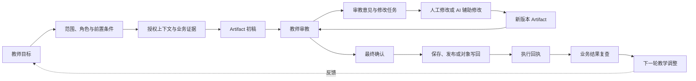
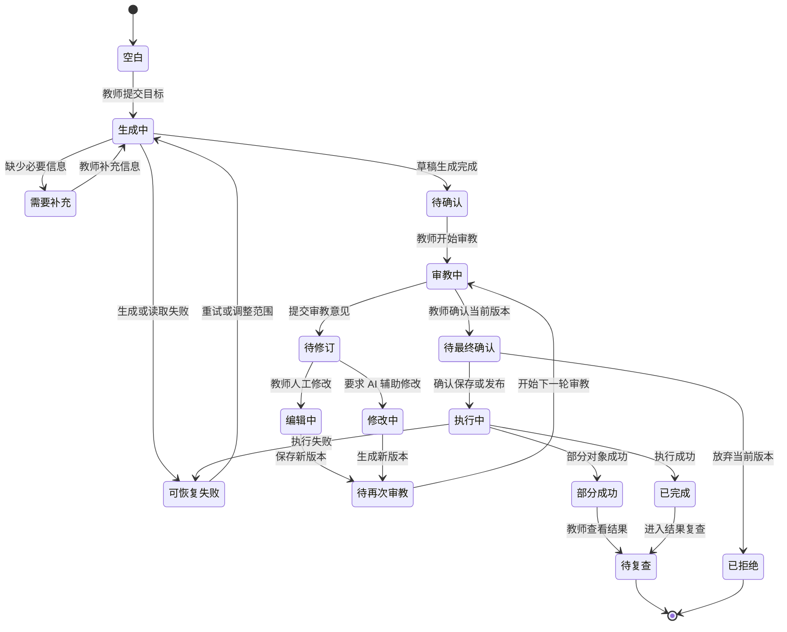
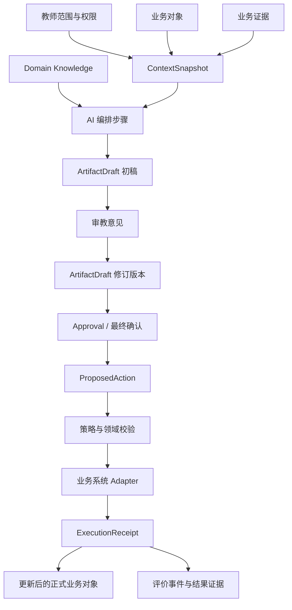
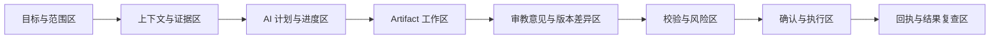

# WorkBuddy 业务场景产品设计附图模板

主文档：[WorkBuddy 业务场景产品设计框架](./SCENARIO-PRODUCT-DESIGN-FRAMEWORK.md)

本文维护四张附图模板。它们分别表达业务结果、教师体验、对象关系和页面结构，不替代主文档中的产品判断。

## D1. 业务闭环图

对应主文档：

- [1. 要帮教师完成什么结果？](./SCENARIO-PRODUCT-DESIGN-FRAMEWORK.md#1-要帮教师完成什么结果)
- [2. 谁在什么情况下使用？](./SCENARIO-PRODUCT-DESIGN-FRAMEWORK.md#2-谁在什么情况下使用)
- [7. 怎么判断真的有帮助？](./SCENARIO-PRODUCT-DESIGN-FRAMEWORK.md#7-怎么判断真的有帮助)

这张图回答：教师从什么目标出发，经过哪些业务结果节点，最终如何产生下一轮教学反馈。对于课件场景，必须表达“审教 → 修订 → 再次审教”的循环。

填写时需要标出：

- 本场景的起点和终点；
- 哪些节点是教师动作；
- 审教意见如何驱动下一轮版本；
- 哪些节点会产生正式业务变化；
- 哪些节点只是 WorkBuddy 内部草稿或推断；
- 结果复查使用什么证据。

## D2. 教师体验与状态图

对应主文档：

- [5. 教师在哪里参与和做决定？](./SCENARIO-PRODUCT-DESIGN-FRAMEWORK.md#5-教师在哪里参与和做决定)
- [6. 哪些动作会改变业务，出错怎么办？](./SCENARIO-PRODUCT-DESIGN-FRAMEWORK.md#6-哪些动作会改变业务出错怎么办)

这张图把正常用户体验和显式状态放在一起，避免只设计成功路径。课件场景需要把“审教中、待修订、待再次审教、待最终确认”表达为独立状态。

填写时需要标出：

- 每个状态教师能看到什么；
- 每个状态教师可以做什么；
- 哪些状态允许重试、撤销或过期；
- 审教意见如何驱动下一轮版本；
- 哪个版本是当前审教版本，哪个版本是最终确认稿；
- 哪些状态需要人工接管；
- 状态变化由谁触发。

## D3. 对象与证据关系图

对应主文档：

- [2. 谁在什么情况下使用？](./SCENARIO-PRODUCT-DESIGN-FRAMEWORK.md#2-谁在什么情况下使用)
- [3. 系统将读取和产出哪些东西？](./SCENARIO-PRODUCT-DESIGN-FRAMEWORK.md#3-系统将读取和产出哪些东西)
- [6. 哪些动作会改变业务，出错怎么办？](./SCENARIO-PRODUCT-DESIGN-FRAMEWORK.md#6-哪些动作会改变业务出错怎么办)

这张图回答：输入、证据、生成草稿、审教意见、版本、审批动作和正式业务对象之间是什么关系。

填写时需要标出：

- 每个对象的事实所有者；
- 每个对象是事实、证据、推断、草稿还是正式结果；
- 对象的版本和可见范围；
- 初稿、修订稿、最终确认稿和正式发布稿的版本关系；
- 每条审教意见是否已经解决，以及由谁解决；
- 哪些内容可以被 WorkBuddy 生成；
- 哪些内容只能通过 Adapter 写回。

## D4. 页面与信息架构图

对应主文档：

- [1. 要帮教师完成什么结果？](./SCENARIO-PRODUCT-DESIGN-FRAMEWORK.md#1-要帮教师完成什么结果)
- [2. 谁在什么情况下使用？](./SCENARIO-PRODUCT-DESIGN-FRAMEWORK.md#2-谁在什么情况下使用)
- [5. 教师在哪里参与和做决定？](./SCENARIO-PRODUCT-DESIGN-FRAMEWORK.md#5-教师在哪里参与和做决定)

这张图不描述具体视觉稿，而是说明教师工作台需要哪些信息区域和操作关系。课件场景必须让教师在 Artifact 工作区中看到审教意见、版本差异、当前审教轮次和最终确认状态。

填写时需要标出：

- 教师首先看到什么；
- 哪些信息必须持续可见；
- 哪些区域支持编辑和提交审教意见；
- 哪些操作具有业务副作用；
- 错误、权限拒绝、版本冲突和部分成功在哪里处理。

## 图表使用规则

- 业务闭环图描述“为什么做、结果如何形成”；
- 教师体验与状态图描述“教师怎么操作、系统怎么变化”；
- 对象与证据关系图描述“数据、版本和业务对象如何流动”；
- 页面与信息架构图描述“这些信息如何被教师理解和操作”；
- 同一个状态、对象或动作只定义一个规范名称，其他图引用该名称；
- 图中未验证的能力必须标记 `SIMULATED`、`INFERENCE`、`UNKNOWN` 或 `FUTURE`。
