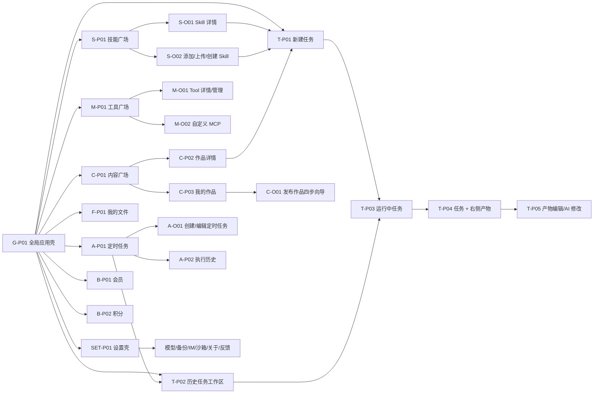

# NineClaw 页面地图与完整跳转关系

## 1. 总览

该图只表达已观察到的页面关系；`F-P01 我的文件`的完整页面行为和会员/积分详情仍存在证据缺口。【UI-E1】【UNKNOWN】

## 2. 全量页面与覆盖层清单

| ID | 名称 | 形态 | 主入口 | 主要出口 | 证据状态 |
|---|---|---|---|---|---|
| G-P01 | 全局应用壳 | 固定壳 | 应用启动后 | 所有一级模块 | `UI-E1` |
| G-O01 | 侧栏收起态 | 壳状态 | 侧栏收起按钮 | 展开侧栏 | `UI-E1` |
| G-O02 | 用户菜单 | 浮层 | 右上角头像 | 账户相关操作 | `UNKNOWN`，只确认入口 |
| G-O03 | 历史任务操作菜单 | 浮层 | 历史条目右侧“…” | 重命名、置顶、删除、关闭 | `OWNER-C1` |
| T-P01 | 新建任务首页 | 页面 | 左栏“新建任务” | 创建运行、技能广场、模型设置、目录选择 | `UI-E1` |
| T-O01 | 工作目录选择器 | 浮层 | 输入器目录按钮 | 最近目录、添加文件夹 | `UI-E1` |
| T-O02 | Skill 选择器 | 浮层 | 输入器 Skill 按钮 | 选 Skill、技能广场 | `UI-E1` |
| T-O03 | 模型选择器 | 浮层 | 输入器模型按钮 | 选模型、自定义模型设置 | `UI-E1` |
| T-P02 | 历史任务工作区 | 页面 | 历史条目 | 恢复对话、继续任务 | `UI-E1` |
| T-P03 | 运行中任务 | 页面 | 提交目标、立即运行、内容改编 | 停止、补参、继续执行、打开产物 | `UI-E1` |
| T-O04 | 结构化补参卡 | 会话内卡片 | Agent 检测缺失信息 | 提交答案、回到输入 | `UI-E1` |
| T-P04 | 任务 + 右侧产物 | 分栏页面 | 点击生成文件或自动打开 | 查看、解析、编辑、保存 | `UI-E1` |
| T-P05 | 产物编辑/AI 修改 | 分栏状态 | 产物编辑或 AI 修改 | 应用修改、保存、返回查看 | `UI-E1` |
| S-P01 | 技能广场 | 页面 | 左栏、Skill 选择器 | 详情、安装、我的技能、添加 Skill | `UI-E1` |
| S-O01 | Skill 详情 | 弹窗/详情层 | Skill 卡片 | 安装、去使用、关闭 | `UI-E1` |
| S-O02 | 添加 Skill | 菜单/弹窗 | “添加技能” | 上传本地包、创建 Skill | `UI-E1` |
| S-P02 | 我的技能 | 页内标签 | 技能广场标签 | 启停、删除、去使用 | `UI-E1` |
| M-P01 | 工具广场 | 页面 | 左栏 | 详情、安装、我的工具、自定义 | `UI-E1` |
| M-P02 | 我的工具 | 页内标签 | 工具广场标签 | 启停、编辑、删除 | `UI-E1` |
| M-O01 | Tool 详情/管理 | 弹窗/菜单 | Tool 卡片 | 安装、编辑、删除、关闭 | `UI-E1` |
| M-O02 | 自定义 MCP | 弹窗 | “自定义” | 表单/JSON 配置、保存、取消 | `UI-E1` |
| C-P01 | 内容广场 | 页面 | 左栏 | 搜索筛选、作品详情、我的作品、发布 | `UI-E1` |
| C-P02 | 作品详情 | 页面 | 作品卡片 | 下载/解锁、一键改编、收藏、返回 | `UI-E1` |
| C-P03 | 我的作品 | 页内标签/页面 | “我的作品” | 发布、我发布/解锁/收藏、作品管理 | `UI-E1` |
| C-O01 | 发布作品四步向导 | 模态向导 | 发布作品 | 成功提交、关闭、上一步/下一步 | `UI-E1` |
| A-P01 | 定时任务列表 | 页面 | 左栏 | 创建、立即运行、编辑、删除、启停 | `UI-E1` |
| A-O01 | 创建/编辑定时任务 | 模态表单 | 新建/编辑 | 保存、取消、目录选择 | `UI-E1` |
| A-P02 | 定时任务历史 | 页内标签 | “历史” | 查看结果/关联任务 | `UI-E1`，细节不完整 |
| F-P01 | 我的文件 | 页面 | 左栏 | 文件预览、作为任务输入 | `UNKNOWN`，只确认入口和数量 |
| SET-P01 | 设置壳/通用 | 页面 | 左栏设置 | 各设置子页 | `UI-E1` |
| SET-P02 | 模型设置 | 页面 | 设置左栏、模型选择器 | 测试连接、添加模型 | `UI-E1` |
| SET-P03 | 云端备份 | 页面 | 设置左栏 | 立即备份、恢复 | `UI-E1` |
| SET-P04 | IM 机器人 | 页面 | 设置左栏 | 绑定/重绑、手动配置 | `UI-E1` |
| SET-P05 | 沙箱环境 | 页面 | 设置左栏 | 切换模式、安装沙箱 | `UI-E1` |
| SET-P06 | 关于 | 页面 | 设置左栏 | 更新/协议等 | `UI-E1`，字段待图册确认 |
| SET-P07 | 反馈 | 页面 | 设置左栏 | 提交反馈 | `UI-E1`，字段待图册确认 |
| B-P01 | 会员 | 页面/弹层 | 侧栏会员卡 | 购买/续费 | `UI-E1`，交易闭环 `UNKNOWN` |
| B-P02 | 积分 | 页面/弹层 | 侧栏积分卡 | 获取/消费/记录 | `UI-E1`，明细交互 `UNKNOWN` |

## 3. 全局应用壳导航

### 3.1 左侧栏顺序

固定顺序为：产品标识与收起按钮 → 新建任务 → 技能广场 → 工具广场 → 内容广场 → 定时任务 → 分隔线 → 历史任务标题与控制 → 历史任务条目 → 我的文件及数量 → 设置 → 会员卡 → 积分卡。【UI-E1】

侧栏选择规则：

- 一级页面仅一个条目高亮；任务页面高亮“新建任务”或历史条目，具体差异以录屏为准。
- 历史条目显示标题；右侧默认显示距离当前几小时等相对时间，进入条目操作位置后显示“…”；点击“…”出现小浮层，支持重命名、置顶和删除。条目数量超过视区时滚动。【OWNER-C1】
- 收起后只保留图标，历史条目正文隐藏；悬停提示、键盘行为和宽度数值为 `UNKNOWN`。

### 3.2 顶部区域

- 一级广场页使用模块标题、说明、标签切换和页面主行动。
- 任务页使用任务标题、`本地`真值标签、工作目录和更多菜单；右上角保留用户头像/名称。
- 设置页由左侧设置子导航和右侧配置区组成，不沿用广场筛选结构。

## 4. 主任务链完整跳转

| 起点 | 用户动作 | 携带上下文 | 终点 | 返回/中断规则 |
|---|---|---|---|---|
| T-P01 | 输入目标并发送 | 文本、附件、目录、选定 Skill、模型 | T-P03 | 新运行进入历史；创建失败回到可编辑输入 |
| T-P01 | 点快捷任务 | 快捷任务类型 | T-P01 输入器预填/进入补参 | 是否立即发送为 `UNKNOWN` |
| T-P03 | Agent 请求补参 | 已知上下文、缺失字段 | T-O04 | 提交后回到同一 Run |
| T-P03 | 提交补参 | 结构化答案 | T-P03 继续执行 | 可恢复到未完成补参状态 |
| T-P03 | 点停止 | 当前 Run/步骤 | T-P03 已停止态 | 保留对话、已有步骤和产物；可继续输入 |
| T-P03 | 中途修改约束 | 新约束、当前计划和产物 | T-P03 重规划 | 原计划需标记失效/调整；实际细粒度为 `INF` |
| T-P03 | 点生成文件链接 | Artifact 引用 | T-P04 | 关闭右栏仍留在同一任务 |
| T-P04 | 点编辑 | Artifact 当前版本 | T-P05 | 取消回到查看态；未保存提示为 `UNKNOWN` |
| T-P05 | 请求 AI 修改 | 选区/整文、指令、版本 | T-P05 修订结果 | 应用或拒绝后仍在同一产物 |
| T-P05 | 保存 | 当前编辑版本、目标文件 | T-P04 保存成功态 | 失败时保留未保存内容并允许重试 |
| T-P02 | 从历史打开任务 | Run ID | T-P03/T-P04 | 恢复最后会话；是否恢复右栏由证据确认 |

## 5. 跨模块回流

### 5.1 Skill → Task

`S-P01/S-O01 → 去使用/立即使用 → T-P01`。目标任务需携带 `skillId`、名称、版本/来源（若界面可用）并在输入器显示 Skill chip；教师仍需提供目标或使用预填示例。删除 chip 只移除本次上下文，不等于卸载 Skill。【UI-E1】【INF】

`S-O02 → 创建 Skill → T-P01`。用户从添加/创建入口选择创建 Skill 后，由 Skill Creator 直接在任务工作台发起一条“创建 Skill”的任务流；Skill 的需求澄清、生成过程、确认和结果均承载在该任务中，而不是在独立表单中一次性完成。【OWNER-C1】

### 5.2 Content → Task

`C-P02 → 一键改编为同款 → T-P01/T-P03`。回流上下文至少包含作品名、作品类型、来源引用和改编意图；录屏可见自动带入提示词和作品引用。原作品不可被改编任务直接覆盖，生成物应成为新产物，此对象规则为设计推断。【UI-E1】【INF】

### 5.3 Scheduled Task → Task

`A-P01 → 立即运行/到时触发 → 后台运行 → A-P02/历史任务`。执行定义携带提示词、计划、工作目录和通知渠道。列表中的一次执行与历史任务 Run 如何一一关联尚未完全观察，保持 `UNKNOWN`。

### 5.4 Tool/MCP → Task

`M-O01 Tool 详情/管理`不支持直接发起任务，也不存在 `M-O01 → T-P03` 的产品跳转。Tool 安装/启用后作为主 Agent 在其他任务运行时可调用的能力，在会话中产生调用参数、响应与总结事件。禁用或删除工具后的既有历史轨迹应保留，但此保留策略未从 UI 直接验证。【OWNER-C1】【UI-E1】【INF】

### 5.5 Settings → Task

- 模型选择器的“自定义模型设置”进入 `SET-P02`；保存后应返回原任务或可在模型选择器选用，精确返回行为 `UNKNOWN`。
- 定时任务的通知渠道依赖 `SET-P04` 已绑定状态；未绑定时的拦截行为 `UNKNOWN`。
- 沙箱模式改变后续命令执行环境，不应改写历史执行记录；这是合理实现要求，不是 UI 已证事实。

## 6. 浏览器后退、关闭和深链规则

NineClaw 是桌面应用，现有材料未证明浏览器 URL、深链或系统级后退栈。还原原型应采用产品内导航语义：

- 页面级详情必须提供明确返回入口；
- 模态层用关闭/取消返回触发它的页面并保留筛选、滚动和草稿；
- 任务分栏关闭只关闭产物视图，不退出任务；
- 从内容/Skill 回流创建任务后，任务进入历史，不能依赖“后退”恢复为未创建状态；
- 未保存编辑、未提交发布向导和未保存自定义 MCP 的退出确认均列为 `UNKNOWN`，需要补录验证。
