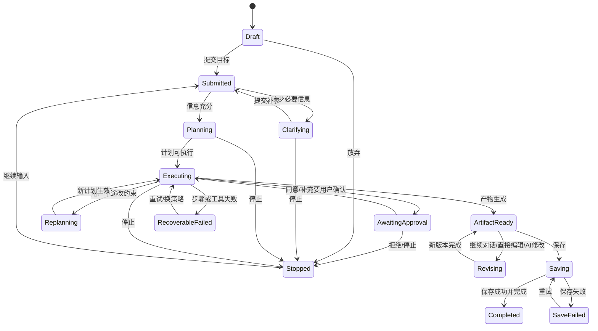

# NineClaw Agent 任务执行交互规格

## 1. 目标与边界

本文把 NineClaw 主任务链拆成可设计、可实现、可测试的事件序列，覆盖目标输入、补参、计划、Skill/Tool 调用、中途改约束、产物生成、查看、编辑和保存。事件名称是为了还原交互而建立的规范化语言，不代表 NineClaw 对外公开了同名协议。【UI-E1】【INF】

任务工作区不是普通聊天页。它同时承担五种职责：

1. 收集教师目标与上下文；
2. 展示 Agent 对任务的理解与缺失信息；
3. 展示长任务计划、步骤和外部能力调用；
4. 把阶段结果与文件产物组织为可验证对象；
5. 承载教师中断、改约束、编辑和保存。

## 2. 页面区域模型

```text
┌──────────────┬──────────────────────────────────┬─────────────────────────┐
│ 全局侧栏     │ 任务会话与执行轨迹               │ 产物查看/编辑（按需出现）│
│              │ 顶部：标题/本地/工作目录/更多    │ 顶部：文件名/动作/关闭    │
│ 新建任务     │                                  │                         │
│ 历史         │ 用户目标                         │ 文档/网页/表格/演示预览   │
│ 我的文件     │ Agent 文本与补参卡               │                         │
│              │ 计划/步骤/Skill/Tool/命令事件    │ 查看/解析答案/编辑/AI修改│
│              │ 阶段结果/Artifact 卡             │                         │
│              │                                  │                         │
│              │ 底部：输入器/附件/Skill/模型/停止│ 保存状态与版本反馈        │
└──────────────┴──────────────────────────────────┴─────────────────────────┘
```

右侧产物栏出现时，中间会话栏收窄；任务上下文和执行状态不能因打开/关闭产物而丢失。【UI-E1】

## 3. Run 生命周期



NineClaw 录屏直接证明补参、执行、停止、中途改约束、产物、修改与保存等行为；上图中的规范化状态名与部分边界是为实现一致性建立的抽象。【UI-E1】【INF】

## 4. 一条完整任务链

### 4.1 阶段 A：目标提交

| 项 | 规格 |
|---|---|
| 教师输入 | 自然语言目标，可附文件/文件夹、工作目录、Skill 和模型 |
| 提交前状态 | 输入器可编辑；发送按钮由内容可提交性控制；已选 Skill 显示 chip |
| 提交动作 | 固化本次消息快照，创建/进入任务，在历史区生成条目 |
| 可见结果 | 用户消息进入会话；Agent 进入思考/处理中；发送按钮可变为停止 |
| 异常 | 附件读取失败、目录无权限、模型不可用、输入为空；具体 UI 仅部分可见 |

### 4.2 阶段 B：任务理解与结构化补参

Agent 识别完成任务所需的关键变量。当变量不足时，不直接编造，而是在会话中显示“需要您的确认”类结构化卡片。【UI-E1】

补参卡规格：

- 顶部说明为什么需要补充；
- 已观察画面清楚证明至少一个教材版本问题，并提供选项、“其他”、跳过和提交；是否存在第 2/3 页及返回规则保持 `UNKNOWN`；
- 问题控件可为单选、多选、自由文本或确认；
- 用户答案在提交前可修改；
- 提交后答案成为任务上下文，并在会话中可追溯；
- 未完成必填项时提交不可用；
- 若教师改用底部自然语言回答，Agent 是否自动映射到卡片字段为 `UNKNOWN`。

### 4.3 阶段 C：计划与任务拆解

信息充分后，Agent 输出目标理解并生成步骤计划。录屏中可见 `TaskCreate`、`TaskUpdate` 以及步骤完成轨迹，这些技术名称可能直接展示。【UI-E1】

还原时每个计划步骤至少包含：

- 稳定的步骤序号或 ID；
- 教师可理解的步骤标题；
- 状态：待执行、执行中、完成、失败、跳过；
- 可选的输入摘要、输出摘要和耗时；
- 关联 Skill、Tool、文件或命令事件；
- 失败后的重试/换策略/跳过结果。

经产品操作者确认，失败步骤触发重试时接续原任务对话继续执行，不创建一条彼此割裂的新任务；实现中应在同一 Run 时间线中创建新的 attempt，并保留前一次失败记录。【OWNER-C1】

计划不是锁死工作流。PPT 改为 HTML 的录屏证明教师可以在执行中改变产物约束，Agent 会调整后续策略。【UI-E1】

### 4.4 阶段 D：能力调用与阶段结果

主 Agent 可组合 Skill、通用文件工具、MCP、命令和远端服务。每次调用应被建模为独立事件，而不是一段不可解析的富文本。

| 可见层 | 默认内容 | 展开内容 | 教师可行动项 |
|---|---|---|---|
| Skill 读取/启用 | 能力名称、用途、状态 | 来源、指令摘要、相关文件 | 查看详情；通常无需教师配置 |
| Tool/MCP 调用 | 工具名称、正在做什么、状态 | 参数、响应摘要、原始 JSON | 重试、复制、诊断 |
| 命令执行 | 人类可读动作、状态 | 原始命令、工作目录、stdout/stderr | 停止、重试、复制 |
| 文件读取 | 文件名、读取目的、状态 | 路径、类型、解析摘要 | 打开、重新选择 |
| 文件写入 | 文件名、产物类型、状态 | 路径、大小、写入摘要 | 打开、在目录中显示 |
| 远端生成 | 服务/能力、进度、状态 | request ID、轮询/错误摘要 | 取消、重试 |

NineClaw 可直接暴露原始命令、绝对路径、环境变量和大段 JSON；V07 甚至显示一条含 `rm -rf` 的命令已执行完成，但相邻画面没有可见审批。还原标杆时应记录这一事实和风险，不能把“显示过命令”等同于“已经安全治理”。ClassIn redesign 默认只显示人类可读层，诊断信息受权限控制并折叠；危险命令在执行前必须经过策略拦截和显式审批。【UI-E1】【INF】

### 4.5 阶段 E：产物生成与验证

当文件写入成功后，会话中出现可点击文件链接/Artifact 卡。点击后打开右侧产物栏；部分场景由系统自动打开。【UI-E1】

Artifact 卡至少表达：

- 文件名、格式图标与类型；
- 生成/更新时间；
- 当前状态：生成中、可查看、解析中、失败、已保存；
- 打开预览、下载/定位文件等可用动作；
- 与生成它的步骤/调用事件关联。

右侧产物栏按类型提供查看能力：

- DOCX/结构化文档：排版预览、编辑、AI 修改、保存；
- HTML/互动内容：网页预览，是否隔离脚本由实现决定；
- 课后练习：题目查看与“解析答案”切换；
- PPTX/XLSX/PDF：采用只读预览；当前实现无法可靠渲染时允许使用明确标注的占位预览，并提供下载/外部打开；
- 视频：使用播放器；播放器尚不可用时采用明确标注的占位状态。以上属于经审阅批准的 `DESIGN_COMPLETION`，不是 NineClaw 一手事实。

### 4.6 阶段 F：迭代与保存

教师可以通过三条路径迭代：

1. 在会话中继续给自然语言约束；
2. 在产物区直接编辑；
3. 在产物区发起 `AI 修改`。

每次修改都必须绑定当前 Artifact 版本，避免旧请求覆盖新编辑。NineClaw UI 证明存在编辑、AI 修改和保存，但版本冲突机制未被观察，应标为 `UNKNOWN`。【UI-E1】

保存流程：编辑态 → 保存中 → 保存成功反馈 → 查看态/保留编辑态。保存失败时不得清除本地编辑，需展示失败原因、重试和另存；其中“失败不丢稿”是详细设计要求，不是已观察事实。

## 5. 事件字典

### 5.1 上下文与控制事件

| 事件 | 触发 | 必要输入 | 会话中的表达 | 下一状态 |
|---|---|---|---|---|
| `UserGoalSubmitted` | 教师发送 | text、attachments、workdir、skill、model | 用户消息 + 附件/Skill chip | Submitted |
| `ContextAttached` | 选文件/目录/内容 | 引用、类型、权限结果 | 输入器 chip 或上下文卡 | Draft/Submitted |
| `SkillSelected` | 选择 Skill | skillId、name | 输入器 Skill chip | Draft |
| `ModelSelected` | 选择模型 | provider/model | 模型标签 | Draft |
| `RunCreated` | 首次提交成功 | runId、title、truth label | 历史条目与任务顶部 | Submitted |
| `RunStopRequested` | 点停止 | runId、currentStep | 停止中反馈 | Stopped/Executing |
| `UserConstraintChanged` | 运行中追加要求 | text、affected artifact/step | 新用户消息 | Replanning |
| `StrategyReplanned` | Agent 调整方案 | old/new plan 摘要 | 说明调整原因与新步骤 | Executing |

### 5.2 补参与计划事件

| 事件 | 触发 | 必要输入 | 可见内容 | 动作/结果 |
|---|---|---|---|---|
| `MissingInputDetected` | Agent 判断信息不足 | missingFields | 简短原因 | 生成补参卡 |
| `ClarificationRequested` | 展示问题 | questionId、type、options、required | 问题、选项、进度 | 选择/输入 |
| `ClarificationAnswered` | 用户作答 | questionId、answer | 已选值/文本 | 下一问或提交 |
| `ClarificationCompleted` | 全部必填完成 | answer snapshot | 答案摘要 | 继续计划 |
| `PlanCreated` | Agent 形成计划 | steps | 步骤列表 | 自动执行/等待确认 |
| `TaskStepStarted` | 步骤开始 | stepId、title | 执行中状态 | 调用能力 |
| `TaskStepCompleted` | 步骤完成 | output summary | 完成标识、摘要 | 下一步 |
| `TaskStepFailed` | 步骤失败 | error、recoverability | 失败原因 | 重试/换策略/停止 |
| `TaskStepSkipped` | 不再需要 | reason | 跳过与原因 | 下一步 |

### 5.3 Skill、Tool、命令与文件事件

| 事件 | 输入 | 中间状态 | 成功输出 | 失败与恢复 |
|---|---|---|---|---|
| `SkillRead` | skillId/version | 读取中 | 采用的能力与约束摘要 | 缺失/损坏：换 Skill 或降级 |
| `ToolCallStarted` | toolId、human purpose、args | 调用中/可取消 | 进入成功/失败事件 | 超时后重试或换工具 |
| `ToolCallSucceeded` | response、duration | — | 响应摘要，原始数据可展开 | — |
| `ToolCallFailed` | errorCode、safeMessage | — | — | 重试、配置、换策略 |
| `ShellCommandStarted` | command、cwd | 运行中/可停止 | 进入完成/失败 | 停止不应假装回滚副作用 |
| `ShellCommandCompleted` | exitCode、stdout summary | — | 结果摘要 | 非零状态进入失败 |
| `FileReadStarted` | fileRef、purpose | 读取中 | 进入完成/失败 | 重新授权/选文件 |
| `FileReadCompleted` | parse summary | — | 内容摘要/抽取对象 | — |
| `FileWriteStarted` | target、format | 写入中 | 进入完成/失败 | 改名/换目录/重试 |
| `FileWriteCompleted` | artifactRef、size | — | Artifact 卡 | — |
| `RemoteGenerationProgressed` | jobId、progress | 排队/生成中 | 百分比或阶段 | 取消/超时/重试 |

### 5.4 审批、产物与完成事件

| 事件 | 触发 | 可见内容 | 用户动作 | 终态 |
|---|---|---|---|---|
| `ApprovalRequested` | 高影响或关键分支 | 动作、影响、风险、参数 | 同意/拒绝/修改 | Executing/Stopped |
| `ArtifactCreated` | 文件/内容生成 | 文件卡、类型、状态 | 打开/定位 | ArtifactReady |
| `ArtifactPreviewLoaded` | 预览成功 | 右侧内容 | 关闭/编辑 | ArtifactReady |
| `ArtifactPreviewFailed` | 解析失败 | 原因、文件仍可用性 | 重试/外部打开 | RecoverableFailed |
| `ArtifactEditStarted` | 点编辑 | 编辑工具和未保存标记 | 修改/取消/保存 | Revising |
| `AIRevisionRequested` | 提交修改指令 | 范围、指令、版本 | 取消 | Revising |
| `AIRevisionApplied` | 新内容可用 | 变更结果 | 接受/继续修改 | ArtifactReady/Revising |
| `ArtifactSaveStarted` | 点保存 | 保存中、目标 | 取消能力 `UNKNOWN` | Saving |
| `ArtifactSaved` | 写入成功 | 保存成功反馈、时间 | 继续编辑/结束 | Completed/ArtifactReady |
| `ArtifactSaveFailed` | 写入失败 | 安全错误、草稿保留 | 重试/另存 | SaveFailed |
| `RunCompleted` | 计划结束 | 完成总结、产物清单 | 查看/继续 | Completed |

`ApprovalRequested` 是 ClassIn 必须正式化的对象；NineClaw 可见的是“用户确认”类交互，不足以证明拥有正式审批对象和回执模型。【UI-E1】【INF】

## 6. 事件卡视觉与交互规则

### 6.1 信息层级

每个执行事件采用三层信息：

1. **一眼状态**：图标、动作名称、进行/完成/失败和一句结果；
2. **业务摘要**：为什么做、输入了什么、得到什么、下一步是什么；
3. **技术详情**：Skill/Tool 名、参数、命令、路径、原始响应、耗时和错误码。

NineClaw 还原稿应能显示其原始技术内容；ClassIn 设计稿默认折叠第 3 层，并对学生信息、Token、环境变量和私有路径脱敏。

### 6.2 状态反馈

- `pending`：中性轮廓；尚未开始；
- `running`：持续动效与动词现在时；
- `waiting_user`：高可见但非错误，明确需要教师做什么；
- `succeeded`：完成图标和结果摘要，不能只显示绿色勾；
- `failed_recoverable`：错误摘要 + 直接恢复动作；
- `failed_terminal`：说明已停止、已保留什么、下一步选择；
- `cancelled/stopped`：与失败区分，保留已发生事件；
- `superseded`：中途改约束后，旧计划/旧产物仍可追溯但不再是当前版本。

### 6.3 展开、折叠和滚动

- 执行中默认跟随最新事件，但教师手动上滚后不得强制拉回底部；
- 有新事件时显示“回到最新”提示；
- 展开技术详情不改变步骤状态；
- 执行时间线只拥有纵向滚动；步骤卡片、技术证据和长上下文必须在可用宽度内收缩或换行，不显示横向滚动条；
- 任务恢复时保留折叠内容，是否保留每个卡片的展开偏好为 `UNKNOWN`；
- 大段 JSON/stdout 应限高并提供复制，不使整个会话失去可扫读性。

## 7. 失败、恢复与幂等

| 失败点 | 教师必须知道 | 必须保留 | 恢复动作 |
|---|---|---|---|
| 模型不可用 | 当前未开始/中断、原因 | 目标、附件、补参答案 | 换模型/重试 |
| 文件读失败 | 哪个文件、权限或格式问题 | 其他上下文和已完成步骤 | 重新授权/替换/跳过 |
| Skill 缺失或损坏 | 所需能力不可用 | 目标与计划 | 安装/换能力/降级 |
| Tool/MCP 超时 | 哪个外部访问失败 | 请求摘要、已完成结果 | 重试/换工具/稍后继续 |
| 命令失败 | 人类可读原因和影响 | stdout/stderr 摘要、已写文件 | 修复参数/环境后重试 |
| 远端任务失败 | 服务状态与是否计费 | jobId、输入快照 | 重试/联系客服/换策略 |
| 预览失败 | 文件是否已生成 | 原文件 | 重试解析/外部打开 |
| 保存失败 | 未保存且草稿仍在 | 编辑内容、目标路径 | 重试/另存/复制内容 |
| 应用重启 | 任务是否恢复 | Run、事件、Artifact 引用 | 从历史继续 |

重试不得重复制造不可逆副作用。若调用可能发布、发送、扣费或覆盖文件，重试前必须显示影响并使用幂等键或新审批；这属于 ClassIn 实现要求，未由 NineClaw UI 完整证明。

## 8. 任务详情数据契约（产品级）

以下不是 NineClaw 后端协议，而是确保页面还原完整所需的最小 ViewModel：

```text
TaskWorkspace
  run: id, title, truthLabel, lifecycleState, createdAt, updatedAt
  context: goal, attachments[], workdir, selectedSkill?, selectedModel?
  clarification: questions[], answers[], completionState
  plan: steps[]
  timeline: ExecutionEvent[]
  artifacts: ArtifactSummary[]
  activeArtifactId?
  composer: draft, attachments[], canSend, canStop

ExecutionEvent
  id, type, timestamp, status, stepId?
  humanTitle, humanSummary, inputSummary?, outputSummary?
  technicalDetails?, actions[], recoverability

ArtifactSummary
  id, name, type, pathOrRef, version, state
  createdByEventId, previewCapability, editCapability, saveState
```

页面只编排这些产品对象；Skill/Tool 的底层返回不应直接决定组件结构。

## 9. 验收场景

1. 教师提交模糊目标，完成多题补参，看到计划、步骤与产物。
2. 某 Tool 首次失败，教师重试成功，时间线保留两次尝试并只生成一个最终产物。
3. 运行中将 PPT 约束改为 HTML，旧计划标记调整，新产物回流同一任务。
4. 教师打开右侧产物、直接编辑、请求 AI 修改、保存失败后重试成功，内容不丢失。
5. 教师停止长任务，再从历史恢复，已完成步骤和产物仍可查看。
6. 技术详情包含路径/JSON 时，默认教师层仍可读；ClassIn 适配层对敏感值脱敏。
