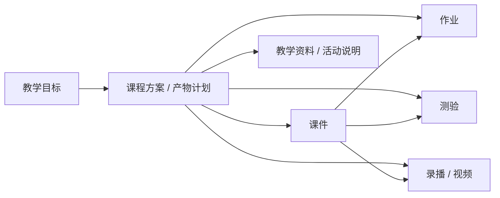
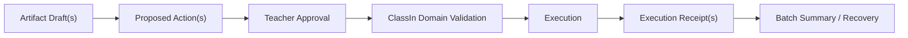

# WorkBuddy Agent 任务类型模型

## 1. 核心决定

“生成单个课件”和“生成课程方案包”是两个独立完整的 Agent 任务类型。课程方案包不是单课件任务的新版名称，单课件也不是课程方案包中必须先执行的隐藏步骤。

两者共享 WorkBuddy 的任务骨架：

```text
Goal → Core Context → Clarification → Plan → Execution
     → Artifact Draft → Review/Revise → Proposed Action
     → Approval → Execution Receipt
```

## 2. Task Type Registry

| 字段 | 说明 |
|---|---|
| `taskTypeId` | 稳定任务类型标识，不把页面模板写死为唯一流程 |
| `displayName` | 教师可理解的名称 |
| `intentSchema` | 目标和结构化补参契约 |
| `contextRequirements` | 必需、建议、默认排除的 Core Context 类型 |
| `artifactBlueprint` | 允许的一到多个 Artifact 类型及依赖 |
| `capabilityPolicy` | 可选 Skill/Tool、自动选择与审批边界 |
| `actionPolicy` | 可提出的 ClassIn 写回动作及审批规则 |
| `recoveryPolicy` | 停止、失败、重试、部分成功和重规划规则 |

页面只消费 Task Type Interface，不用两个相互复制的页面实现两种流程。

## 3. 类型一：生成单个课件

`taskTypeId: single_courseware_generation`

### 3.1 用户意图

教师需要独立完成一份课件，可能只提供一个 Prompt，也可能带入班级、课程、单元、源资料和模板。任务完成后，课件本身已经是可预览、可编辑、可保存、可继续使用的正式 WorkBuddy Artifact。

### 3.2 默认链路

1. 输入课件目标或 Prompt；
2. 自动装配教师/机构，建议教学范围、资料和 Domain Knowledge；
3. 结构化补齐学科、年级、内容范围、课时、风格和输出格式；
4. 生成并允许教师调整计划；
5. 调用内容、检索、视觉、版式、文件生成等能力；
6. 生成一个主课件 Artifact，可带素材、引用或大纲等附属 Artifact；
7. 在右侧进行预览、直接编辑、AI 修改、版本比较和保存；
8. 若要保存到 ClassIn Space 或关联课程，提出 ProposedAction，教师确认后执行并返回 Receipt。

### 3.3 完成标准

- 主课件可打开并验证；
- 过程与 Skill/Tool 调用可追踪；
- 教师修改不会被后续步骤静默覆盖；
- 保存或写回有清晰结果；
- 任务不依赖课程方案包即可达到 `completed_pending_review` 或 `completed`。

## 4. 类型二：生成课程方案包

`taskTypeId: course_package_generation`

### 4.1 用户意图

教师从教学目标出发，一次规划并生产相互关联的一组教学材料和活动。课程方案包是 WorkBuddy 拥有的多 Artifact 集合，不是未经 ClassIn 领域确认就新造出的正式“课程包”业务对象。

### 4.2 默认产物蓝图



产物清单可由教师调整，不要求每次都包含全部类型。每个 Artifact 有独立状态、版本、验证结果和写回目标；一个失败不应抹掉其他已完成产物。

### 4.3 默认链路

1. 输入教学目标，或从班级/课程/单元发起；
2. 确认目标班级、课程范围、单元/课节、时间和产物清单；
3. 选择教材、资料、班级聚合画像、机构规则和评价量规；
4. 生成产物依赖图、执行计划与风险提示；
5. 按依赖顺序或可并行关系生成多种 Artifact；
6. 教师逐项或批量审阅，可退回某项重做而不重置全部产物；
7. 为每个目标 ClassIn 对象形成一个或多个 ProposedAction；
8. 教师按动作或批次审批；
9. 领域校验后执行，结果以单项 Receipt 和批次摘要表达部分成功。

### 4.4 完成标准

- 产物计划与实际 Artifact 一一对应；
- 依赖、来源、版本和失败影响范围可解释；
- 每个 Artifact 可独立查看、修改、重试或排除；
- 多对象写回支持部分成功、补救与重试；
- 未发布或未写回的 Artifact 不冒充 ClassIn 正式对象。

## 5. 两类任务如何衔接

### 5.1 从单课件派生课程方案包

单课件完成后提供“基于此课件生成课程方案包”。该操作创建一个**关联的新 Run**：

- 新 Run 的 `taskTypeId` 是 `course_package_generation`；
- 源课件以 `sourceArtifactRef` 加入新的 Core Context；
- 原 Run 的 Context Snapshot 只作为可检查的来源建议，不把当时未使用的隐式数据带入新 Run；
- 教师确认目标班级、课程和产物清单后，新 Run 才冻结自己的 Snapshot；
- 原单课件 Run 保持完成状态和独立版本，不被改名、吞并或重新解释。

### 5.2 直接创建课程方案包

教师也可以从 AI Agent 新建任务、班级、课程或单元入口直接启动课程方案包，不需要先完成单课件任务。

### 5.3 关系模型

```text
WorkBuddyRun A: single_courseware_generation
  └─ Artifact: Courseware v3
       └─ startsRelatedRun → WorkBuddyRun B: course_package_generation
                                  ├─ sourceArtifactRef: Courseware v3
                                  ├─ Artifact: Homework
                                  ├─ Artifact: Quiz
                                  └─ Artifact: Recording / Video
```

“关联 Run”表达来源和导航关系，不自动形成父任务控制子任务的生命周期。

## 6. 共享状态与多产物状态

### 6.1 Run 状态

```text
draft → needs_context → planning → awaiting_plan_confirmation
      → executing → awaiting_input / awaiting_approval
      → completed_pending_review → completed
```

并行状态包括：`stopped`、`recoverable_failed`、`partially_completed`、`superseded`、`expired`。

### 6.2 Artifact 状态

```text
planned → generating → ready_for_review → revising
        → approved → action_proposed → written_back
```

异常状态包括：`blocked_by_dependency`、`recoverable_failed`、`excluded`、`superseded`。

Run 的 `completed` 不能由单个“所有文件成功”布尔值决定；它根据 Artifact Blueprint、教师排除项和所需审批/写回结果计算。

## 7. 写回模型



- WorkBuddy 拥有 Draft、ProposedAction、Approval 和 Receipt；
- ClassIn 拥有课程、单元、活动、作业、测验、资源和发布状态；
- 预览保存、ClassIn Space 保存、加入课程和正式发布是不同动作；
- 批量确认必须能展开到单项动作；
- 部分成功必须说明成功、失败、未执行和可重试项。

## 8. Phase 2 Review 重点

1. “基于此课件生成课程方案包”是否确认创建关联新 Run，而不是在原 Run 内改变任务类型；
2. 默认课程方案包产物集合是否以“课件、作业、测验、录播/视频、教学资料”为合理起点；
3. 课程方案包是否允许教师在执行前移除任一默认产物；
4. 多对象写回是否默认逐项审批，还是允许教师选择批量审批。
