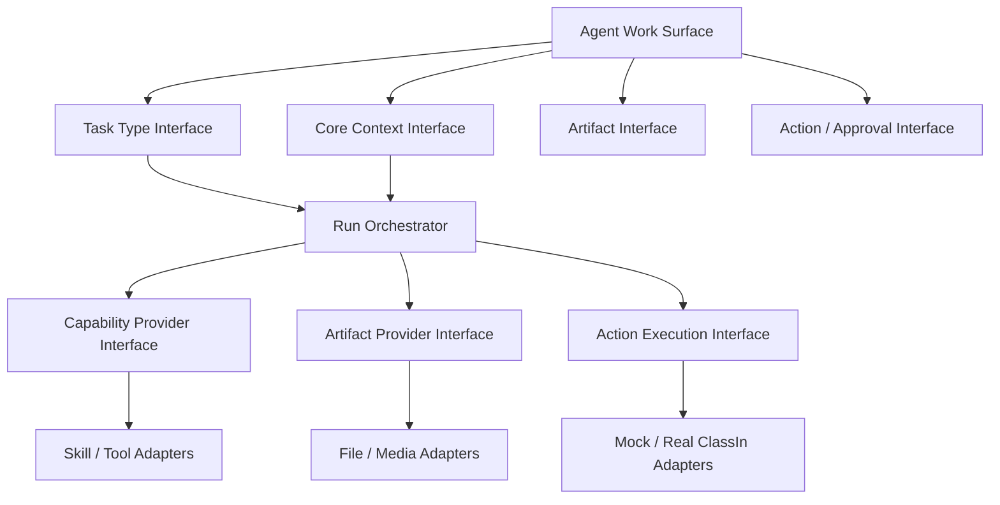

# WorkBuddy V1 架构扩展性检查

## 1. 检查目的

这是 D-014 规定的第一次轻量校验：确认 V1 产品骨架不会硬编码成“只能生成一个课件”，且不需要在完整页面设计前展开所有 ClassIn AI 能力。

`DESIGN_PASS` 只表示当前产品对象、Interface 和页面容器有明确承载方式，不表示代码、真实 API、生产权限或媒体生成已经验证。

## 2. 检查结果

| 检查项 | 结果 | 当前承载方式 | 尚未证明的边界 |
|---|---|---|---|
| 多任务类型 | `DESIGN_PASS` | Task Type Registry 将意图、Context、Artifact、能力和动作策略参数化 | Registry 尚未实现 |
| 单一与多个 Artifact | `DESIGN_PASS` | Run 持有 Artifact Blueprint/Graph，每项独立状态与版本 | 大文件、复杂格式和生产存储未知 |
| Artifact 依赖与并行 | `DESIGN_PASS` | 依赖图支持串行、并行、阻塞和局部重试 | 实际调度器和资源限额未验证 |
| Core Context 多来源 | `DESIGN_PASS` | Business Context、Domain Knowledge、资源、教师输入和证据分区装配 | 真实 ClassIn API 与版本协议未知 |
| Context 最小下发 | `DESIGN_PASS` | Capability Manifest + Context Projection 限制每步所获数据 | 第三方模型/Tool 的生产准入未知 |
| 任务中途改约束 | `DESIGN_PASS` | 主范围变化触发 Replanning，旧计划/产物标记 superseded | 精确差异算法未实现 |
| 右侧复杂工作区 | `DESIGN_PASS` | 单一活动辅助区在 Artifact / Core Context / 执行详情之间切换 | 嵌入式 DOCX/PPT/视频预览实现待 Spike |
| Skill/Tool 可扩展 | `DESIGN_PASS` | Skill/Tool 通过 Capability Manifest 声明输入、输出、权限和适用任务 | 机构安装、审核、版本与回滚规则未定 |
| 多对象业务写回 | `DESIGN_PASS` | ProposedAction → Approval → Domain Validation → Receipt；支持批次摘要 | 真实动作 API、幂等和补偿协议未知 |
| 部分成功与恢复 | `DESIGN_PASS` | Run、Artifact、Action 三层分别表达失败、重试和排除 | 跨对象事务语义未知 |
| 任务派生与复用 | `DESIGN_PASS` | 关联新 Run + sourceArtifactRef + 独立 Context Snapshot | 关系导航和保留周期待页面 Spec |
| 定时/消息等触发渠道 | `DESIGN_PASS` | 触发器创建标准 WorkBuddyRun，不建立旁路执行模型 | IM 渠道和生产 Scheduler 未定 |
| NineClaw 全功能去向 | `DESIGN_PASS` | 38/38 页面、覆盖层和壳状态均有目标去向 | 会员/积分正式商业绑定仍 OPEN |
| ClassIn 多租户与权限 | `UNKNOWN` | Interface 已要求 Actor/Tenant/Permission | 生产角色、权限粒度和接口未取得 |
| Domain Knowledge 治理 | `OPEN` | 独立 Adapter 与版本化 Context Item | 创建、审阅、发布和机构继承流程待设计 |
| 真实媒体/文件生成 | `OPEN` | 作为 Artifact Provider 后的可替换 Adapter | PPT、DOCX、音视频生成质量与沙箱待 Spike |
| 商业授权与用量 | `OPEN` | 保留 Entitlement/Usage 产品位置 | 教师购买、机构配额、积分名称与规则未定 |

## 3. 关键架构形状



### 3.1 Deep Modules

- `CoreContext`：隐藏来源装配、层级一致性、权限、敏感度、版本和 Projection；
- `RunOrchestrator`：隐藏计划、步骤、能力调用、暂停、重规划和恢复；
- `ArtifactGraph`：隐藏多产物依赖、版本、验证和局部重试；
- `ActionCommit`：隐藏动作策略、审批、领域校验、幂等、执行与 Receipt。

页面只编排这些 Interface，不自行拼接业务 API、Skill 参数或多产物状态。

### 3.2 必须建立的 Seam

| 变化点 | Seam | Mock 与未来替换关系 |
|---|---|---|
| ClassIn 业务事实 | Business Context Interface | 固定、脱敏、可重置 Mock Adapter → 真实 ClassIn Adapter |
| 教学知识与规则 | Domain Knowledge Interface | 固定版本 Mock Knowledge → 受治理 Knowledge Adapter |
| 模型、Skill、MCP | Capability Provider Interface | 固定 Manifest/Fake Execution → 真实 Provider/Tool Adapter |
| PPT/DOCX/视频等产物 | Artifact Provider Interface | 可预测 Mock Artifact → 文件/媒体生成 Adapter |
| ClassIn 写回 | Action Execution Interface | 模拟校验与 Receipt → 真实 Domain Adapter |

## 4. 反硬编码验收场景

在进入完整页面 PRD 前，设计必须能解释以下场景：

1. 一个 Run 只产生一份 PPT，不出现空的“课程包”壳；
2. 一个 Run 产生课件、作业、测验和视频，其中视频失败，其余仍可审阅；
3. 教师在课件完成后创建关联方案包 Run，原 Run 不改变状态；
4. 教师中途更换班级，系统识别受影响计划、学生范围和写回目标；
5. 一个 Skill 只获得课程目标和资料，不能获得学生姓名；
6. 写回四个 ClassIn 对象时两项成功、一项失败、一项未执行，教师能继续补救；
7. 定时任务和内容改编都回流标准 Run，而不是建立第二套任务状态。

以上七项在设计层均有明确对象和状态承载，因此本次轻量检查结论为：**可以进入 Phase 3 页面与交互详细设计；生产可行性仍需后续 Spike 与 Adapter 契约验证。**

## 5. 第二次全量能力补足的输入

V1 页面与原型确认后，再把 ClassIn 全量 AI 能力逐项映射到：

```text
入口 → Task Type → Core Context → Skill/Tool
    → Artifact → ProposedAction → ClassIn Object → Receipt
```

第二次校验会决定新增任务类型、页面入口和能力治理，不反向否定本次保留的 NineClaw 闭环。
