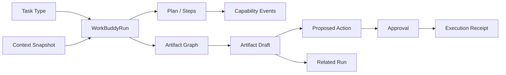

# ClassIn WorkBuddy V1 目标信息架构

## 1. IA 目标

WorkBuddy 既不能成为脱离 ClassIn 的独立桌面应用，也不能被压缩成普通聊天抽屉。目标结构是两级导航：ClassIn 一级主导航继续表达教师身份、组织和业务对象；教师从 AI Agent 入口进入后，扁平二级导航作为该入口的上下文扩展直接展开在同一左侧栏，右侧保留连续 Agent Work Surface。历史、能力、内容和触发渠道围绕同一 Run 模型组织。

## 2. 全局层级

```text
ClassIn PC Shared Shell
├── 一级主导航
│   ├── 首页 / 课程表 / 班级 / 待办 / 空间 / 教学洞察 / …
│   └── AI Agent                                 ← 一级入口
│   └── AI Agent 二级导航扩展                    ← NineClaw 式扁平导航，嵌入一级入口下方
│   ├── 新建任务
│   ├── 近期任务（置顶 + 普通，默认共可见 6 条）
│   ├── 查看全部 / 搜索
│   ├── Skills
│   ├── Tools / MCP
│   ├── 内容
│   ├── 定时任务
│   ├── 我的文件（跳转共享 Space 的 WorkBuddy 视图）
│   └── AI Agent 设置
├── WorkBuddy Work Surface
└── 账户 / 组织 / 全局消息
```

一级主导航和 AI Agent 二级导航共享同一左侧 Shell Surface。二级扩展中的“近期任务”“能力与资源”等文字只作为 Section 标题，不形成第三级菜单；任务条目就是可直接打开的导航对象。导航内部可滚动，但当前任务、输入草稿和右侧活动区不随导航滚动丢失，也不在 Work Surface 左侧再建立历史栏。

## 3. AI Agent Work Surface

```text
Work Surface
├── New Task Surface
│   ├── 目标 / Prompt
│   ├── 附件与资源
│   ├── Core Context 摘要
│   ├── 快捷任务类型
│   └── 高级能力：Skill / Model
├── Run Surface
│   ├── Run Header：标题、状态、来源、更多动作
│   ├── Goal & Context Summary
│   ├── Conversation / Execution Timeline
│   ├── Plan & Process Events
│   ├── Artifact References
│   ├── Decision / Recovery Cards
│   └── Composer / Stop Control
└── Active Auxiliary Surface                 ← 同时只活动一个
    ├── Artifact
    ├── Core Context
    └── 执行详情
```

Artifact、Core Context 与执行详情是同一右侧活动区的三种模式，不是三个永久并列栏。复杂课件编辑、多产物审阅或大尺寸媒体可以进入 Focus Surface，并保留返回 Run 的现场。

## 4. 内容对象层级



- Run 是工作现场，不等同于对话 Session；
- Artifact 是可独立审阅和版本化的对象，不是消息附件；
- Context Snapshot 解释当时用了什么，不替代实时 ClassIn 事实；
- Related Run 只保留来源与导航关系，不共享一个可变生命周期。

## 5. 页面容器层级

| 内容 | 默认容器 | 升级容器 | 原因 |
|---|---|---|---|
| 新任务、Run 时间线 | 主 Work Surface | 不需要 | 保持任务连续性 |
| Context 摘要 | Chip / Summary | 右侧活动区 | 快速可见，详情可编辑 |
| Process Event | 时间线摘要 | 右侧执行详情 | 技术信息渐进披露 |
| 单个 Artifact | 右侧活动区 | Focus Surface | 预览与轻编辑不断开 Run |
| 多 Artifact 方案包 | 右侧列表/摘要 | Focus Surface | 支持逐项审阅和依赖关系 |
| 写回审批 | 就地高可见卡 | 右侧详情 / Dialog | 低歧义且保持影响范围 |
| Skill/Tool/Content 管理 | 独立主页面 | Dialog/Popover | 不挤压 Run |
| 小范围选择 | Popover | Dialog | 按复杂度升级 |
| 高风险删除/业务动作 | Dialog | — | 明确影响与确认 |

## 6. ClassIn 业务入口

WorkBuddy 除 ClassIn 一级主导航中的 AI Agent 入口外，接受来自以下 ClassIn 对象的业务入口：

| 来源 | 自动建议的 Context | 典型动作 | 返回现场 |
|---|---|---|---|
| 班级 | 组织、班级、成员聚合 | 为本班生成课件/方案包/作业 | 原班级 Tab 与滚动位置 |
| 课程 | 班级、课程、课程状态 | 课程设计、内容生产、改编 | 原课程详情 |
| 单元 | 班级、课程、单元 | 单课件、方案包、活动材料 | 原单元锚点 |
| 课堂/课节 | 课程对象、时间、已有资料 | 备课、录播配套、课后总结 | 原日期与事件 |
| 作业/测验 | 归属、要求、时间、统计摘要 | 改编、生成配套、分析 | 原详情与筛选 |
| Space 资源 | 文件引用、来源、权限 | 改编为课件/方案包 | 原目录与选中项 |
| 教学洞察 | 班级/课程、时间、聚合证据 | 分层、诊断、干预类未来任务 | 原筛选与时间范围 |

业务入口只形成 Context Proposal。教师确认前，不把最近使用或隐式学生数据冻结进 Snapshot。

## 7. 能力与资源 IA

### 7.1 Skills

`发现 → 详情 → 安装 → 启用 → Run 内自动/显式选择 → 调用追踪 → 管理/更新/删除`

创建 Skill 使用 Skill Creator 建立独立 Run，结果安装到“我的技能”。

### 7.2 Tools / MCP

`发现 → 详情 → 安装/配置 → 连接/权限 → Run 内调用 → 追踪 → 管理`

Tool 详情不直接创建任务；教师从任务或内容入口创建 Run，编排器再调用 Tool。

### 7.3 内容

`发现 → 详情 → 获取/收藏 → 一键改编 → 新 Run → 新 Artifact`

作品只作为带来源的 Context Item，不把原作者内容静默当成教师自产内容。

### 7.4 我的文件

AI Agent 中保留“我的文件”快捷入口，但目标页面复用 ClassIn Space 的 WorkBuddy 筛选视图：任务 Artifact、本地/上传、个人云盘和组织云盘分别标来源。返回时恢复原 Run 或原 Space 现场。

## 8. 设置与商业信息

- 模型、备份、外部消息、沙箱、关于和反馈进入 AI Agent 设置；
- Skill/Tool 的机构策略可从设置进入，但实际对象管理仍在能力页面；
- 会员与积分暂以“授权与用量”作为目标信息架构位置，位于 AI Agent 设置或账户相关区域；
- 最终名称、购买主体和额度规则保持 `OPEN`，不得在 V1 原型中伪造交易成功。

## 9. 导航不变量

1. 任一功能入口最终回流标准 WorkBuddyRun；
2. Tool 详情没有“立即运行”；
3. 创建 Skill 可以启动 Skill Creator Run；
4. 关闭右侧活动区不结束 Run；
5. 从 Focus Surface 返回恢复 Run、滚动位置、展开项和 Artifact 版本；
6. 跨组织切换不能恢复另一组织的业务 Context；
7. 删除历史任务不删除已写回的 ClassIn 对象；
8. 业务写回不能用“保存文件”替代审批与 Receipt。
