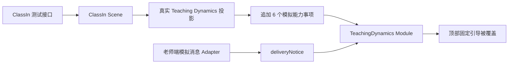
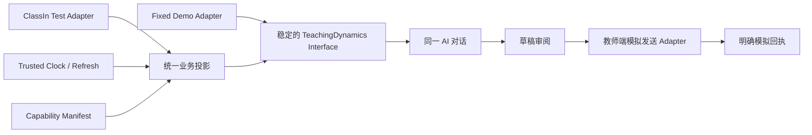

# IM Copilot 模拟方案与真实测试方案校准审阅稿

## 1. 审阅目的

本文只整理方案与待确认决策，不修改页面或运行逻辑。目标是回答三个问题：

1. 原模拟班和当前真实测试班分别如何提供数据、时间、建议与消息交付；
2. 真实 API 接入后哪些差异属于正确的数据变化，哪些属于不应发生的 UI/产品变化；
3. 如何在保留原版 Copilot 页面、交互和文案的前提下，让真实课程时间和真实业务数据稳定驱动建议。

本稿遵守 D-154 与 D-156：顶部协作面保持原版；真实测试班与原演示班独立；真实事实、模拟能力和模拟消息交付必须可区分。

## 2. 已确认的产品基线

以下内容已经锁定，不应因数据 Adapter 从 Mock 切换到真实测试接口而改变：

- 顶部仍是一个合并后的协作面，不增加第二个 Header 或工程状态栏；
- 展开与紧凑状态都显示 `AI 消息助手 · N 项建议`；
- 固定引导文案是 `选环节，点一条建议，AI写消息草稿，您确认后发送`；
- 继续使用 `课前 / 课中 / 课后 / 总结` 四阶段 Tab 和单一内容卡；
- 点击建议只把教师可读要求送入同一条 AI 对话；
- 生成、修改、审阅和发送状态留在对话及草稿区域，不进入顶部教学动态；
- `N` 是当前快照中可操作建议的动态数量，并非固定为模拟班的 `10`；
- 正常页面不在顶部重复展示连接成功、数据来源或模拟范围等工程说明。

依据：

- [D-154 与 D-156](../../../00-project/DECISION-LEDGER.md)
- [IM Copilot Feature Spec](../workbuddy-im-collaboration/FEATURE-SPEC.md)
- [ClassIn 测试接入 PRD](./PRD.md)

## 3. 两套方案对比

| 维度 | 原模拟班方案 | 当前真实测试班方案 | 校准判断 |
| --- | --- | --- | --- |
| 会话对象 | 固定 `高二物理 3 班`，Thread 为 `class-physics-3` | API 读取的测试班、测试课程，使用独立 ClassIn Test Thread | 正确差异 |
| 教师、班级、课程 | 固定、去标识 Fixture | 从测试环境授权范围读取 | 正确差异 |
| 教学活动 | 固定物理课堂、作业、测验、总结等场景 | 当前读取 54 项活动，包含在线课堂、作业、测验、录播课、学习资料 | 正确差异 |
| 学员 | 固定模拟名单及人数 | 当前授权测试班 3 名测试学生；活动分配和进度按详情接口核对 | 正确差异 |
| 时间来源 | 固定演示时钟 `2026-08-09 14:40 +08:00` | API 响应的 `capturedAt` 加各活动真实开始、结束和截止时间 | 方向正确，刷新机制有缺口 |
| 当前阶段 | 固定时钟依次投影课前、课中、课后、总结 | 按最近一次 API 快照判断课前、课中和进行中的作业/测验 | 方向正确，长时间打开可能过期 |
| 建议内容 | 固定、完整、可重复的物理教学场景 | 真实活动生成建议，再固定追加 6 个“未接入能力”模拟入口 | 需要收敛显示条件 |
| 建议数量 | 由固定时刻下的可操作事项计算，当前基线是 10 | 由真实可操作事项与 6 个固定模拟入口共同计算，数量随时间变化 | 动态数量正确；常驻模拟项会虚增 |
| 顶部引导 | 固定锁定文案 | 被替换为 `真实课程 · 未接入能力使用模拟 · 消息仅老师端可见` | 明确偏差，应恢复 |
| 顶部样式 | 已验收的统一浅灰协作面 | 共用同一 Teaching Dynamics 样式 | 样式 Module 未因真实接口重做；长文案造成视觉观感变化 |
| 事实边界 | 全部标为 `fixed-demo` | API 事实标为 `read-only-business-data`；补充能力标为 `fixed-demo` | 正确设计 |
| 消息发送 | Mock Message Adapter，教师端生成模拟回执 | 当前同样是教师端本机模拟发送，学生端不接收 | 符合 D-156，但须在交付位置说明 |
| 错误处理 | 固定数据通常不会出现网络错误 | 真实 API 失败必须显示错误和重试，不退回虚构事实 | 正确差异 |
| 可复现性 | 完全确定，可用固定时钟重放 | 受真实课表、当前时刻、活动状态和接口可用性影响 | 应用录制快照做自动化，现场验收继续读真实 API |

## 4. 当前真实时间样本

2026-09-15 本稿编写时从本机测试 BFF 重新读取到：

- 读取时间：`2026-09-15 09:37:14`，Asia/Shanghai；
- 课程活动：54 项；
- 测试学生：3 人；
- 第 1 讲在线课堂：9 月 14 日 19:30 开始，当前已结束；
- 第 1 讲作业和测验：9 月 14 日 19:30 开始，9 月 16 日 19:30 截止；
- 联调短课：9 月 15 日 19:30–19:45；
- 第 2 讲在线课堂：9 月 16 日 15:30–17:30；其作业于 9 月 18 日 15:30 截止；
- 第 3～14 讲继续按每隔一天一讲排布，最后一讲于 10 月 10 日结束；
- 学习资料统一覆盖 9 月 13 日至 10 月 12 日；录播微课也处于这段课程有效期内。

因此在上述读取时刻，真实数据可以合理产生：

- 课前：当晚联调短课提醒；
- 课中：没有正在进行的课堂，只能表达实时出勤不可确认；
- 课后：第 1 讲作业及测验截止提醒；
- 总结：课程活动盘点，以及有真实报告证据时产生的课后总结事项。

真实时间不是为了复刻模拟班此刻恰好处于“上课 10 分钟”的状态。页面结构应完全一致，业务内容必须随测试课表与当前时刻变化。

## 5. 当前偏差如何产生

数据读取和真实时间投影位于正确的 Seam，但交付 Adapter 的状态说明被直接作为顶部 `guidance` 传给了 `TeachingDynamics Module`。这把两种不同信息混在了一起：

- `guidance` 应回答“老师如何使用这个 Copilot”，属于稳定产品文案；
- `deliveryNotice` 应回答“这次确认发送会产生什么结果”，属于具体交付状态。

与此同时，6 个模拟能力事项无条件进入四个阶段：模拟改期、模拟到课、模拟测验批阅、模拟个性化回顾、模拟授课分析、模拟媒体学习总结。它们虽然带有模拟标签，没有覆盖真实事实，但会持续增加 `N 项建议`，也会让真实时刻下并不适用的能力显得正在发生。

## 6. 建议的真实方案

### 6.1 保持一个稳定的页面 Interface

`TeachingDynamics Module` 只接收已经投影好的教学动态，不感知当前是 Mock Adapter 还是真实 ClassIn Adapter。顶部身份、固定引导、四阶段交互、展开收起和视觉样式由该 Module 统一拥有。

建议取消真实测试班对 `guidance` 的覆盖，恢复锁定文案。若未来确实需要更换引导，应走独立产品决策，不由某个数据 Adapter 改写。

### 6.2 将事实来源放在最接近事实的位置

| 信息 | 建议位置 | 推荐展示 |
| --- | --- | --- |
| 真实课堂、作业、测验 | 具体事项的标题、时间与详情 | 正常业务语言，不反复写“真实” |
| 未接入能力的模拟样本 | 具体模拟事项 | 标题保留“模拟”，详情保留“模拟体验 · 不修改真实业务记录” |
| 老师端模拟发送 | 草稿确认区与发送回执 | `模拟发送，仅保存在当前老师端；学生端不接收` |
| 当前班级的测试连接范围 | 群资料/课程核验入口 | 保留独立入口，不占据 Copilot 固定引导 |
| API 读取失败或过期 | 受影响的动态区域 | 显示失败、上次读取时间与重试；不切换到 Mock 事实 |

这样既能让用户辨别真值，又不会把工程说明提升为顶部主文案。

### 6.3 让模拟能力服从真实业务时机

建议把“无条件追加 6 项”改为“能力清单 + 适用条件投影”：

| 模拟能力 | 建议出现条件 |
| --- | --- |
| 模拟改期通知 | 存在尚未开始的真实课堂，并明确只演练通知、不修改课表 |
| 模拟到课提醒 | 当前确实处于某堂真实课堂的排定时间内；实时出勤未接入 |
| 模拟测验批阅 | 存在已开始的真实测验，但真实逐题作答或批阅证据不可用 |
| 模拟个性化回顾 | 存在已结束课堂或已开始任务；使用虚构学员，不映射三名真实学生 |
| 模拟授课分析 | 存在已结束课堂，而真实 AI 分析全文或高光不可用 |
| 模拟媒体学习总结 | 当前课程存在录播或资料，但视频转写、图片 OCR 等内容理解未接入 |

不满足条件时不计入 `N 项建议`。这可以保留业务场景的完备性，同时让建议数量表达“现在可做什么”。

### 6.4 使用可信时钟并在边界刷新

当前投影以 `scene.capturedAt` 为 `now`，能避免浏览器时钟篡改，但页面打开后该时间不会继续前进。建议的时间 Module 如下：

1. 首次进入和手动刷新时，以 BFF 返回的服务器读取时间为可信基准；
2. 根据活动开始、结束和截止时间，计算最近一个状态边界；
3. 到达边界后重新读取真实 API，再决定课前、课中、课后状态；
4. 页面重新获得焦点或网络恢复时重新读取；
5. 若刷新失败，保留上次快照并标为过期，不把旧状态当作当前事实；
6. 自动化测试通过注入时钟和录制的脱敏响应验证边界，现场验收仍使用真实测试接口。

建议继续沿用当前基础窗口：

- 课前提醒：已发布、未取消、未结束，且距离开始不超过 24 小时；
- 课中事项：开始时间不晚于当前时刻，结束时间晚于当前时刻；
- 作业/测验提醒：任务已经开始且尚未截止；
- 已结束课堂、已截止任务不继续作为相同提醒，转入有真实证据的总结或闭环确认。

### 6.5 目标结构

变化集中在 Adapter 和投影 Module 内，页面不需要知道真实接口字段、固定场景数据或模拟能力判断规则。这样能提高 Locality：以后接入真实出勤、真实批阅或真实 IM 时，只替换对应 Adapter，删除该能力的模拟投影，不再修改顶部页面。

## 7. 推荐修正顺序

| 顺序 | 工作项 | 完成条件 |
| --- | --- | --- |
| CAL-01 | 固化本次审阅决策 | 确认顶部文案、模拟标签位置、能力出现条件和时间刷新策略 |
| CAL-02 | 恢复顶部 UI 基线 | 模拟班与真实测试班均显示 D-154 固定文案；布局、阶段 Tab 和展开收起一致 |
| CAL-03 | 收敛模拟提示位置 | 顶部不显示交付状态；具体事项、草稿和回执仍能明确区分真实与模拟 |
| CAL-04 | 增加模拟能力适用条件 | 不适用于当前真实时刻的模拟事项不出现、不计数；真实事实不被覆盖 |
| CAL-05 | 增加时间边界刷新 | 页面跨越开课、下课或截止时刻后重新读取并正确切换阶段；失败时显示过期和重试 |
| CAL-06 | 回归验证 | 原物理演示班视觉与交互不变；真实班按录制时钟覆盖课前/课中/课后；API 失败、模拟交付、学生隔离均通过 |

## 8. 建议验收矩阵

| 场景 | 顶部 | 动态事项 | 交付 |
| --- | --- | --- | --- |
| 原模拟班 | 原文案、原样式、动态数量 | 固定时钟产生既有 10 项建议 | 原 Mock 发送闭环 |
| 真实班，课前 24 小时内 | 原文案、原样式 | 真实课堂提醒；符合条件的模拟能力单独标记 | 老师端模拟回执，学生不接收 |
| 真实班，正在上课 | 原文案、原样式 | 显示真实排课状态；出勤未接入时才出现模拟到课入口 | 同上 |
| 真实班，作业/测验进行中 | 原文案、原样式 | 使用真实截止时间和真实汇总；没有个人证据不点名 | 同上 |
| 真实班，接口失败 | 原文案、稳定尺寸 | 明确失败、上次读取时间、重试；不出现替代 Mock 事实 | 不允许基于过期事实直接发送 |
| 真实班，跨越时间边界 | 原文案不变化 | 自动刷新后从课前切至课中或从进行中移除 | 已有对话历史不丢失 |

## 9. 本次需要共同确认的三项决定

本稿推荐以下默认方案：

1. **顶部严格复用原版**：两个 Adapter 都固定显示 D-154 文案，真实/模拟说明不占用顶部引导。
2. **模拟标签就近展示**：模拟能力写在事项上，模拟发送写在草稿和回执上；真实业务事项使用正常业务语言。
3. **模拟能力按真实时机出现**：不再常驻 6 项；以真实课堂、任务及资源是否存在和当前时间窗口决定是否展示。

上述三项确认后，再把本文结论写入 Feature Spec 和 Tickets，并开始 CAL-02～CAL-06。当前文档是讨论稿，不代表已批准修改锁定决策。
