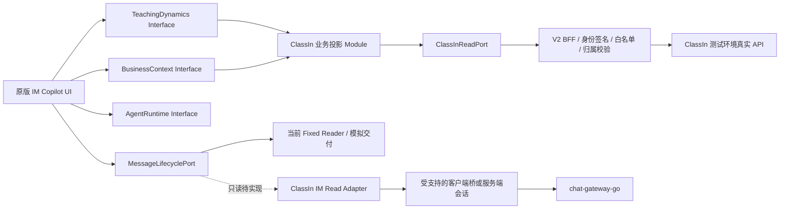

# IM Copilot 模拟数据与真实 API 全量映射审阅稿

> **当前 Review Gate（2026-09-16）**：用户已完成 Copilot 模拟基线验收，正在审阅本稿，并明确本稿是接下来的重点动作。§2.3“页面模板与稳定文案不变，班级、人数、课堂和日期等参数随真实 API 返回值变化”已确认。2026-09-16 又完成五轮补充研究：v0.3 将普通班群历史从“接口缺口”改为“协议与真实读取已验证、V2 Adapter 待实现”；v0.4 补入用户提供的实时考勤数据库与 `getClassInfo` 路径；v0.5 通过 `127.0.0.1:7777` 监听 ClassIn 6.1 内嵌 LMS 的真实点击，验证 47 个登录态 Endpoint，并确认 `/classroom/app/classInfo/simpleInfo` 可按 24 小时时间窗发现目标课节；v0.6 同时监听教师和两个学生客户端，完整验证课节 `1250728` 的进入、开课、聚合在线人数、下课与课后出勤汇总，并在普通 IM 中观察到一条学生侧发起、教师侧实时接收的 `receiveChatMsg`；v0.7 在操作前同时监听教师 `7777` 与两个学生端 `7779/7780`，验证两名学生测验交卷、一名学生作业提交以及教师批改后的跨端状态回读，并从原生日志补获 `submitPaper` 正式交卷请求与“测验被批阅”结果事件。真实 IM 发送命令、成员级实时考勤、作业写 Endpoint 与教师批改写 Endpoint 仍分别保留 Gate。其余批注完成后，再统一进入新的 PRD → Feature Spec → Tickets，不提前切换默认 Adapter。

人工批注与上述补充监听的统一结论见 [ClassIn 真实测试环境接口整体判断与接入基线](./CLASSIN-REAL-TEST-API-OVERALL-ASSESSMENT-2026-09-16.md)。该文档区分“业务数据覆盖、测试环境实调、V2 工程接入、业务写闭环”，作为下一阶段 PRD 的建议输入；本稿继续保留逐接口证据和审阅上下文。

## 1. 本稿回答什么

本稿在开始新一轮真实 API 开发前，统一回答四个问题：

1. 当前 IM Copilot 的页面和 21 个通用问题实际依赖哪些业务事实；
2. 这些固定模拟事实分别能映射到哪些 ClassIn 测试环境接口；
3. 哪些接口只是 Apifox 有定义，哪些已经由测试教师只读调用成功，哪些已经进入 V2 的服务端封装；
4. 在页面结构、交互、视觉和产品文案不变的前提下，真实数据接入后哪些业务值必然变化。

本轮没有切换默认 Adapter，也没有修改 UI。用户在已授权测试账号中执行了学生提交和教师批改；Agent 只进行被动监听、脱敏记录与只读回读，没有自行调用或重放写接口。D-157 继续有效：默认 IM Copilot 仍使用已验收的固定模拟数据；真实 ClassIn Module 只保留在独立核验入口，待本稿审阅后再进入 PRD → Spec → Tickets → Implementation。

## 2. 结论先行

### 2.1 能接入的范围

当前已经具备一条较完整的只读主链：

```text
测试教师身份
  → 班级/课程关系
  → 课程分类/单元/五类教学活动
  → 活动详情与活动分配学生
  → 作业提交、测验作答、录播进度、资料文件
  → 课堂报告、回放元数据、教师笔记、AI 分析状态
  → 现有 BusinessContext / TeachingDynamics 投影
  → 原版 IM Copilot
```

它足以真实驱动课程目录、下一堂课、任务时间、班级学生数、作业/测验提交概况、录播观看进度、学习资料正文，以及部分课后报告场景。

普通 IM 另获得了一条已验证的客户端只读链路：

```text
课程消息入口中的 courseId/chatSessionId
  → POST /chat-gateway-go/api/chatGroup/list
  → {id: courseId, type: "group"} Cluster 引用
  → WSS /chat-gateway-go/ws 鉴权
  → chatWith / requestChatMsg
  → 真实普通班群历史消息对象
```

该链路已在当前已登录测试客户端中完成握手、鉴权、一页 20 条历史消息回读，并在教师端实时收到一条学生侧消息；尚未进入 V2 合同与 Adapter。发送侧命令与 ACK 没有捕获，也不能据此宣称教师发送和学生收件已经接通。

实时考勤也不再是“没有接口方向”。当前已经形成两条候选链：一条是登录态 ClassIn LMS 已经 `CALL` 成功的 `/classroom/app/classInfo/simpleInfo`，它按当前到未来 24 小时时间窗发现目标课节并返回 `classId`，随后由 Web 教务 `getClassMember + classId` 返回成员的到课、当前在教室、迟到、早退、终端、累计时长与进出时间序列；监课场景也可用 `getClassInfo` 按时间窗和课堂状态列出正式课节。另一条是 OceanBase 课节成员停留汇总与进出明细候选表。Apifox 与数仓 ODS 血缘支持成员字段模型，但本轮课程主页和课堂详情点击没有触发 `getClassInfo/getClassMember`，成员级链路仍需在监课/考勤页面完成登录态真实样本验收。

### 2.2 仍不完整的范围

下列能力不能在接入时宣称为完整真实能力：

- **普通 IM 历史与发送不是同一成熟度**：普通班群历史已经在真实客户端中完成协议识别和只读回读，消息正文、作者、时间、稳定消息 ID、引用及状态字段均可观察；但它依赖已登录 ClassIn PC 的身份、签名和客户端桥，尚无 V2 Adapter 或受支持的独立服务端合同。文本发送命令和成功/失败/超时事件只完成静态识别，尚未执行发送、ACK、回读和学生可见验收。原先找到的 `/getChatList` 仍是课堂内聊天，`/ws/sendGroupMessage` 仍是业务推送，均不作为普通 IM 合同。——原批注：“拿不到真实的IM接口，这个可以缓一下，作为后续的api接入批次”；v0.3 更新：现在可把该批次拆成“只读历史接入”和“真实发送验收”两个 Gate
- **提交/批改结果已跨端回读，只有测验交卷补获写请求**：v0.7 同时监听三个客户端，已由教师与学生两端确认两次测验交卷、一次作业提交和批改后的状态变化；第二名学生测验回读 `showScore=25`。CEF CDP 只观察到 `studentUnitActivityList/unitActivityList/todo-list/detail`，但辅助学生端原生日志补获 13 次 `POST /api/exam.api.php?action=submitPaper` 请求形状；最后一次 `isExamEnd=1` 与约两秒后的交卷回读一致。原生日志还收到 `pushScenes=测验被批阅-无系统评分` 的结果事件。`submitPaper` 可标记为“请求与结果回读 `CALL`”，直接响应外壳仍待补；`ReferHomeworkStudents`、`reviewPapers` 和作业批改写路径仍未运行时捕获。当前不能把 PC 原生写入整体视为已接通，也不能依据一次状态变化冻结未文档化枚举。
- **课节发现与聚合在线人数已 `CALL`，成员实时考勤鉴权待打通**：用户提供 `POST /saasajax/teaching.ajax.php?action=getClassInfo` 与 OceanBase 两表；Apifox `345136/3473499` 证明 `getClassInfo` 是监课列表，配套的 `345136/3473563 getClassMember` 再以 `classId` 读取成员明细。v0.5 证明 `/classroom/app/classInfo/simpleInfo` 可发现目标课节，v0.6 又在教师和两个学生客户端交叉验证 Bridge 的 `getBatchLessonMemberNumber/updateLessonMemberNumberNotice`，并由课后 `onClassTotal=2/studentTotal=3` 对上两个实际进入的学生。聚合在线数包含教师，成员的 `isOnClass/isInClass/isLate/isEarly/platformType/classTime/timeList` 仍为 `DOC`，还不是 `CALL/V2`。——原批注：“这个接口需要第一批拿到，我可以进一步去和研发伙伴沟通”；第一批验收链更新为“`simpleInfo/getClassInfo` 发现课节 → Bridge 聚合在线快照 → `getClassMember` 成功回读 → 与课后活动汇总、报告和数据库对账”
- **跨活动错题聚合**：逐个测验的题目与作答已有读取链路，但“最近两次作业/测验中高频错题”仍需要跨活动聚合、题目身份对齐和统计规则。——这个我理解需要两步处理，我们先通过测验的方式，通过作业和测验的结果拿到错题的内容。第二步我们人工做，用 AI 的方式，按标准的规范做聚合。我们只要定义好这个 skill 的聚合标准。
- **个人学情闭环**：活动级学生结果可由教师私有上下文读取，但当前真实 Adapter 没有完成私聊对象、学生身份、时间范围和证据范围的稳定绑定。——这个我不太清楚，你具体指的是哪些接口的问题？
- **录播/课堂语义总结**：可读文件、播放状态、时长、教师笔记和报告；没有证据时不能把 AI 生成的主题摘要说成真实视频转写或完整课堂内容。——对应的接口可以提供相应的课堂 ASR 语音文字，以及课堂回放视频，这些可以作为识别的上下文。那也确实存在一些 AI 生成的课堂纪要、课堂知识点，其实也可以用。
- **AI 授课分析全文**：记录状态与报告定位已验证；正文存在异构包装、分数冲突，并可能与正式出勤事实矛盾，尚不适合直接作为学生事实投影。——对，这一点授课报告其实当前也是存在的，也可以是 AI 生成的。对课堂所讲的内容、课堂回放、课堂里老师的一些语音文本的分析，也可以作为输入

### 2.3 “页面内容完全不变”的可执行定义

真实数据接入的推荐约束是：

> **页面信息架构、组件、视觉、交互、稳定产品文案和问题类型完全不变；只有既有业务槽位中的对象名称、人数、时间、状态、内容与结果换成真实 API 值。**

如果“展示内容完全不变”还要求继续显示固定的“高二物理 3 班、30 人、动量守恒、8 月 9 日”等字面值，那么真实数据将没有用户可见效果，而且页面会继续陈述与真实测试班冲突的事实。该方式不建议采用。本文后续所有显示预判均采用“模板不变、业务值真实”的定义。
——我同意你的意思。它只是模板不变，展示文案的这套结构不变，但具体的数值参数会随着真实 API 返回的结果而变化。当然不是把这个句子的结构都变化，是模板不变，注意体会模板不变。我举个例子，比如班级名称（xxx）、（xx人）多少人、（xxx）课堂的名称、（x月x日）几月几日时间日期，这是结构，然后参数填刚才我说的这些xx的部分。

## 3. 三层状态口径

本稿不把“Apifox 搜到接口”等同于“项目已经能用”。每条能力使用以下三层证据：

| 标记 | 含义 | 通过条件 |
| --- | --- | --- |
| `DOC` | Apifox 或既有一手客户端证据中存在定义 | 已核对项目、Endpoint、方法、路径和主要输入输出 |
| `CALL` | 当前测试教师在测试环境通过 HTTP 或已登录客户端运行时只读调用成功 | 响应成功且对象归属能与目标班/课/活动交叉核对；客户端运行时证据还要注明会话与桥接边界 |
| `V2` | V2 已有服务端白名单、合同和投影 | 浏览器不持有 Secret；数据经过 BFF 校验后进入领域合同 |

`DOC/CALL/V2` 全有仍不自动代表某个 Copilot 场景完整；例如课堂报告虽三层可用，实时出勤仍然不成立。

## 4. 必须冻结的前端 Surface Contract

真实 Adapter 不得修改下表内容。它们由现有 UI Module 和已锁定决策拥有，不属于 ClassIn API Adapter。

| 前端范围 | 冻结要求 |
| --- | --- |
| 页面框架 | 保留消息页左侧会话列表、中间消息区、右侧 Copilot；不新增真实接口专用页面作为主入口 |
| Copilot 身份 | 固定显示 `AI 消息助手` 和现有头像 |
| 引导文案 | 固定显示 `选环节，点一条建议，AI写消息草稿，您确认后发送` |
| 阶段导航 | 保留 `课前 / 课中 / 课后 / 总结` 四阶段、圆形节点、选中态和现有收起行为 |
| 建议卡 | 保留标题、说明、操作按钮、`无需处理` 等既有表现；API 字段不能直接成为新 UI |
| 通用问题 | 保留 6 组、21 个问题类型、入口位置和交互流程；具体对象名可由真实上下文代入 |
| 对话 | 保留同一连续对话、历史向上滚动、处理中过程、停止/恢复、错误和重试样式 |
| 消息引用 | 保留“引用给 AI”、引用预览、撤回/缺失引用处理和历史顺序 |
| 草稿交付 | 保留生成 → 修改 → 审阅 → 确认发送的现有状态机；普通 IM 历史接入不自动开放发送，发送验收完成前继续明确模拟回执 |
| 图片产物 | 保留图片卡、预览、下载、重试和消息顺序；ClassIn 数据 Adapter 不改变图片生成布局 |
| 样式 | 保留现有 Token、字号、间距、颜色、分栏宽度、滚动和响应式行为 |
| 错误处理 | 使用现有错误/重试区；不把 API 失败改成空白，也不静默回退到模拟业务事实 |

真实接入不得在顶部增加“真实课程”“接口已连接”“未接入能力使用模拟”等工程文案。数据来源、过期和模拟边界只在真正受影响的事项、草稿回执或核验入口中就近表达。
——嗯，对的。只是我们把真实 API 的数据吐出来，并不代表说我们把真实 API 各种样的一些标识啊、标签啊也附带过来，这些没有任何业务意义，没有必要
## 5. 当前 IM Copilot 的内部 Interface 与替换边界

| Interface / Module | 当前默认实现 | 真实实现现状 | 本轮目标边界 |
| --- | --- | --- | --- |
| `TeachingDynamicsAdapter.list` | `FixedWorkBuddyImTeachingDynamicsAdapter` | `ClassInTeachingDynamicsAdapter` 已存在，能投影真实排课和任务 | 只替换 Adapter；`TeachingDynamics` React 组件不改 |
| `BusinessContextAdapter.capture` | 固定物理教学事实 + 固定消息上下文 | `ClassInBusinessContextAdapter` 已存在，可按活动读取明细 | 保持 Runtime Envelope 结构和提示行为不变 |
| `BusinessContextAdapter.listLearningContext` | 固定学生、课次、任务、错题、时间段目录 | 真实实现只稳定列出课堂和作业/测验；学生、错题、时间段暂为空 | 完成真实目录合同后再开放对应个人问题 |
| `BusinessContextAdapter.captureLearningContext` | 固定个人学情证据 | 真实实现当前不支持 | 新建深层个人学情聚合 Module，不在组件内拼接 |
| `ImChatReadResult` 读取 | `createFixedImChatReader` | 已验证 `chat-gateway-go/ws` 的课程群历史读取协议；尚无 V2 Adapter | 为课程群历史新建只读 Adapter 与标准化合同；在其完成前默认消息时间线仍留在模拟 Thread |
| `MessageLifecyclePort` / `ClassInMessageDraftAdapter.execute` | 老师端 Mock append + `SIMULATED` 回执 | 已识别发送命令及成功/失败/超时事件，未完成实际发送与收件验收 | 历史读取和发送分 Ticket；保持现有确认流程，真实发送不阻塞只读历史接入 |
| `AgentRuntimeAdapter` | TeachBuddy Harness HTTP Runtime | 已是现有运行服务，与 ClassIn 业务 API 无直接替换关系 | 保持模型、生成、图片和会话恢复实现不变 |
| `ClassInReadPort` | 独立测试页通过 HTTP BFF 调用 | `scene/detail/resource/...` 已存在 | 作为所有真实业务事实的底层 Read Port，禁止 UI 直调内部服务 |

目标依赖保持：



## 6. 业务对象与真实 API 总表

下表是当前 IM Copilot 会用到的外部业务接口，不包括与消息页无关的 ClassIn 写接口。

### 6.1 班级、课程、单元和活动目录

| 业务事实 | Apifox 项目 / Endpoint | 方法与路径 | 证据 | V2 用途与边界 |
| --- | --- | --- | --- | --- |
| 教师可见班级/课程 | `eeo_course_business` 345169 / 3496948 | POST `/course/app/member/course_list` | `DOC/CALL/V2` | 定位授权班级和课程；当前场景仍以配置的目标课程为主，不等于已聚合教师所有课程 |
| 班级成员 | 345169 / 3493906 | POST `/course/app/getCourseMember` | `DOC/CALL/V2` | 班级总人数、学生/旁听身份；班级名单不等于每项活动实际分配 |
| 课程分类 | `LMS` 345129 / 3496924 | POST `/lms/app/category/list` | `DOC/CALL/V2` | 定位课程目录和分类 SID |
| 单元列表 | 345129 / 3471141 | POST `/lms/app/course/unitList` | `DOC/CALL/V2` | 单元顺序、名称和活动计数 |
| 单元活动列表 | 345129 / 3471555 | POST `/lms/app/course/unitActivityList` | `DOC/CALL/V2` | 得到在线课堂、作业、测验、录播、资料五类活动及时间/状态摘要 |

### 6.2 五类教学活动明细

| 活动 | 详情接口 | 学生/进度接口 | 证据 | 可支撑的页面事实 |
| --- | --- | --- | --- | --- |
| 在线课堂 | 3471071 POST `/lms/app/activity/class/get` | 3471043 POST `/lms/app/activity/class/students` | `DOC/CALL/V2` | 名称、起止时间、发布/进程、录课设置、分配学生、课后参与摘要；不能作为实时到课 |
| 作业 | 3471031 POST `/lms/app/activity/homework/get` | 3471069 POST `/lms/app/activity/homework/students` | `DOC/CALL/V2` | 作业正文、资源、答案配置、开始/截止、满分、提交和批阅状态 |
| 测验 | 3471127 POST `/lms/app/activity/exam/get` | 3471053 POST `/lms/app/activity/exam/students` | `DOC/CALL/V2` | 试卷配置、题量/分值、时间、参与、作答/批阅状态、得分率 |
| 录播课 | 3471030 POST `/lms/app/activity/recordClass/get` | 3471061 POST `/lms/app/activity/recordClass/students` | `DOC/CALL/V2` | 视频配置、有效期、发布状态、观看进度和学习时长 |
| 学习资料 | 3471040 POST `/lms/app/activity/learningMaterials/get` | 3471026 POST `/lms/app/activity/learningMaterials/students` | `DOC/CALL/V2` | 资料名称、说明、文件、有效期、学生查阅/进度 |

### 6.3 题目、提交、文件与正文

| 业务事实 | Endpoint | 证据 | 当前可用结果 | 限制 |
| --- | --- | --- | --- | --- |
| 作业单个学生提交详情 | LMS 3499108 POST `/lms/app/activity/homework/student/detail` | `DOC/CALL/V2` | 提交正文、教师评语、附件类型和图片引用 | 没有读取原图时不得判断图片答案内容和正确率 |
| 学生侧活动状态回读 | POST `/lms/app/course/studentUnitActivityList`、`/todocenter/todo/todo-list/detail` | `CALL`；v0.7 两个学生端运行时验证 | 提交后的个人活动状态、完成时间、测验出分状态和显示分数 | 是结果回读，不是提交或批改写接口；状态枚举需正式合同 |
| 教师侧提交/批改摘要回读 | POST `/lms/app/course/unitActivityList`、`/todocenter/todo/todo-list/detail` | `DOC/CALL/V2`；v0.7 写操作前后对比 | `submitTotal/correctTotal/studentTotal` 与教师待办业务状态 | 汇总不能替代单个学生详情；`correctTotal` 变化不可脱离枚举合同解释 |
| 题目批量详情 | 题库 345268 / 3487332 POST `/question-bank-business-service/topic/batchGet` | `DOC/CALL/V2` | 题干、题型、选项、答案、解析、题图引用 | 题图需经安全 BFF 下载；部分富文本需规范化 |
| 测验作答与批阅 | 考试 345131 / 3470597、3470598，POST `/api/exam.api.php` 对应 action；v0.7 原生日志捕获 `action=submitPaper` | 读取为 `DOC/CALL/V2`；交卷请求与结果回读为 `CALL`；批改结果事件为 `CALL` | 逐题答案、状态、批阅、得分和是否含媒体；正式交卷使用 `isExamEnd=1`，进行中保存为 `isExamEnd=2` | action、角色字段和成功外壳按考试服务专属合同解析，不能套用 LMS 规则；`submitPaper` 直接响应、`reviewPapers` 发起请求与幂等/失败恢复仍待补 |
| 活动文件列表 | LMS 3486110 POST `/lms/app/file/getFiles` | `DOC/CALL/V2` | PDF、图片、视频等资源元数据 | Endpoint 状态为 developing；仍需对象归属校验 |
| 下载信息 | LMS 3495858 POST `/lms/app/file/getDownInfo` | `DOC/CALL/V2` | 为授权资源解析下载定位 | 不把签名 URL 暴露给模型或持久化日志 |
| PDF 正文 | 上述文件接口 + V2 PDF 文本提取 | `CALL/V2` | 当前学习资料 PDF 可提取页数与正文 | 扫描件无文本层时需要 OCR，当前不自动伪造正文 |
| 作业/题目图片 | 上述提交/题库接口 + V2 资源代理 | `CALL/V2` | 当前样本图片可显示、下载并按题目/学生关联 | 只允许服务端已授权引用，不接受任意 URL |

### 6.4 课堂报告、回放、笔记和 AI 分析

| 业务事实 | Endpoint | 证据 | V2 状态 | 限制 |
| --- | --- | --- | --- | --- |
| 报告票据 | POST `/api/classin.api.php?action=getReportUrl` | `CALL/V2`；准确路径未被本轮 Apifox 完整覆盖 | 已封装 | 只提取报告 key；不把完整 URL 或 key 暴露给浏览器/模型 |
| 课堂总体报告 | classroom 345171 / 3478511 POST `/classroom/web/class/report/overallView` | `DOC/CALL/V2` | 已封装到 `classroomResult` | 是课后报告；空对象不能转成 0 分或“无人掌握” |
| 出勤明细 | 345171 / 3478531 POST `/classroom/web/class/report/getAttendRecords` | `DOC/CALL` | 尚未进入当前 Read Port | 状态枚举不完整；成员专属 key 必须剔除；不是实时出勤 |
| 24 小时窗课节发现 | ClassIn LMS 登录态 `POST /classroom/app/classInfo/simpleInfo` | `CALL`；课程主页四次成功调用 | 尚未封装 | 请求 `startTime/endTime`，返回 `courseId/classId/className/classBtime/classEtime/classStatus`；可定位下一堂目标课，但不含成员考勤 |
| 课中聚合在线人数 | 已登录客户端 Bridge `getBatchLessonMemberNumber`；增量事件 `updateLessonMemberNumberNotice` | `CALL`；教师与两个学生端对同一课节交叉验证 | 尚未封装 | 返回 `courseId/lessonId/onlineNum/totalNum`；本轮 `onlineNum` 包含教师，不能直接作为已到学生数，也不能生成成员名单、迟到或早退结论 |
| 课中实时考勤 Web 接口 | 用户提供 `/saasajax/teaching.ajax.php?action=getClassInfo`；Apifox 345136 / 3473499 为正式课节监课列表，345136 / 3473563 为 `action=getClassMember` 成员明细 | `DOC`；两个 action 的未登录响应均已复现，成功 `CALL` 待完成 | 尚未封装 | `getClassInfo` 以时间窗、课堂状态和类型筛课并返回 `classId`；`getClassMember` 以 `classId` 返回 `studentUid/studId/identity/isOnClass/isInClass/isLate/isEarly/platformType/classTime/timeList`。Cookie/客户端会话合同、字段单位、刷新频率和跨班拒绝仍需实测 |
| 课中实时考勤数据库候选 | 用户提供 OceanBase `eo_classroom.eeo_class_member_time`、`eeo_class_member_time_detail`；数仓存在 `eo_classroom` 与 `eo_os` 两条 `eeo_class_member_time` ODS 血缘、Kafka CDC 表和 T-1 视图 | 汇总字段 `DOC`；直接源表位置待 DBA 确认；`WAREHOUSE_T1_VERIFIED` | 不进入 V2 浏览器或页面直连 | 数仓可确认 `class_id/course_id/member_uid/identity/is_on/is_late/is_early/platform_type/stayin_time/time_list` 字段模型，但不能用于课中实时；当前原始数据元数据中 `eo_classroom` 只暴露 `eeo_class_file`，未发现用户给出的两张表，`detail` 也未在 ODS/视图中找到，需确认是否迁库、改名或折叠进 `time_list` |
| 课堂互动/成就候选 | 3493816 `/web/class/report/achievements`、3493818 `/engageList`、3493828 `/sceneOccurTime` | `DOC`，部分当前样本为空 | 尚未封装 | 需先定义空值与状态枚举，再决定是否用于 Copilot |
| 课堂笔记 | POST `/api/classin.api.php?action=getClassNotes` | `DOC/CALL/V2` | 已封装教师本人笔记 | 未验证学生私人笔记；笔记时间不等于真实授课时间轴 |
| 回放元数据 | eeocn 345136 / 3489304 POST `/api/classin.api.php?action=getLessonRecordInfo` | `DOC/CALL/V2` | 已封装文件状态、时长、开始/结束/生成时间 | 回放文件范围不等于整堂课完整内容；状态码枚举尚不完整 |
| 回放流 | V2 安全代理使用已授权回放引用 | `CALL/V2` | 当前样本支持 Range 播放 | 不接受客户端任意播放 URL；可播放不等于可语义理解 |
| AI 分析是否存在 | AI 345469 / 3501069 POST `/course-ai-assistant/app/course/checkAiTeachingAnalysisRecord` | `DOC/CALL/V2` | 当前只投影 `available/not_generated/unavailable` | 只表示记录状态，不代表内容与正式事实一致 |
| AI 分析定位/正文 | 3499550 `/app/file/aiTeachingAnalysis`、3499551 `/admin/ai-teaching-analysis/report` | `DOC/CALL` | 尚未进入 Copilot 投影 | 正文包装和分数冲突需单独规范化；生成描述必须标为 AI 推断 |
| 实时字幕能力状态 | POST `/classroom/app/class/getAIFeatureStatus` | `CALL`；教师与学生端按 `classId` 调用成功 | 尚未封装 | 当前只验证 `realTimeSubtitleTranslationCode` 能力开关；不能据此宣称 ASR、课堂纪要或 AI 分析正文可读 |
| 结束在线课堂 | POST `/classroom/app/class/finish` | `CALL`；教师端 HTTP 200、业务成功，随后三端同步退出 | 不进入首轮只读范围 | 属于真实写操作；参数含课堂、学校和操作者身份，只能由受支持客户端及独立审批合同执行 |

### 6.5 普通 IM 与生成服务

| 能力 | 已找到接口/实现 | 证据 | 结论 |
| --- | --- | --- | --- |
| 课程与附加群组映射 | POST `https://wdevlf001.eeo.im/chat-gateway-go/api/chatGroup/list`，body 为 `{courseId, uid}` | `DOC/CALL` | 当前测试客户端调用成功；课程入口的主群 Cluster 规范化为 `{"id":"<courseId>","type":"group"}`。`groups=[]` 只表示没有该接口返回的附加分组，不表示主群不存在 |
| 普通 IM 连接与鉴权 | `wss://dynamic14.eeo.im/chat-gateway-go/ws`；`auth {uid, token, authType}` | `DOC/CALL` | WebSocket 101 且返回 `authenticated`。连接依赖已登录 ClassIn 客户端会话和动态签名，不能固化 Token 或调试端口，也不能视为匿名 Web API |
| 普通班群历史 | `chatWith {clusterId, oldClusterId}`；`requestChatMsg {clusterId,msgId,count,isForward}` | `DOC/CALL` | 当前课程主群已回读一页 20 条真实历史消息对象；证明普通 IM 读取协议可用，尚未进入 V2 Reader、分页完整性和断线恢复验收 |
| 其他历史读取形式 | `queryChatMsgsByLimit {clusterId,limit,lastMsgId}`；`queryChatMsgs {clusterId,srcMsgId,destMsgId}` | `DOC` | 已在真实前端包中识别，尚未逐项运行时调用；不能据此宣称时间窗分页已经验收 |
| 消息字段 | `msgId/localId/clusterId/talkerUid/time/type/content/mentions/quoteMsgId/reactions/sentStatus/isDeleted/isUndone/isMentionMe` 等 | `CALL` | 已获得真实消息对象并核对字段形状；研究记录不保存正文、UID、Token、签名或媒体地址 |
| 普通 IM 事件 | `receiveChatMsg/responseChatMsgs/sessionUpdated/undoChatMsg/msgStatusChanged/msgReactionChanged` 及成员事件 | `DOC`；订阅帧与一条实时 `receiveChatMsg` 为 `CALL` | 当前群订阅已运行时观察，并在教师端收到学生侧发起的实时消息对象；发送侧命令与 ACK 因位于另一客户端端口而未捕获，各事件的重连、乱序、撤回和权限语义仍待 Adapter 合同测试 |
| 普通 IM 文本发送 | `sendTextMessage {clusterId,text,mentions,quoteMsgId,agentMention?}`；另有图片、文件、撤回、重发和删除命令 | `DOC` | 当前真实前端包已识别命令；用户从学生客户端发起过一条消息，但发送侧端口当时未监听，因此命令、ACK 与失败恢复仍不能标记为已接通 |
| 发送结果事件 | `msgSendSuccess/msgSendTimeout/msgSendFailure` | `DOC` | 只能证明客户端定义了状态事件；消息 ID、幂等、ACK、结果未知恢复、回读和学生可见尚未验收 |
| 课堂内聊天 | classchat 345368 / 3492958 POST `/getChatList` | `DOC/CALL` | 实际属于课堂内聊天，不作为普通班群历史 |
| 群消息推送 | push gateway 345452 / 3502953 POST `/ws/sendGroupMessage` | `DOC` | 是业务推送形状，不作为普通 IM 落库、回读或教师发件合同 |
| IM 文件上传 | cloud 345297 / 3488485 POST `/api/imUploadFile` | `DOC` | 只提供文件上传线索，不单独构成消息发送和收件合同 |
| AI 文本与图片生成 | 项目 `AgentRuntimeAdapter` / TeachBuddy Harness | `V2` | 属于项目 Runtime，不是 ClassIn 业务 API；真实数据接入不替换其 UI 或会话状态 |
| 当前老师端“发送” | `MockWorkBuddyImMessageDraftAdapter` | `V2` 模拟实现 | 当前只写入老师端本地模拟消息历史；学生端不接收，回执继续明确 `SIMULATED` |

普通浏览器直接打开课程聊天 URL 时只能加载 Web 壳，随后因缺少 ClassIn PC 注入的桥接对象而进入 404，WebSocket 握手为 403。以上 `CALL` 证据来自本机已登录 ClassIn PC 的现有 CEF 页面；Agent 只执行重新加载和被动网络观察，没有触发发送、撤回、删除或成员修改，也没有落盘真实正文。用户发起的学生侧消息只用于验证教师端实时收件，发送侧命令与 ACK 因端口漏采仍未验收。详细证据与边界见《普通 IM 接入探测》和《学生提交、教师批改与 IM 双客户端采集复核》。

### 6.6 已发现但尚不能直接纳入首轮的候选接口

Apifox 还登记了若干聚合或扩展读取能力，例如：

- LMS 课程活动表现 `/app/report/course/activityPerf`；
- LMS 课程变化分析 `/app/report/course/changeAnalysis`；
- 单元学生活动列表 `/app/report/unit/stuActivityList`；
- 活动 `baseInfo/scoreInfo/examInfo/homeworkInfo/recordClassInfo` 报告族；
- Classroom 的 `/class/lmsInfo`、`/class/classMemberTime`、`/web/class/report/achievements`、`/engageList`、`/sceneOccurTime`；
- Course AI Assistant 的视频总结、文件学习状态和更丰富的授课分析接口。

这些接口中有 released、testing 和 developing 等不同状态。它们目前没有同时完成测试教师权限实测、响应语义核对、对象归属校验和 V2 合同封装，因此只作为补齐 B2、C5、D1/D2、E2/E4 等场景的候选，不写入首轮“已接通”清单。

## 7. 固定模拟数据到真实业务事实的映射

### 7.1 模拟班级与课程事实

| 当前固定模拟事实 | 当前来源 | 真实来源 | 接入判断 |
| --- | --- | --- | --- |
| `高二物理 3 班`、星河学习中心、王老师、30 人 | `PHYSICS_IM_TEACHING_CONTEXT` + 消息 Fixture | 班级/课程列表 + 班级成员 | 可替换；名称和人数是业务槽位，会变化 |
| 三门物理课程、12 讲、已完成 8 讲、剩 4 讲 | 固定计划实体 | 教师课程列表 + 每门课单元/活动目录 + 活动进程 | 部分；当前 V2 Scene 只聚合一个目标课程，跨课程总计划需新增聚合 |
| 动量守恒、机械波、电磁感应三门课的目标与进度 | 固定课程实体 | 单元、活动标题/说明、活动状态 | 单课程可读；真实接口不一定提供“课程目标”结构化字段 |
| 当前课、下一课和后续安排 | 固定时钟 + 固定课表 | 在线课堂开始/结束/发布/取消状态 + 可信服务器时间 | 可替换；需在跨越时间边界时刷新 |

### 7.2 课堂、任务和资源事实

| 当前固定模拟事实 | 真实接口链 | 接入判断 |
| --- | --- | --- |
| 课堂名称、起止时间、讲次 | 单元活动列表 + 在线课堂详情 | 完整可读 |
| 课堂知识点、教学流程、材料 | 活动说明、教师笔记、活动资源；必要时由模型整理 | 部分；没有证据时不得补写成真实授课内容 |
| 当前应到 30、已进 27、未进 3 及名单 | 课中 Bridge 聚合在线人数 + `getClassInfo → getClassMember` 候选 + 课后活动汇总/考勤明细 + OceanBase 对账 | 聚合在线人数已 `CALL`，且课后 `onClassTotal/studentTotal` 与两名测试学生实际进入一致；成员级名单、迟到、早退和进出时间仍须完成 `getClassMember` 验收 |
| 作业题量、正文、截止、提交/批阅人数 | 作业详情 + 学生列表 + 提交详情 + 题库 | 可读；汇总与个人证据需按用途隔离 |
| 测验 10 题、满分、截止、提交情况 | 测验详情 + 学生列表 + 试题/作答结果 | 可读；跨测验统计另做聚合 |
| 录播视频、观看百分比、时长 | 录播详情/学生 + 文件下载 | 可读；转写/语义总结不在当前业务接口保证内 |
| 学习资料 PDF 原文 | 资料详情/学生 + 文件列表/下载 + PDF 提取 | 当前文本型 PDF 已验证；扫描 PDF 另需 OCR |
| 报告、回放、板书、精彩瞬间、教师笔记 | 报告票据 + overallView + replay + getClassNotes | 大部分可读；媒体正文、时间轴和完整状态枚举仍有限制 |

### 7.3 学生与个人学情事实

| 当前固定模拟事实 | 真实来源 | 接入判断 |
| --- | --- | --- |
| 李明等固定学生与私聊 | 班级成员 + 正式 IM 群/私聊映射 | 班级成员可读，私聊 Cluster 类型已识别为 `friend`；学生 UID 到可访问私聊 Thread 的运行时绑定尚未验收 |
| 某生的课堂、作业、测验和未完成任务 | 各活动 students/detail + 题目/作答 + 时间窗口 | 原始证据大部分可读；当前缺跨活动个人聚合 Module 与隐私用途校验 |
| 某生课堂表现、困难、下一步 | 正式活动事实 + AI 生成建议 | 必须分开“事实”和“教师/AI 推断”；不能照搬模拟结论 |
| 给家长的话 | 上述证据 + Agent Runtime | 不需要新的 ClassIn 生成接口；私聊历史对象绑定与真实发送仍未接通 |

### 7.4 IM 消息事实

| 当前固定模拟事实 | 真实来源 | 接入判断 |
| --- | --- | --- |
| 会话列表、群/私聊、成员数 | 当前消息 Fixture；`chatGroup/list`、`group/friend` Cluster、群信息/成员命令 | 课程主群映射已验证；完整会话列表、成员快照和私聊对象绑定仍是部分缺口 |
| 消息正文、时间、作者、分页 | 当前固定 `ImChatReadResult`；真实 `requestChatMsg` 与两种 query 命令 | 真实正文、时间、作者和消息 ID 已回读；V2 标准化、完整分页、增量同步和断线恢复待实现 |
| 回复、引用、撤回、附件/对象卡 | 消息字段、实时事件和客户端命令 | `quoteMsgId`、撤回/删除状态及图片/文件命令已识别；除本次历史对象字段外，写动作与附件回读未验收 |
| `引用给 AI` 后读取原消息 | 固定 Reader + 引用 ID；真实 `msgId/content/quoteMsgId` | 协议基础已具备；待真实 Reader 进入 V2 后才能替换固定引用链 |
| 老师确认发送及回执 | 本地 Mock append；真实发送命令与结果事件仅静态识别 | 继续模拟；不得写“已送达学生”，直至发送、回读和学生端可见联合验收 |

## 8. 21 个通用问题逐项映射

状态含义：`可接`表示当前接口链和 V2 合同足以支撑；`部分`表示能给出受限真实答案但达不到当前模拟答案的完整度；`缺口`表示不能用现有真实 API 诚实回答。

| ID | 现有问题类型 | 所需真实事实 / 接口 | 状态 | 接入后页面与回答预判 |
| --- | --- | --- | --- | --- |
| A1 | 我们班有哪些课程，分别学到哪了？ | 教师课程列表 + 各课程单元/活动进程 | 部分 | 问题文案和入口不变；首版只能稳定回答当前选中课程，不能把一个课程说成教师全部课程——对， |
| A2 | 接下来要上什么课，什么时候上？ | 活动列表中的后续在线课堂 + 可信时间 | 可接 | 结构不变；课程名和日期换成真实测试课表 |
| A3 | 我们班有多少学生？ | 班级成员 | 可接 | 显示真实学生/旁听人数；当前样本预计为 3 名测试学生 |
| A4 | 这节课有哪些配套活动和资料？ | 同单元活动 + 五类详情/文件 | 可接 | 按真实讲次列作业、测验、录播和 PDF；不再显示物理讲义——这里可接，对应的api数据是完备的吗？能拿到所有的「教学活动」对应的api数据接口？   |
| B1 | 这节课的到课情况怎么样？ | 课中 Bridge 聚合在线人数；`getClassInfo → getClassMember`；课后活动汇总 / overallView / attendRecords；必要时 OceanBase 对账 | 部分 | 课中可回答“当前课堂参与者在线总数”，课后可答正式学生到课汇总；成员级成功调用与刷新时效通过前不显示未进入名单、迟到或早退结论 |
| B2 | 最近几节课，哪些同学有迟到或缺席记录？ | 多课堂 attendRecords + 状态枚举 + 跨课聚合 | 部分 | 可从完成课堂逐堂读取；未完成枚举与聚合前不自动点名或下结论 |
| B3 | 这节录播大家学到哪了？ | 录播详情 + 学生进度/时长 | 可接 | 显示真实完成比例、时长和状态；无进度不推断未学习 |
| C1 | 这份作业要做什么，什么时候截止？ | 作业详情 + 题库/资源 | 可接 | 使用真实题目、说明和截止时间，页面模板不变 |
| C2 | 这份作业还有谁没交，交上来的批完了吗？ | 作业 students + student/detail | 可接 | 教师私有回答可列真实测试学生；班群草稿默认只给人数，避免公开个人成绩 |
| C5 | 最近作业和测验，哪些题做错的人比较多？ | 多活动题目 + 学生逐题答案/批阅 + 聚合规则 | 部分 | 题目和作答可读；完成聚合前只能按指定单份测验回答，不能给“最近”排行榜 |
| D1 | 了解一位同学最近的学习情况 | 跨活动个人证据 + 学生/Thread 身份绑定 | 部分 | 可在教师私有上下文形成限定时间的摘要；当前选择器和私聊绑定尚未完成 |
| D2 | 这位同学还有哪些学习任务没完成？ | 活动有效期 + 学生状态跨活动聚合 | 部分 | 原始状态可读；需先统一“未开始/进行中/未交/已交待批”的业务规则 |
| D5 | 根据这位同学的学情报告，帮我写一段给家长的话 | D1 证据 + Runtime + 私聊目标 | 部分 | 草稿可生成；真实家长/私聊发送不可用，仍为老师端审阅或复制 |
| E1 | 这节课有哪些报告、回放和板书？ | report URL + overallView + replay + notes | 部分 | 可列是否有报告、回放文件、板书/高光数量和教师笔记；媒体内容与完整课堂时间轴不保证 |
| E2 | 把这节课讲的内容整理成课堂回顾 | 活动说明 + 教师笔记 + 正式报告 + 可选 AI 报告 | 部分 | 只总结可核验内容；无转写时明确证据范围，不补造“实际讲过”的细节 |
| E3 | 帮我把这份学习资料里的方法整理成三点 | 资料详情 + 文件下载 + PDF 文本 | 可接 | 使用真实 PDF 正文；扫描件无正文时进入现有不足/重试状态 |
| E4 | 总结一下我们班本周的学习情况 | 一周课堂/任务/进度的跨活动聚合 | 部分 | 可聚合目录与提交概况；完整表现总结需个人结果规则和证据覆盖率 |
| E5 | 把刚才的内容整理成一条消息 | 当前对话/产物 + Runtime | 可接 | 不依赖 ClassIn 新接口；UI 和生成流程完全不变 |
| F1 | 总结群里最近两天的聊天要点 | 普通 IM 历史、分页和完整性 | 部分 | 真实班群消息对象已经可读；完成 V2 Reader、时间窗分页与完整性验收后可总结。当前只能基于明确回读到的有界消息回答，不能声称覆盖完整两天 |
| F2 | 帮我讲解一下他问的今天作业第二题 | 普通 IM 引用 + 作业题目/题图 | 部分 | 真实消息 ID、正文和引用字段以及作业题目均已有读取证据；仍需在 V2 中完成 Thread、消息与作业对象的归属绑定 |
| F3 | 帮我回复一下群里这位同学的问题 | 普通 IM 引用 + Runtime + 发送 | 部分 | 真实引用读取与 Runtime 足以形成可审阅回复草稿；真实交付仍不可用，确认发送继续给出模拟回执，不能宣称学生已收到 |

## 9. 顶部教学动态逐项映射

| 当前模拟建议 | 真实数据来源 | 状态 | 真实投影规则 |
| --- | --- | --- | --- |
| 整体课程进度 | 课程/单元/活动目录 | 部分 | 首版只显示当前课程；跨课程总计划另做聚合 |
| 即将上课提醒 | 后续在线课堂 + 当前时间 | 可接 | 继续使用 24 小时时间窗和同一提醒卡 |
| 正在上课/未进入提醒 | 排课时间 + `getClassInfo → getClassMember` 实时出勤 | 部分（`DOC`） | 接口字段可表达当前在课/未进；完成登录会话、刷新时效和名单归属验收前，只能说“处于排定课堂时间内” |
| 全员到齐/无需处理 | `getClassInfo → getClassMember` 实时出勤 + 应到名单 | 部分（`DOC`） | 需以活动应到名单为分母，并确认所有目标成员当前在课；接口未通过 `CALL/V2` 前不显示“全员到齐” |
| 课后任务同步 | 同单元作业/测验/录播/资料 | 可接 | 使用真实任务名称和截止时间 |
| 作业提醒 | 作业详情/学生 | 可接 | 群卡以数量呈现；个人姓名只进入教师私有上下文 |
| 测验提醒 | 测验详情/学生 | 可接 | 使用真实截止与提交数 |
| 错题订正提醒 | 个人作答/批阅 + 订正活动 | 部分 | 只在有明确学生和任务状态时生成 |
| 高频错题卡 | 多活动逐题作答聚合 | 部分 | 先完成统计 Module，再替换固定“7 道题” |
| 本讲回顾 | 课堂说明、笔记、报告、资源 | 部分 | 明确依据，不把生成摘要写成真实转写 |
| 班级周总结 | 周期内全活动聚合 | 部分 | 先展示覆盖到的课堂/任务；缺失数据明确说明 |
| 个人学情总结 | 跨活动个人证据 | 部分 | 需学生选择和私有用途授权；不在班群公开个人成绩 |

## 10. 真实接入后的页面显示预判

### 10.1 页面不会变化的内容

- URL 仍进入现有教师消息页；左中右三栏框架、Copilot 位置和宽度不变；
- 顶部仍是 `AI 消息助手 · N 项建议`、固定引导和四阶段导航；
- 建议点击后仍进入同一 AI 对话，继续生成可审阅草稿；
- 6 组、21 个“可以问什么”仍保留原来的内容组织和入口；
- 历史、引用、图片卡、错误、重试、编辑和确认发送交互不变；
- 不出现 API 项目名、Endpoint、UID、Secret、SID、原始错误码或内部字段。

### 10.2 当前真实样本会改变的业务槽位

根据最近一次已记录的测试环境读取，首轮切换后的主要视觉差异预计如下：

| 位置 | 当前固定模拟值 | 真实样本预判 | 是否可接受的原因 |
| --- | --- | --- | --- |
| 当前班级/课程 | 高二物理 3 班；三门物理课 | 测试账号下的目标班级；`初中数学专题提升课程` | 这是用户要求接入的真实业务对象 |
| 学员数 | 30 人 | 3 名测试学生 | 来自班级成员；不伪造 30 人 |
| 课程结构 | 固定 12 讲及 3 门物理课 | 约 14 个讲次、54 项教学活动 | 由单元和活动目录计算；实际值以读取时快照为准 |
| 学科内容 | 动量守恒、机械波、电磁感应 | 有理数、一元一次方程、线段计算等数学主题 | 模板和信息层级不变，内容来自真实测试课 |
| 时间 | 固定 2026-08-09 演示时钟 | 测试课表 2026-09-13 至 10 月中旬附近 | 状态随服务器时间和真实活动边界变化 |
| 课中状态 | 已上课 10 分钟，3 人未进入 | `getClassInfo → getClassMember` 成功接入后按真实在课状态显示；当前仍只显示排课时间状态 | 不用课后报告或未验收的数据库查询冒充实时数据 |
| 作业/测验 | 固定提交人数、题目和截止 | 测试环境实际作业/测验的题目、3 人状态和截止 | 数值真实；班群草稿不公开个人成绩 |
| 录播/资料 | 固定物理视频和讲义 | 当前单元真实录播、观看进度和数学 PDF | 有文件证据才总结正文 |
| 课堂回顾 | 固定机械波/动量知识点 | 活动说明、教师笔记和正式报告能支持的数学内容 | 无转写内容会明确证据不足 |
| 群聊天 | 固定模拟消息 | 当前默认仍是模拟 Thread；下一只读批次可换成目标测试课程群的真实历史 | 协议和一次真实回读已验证，但 V2 Reader、分页与恢复尚未实现 |
| 发送 | 老师端模拟发送 | 仍是老师端模拟发送 | 学生不接收；回执继续明确模拟 |

### 10.3 `N 项建议` 的建议处理

`N` 当前定义为业务快照中的可操作建议数量。真实课表在不同时间会自然产生不同数量，因此建议保持 **组件和计算规则不变，数值随真实快照变化**。强行固定为 `10` 会出现两种问题：没有真实依据的建议被补造，或有真实紧急事项被隐藏。

建议采用以下投影规则：

1. 只统计有操作按钮、且当前时间确实适用的事项；
2. `无需处理` 和 `数据不足` 的确认卡可以显示，但不计入可操作建议数；
3. 没有真实实时出勤时，不制造“3 人未进入”来凑数量；
4. 普通 IM 历史是否进入真实 Reader 不影响教学建议数量；发送验收完成前，发送回执继续标明模拟；
5. API 失败时保留页面尺寸和现有错误样式，不用固定 Mock 事实补位。

## 11. 接入风险与防护

| 风险 | 具体表现 | 必须的防护 |
| --- | --- | --- |
| UI 被 Adapter 污染 | 顶部出现连接状态、真实/模拟说明或新字段 | Adapter 只能返回领域合同；固定文案和布局由 UI Module 拥有 |
| 文档接口被误判为可用 | Apifox 有 Endpoint 就直接上线 | 每个接口分别通过 `DOC → CALL → V2` 门禁 |
| 对象串班/串课 | 只凭名称或客户端 ID 读取详情 | 每层回读校验 school/class/course/unit/activity 归属 |
| Secret 暴露 | 浏览器请求或日志中出现教师 Secret | 只由服务端读取本机安全配置；浏览器只访问同源 BFF |
| 客户端会话被固化 | 把调试端口、当前 Token、签名或内部 WebSocket 当成长期配置 | 先确认受支持的客户端桥或服务端会话合同；凭据由其持有，V2 只接收白名单结果 |
| 多客户端端口漏采 | 教师与不同学生实例分别使用 `7777/7779/7780`，只监听一个端口会漏掉发送或提交侧动作 | 每轮先枚举所有 ClassIn 实例和 CDP Target；按角色分流证据并用课节、课程和服务器时间交叉校验 |
| CEF 监听误当全客户端网络 | 三个端口均已监听仍只看到提交/批改后的状态回读；测验 `submitPaper` 最终只能从原生日志补获，证明子窗口或原生网络栈不一定进入主页 CDP Target | 写入验收同时接入受支持的原生诊断/代理；证据应包含写请求与 ACK，仅有请求加跨端回读时明确标记“直接响应待补”，仅有状态变化时标记“结果回读 `CALL`” |
| 原生日志泄露凭据 | 客户端日志可能含账号标识、设备标识、媒体地址和带登录参数的深链 | 原始日志只存 `.runtime/private`；提交文档只保留脱敏字段形状；发现的测试凭据按已落日志处理并轮换 |
| 真假数据混合 | API 缺字段时回退物理 Fixture | 真实 Thread fail closed：显示未知/不可用，不补模拟业务事实 |
| 课后出勤冒充实时 | 正在上课时显示课后报告名单 | 实时与课后使用独立能力标记和投影 |
| 实时接口职责混淆 | 产品把 `getClassInfo` 的课节发现/轻量监课快照与 `getClassMember` 的成员明细视为同一合同 | 在同一登录会话中按“时间窗发现课节 → `classId` 读取成员”顺序验收字段、刷新时间与权限错误，再分别冻结 Adapter 合同 |
| 数据库位置或时效误判 | 把 T+1 数仓视图当实时源，或按未确认的库名直连生产表 | 数据库仅由受控服务读取；DBA 确认源库、索引和只读账号，接口与数据库按同课节对账，页面不直连数据库 |
| AI 推断冒充事实 | AI 报告内容覆盖正式出勤/成绩 | 正式事实优先；AI 内容显式标记为生成分析并保留冲突 |
| 学生隐私外发 | 班群草稿列姓名、成绩或个人错题 | `private-assistance` 与 `message-draft` 两种用途继续隔离 |
| 时间过期 | 页面打开后跨过开课/截止时间却不刷新 | BFF 服务器时间 + 最近边界刷新 + 焦点/网络恢复刷新 |
| 重复/误发送 | 请求超时后再次发送 | 真实 IM 实施前取得幂等、消息 ID、结果查询和回读合同 |

## 12. 建议的首轮接入边界

审核通过后，建议首轮升级为 **真实只读业务事实（含实时考勤 Gate）+ 有条件的真实班群历史 + 原版 UI + 现有老师端模拟发送**：

1. 真实接入班级、目标课程、单元、活动、成员；
2. 真实接入五类活动详情、学生进度、题目、提交、文件；
3. 真实接入课后报告、回放、教师笔记和 AI 分析状态；
4. 为实时考勤建立第一批只读 Ticket：优先复用已 `CALL` 的 `classInfo/simpleInfo` 发现未来 24 小时目标课节，使用已 `CALL` 的 Bridge 聚合事件提供课堂在线总数；监课页保留 `getClassInfo` 作为课节列表；确认登录会话合同后，以 `getClassMember` 读取成员明细并验证到课、当前在教室、迟到、早退、累计时长、进出序列和刷新延迟，再与活动应到名单、课后 `onClassTotal/studentTotal`、报告及受控数据库查询对账；
5. 产品 Adapter 优先使用受支持的实时 API；OceanBase 只作为受控服务端读取、核验或接口故障兜底候选，不允许 UI、模型或浏览器直连；
6. 将这些事实投影到现有建议和 21 个问题；
7. 对部分/缺口能力显示现有“证据不足/尚未接入”状态，不新增页面结构；
8. 为普通班群历史建立独立只读 Ticket：确认受支持的身份/桥接边界，将 `courseId → group Cluster → 历史消息` 标准化为 `ImChatReadResult`，验证正反向分页、时间窗、引用、撤回、断线恢复和对象归属；
9. 只在第 8 项通过后对目标测试课程启用真实历史；未通过时保持 Fixed Reader，不能直接复用或固化当前客户端 Token、签名、调试端口；
10. 普通 IM 发送继续模拟并明确标识；实际发送、ACK、回读、幂等和学生端可见另立写入 Ticket；
11. 使用配置开关保留固定物理 Mock 的一键回退；
12. 自动对比 Mock Adapter 与 Real Adapter 的 DOM 结构、稳定文案、交互状态和关键截图，业务槽位列入允许差异清单。

首轮不应顺带实现课程/作业写回、学生记录修改、真实普通 IM 发送或 AI 报告全文事实化。这些能力需要独立 Spec、权限与验收合同。普通 IM 只读历史虽然不再是接口未知，但在身份与桥接合同确认前仍是条件性范围，不能以一次调试会话直接转成生产实现。

## 13. 建议审核结论

建议批准以下四点作为后续 PRD 的输入：

1. **冻结 Surface**：第四节列出的页面结构、交互、样式和稳定文案 100% 不变。
2. **允许业务槽位变化**：班级、课程、人数、日期、任务、学生结果和资源内容以真实 API 为准；不保留与真实对象冲突的固定物理值。
3. **首轮只读混合边界**：业务事实真实；普通班群历史在受支持的身份/桥接合同和只读验收完成后可进入真实 Adapter，发送继续模拟并在回执处明确；不存在的真实事实不由 Mock 补齐。
4. **能力分级开放**：`可接`问题直接接入，`部分`问题限制答案范围，`缺口`问题保留入口和现有不可用反馈，不能虚构成功。

审核后再把批准项写入新的 PRD、Feature Spec 和 Tickets；在此之前不改变 D-157 默认组合根。

### 13.1 审阅勾选项

- [ ] 同意 Surface Contract 100% 冻结，真实 Adapter 不修改页面和稳定产品文案。
- [ ] 同意班级、课程、人数、时间、任务内容和学习结果等既有业务槽位显示真实值。
- [ ] 同意 `N 项建议` 保持原计算含义，数量随当前真实可操作事项变化，不固定凑成 10 项。
- [ ] 同意将实时考勤列入第一批只读接入：使用已 `CALL` 的 `classInfo/simpleInfo` 或监课页 `getClassInfo` 发现课节，Bridge 事件提供聚合在线总数，再由 `getClassMember` 读取成员；OceanBase 作为服务端核验/兜底候选；成员会话鉴权、字段语义和刷新时效通过验收后才显示真实未进入名单。
- [ ] 同意把普通 IM 拆成两个 Gate：班群历史作为有条件的只读接入项；老师端真实发送继续后置，并在当前交付回执处明确学生端未接收。
- [ ] 同意 `可接 / 部分 / 缺口` 分级；数据不足时给受限答案，不用固定物理事实补位。
- [ ] 同意保留固定 Mock 配置作为回归与一键回退，但不与真实 Thread 混合事实。

## 14. 依据

- [决策账本 D-154、D-156、D-157](../../../00-project/DECISION-LEDGER.md)
- [IM Copilot 模拟与真实方案校准稿](./COPILOT-MOCK-REAL-CALIBRATION-REVIEW.md)
- [ClassIn 测试接入升级计划](../../../06-architecture/CLASSIN-TEST-INTEGRATION-UPGRADE-PLAN-2026-09-14.md)
- [ClassIn API 能力映射](../../../01-research/CLASSIN-API-CAPABILITY-MAP-2026-09-11.md)
- [活动详情字段盘点](../../../01-research/CLASSIN-ACTIVITY-DETAIL-FIELDS-2026-09-11.md)
- [普通 IM 接入探测](../../../01-research/CLASSIN-IM-INTEGRATION-PROBE-2026-09-14.md)
- [学生提交、教师批改与 IM 双客户端采集复核](../../../01-research/CLASSIN-ASSESSMENT-IM-DUAL-CLIENT-CAPTURE-2026-09-16.md)
- [实时考勤接口与数据库探测](../../../01-research/CLASSIN-REALTIME-ATTENDANCE-PROBE-2026-09-16.md)
- [ClassIn LMS 登录态页面接口采集](../../../01-research/CLASSIN-LMS-CDP-INTERFACE-CAPTURE-2026-09-16.md)
- [ClassIn 在线课堂三客户端运行时采集](../../../01-research/CLASSIN-LIVE-CLASSROOM-NATIVE-CAPTURE-2026-09-16.md)
- [第一讲课堂数据接口核验](../../../01-research/CLASSIN-LESSON1-CLASSROOM-DATA-INTERFACE-AUDIT-2026-09-14.md)
- [课堂报告与教师笔记复核](../../../01-research/CLASSIN-INT4-REPORT-REPROBE-2026-09-15.md)
- [回放元数据合同](../../../01-research/CLASSIN-REPLAY-METADATA-CONTRACT-2026-09-15.md)
- [资源下载与 PDF 解析](../../../01-research/CLASSIN-RESOURCE-DOWNLOAD-RESOLUTION-2026-09-15.md)
- [当前 ClassIn Read Port](../../../../src/contracts/classin-test/index.ts)
- [当前真实业务投影](../../../../src/domain/classin-test/projections.ts)
- [当前真实 Adapter](../../../../src/features/classin-test/classin-test-adapters.ts)
