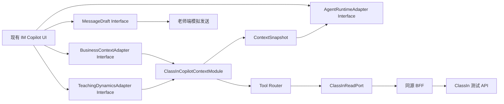

# 1. Module、Interface 与 Seam

页面只编排既有 `ImSidecarAgentSurface`。真实接入在现有 `BusinessContextAdapter` Seam 后实现一个深层 `ClassInCopilotContextModule`：调用者只提交教师问题、当前 Thread、可选对象引用和用途；Module 内部隐藏意图路由、工具计划、权限、对象解析、分页、接口组合、确定性派生、证据等级和 Context 投影。



外部 Interface 保持小而稳定：

```ts
type CopilotContextRequest = {
  actorRef: string;
  tenantRef: string;
  target: WorkBuddyImTarget;
  question: string;
  focusRefs?: readonly string[];
  referencedMessageId?: string;
};

type CopilotContextResult =
  | { status: 'ready'; snapshot: BusinessContextSnapshot; route: ToolRouteReceipt }
  | { status: 'needs-object'; candidates: readonly BusinessObjectCandidate[]; message: string }
  | { status: 'partial'; snapshot: BusinessContextSnapshot; failures: readonly ContextFailure[] }
  | { status: 'failed'; code: ClassInErrorCode; message: string; retryable: boolean };
```

现有 `BusinessContextAdapter.capture` 可继续作为 UI Interface；以上结果由 Adapter 内部投影到现有成功/错误状态，避免 UI 学习供应商字段。

# 2. 工具路由

模型只负责从白名单工具目录选择业务工具和表达取数目的，不提供身份、业务ID、URL、分页或上游参数。执行器根据当前 Thread 和受信对象目录补齐所有参数，并执行以下规则：

- 每轮最多8个工具，同一工具最多一次；
- 需要课堂、作业、学生或消息而对象不明确时不执行，返回候选让老师选择；
- 工具种类与对象类型不匹配时拒绝；
- 每个工具先重核教师、学校、班级、课程和活动归属；
- 请求只命中固定主机和白名单路径，拒绝重定向；
- 原始响应保留在受限运行记录，模型只接收最小业务投影；
- 依赖请求、失败、部分结果和数据时间分别记录；
- 生成回答不允许在 Context 之外追加实时读取。

工具目录按里程碑扩展：

| 工具 | 主要问题 | 核心接口 |
| --- | --- | --- |
| `read_course_progress` | A1 | `course_list`、`category/list`、`unitList`、`unitActivityList` |
| `list_course_activities` | A2 | 同上；按可信时钟过滤未来已发布未取消课堂 |
| `read_class_roster` | A3 | `getCourseMember` |
| `read_lesson_companions` | A4 | `unitActivityList` + 按需五类详情/文件 |
| `read_class_attendance` | B1/B2 | 已结束课 `overallView`/`getAttendRecords`；课中实时另走 `getClassInfo` 或经批准的只读DB Adapter |
| `read_recording_progress` | B3 | `recordClass/get`、`recordClass/students` |
| `read_activity` | C1 | `homework/get` + 题目/资源引用 |
| `read_homework_students` | C2 | `homework/get`、`homework/students`、`getCourseMember`；按需 `student/detail` |
| `aggregate_question_results` | C5 | 作业/测验名单、提交/逐题答案、`topic/batchGet` |
| `read_student_learning` | D1/D2/D5 | 学情报告/学情Agent正式Interface；受限回退为活动级聚合 |
| `read_class_resources` | E1 | 报告票据、`overallView`、回放、笔记 |
| `read_class_transcript` | E2 | `getLessonRecordInfo`、`richVideoSummary(subtitle=1)` |
| `read_ai_analysis` | E2 | AI记录检查、分析定位与正文；等级为 `AI_DERIVED` |
| `read_material_content` | E3 | `learningMaterials/get`、文件列表/下载信息、PDF文本提取 |
| `read_weekly_learning` | E4 | 班级学情报告Interface或有覆盖率的跨活动聚合 |
| `reuse_conversation_artifact` | E5 | 当前 Session 已确认内容；不调用新的 ClassIn 接口 |
| `read_im_history` | F1/F2/F3 | 稳定 Reader：WebSocket历史/实时收件合同；试点可用真实捕获快照 |
| `resolve_referenced_question` | F2 | 引用消息 + 作业/题目/题图 + 标准解析 |
| `read_reply_context` | F3 | 引用消息、前后文、后续回复和必要业务事实 |

# 3. ContextSnapshot

Context 必须包括：

- actor、tenant、thread、channel和用途；
- 当前业务时钟与 `Asia/Shanghai` 确定性时间；
- 选中业务对象及稳定引用；
- 每份证据的等级、来源、捕获时间、版本、覆盖范围和限制；
- 程序派生值及派生规则，如截止前/按时/迟交、课节间隔和覆盖率；
- 本轮失败项和排除项；
- 学生个人信息只在教师私有 Context 中出现；班群消息草稿默认使用汇总，不公开成绩或个人作答。

禁止进入模型 Context：Token、签名、报告key、下载/播放URL、内部FileId、未选学生的完整个人记录、媒体正文猜测和供应商错误原文。

# 4. 数据 Adapter 设计

## 4.1 复用

- 复用 `ClassInTestService` 的教师授权、Scene、活动详情、提交、测验、资源、报告和回放能力；
- 复用 `BusinessContextAdapter`、`TeachingDynamicsAdapter`、`AgentRuntimeAdapter` 与现有 Runtime Envelope；
- 复用审阅台已验证的确定性投影和回答合同，但不复制独立审阅台的页面、存储或服务进程；
- 将审阅台新增工具实现迁入生产代码时，按 `ClassInReadPort` 能力拆分并补 TypeScript 合同。

## 4.2 新增

- `ClassInCopilotContextModule`：统一路由、执行、证据投影和失败合同；
- `ClassInToolCatalog`：版本化工具定义与问题能力映射；
- `ClassInToolExecutor`：白名单执行器，模型不能覆盖参数；
- `BusinessObjectResolver`：处理课程、单元、课堂、作业、学生和引用消息消歧；
- `ContextEvidenceProjector`：最小字段、等级、时间、覆盖率和限制；
- `ToolRouteReceipt`：计划、实际工具、依赖、失败、Context版本和模型回答引用；
- 个人学情、跨活动聚合和普通 IM Reader 作为后续内部 Adapter，不扩大 UI Interface。

# 5. Thread 与组合根

- 固定演示班继续使用 Mock Adapter；
- 授权测试班创建独立 `classin-test` Thread，使用真实 Context Adapter；
- 教师身份、学校、班级和课程决定 Thread 稳定ID；
- 两类 Thread 不共享 Runtime Session、ContextSnapshot、草稿、评价和模拟消息历史；
- 学生端不显示测试 Thread；
- 配置关闭或连接失败时，不把测试 Thread 替换成固定演示事实；
- `/teacher/classin-test` 保留为数据核验入口，消息页是产品主入口。

# 6. 回答合同

- 先回答教师问题，再在必要时说明范围或限制；
- 关键数字、姓名、日期、状态必须能追溯到 Context；
- 0、空、未设置、未返回、读取失败分别处理；
- 未提交不等于做错，未批阅不等于0分，打开过不等于学完；
- 课后报告不回答实时在线名单；
- ASR只证明记录中的讲解，不证明掌握；AI分析必须标记为AI生成；
- 群聊总结只覆盖实际读取窗口；群聊自述不替代LMS正式状态；
- E5、D5、F3生成草稿后仍由教师审阅，不能自动发送。

# 6.1 四阶段建议合同

`TeachingDynamicsAdapter`继续是阶段建议Seam。真实Adapter输出固定四个stage，不因某阶段没有项目而删除Tab。`TeachingDynamicItem`新增或等价携带稳定`recommendationKey`，按`recommendationKey + objectRef + contextVersion`去重；顶部计数只统计有action的项目。

阶段无项目由UI显示阶段专属空提示，不补造Item。真实有效的“无需处理”事实使用`confirmation`且无action；能力未知或读取失败使用`unknown`，Tab显示“待核”。P01–P10的触发、工具和排重规则以[覆盖矩阵](./TEACHING-DYNAMICS-COVERAGE.md)为准，属于M0合同与后续里程碑Gate。

# 7. 非功能标准

- 单个上游请求12–15秒超时，Scene整体45秒，浏览器Context请求50秒；
- 同一Scene并发去重，详情并发上限4；
- 模型规划、执行、回答均可取消或重试，旧响应不得覆盖新对象；
- 真实响应不进入仓库；私有运行目录0700、文件0600；
- 所有浏览器响应 `no-store`，同源、loopback和Origin校验沿用现有BFF；
- 应用层记录问题ID、工具ID、结果状态、耗时和证据版本，不记录凭据与敏感正文。

# 8. 测试策略

1. 领域契约：空值、0值、枚举、时间、身份、分页、重复、跨对象、派生规则；
2. 工具路由：正确工具、缺对象澄清、非法参数拒绝、重复工具、部分失败；
3. 真实联调：固定授权对象逐项对照API原始响应和Context；
4. 模型验证：真实DeepSeek计划与回答，引用存在且支持结论；
5. UI集成：问题入口、对象选择、加载、失败、恢复、历史、草稿和评价；
6. 隔离：Mock/真实 Thread、教师/学生、班级/课程、Session和存储；
7. 回归：现有消息工作区、Copilot两入口、引用、图片、历史和发送确认；
8. 视觉与可访问性：1440×900、1100×720、390×844及axe适用检查。
