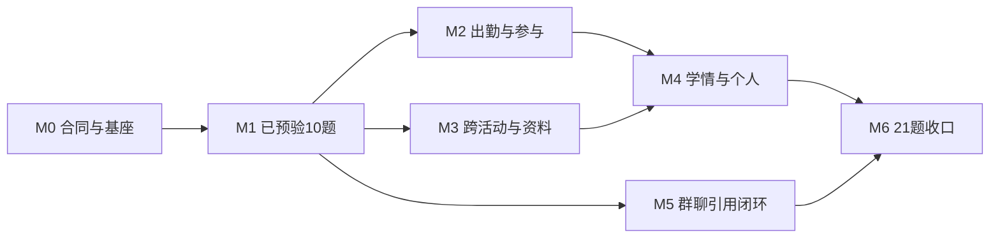

# 总体顺序

里程碑不绑定未经评估的日期。每个里程碑只有在完成范围、自动验证、真实联调和用户问答验收同时通过后才能关闭。

# M0：合同冻结与接入基座

**目标**：建立真实测试 Thread 和深层 Context Module，不改变现有页面模板。

工作：

1. 用户审阅并确认本计划；在决策账本记录新的接入范围；
2. 固化 `ClassInCopilotContextModule`、工具目录、Route Receipt、Evidence等级和失败合同；
3. 固化四阶段`empty / confirmed / unknown`状态和P01–P10稳定推荐Key；
4. 将审阅台确定性派生与回答合同迁入TypeScript领域代码；
5. 恢复 `ClassInMessageConnectionProvider` 到教师组合根，但只产生独立测试 Thread；
6. `WorkBuddyImProvider.resolveAgentServices` 按 Thread 选择 Mock 或真实 Context Adapter；
7. 建立配置开关、权限、存储命名空间、日志和回退方式；
8. 建立Fixture契约测试与真实联调证据目录。

Gate：

- 原模拟 Thread 完全不变；测试 Thread只对教师出现；
- 两类Thread的Session、Context、草稿、历史和回执不串线；
- 模型无法覆盖身份、对象、URL和分页；
- 四个阶段始终存在；空态、无需处理和未知的语义/计数正确；P01–P10重复抑制合同通过；
- 配置关闭、401/403、超时、schema变化和部分失败均可恢复；
- 根应用类型、Lint和消息工作区核心回归通过。

# M1：迁入已预验证的10题

**范围**：A1、A2、A3、A4、B1课后、C1、C2、E1、E2、F1捕获试点。

**阶段推荐**：P01、P02、P04、P05、P08。

工作：

- 把审阅台工具迁到 `ClassInReadPort`/内部Adapter，不复制独立服务；
- 每题增加对象解析、最小Context、回答合同和Route Receipt；
- B1未来课堂硬性禁止使用课后报告回答实时状态；
- E2逐文件核对ASR主题，AI分析以派生证据进入；
- F1使用真实消息快照时显示实际时间窗和条数，不宣称完整历史；
- 开放式提问只开放本里程碑工具。

Gate：

- 10题各完成至少一次Demo内真实DeepSeek运行；
- 关键事实逐项与API/审阅台样本一致；
- 10题三项用户评价至少“基本满意”，阻断性事实错误为0；
- 刷新后可恢复运行和回答，重新取数产生新Context版本；
- 旧模拟Copilot两入口和完整交互回归通过。

# M2：实时/历史出勤与录播参与

**范围**：补全B1实时，实施B2、B3。

**阶段推荐**：P03。

工作：

- 与研发伙伴确认 `teaching.ajax.php?action=getClassInfo` 的身份、对象、成员状态和刷新合同；
- 若使用OceanBase，只在服务端建立只读Attendance Adapter，表 `eeo_class_member_time` / `eeo_class_member_time_detail` 不向浏览器暴露；
- 建立实时与课后两种证据的时间口径和冲突优先级；
- 聚合最近课堂 `getAttendRecords`，明确缺席、迟到、早退、请假枚举；
- 接入录播逐人进度和完成规则。

Gate：

- 实时接口必须有当前课堂成员级样本，刷新前后状态可复现；没有样本则B1实时保持 `BLOCKED_EXTERNAL`；
- B2时间窗内课次数和名单覆盖可核对，聚合可由明细复算；
- B3分母、进度、时长和完成状态与原始学生列表一致；
- 不用DW历史表冒充实时状态，不因缺值判缺席。

# M3：跨活动统计、资料正文和连续草稿

**范围**：C5、E3、E5。

**阶段推荐**：P06、P07。

工作：

- 建立跨作业/测验的活动窗口、有效分母、题目身份和逐题判分聚合；
- 读取学习资料正文，区分文本PDF、扫描件、图片和不支持格式；
- 将同一对话已确认内容转为消息草稿，不新增业务事实；
- 为聚合结果记录覆盖活动、排除记录和计算规则。

Gate：

- C5每个题目统计都可回溯到活动、学生逐题状态和题目版本；不输出错因；
- E3三点均能定位原文，扫描件无OCR时明确不足；
- E5连续追问、缩短、保留截止时间、刷新恢复和两个入口一致；
- 大数据量仍受分页、并发和Context大小限制保护。

# M4：个人学情和班级周报

**范围**：D1、D2、D5、E4。

**阶段推荐**：P09、P10。

工作：

- 定义并接入学情报告/学情Agent正式Interface；
- 建立教师选择学生、周期和课程的对象解析；
- 五类活动分别定义“未完成、已逾期、未来任务”；
- 班级周报记录课程和学生覆盖率；
- 家长话术只二次加工已确认学情事实。

Gate：

- 学生身份与教师权限每次重核，不能从群聊代词猜人；
- 学情报告或受限聚合的周期、课程、数据覆盖和缺口可见；
- D5不增加进步、错因、改进建议或送达承诺；
- E4不把未来排课写成已完成，不以部分学生外推全班。

# M5：稳定群聊Reader、引用题目和回复

**范围**：F1稳定化、F2、F3。

工作：

- 将已验证WebSocket链封装为受治理的 `ImChatReader` Adapter；
- 实现最近N天分页/游标、去重、撤回/删除、作者/时间和群归属；
- 引用消息定位课程、作业版本和题号，读取完整题面/题图/标准解析；
- 回复前读取后续回复，发送前重核原消息撤回/修改和新信息；
- 真实发送继续独立Gate，本里程碑只要求可编辑草稿和现有模拟交付。

Gate：

- F1实际取得多少总结多少，范围和完整性不虚构；
- F2题面唯一且完整，标准解析与AI新解区分，代表性样例人工验算通过；
- F3引用对象和上下文正确，原消息变化会阻止旧草稿直接发送；
- 消息正文不脱敏地保留在授权私有运行链，但不提交仓库或暴露给无权角色。

# M6：21题收口与默认测试Thread切换

工作：

- 按验收矩阵完成21题最终状态和用户评价；
- 处理失败恢复、负例、并发、Context限额和长对话；
- 跑全量类型、Lint、单元/集成、浏览器、axe和视觉验收；
- 更新接口库存、决策、运行手册、回退手册和当前状态；
- 仅把通过的问题作为测试Thread默认真实能力，条件项显示限制，外部阻塞项保持不可用。

最终Gate：

- 21题无“状态不明”；
- P01–P10无遗漏、无重复，均有最终`PASS / CONDITIONAL_PASS / BLOCKED_EXTERNAL`状态；
- 所有 `PASS` 题满足验收矩阵横向标准；
- `CONDITIONAL_PASS` 在页面明确条件且不误导；
- `BLOCKED_EXTERNAL` 有负责人、所需合同和恢复入口；
- 用户完成整体验收后，才将计划状态改为 `COMPLETE_USER_ACCEPTED`。

# Ticket索引

M0、M1 已通过用户验收；M2～M6 已按 D-163 通过内部严格 Gate，当前等待整体用户验收。各阶段结果分别记录在 M2～M6 验收文档中。

| Ticket组 | 内容 | 依赖 |
| --- | --- | --- |
| RC-000～009 | M0合同、组合根、隔离、日志、测试基座 | 计划获批 |
| RC-100～109 | M1十题工具、Context、回答、UI集成 | M0 |
| RC-200～206 | M2实时/课后考勤、跨课聚合、录播 | M1、实时合同 |
| RC-300～305 | M3逐题聚合、资料正文、连续草稿 | M1 |
| RC-400～406 | M4学情报告、学生对象、周报、家长草稿 | M2/M3、学情Interface |
| RC-500～507 | M5消息Reader、引用、题目定位、回复重核 | M1、IM合同 |
| RC-600～606 | M6全量验收、文档、回退与切换 | M2～M5 |

具体代码Write Set、测试文件和实施顺序在每个里程碑启动时从对应Ticket组细化，避免在外部合同未明确前锁死实现细节。
