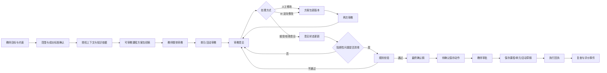
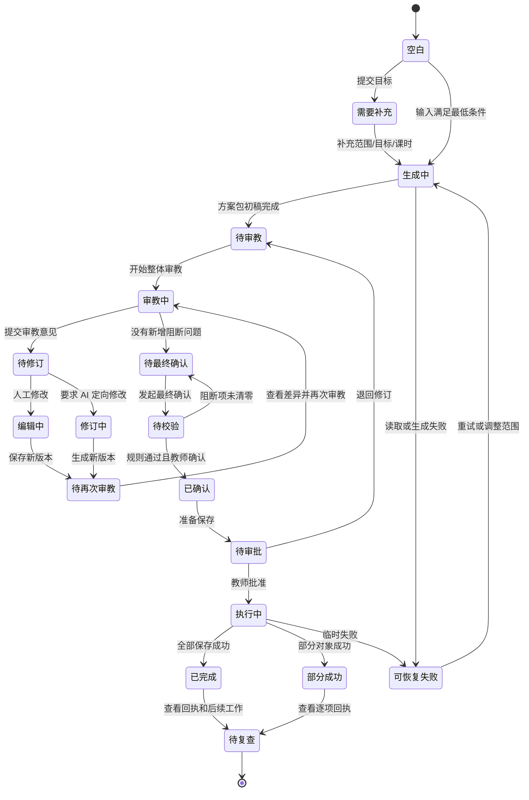
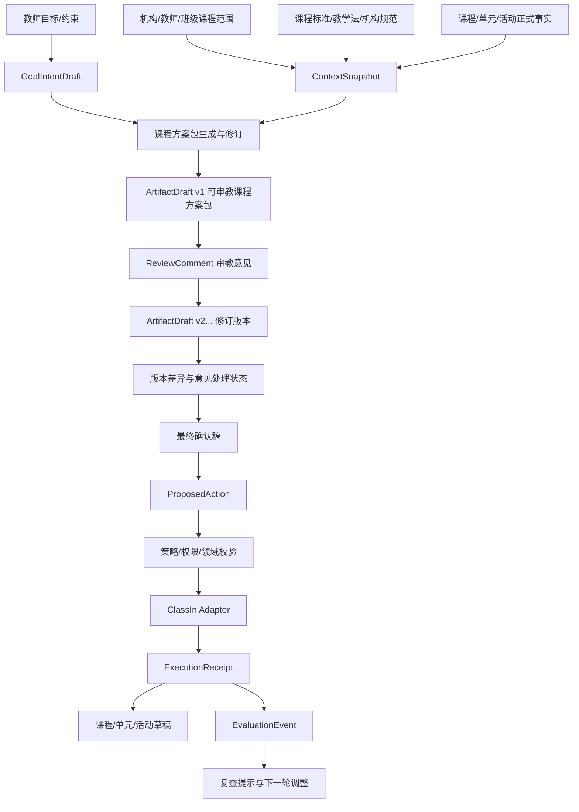
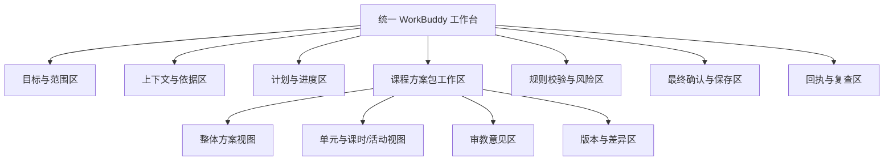

# 课程目标到课程对象第一版产品设计附图

主文档：[课程目标到课程对象第一版产品设计](./PRODUCT-DESIGN.md)

## D1. 第一版业务闭环图

第一版的交付终点是可审教课程方案包，不是 PPT 文件。

## D2. 教师体验与状态图

## D3. 对象与证据关系图

第一版不包含 `PPT 课件 Artifact`。第二版新增一条派生关系：`最终确认课程方案包版本 → PPT 课件 Artifact 初稿`，并保留来源版本引用。

## D4. 页面与信息架构图

页面职责：

- 对话区域负责目标协调和补充信息；
- 方案包工作区负责阅读、编辑和审教；
- 依据区域负责来源、版本和缺口；
- 版本区域负责差异和意见处理；
- 控制区域负责最终确认、审批和写回风险；
- 回执区域负责真实执行结果和后续复查。
