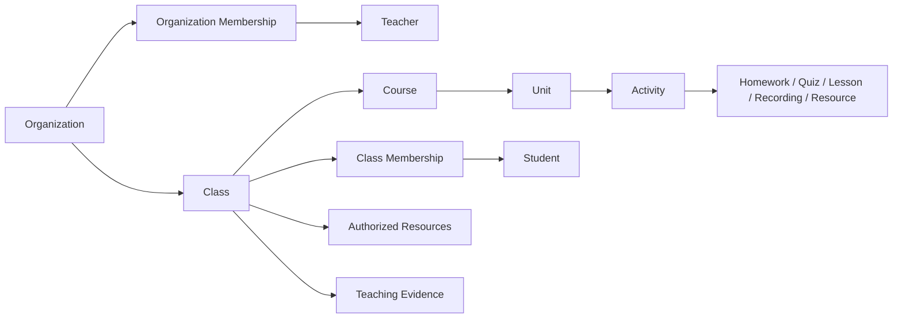

# WorkBuddy Core Context Feature Spec

## 1. 产品定义

`Core Context` 是一次 Agent Run 用来理解教师工作现场的受治理上下文集合。它把 ClassIn 业务上下文、Domain Knowledge、教师主动提供的资料和本次任务约束组织在一起，但不复制或篡改各自的事实所有权。

产品界面使用“核心上下文”或“任务上下文”。“调用上下文”只表示某个 Skill/Tool 在某一步实际收到的最小参数投影，不代表整个 Run 的 Context。

## 2. 目标

教师应当能够回答五个问题：

1. WorkBuddy 当前在为谁、哪个机构和哪个班级工作；
2. 当前任务关联哪门课程、哪个单元或教学活动；
3. Agent 会使用哪些学生范围、资源、时间和教学证据；
4. 哪些内容来自 ClassIn 事实，哪些来自 Domain Knowledge、教师输入或 AI 推断；
5. 某个 Skill/Tool 实际使用了哪些上下文，为什么可以使用。

## 3. 非目标

- Core Context 不是长期无治理记忆；
- 不是把整个 ClassIn 数据库复制给模型；
- 不是文件附件列表；
- 不是一个由教师手工填写所有字段的大表单；
- 不拥有班级、课程、学生、作业、成绩、资源或权限的正式状态；
- 不允许不同机构、角色或班级的数据因“最近使用”自动串入同一 Run。

## 4. 领域语言

| 术语 | 定义 |
|---|---|
| `Core Context` | 一次 Run 可查看、可调整、可冻结的核心上下文集合 |
| `Business Context` | ClassIn 拥有的身份、机构、班级、课程、单元、活动、成员、资源、时间和业务证据引用 |
| `Domain Knowledge` | 课程标准、学科知识、教学法、机构规则、审教规则、模板和评价量规等受治理知识 |
| `Context Source` | 一个 Context Item 的事实所有者、对象 ID、版本、更新时间和权限来源 |
| `Context Proposal` | 系统根据入口和任务意图自动建议、但尚未由教师确认的 Context 集合 |
| `Context Snapshot` | Run 在一个时间点实际冻结并使用的 Context 引用与版本，不替代实时业务事实 |
| `Context Projection` | 某个 Skill/Tool 按最小必要原则从 Snapshot 中取得的参数子集 |
| `Sensitivity` | Context Item 的数据敏感级别和可下发范围 |

## 5. ClassIn 事实来源盘点

以下来源来自 `/Users/eeo/Documents/claudecode/classin-pc-optimizer`，是字段与对象选择的依据，不代表生产 API 已经存在。

| 领域 | 已有事实或设计证据 | Core Context 用途 | 主要来源 |
|---|---|---|---|
| 身份与机构 | 当前账号、老师视角、当前组织、组织成员身份、页面树与权限隔离 | 确定 Actor、Tenant 和权限范围 | `app-shell-and-role-switch/PRD.md`、`CLASSIN-PRODUCT-DNA.md` |
| 班级 | `active/completed` 生命周期、班级名称、当前教师权限、成员与班级群关系 | 教学工作最常见的业务容器 | `class-and-open-course-workspace/PRD.md` |
| 课程内容层级 | `Class → Course → Unit → Activity` | 确定课件、作业、测验和资料的业务归属 | `MOBILE-APP-FULL-FEATURE-INVENTORY.md`、Milestone B Spec |
| 课程 | 名称、当前课程、课程范围、单元数/活动数；课程设置存在部分 `DECLARED/UNKNOWN` | 课程设计与内容生产的主要范围 | `C-02/C-03`、`MOBILE-PC-FEATURE-ALIGNMENT-MATRIX.md` |
| 单元 | 名称、介绍、`draft/published`、活动数量 | 约束课件和活动属于哪一单元 | Milestone B Tech/UX Spec |
| 教学活动 | 课堂、作业、测验、阅读、练习、直播等类型；时间和状态由所属领域拥有 | 作为已有活动引用或新内容的目标位置 | `ActivityPublishSheet` 对应研究与 Milestone B Spec |
| 班级成员 | 班主任、教师、学生分组，班级昵称、成员数量/容量、active 成员与权限 | 选择全班、分组或指定学习者范围 | `C-30` 至 `C-34`、成员管理 Spec |
| 课程表与时间 | 日期、课堂/公开课、作业、测验、录播、班级/课程/单元归属、开始/截止与状态 | 为备课和课程生产提供时间窗口与当前课节 | `schedule-workspace/PRD.md` |
| 待办与作业 | 任务类型、标题、班级、课程、时间、角色状态；作业标题、要求、起止、分值、提交与反馈状态 | 从作业/待办入口发起改编、分析或生产任务 | `task-and-todo-workspace/PRD.md`、Milestone B Spec |
| 空间与资源 | 我的云盘、组织云盘、资源中心、文件/目录、格式、权限、获取状态与更新时间 | 作为输入资料、模板、参考内容或目标保存位置 | `space-and-resource-access/PRD.md` |
| 教学洞察与证据 | 班级/课程范围、数据更新时间、课程进度、出勤、互动、作业质量、近期课堂和学生表现 | 仅在诊断、分层和个性化任务需要时加入 | `teaching-insights-workspace/PRD.md` |
| 来源与返回现场 | `source`、`classId`、`courseId`、`unitId`、`activityId/homeworkId`、日期、事件、锚点 | 形成自动预填和任务完成后的返回路径 | 各 Feature 深链与返回契约 |

### 5.1 已确认的 ClassIn 业务对象骨架



公开课是独立单次课堂，不强行挂入班级课程树。任务只有在明确需要时才将公开课作为主业务对象。

## 6. Core Context 七类结构

### C1：Actor 与组织范围

始终存在且默认不可移除：

- 当前教师 ID、显示名；
- 当前组织 ID、名称；
- 组织成员身份、角色和权限摘要；
- 当前产品视角：教师；
- 时区和当前时间基线。

切换组织必须创建新的 Context Proposal；不能沿用上一个组织的班级、课程、成员、资源或证据。

### C2：教学业务范围

按层级表达：

```text
班级 → 课程 → 单元 → 教学活动
```

每一层显示名称、状态、来源和是否纳入本次任务。级联规则：

- 更换班级后，清除不属于该班级的课程、单元、活动和成员选择；
- 更换课程后，清除不属于该课程的单元和活动；
- 更换单元后，清除不属于该单元的活动；
- 单课件任务允许不绑定 ClassIn 班级，通过教师输入补足年级、学科和目标；
- 课程方案包写回 ClassIn 对象时，必须明确目标班级与课程范围。

### C3：学习者范围

支持三种范围：

1. 全班；
2. 结构化分组；
3. 指定学习者。

默认只向 Run 提供班级人数、角色构成和任务相关的聚合摘要。姓名、班级昵称、个人证据或个体标签只在任务确有必要、教师明确选择且权限通过时加入。

界面字段：

- 班级总人数、教师人数、学生人数；
- 当前选择模式与已选数量；
- 成员姓名/昵称、角色、active 状态；
- 个体数据是否包含、敏感级别和使用原因；
- 搜索、全选当前范围、清空个体选择。

### C4：时间与日程范围

- 当前日期、时区；
- 目标课节/课堂的开始时间、结束时间和状态；
- 作业/测验的开始与截止时间；
- 课程生产目标日期或时间范围；
- 来源页面选中的日期/事件。

时间事实来自课程表或所属业务对象。Core Context 不发明排课、冲突检测或生产时区规则。

### C5：资源与教师输入

- 教师上传的附件；
- 本地文件或目录；
- 我的云盘、组织云盘、资源中心中的对象引用；
- 既有课件、作业、测验、视频或模板；
- 来源、格式、大小、更新时间、权限和解析状态；
- 目标保存位置。

本地路径、凭据和私有目录默认不进入教师摘要；需要诊断时在高级技术层脱敏显示。

### C6：教学证据

按任务需要选择：

- 课程进度；
- 出勤；
- 课堂主动参与/被动响应；
- 作业提交率与正确率；
- 最近课堂事实；
- 学生表现事实与教师已确认结论。

课程设计和单课件生成默认不自动加入学生个人洞察。诊断、分层作业和个性化任务才建议加入，并明确数据更新时间与来源。

### C7：Domain Knowledge

- 国家/地区课程标准；
- 学段、年级、学科知识；
- 教材体系和章节知识；
- 教学法、活动模式和课堂策略；
- 机构内容规范、敏感规则和发布规则；
- 审教规则、评价量规、模板；
- 教师个人偏好。

Domain Knowledge 与 Business Context 分区呈现。每项显示版本、适用范围、所有者和更新时间，不与学生事实或 AI 推断混入无治理长期记忆。

## 7. 自动装配与选择规则

### 7.1 入口优先级

| 优先级 | 来源 | 行为 |
|---:|---|---|
| 1 | 教师在当前任务中明确选择 | 作为当前 Context Proposal 的最高优先选择 |
| 2 | 业务对象内发起入口 | 自动带入当前班级/课程/单元/活动及来源位置 |
| 3 | 当前 ClassIn Shell 身份与组织 | 自动带入且不可跨组织替换 |
| 4 | 任务类型默认需求 | 建议缺少的 Context，不自动猜具体业务对象 |
| 5 | 最近使用 | 只作为建议，不自动带入跨班级或跨组织数据 |

教师从 AI Agent 一级菜单直接新建任务时，除身份与组织外不默认选择最近班级；页面可显示“最近使用”建议，但需教师确认。

### 7.2 任务类型默认需求

| 任务类型 | 必需 | 建议 | 默认不加入 |
|---|---|---|---|
| 单课件生成 | 教学目标或 Prompt；至少有年级/学科/内容范围之一 | 班级、课程、单元、模板和教师资料 | 学生个人证据、全量成员名单 |
| 课程方案包生成 | 教学目标；目标班级与课程范围；预期产物 | 单元、课节、教材、时间、班级聚合画像、机构规则 | 无关课程、无关班级、未确认个体推断 |
| 基于既有课件生成方案包 | 源课件 Artifact；目标班级/课程；目标产物清单 | 原课件 Context Snapshot、Domain Knowledge | 原任务未使用的隐式 Context |
| 分层作业 | 班级、课程/单元、学习者范围、目标 | 教学证据、已有作业和量规 | 无权限个体数据 |

### 7.3 冲突与失效

- `stale`：来源对象版本或更新时间变化，但权限仍有效；允许刷新或继续使用旧 Snapshot；
- `permission_changed`：当前教师不再有权访问；阻止下发和业务写回；
- `deleted/unavailable`：来源不存在或服务不可用；保留历史引用，要求替换或移除；
- 教师手动修改 Context 后，系统不得静默恢复自动值；
- 运行中更换主班级或课程属于目标约束变化，进入 Replanning；已有产物与计划标记受影响范围；
- Domain Knowledge 更新不会静默改写已完成 Run 的 Snapshot。

## 8. UI 规格

### 8.1 输入区摘要

输入器上方或内部提供 `核心上下文` 入口，并显示不超过四个高价值 Chip：

```text
[星河学习中心] [八年级英语 2 班] [Unit 3] [学生 30 人]  +3
```

规则：

- 组织是锁定 Chip；
- 班级、课程、单元、活动使用稳定对象图标；
- `学生 30 人` 表示范围，不直接平铺姓名；
- `+N` 表示其他资源、证据或知识项；
- Chip 可打开右侧 Core Context 面板；允许替换或移除的对象提供菜单；
- 缺少必需 Context 时使用中性提示，不将其表达成错误。

### 8.2 右侧活动辅助区

Work Surface 右侧同一时间只活动一个面板：`Artifact / Core Context / 执行详情`。

Core Context 面板结构：

```text
Header
  核心上下文 · 7 项
  Snapshot 状态 / 更新时间 / 关闭

Scope Summary
  教师 · 机构 · 当前来源

教学范围
  班级 / 课程 / 单元 / 活动

学习者范围
  全班 / 分组 / 指定学生
  人数摘要 / 展开成员

时间与日程
资源与教师输入
教学证据
Domain Knowledge

Footer
  恢复入口建议 / 应用更改
```

交互规则：

- 面板宽度在 `344-640px` 范围内按内容扩展；
- Header 固定，内容区单一滚动；
- Section 默认显示摘要，按需展开；
- 切换到 Artifact 或执行详情不丢失 Context 编辑草稿；
- 未应用的 Context 更改在关闭或切换任务时触发保存/放弃/取消保护；
- 任务执行后，修改主范围需说明受影响步骤并进入 Replanning；
- 系统可以建议打开面板，但不能反复自动抢占教师当前 Artifact 焦点。

### 8.3 Context Item 行

每一行显示：

- 对象图标、名称和类型；
- 来源：ClassIn / 教师上传 / 机构规则 / AI 推断；
- 纳入状态；
- 权限与敏感标记；
- 更新时间或版本；
- `查看来源 / 替换 / 排除 / 刷新` 中适用动作。

AI 推断不能伪装成 ClassIn 事实；教师确认结论与尚未确认推断必须分别标记。

### 8.4 学习者详情

学习者 Section 默认显示聚合摘要。教师展开后可：

- 搜索姓名或班级昵称；
- 按班主任/教师/学生分组查看；
- 选择全班、已有分组或指定学习者；
- 查看每个成员的角色、active 状态和是否纳入；
- 在加入个体证据前看到使用原因和敏感提示。

名单的“可见”不等于全部成员数据会被发送给模型。每次能力调用仍使用 Context Projection。

### 8.5 执行过程中的 Context 引用

教师摘要层显示：

> 已使用：八年级英语 2 班 · Unit 3 · 课程标准 v2 · 教师上传课件

能力追踪层显示：

- 使用的 Context Item；
- 使用目的；
- 是否经过裁剪/脱敏；
- 数据更新时间；
- 与 Snapshot 的关系。

高级技术层显示该 Skill/Tool 的 `Context Projection` 字段和值摘要，不显示未下发的其他 Context。

## 9. 产品状态矩阵

| 状态 | 页面表达 | 允许动作 |
|---|---|---|
| `empty` | 只有身份/机构，提示选择任务范围 | 选择对象、上传资料 |
| `proposing` | 正在根据入口和任务意图生成建议 | 等待、取消 |
| `needs_attention` | 缺必需项或存在层级冲突 | 补充、替换、移除冲突 |
| `ready_to_confirm` | 建议项完整，尚未冻结 | 检查、编辑、确认 |
| `snapshotting` | 正在校验权限和版本 | 等待，防重复提交 |
| `ready` | Snapshot 可供 Run 使用 | 查看、开始任务、按规则修改 |
| `partial` | 部分来源不可用，但任务可降级 | 继续、替换、重试 |
| `stale` | 来源有更新 | 刷新、继续旧 Snapshot、查看差异 |
| `permission_changed` | 权限失效 | 移除、重新授权、停止相关步骤 |
| `unavailable` | 核心来源不可用且无法继续 | 重试、保存草稿、退出 |

## 10. 权限、敏感度与最小化

### 10.1 敏感度

| 等级 | 示例 | 默认行为 |
|---|---|---|
| `public` | 公开课程标准、公开模板 | 可按任务需要使用 |
| `organization` | 机构规则、组织资源 | 仅当前组织和授权能力 |
| `class` | 班级、课程、课程活动与聚合数据 | 仅当前班级范围 |
| `personal` | 教师个人资料、偏好和私有文件 | 教师明确选择或入口携带 |
| `student_sensitive` | 学生身份、个体证据、评价和推断 | 默认排除；明确任务需要、权限校验和最小投影后使用 |

### 10.2 Context Projection

任何 Skill/Tool 不直接取得完整 Context Snapshot。Core Context Module 根据 Capability Manifest、任务步骤、教师选择和权限生成最小投影。

例：课件版式生成 Skill 可以取得年级、学科、目标、课程标准、源内容和视觉模板，但不应取得学生姓名与作业表现。

例：分层作业 Skill 可以取得教师选择的学习者分组和相关证据摘要，但不应取得无关课程或其他班级数据。

## 11. Module、Interface、Seam 与 Adapter

### 11.1 CoreContext Module

这是一个 Deep Module：页面只使用少量 Interface，不自行拼接来源、权限、失效和敏感数据规则。

产品级 Interface：

```text
prepareContext(taskIntent, entryPoint, actorScope) -> ContextProposal
confirmContext(proposal, teacherEdits) -> ContextSnapshot
projectContext(snapshot, capabilityManifest, stepPurpose) -> ContextProjection
```

Interface 同时包含：层级一致性、权限检查、来源版本、敏感度、失效行为和错误模式。

### 11.2 Seams

| Seam | Interface 责任 | Adapter |
|---|---|---|
| ClassIn Business Context | 读取当前 Actor 有权访问的业务对象引用和版本 | 当前可重置 Mock ClassIn Adapter；未来真实 ClassIn Adapter |
| Domain Knowledge | 查询适用规则、知识、模板与版本 | 固定版本 Mock Knowledge Adapter；未来受治理 Knowledge Adapter |
| Resource Reference | 解析本地/空间/上传资源并返回权限和元数据 | 本地文件 Adapter、Mock Space Adapter、未来 ClassIn Space Adapter |
| Capability Projection | 声明每个 Skill/Tool 可接收的 Context 类别和敏感范围 | 当前固定 Capability Manifest；未来机构治理 Manifest |

页面、Skill 或 Tool 不能跨过这些 Seam 直接读取全部业务数据。

## 12. 关键场景

### 场景 A：从 AI Agent 一级菜单生成单课件

1. 自动带入教师和机构；
2. 教师输入目标；
3. 系统建议最近课程但不自动选中；
4. 教师选择班级、课程、Unit 3 和一份源资料；
5. 学习者默认只显示“全班 30 人”的聚合范围，不下发姓名；
6. 确认 Snapshot 后执行；
7. 版式 Skill 的 Projection 不包含学生名单。

### 场景 B：从班级课程页生成课程方案包

1. 入口自动带入教师、机构、班级、课程、单元和返回位置；
2. 面板显示已带入对象及来源；
3. 教师选择全班、教学目标、时间范围、教材和机构规则；
4. 系统冻结 Context Snapshot；
5. 生成课件、作业、测验和录播等多个 Artifact；
6. 写回前重新校验权限和目标对象版本。

### 场景 C：运行中更换班级

1. 教师打开 Core Context 并选择另一班级；
2. 系统清除不兼容课程、单元、活动和成员选择；
3. 显示受影响计划步骤和 Artifact；
4. 教师确认后进入 Replanning；
5. 原 Snapshot、旧计划和旧产物保留为 superseded 证据。

## 13. 验收标准

- 教师从任一业务对象入口进入时，Context Proposal 只包含当前权限范围；
- 直接从 AI Agent 新建任务时，不自动串入最近班级；
- 更换班级/课程/单元时正确清理不兼容下级对象；
- 学生姓名和个体证据默认不进入普通课程生产任务的 Projection；
- 右侧面板可在 Artifact、Core Context、执行详情间切换且不丢草稿；
- 每个 Context Item 可显示来源、更新时间、权限和纳入状态；
- Snapshot 可解释历史 Run 使用了什么，但不冒充实时业务事实；
- Skill/Tool 执行详情只展示其实际 Context Projection；
- stale、permission_changed、partial 和 unavailable 均有可操作恢复路径；
- Mock、未来和真实能力状态明确标记。

## 14. UNKNOWN 与后续验证

- 真实 ClassIn 多组织切换、生产权限粒度和 API 字段；
- 生产数据刷新频率、对象版本和冲突协议；
- 班级已有“分组”的正式业务对象与管理规则；
- 课程设置、完整课堂创建参数和真实录播对象结构；
- 机构 Domain Knowledge 的创建、审核和发布流程；
- 允许哪些第三方模型或 Tool 接收 `student_sensitive` Context；
- 真实资源解析、转码和跨端同步能力。

这些未知项不阻塞页面与 Mock 规格，但不能被设计稿暗示为生产能力已经存在。
