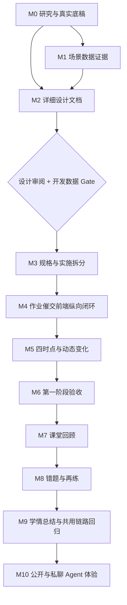

# IM Copilot 产品设计与落地总里程碑计划

## 1. 计划定位

本文是 IM Copilot 后续推进的总入口，记录阶段顺序、当前状态、数据 Gate、交付物和完成条件。上午形成的产品思考见[情境引导体验提案 v1.2](./COPILOT-CONTEXTUAL-ENTRY-EXPERIENCE-PROPOSAL.md)，下午线框的撤回边界见[M2 重启设计输入基线](./COPILOT-M2-DESIGN-BRIEF.md)，数据事实与缺口见[数据准备方案](./COPILOT-DW-SCENARIO-DATA-PLAN.md)。新 M2 已先以[初始面内容全集与机会状态模型](./COPILOT-INITIAL-SURFACE-CONTENT-MODEL.md)明确“需要表达什么”，再通过[初始面页面承载结构方案对比](./COPILOT-INITIAL-SURFACE-LAYOUT-OPTIONS.md)选择“方案 E + 可展开与紧凑的统一教学动态”；外部模式证据见[初始面内容承载模式研究](../../../01-research/IM-COPILOT-INITIAL-SURFACE-PATTERNS-RESEARCH.md)。

2026-09-09，用户撤回下午形成的两轮 M2 线框页面、由线框派生的具体交互说明及其验收结果。上午的体验提案和数据采集方案继续保留。撤回原因不是产品问题或上午讨论的出发点失效，而是过早用薄数据和固定交互做成页面，线上效果与教学真实感不足。M2 由此重新开始，当前只产出文字设计文档；前端页面、样式与真实交互移到开发阶段，并由达到 Gate 的可重置模拟数据驱动。

总体目标保持：教师从任一 IM 入口进入聊天后，能理解 TeachBuddy 在当前教学现场可以提供什么帮助，通过自然沟通形成可修改的教学消息，由教师确认交付，并在切换聊天后继续未完成的协作。

## 2. 三个产品阶段

| 阶段 | 目标 | 里程碑 |
| --- | --- | --- |
| 第一阶段：入口与个性化提醒 | 从设计、数据契约、开发到验收，跑通一个可信的提醒闭环并覆盖四个教学时点 | M0–M6 |
| 第二阶段：三项能力复用 | 课堂回顾、错题解析与再练、个人学情总结复用稳定链路 | M7–M9 |
| 第三阶段：Agent 交流体验 | 单独设计群内公开 Agent 与人与 Agent 私聊，明确其与教师私有 Copilot 的边界 | M10 |

用户确认新版 M2 后，于 2026-09-09 授权按 `PRD → Tech Spec → Tickets → Implementation`连续推进。M3—M5 已依照确认方案完成，当前进入 M6 用户整体体验审阅。

## 3. 里程碑与当前状态

| 里程碑 | 名称 | 当前状态 | 完成标志 |
| --- | --- | --- | --- |
| M0 | 研究与真实底稿 | `DONE_WITH_GAPS` | 原始采集、覆盖范围、质量与缺口可追溯 |
| M1 | 场景数据证据 | `FOUNDATION_RETAINED_WITH_SOURCE_GAPS` | 去标识场景、变换记录与契约检查可作为设计输入；不等于开发数据 Gate 已满足 |
| M2 | 详细产品与交互设计文档 | `USER_APPROVED` | [初始面详细交互设计](./COPILOT-INITIAL-SURFACE-DETAILED-DESIGN.md)已由用户确认，并成为实现基线 |
| M3 | 技术规格与实施拆分 | `DONE` | PRD v0.23、Feature Spec v0.23、IM-031—035 与 D-142 已完成 |
| M4 | 作业催交前端纵向闭环 | `IMPLEMENTED` | 可重置模拟数据、事项一键发起、自然语言沟通、草稿审阅、群聊发送与群转私聊链路可运行 |
| M5 | 四教学时点与动态变化 | `IMPLEMENTED_SELF_REVIEWED` | 课前、课中、课后、总结的时钟过滤、确认态、未知降级、展开/紧凑与非打断刷新已落地并通过范围内自动化 |
| M6 | 第一阶段完整验收 | `COMPLETE_USER_ACCEPTED` | 自动化、浏览器、视觉及后续源项目代码对齐完成；用户于 2026-09-16 确认最新验收无问题 |
| M7 | 课堂回顾复用 | `PLANNED` | 内容证据和共用链路验收完成 |
| M8 | 错题解析与再练复用 | `PLANNED` | 原题、解释、再练和交付验收完成 |
| M9 | 学情总结与链路回归 | `PLANNED` | 四项能力的共用路径及独立内容验收完成 |
| M10 | 公开与私聊 Agent 体验 | `PLANNED` | 两类 Agent 交流体验、隐私边界与后续实施范围明确 |

## 4. M0/M1：保留的数据与研究基础

本次 M2 重置不删除以下事实：

- DW 只读候选发现、选中教师和冻结原始底稿；
- 班级、课程、课次、作业与学生状态的层级研究；
- 去标识、时间平移、模拟事件和场景时点的来源分层；
- S1–S9 场景、场景构建脚本和契约检查；
- 用户原始需求、竞品一手研究和已确认的产品定位。

当前 M1 适合作为研究与设计输入，不足以直接宣称下一版页面模拟了真实使用。课程目录名称、完整群成员、真实私聊关系、实时请假/到课、课堂内容和历史交付回执仍有缺口；第二课程关系及部分事件是明确模拟。M4 开发前必须按第 7 节重新检查数据 Gate。

## 5. M2：重新做详细设计文档

### 5.1 当前输入

新 M2 从以下四类输入开始：

1. [情境引导体验提案 v1.2](./COPILOT-CONTEXTUAL-ENTRY-EXPERIENCE-PROPOSAL.md)中上午形成的背景、设计推理和经用户补充的体验原则；
2. [M2 重启设计输入基线](./COPILOT-M2-DESIGN-BRIEF.md)界定的下午线框撤回范围；
3. [场景数据包](./COPILOT-SCENARIO-PACK.md)、[数据准备方案](./COPILOT-DW-SCENARIO-DATA-PLAN.md)及 DW 研究中的事实和未知；
4. 现有 ClassIn IM 的真实页面结构、入口和正式发送边界。

下午旧线框、对应组件结构、按钮布局、由其派生的详细交互说明和旧验收结果不属于输入。体验提案中标为推荐或待验证的内容仍需逐项评审，不因保留原文而自动锁定为最终页面。

### 5.2 工作顺序

| 工作项 | 需要回答的问题 | 文档产出 |
| --- | --- | --- |
| M2.0 内容全集与状态语义 | 初始面有哪些教学事实、行动机会、教师业务待办、闭环确认和能力入口；AI 协作怎样由原对话承载；它们如何计数、去重和排序 | [初始面内容全集与机会状态模型](./COPILOT-INITIAL-SURFACE-CONTENT-MODEL.md)、状态轴、数据成立条件与开放问题；`APPROVED_CONTENT_BASELINE` |
| M2.1 用户故事 | 教师在什么教学现场进入，真正想完成什么，成功后发生什么 | 核心故事、触发条件、前后状态 |
| M2.2 产品关系 | TeachBuddy 与群聊、私聊、消息聚合入口及未来 Agent 的边界是什么 | 信息架构、可见范围与目的地模型 |
| M2.3 完整旅程 | 如何发现、发起、沟通、生成、修改、交付、离开和恢复 | 逐步流程与关键分支，不画页面 |
| M2.4 页面结构 | 页面需要哪些区域，各区域承担什么职责，何时出现或退出 | 区域结构、层级与响应式原则 |
| M2.5 元素说明 | 每个元素显示什么、为什么显示、可做什么、禁用或隐藏条件是什么 | 元素清单、内容规则和动作后果 |
| M2.6 对话逻辑 | AI 何时直接工作、何时提问、如何承接修改和新目标 | 对话脚本、澄清规则和上下文边界 |
| M2.7 状态与恢复 | 空白、生成中、需补充、待确认、失败、权限/对象变化、完成如何表达 | 状态表、恢复规则和异常出口 |
| M2.8 场景与数据映射 | 四个教学时点及同班多课程分别需要哪些事实 | 字段到界面内容的映射、未知与降级 |
| M2.9 文案与验收 | 如何让教师理解而不暴露工程概念，如何逐项判断设计是否成立 | 关键文案、反例、设计评审清单 |

### 5.3 本阶段不做

- 不制作线框图、高保真图、HTML 页面或可点击原型；
- 不实现前端组件、固定意图解析、模拟生成或浏览器状态；
- 不用虚构人数、课程、学生或消息来证明设计成立；
- 不把文档审阅写成视觉或功能验收通过。

### 5.4 M2 完成条件

M2 只有在一份新的详细设计文档满足以下条件并经用户审阅后才完成：

- 不依赖旧线框也能完整理解产品和使用过程；
- 页面区域、元素、动作和状态均有清楚说明；
- 每个主动提示和生成内容都能对应所需业务数据；
- 班级内多课程、群聊与私聊、私有协作与正式发送不混淆；
- 明确哪些问题已经决定，哪些仍需在开发数据或真实页面中验证；
- 可以直接转成 M3 的规格、数据契约和实施票。

## 6. M3–M6：开发与验证

### M3｜规格、数据契约与实施拆分

将已审阅的 M2 设计和 M1 数据事实映射为 Domain、Interface、Seam、Adapter、状态机、策略与验收用例。同时补齐实现级模拟数据契约，明确现有数据缺口如何取得、模拟或降级。M3 不再从旧原型反推规格。

### M4｜作业催交纵向闭环

这是重启后第一次制作前端页面样式和真实交互。以数据关系最完整的作业催交为首条切片，接入同一套可重置模拟数据与 Agent 上下文，完成发现或表达需求、AI 协作、内容修改、私聊/群聊交付、切换与恢复。所有正式发送仍由教师确认。

### M5｜四个时点与动态变化

在 M4 稳定后扩展课前、课中、刚下课和稍后回访，处理名单变化、提交变化、权限、数据未知、生成与发送失败。场景参数不自动成为生产默认阈值。

### M6｜第一阶段验收

同时验收两个 IM 入口、功能闭环、视觉质量、较窄窗口、键盘与状态播报、数据一致性、隐私和真值标签。M2 文档通过不能替代 M6 的运行验收。

## 7. 开发数据 Gate

M3 可以设计契约，但 M4 开始前必须确认用于页面和 Agent 的数据达到以下标准：

| Gate | 要求 |
| --- | --- |
| 范围 | 选定教师、班级、班级内课程、课次、作业和相关学生集合边界明确 |
| 完整性 | 页面会显示的名单、数量、时间、状态和目的地均有来源或明确降级 |
| 一致性 | 页面推荐、AI 输入、生成对象和发送复核消费同一时点投影 |
| 可追溯 | 每个字段区分 DW 原始事实、时间变换与模拟补充 |
| 可重置 | 场景时钟、状态变化和交付事件可确定性恢复 |
| 隐私 | 仓库数据去标识；真实身份和原始内容只留受限私有区 |
| 接口 | 页面与 Runtime 通过同一 Adapter Interface 消费，不在组件中硬编码业务结果 |
| 变化 | 已提交、已进入、请假、对象不可达、权限失败和未知回执均可复现 |

未满足 Gate 时，可以继续完善文档、契约和数据，不制作伪装成真实体验的页面。

## 8. M7–M10：后续顺序

M7–M9 依次处理课堂回顾、错题解析与再练、个人学情总结。每项先核对其独有内容证据，再复用 M4–M6 已稳定的发现、沟通、修改、交付和恢复链路。

M10 单独设计群内公开 Agent 与人与 Agent 私聊。两者共享 Agent 定义时仍执行不同可见性与渠道策略，不能把教师私有 Copilot 的内容默认公开。

## 9. 当前批次

当前批次已经完成内容基线确认与承载方向选择，进入详细设计：

- 撤回范围、上午体验提案和数据准备方案保持不变；
- [初始面内容全集与机会状态模型](./COPILOT-INITIAL-SURFACE-CONTENT-MODEL.md)已经用户确认；
- 全勤、学生全部提交、计划已同步等状态继续作为有证据的闭环确认；
- `课前 / 课中 / 课后 / 总结`统一收进一个“教学动态”模块，不再设置独立的顶部重点提醒区；教学动态只表达业务信号与一键发起，不展示生成中、待确认或已完成；
- 外部经典案例研究已经补充可迁移界面语法；用户从[初始面页面承载结构方案对比](./COPILOT-INITIAL-SURFACE-LAYOUT-OPTIONS.md)中选择方案 E，并用 Notion 参考图和手绘稿明确按 `课前 / 课中 / 课后 / 总结`组织二级教学事项；
- 老师首次进入且尚未开始沟通时，教学动态默认展开：当前阶段完整呈现，最重要事项作为阶段内强调行，其他阶段保留一行摘要和`另外 N 项`，同一事项只出现一次；
- 老师进入对话并定位到新消息后，教学动态可以收成`教学动态｜课中 1｜课后 2`一行，点击后原位展开，不进入二级页面；展开和紧凑只属于界面呈现，不改变事项数量、业务状态或 AI 状态；
- 紧凑状态下发生业务事实更新时，只刷新摘要、数量和必要提示，不强制展开或打断老师；AI 沟通、补问、生成、修改、审阅、发送、产物和回执全部留在原对话；
- 入课与课中提醒在课堂结束后退出，作业催交在截止时间到达后退出；闭环事实同样由业务条件自动出现和退出，不要求教师回执；
- 两个 IM 入口都已有默认聊天，本阶段不设计无聊天状态下的跨班 Copilot 首页；
- [初始面详细交互设计](./COPILOT-INITIAL-SURFACE-DETAILED-DESIGN.md)已经用户确认，并按 PRD v0.23、Feature Spec v0.23 和 IM-031—035 完成实现；
- M2—M5 已完成；M6 的自动化、axe、视觉自审和后续源项目代码对齐均已完成，2026-09-16 用户验收通过。

当前不再等待 Copilot 页面验收。下一步以[真实 API 全量映射审阅稿](../classin-test-integration/IM-COPILOT-REAL-API-INVENTORY-REVIEW-2026-09-15.md)为主线；审阅收口后建立新的 PRD、Feature Spec 和 Tickets，再进入真实只读接入。
