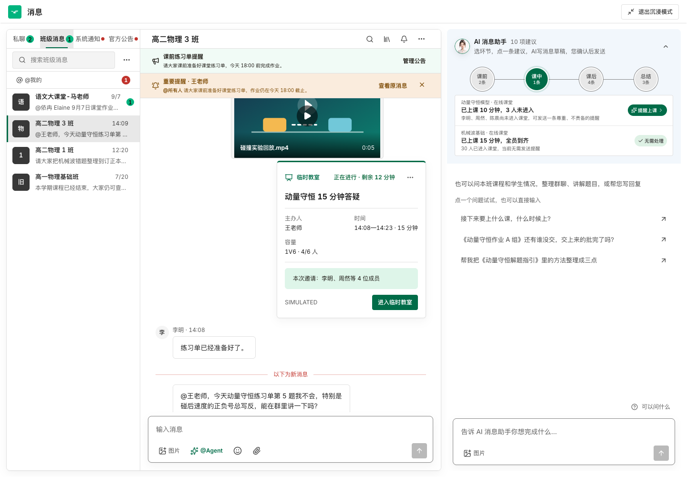

# IM Copilot 源项目 100% 对齐盘点

## 1. 结论

可以把 `classin-ai-harness` 今天完成的 IM Copilot 体验完整迁入 V2，并先让 V2 回到模拟业务数据驱动的产品状态。迁移时不建议对 V2 执行整仓 `reset`，也不建议直接覆盖整个 `src/`：两个仓库已经在同一批共享文件上分别加入了新的交互和真实接口逻辑，整仓覆盖会丢失 V2 已完成的图片时间线、Runtime 恢复和真实接口研究成果。

推荐采用“冻结源项目工作树 → 恢复 V2 的 Mock 组合根 → 迁入已验收 IM 切片 → 合并冲突文件 → 双实例逐像素验收”的方式。最终用户看到的默认消息页面与源项目一致；V2 的真实 ClassIn Module 暂时不挂载到默认产品入口，代码和研究证据保留，供下一轮真实接口接入复用。

本次只完成盘点、源快照和迁移边界记录，没有修改 V2 的运行代码。

## 2. 对齐基准

### 2.1 源项目

- 目录：`/Users/eeo/Documents/claudecode/classin-ai-harness`
- 分支：`codex/copilot-stage-nav-v2`
- HEAD：`b1a3d7f`（2026-09-15 12:11，`simplify IM assistant composer`）
- 对齐对象：HEAD 加 2026-09-15 当前尚未提交的工作树；不能只迁移 HEAD
- 与本次 IM 优化相关的工作树路径：60 个，其中 34 个已跟踪修改、其余为新增文件
- 实机地址：`http://127.0.0.1:4173/teacher/messages?category=class&thread=class-physics-3`

源工作树仍可能继续变化。正式搬迁前必须以文件哈希重新冻结一次，避免“迁到一半源项目又变化”。当前哈希清单见 [SOURCE-PARITY-MANIFEST-2026-09-15.tsv](./SOURCE-PARITY-MANIFEST-2026-09-15.tsv)。

### 2.2 目标项目

- 目录：`/Users/eeo/Documents/claudecode/classin-ai-harness-v2`
- 分支：`codex/real-api-integration-v2`
- HEAD：`2911228`（`integrate gateway compatibility and solution images`）
- 当前工作树包含真实 ClassIn 测试 API、测试班 Thread、教师端模拟消息及图片时间线修复

### 2.3 实机基线

使用新的浏览器上下文、1440×1000 视口读取源项目，页面无 `pageerror`。首屏实际显示：

- `AI 消息助手`
- `10 项建议`
- `选环节，点一条建议，AI写消息草稿，您确认后发送`
- 四阶段数量：课前 2、课中 1、课后 4、总结 3
- 当前课中事项：动量守恒课堂“已上课 10 分钟，3 人未进入”和机械波课堂“全员到齐”
- 三条通用问题及底部“可以问什么”入口

## 3. 今天完成的主要体验升级

### 3.1 顶部协作面

- 顶部保持 `AI 消息助手 · N 项建议` 和锁定引导文案；
- 导航底色从中性浅灰调整为淡蓝灰 `#F2F7FC`，新增语义 Token `--color-assistant-guide-surface`；
- 头像、名称、数量、引导文案、留白和箭头合并为一个原生折叠按钮；
- 整栏可点击，Enter/Space 等价；关闭按钮仍是独立操作；
- 展开与收起使用相同文案，不随对话滚动自动折叠。

### 3.2 首屏通用问题引导

- 在还没有本次回答时，展示一句能力说明和最多三条当前班级可回答的问题；
- 完整问题库包含 21 个问题，按班级课程、课堂参与、作业测验、某位学生、报告沟通、群聊内容六组组织；
- “可以问什么”从 Composer 附近打开轻量面板，点击外部或 Escape 关闭；
- 空闲且输入框为空时，点击问题直接发起真实 Runtime 请求；
- 已有文字、图片、引用、运行中任务或审阅草稿时，问题只加入输入框，不覆盖老师内容；
- 问题可用性由 Business Context Adapter 提供，UI 不硬编码业务权限。

### 3.3 引用群消息给 AI

- 班级消息动作中增加“引用给AI”；
- 引用进入 Copilot Composer，并保留消息 ID、作者、时间与预览；
- 读取范围由 `ImChatReader` 限定在当前 Thread；
- “最近两天”按 Asia/Shanghai 日历或明确 48 小时解释；
- 撤回、编辑或引用后出现的新讨论会使旧引用失效，避免基于过期消息生成回复；
- 群消息只作为不可信证据，不作为模型指令。

### 3.4 页面级历史呈现

- 进入或刷新 Copilot 时默认隐藏进入前的旧回合和旧产物，但保留原 Runtime Session 与上下文；
- 存在历史时显示“↑ 查看历史”，也可在对话顶部向上滚动恢复；
- 恢复历史时保持当前阅读位置，不强制滚到底部；
- 历史展开后，第一次本次新回合前显示一次红色“以下为新消息”分界；
- 刷新只重置页面展示边界，不删除会话或清除绑定。

### 3.5 消息草稿和发送

- 可交付回答直接以“消息草稿”预览呈现；
- 草稿下方明确显示 `发送至：班级名`；
- “修改文案”进入原位编辑，“直接发送”直接对当前可见正文完成审批与发送；
- 发送使用互斥锁避免快速连击；失败保留草稿并显示“重试发送”；成功只显示简短“已发送”；
- 私聊仍是插入输入框，家长消息草稿只能复制，不冒称已经发到当前班群；
- 预览、编辑和发送共用同一正文，AI 的寒暄、写法说明和结尾邀约不进入消息。

### 3.6 文案结构、密度和提及

- 课程安排、知识点、练习表现和易错提醒按语义拆分；同一要点内的短句保持连贯；
- 草稿使用紧凑行高和段间距，减少卡片感和大面积留白；
- `@所有人` 和当前上下文中可核验的学生姓名显示为浅蓝提及标签；
- 提及名单与个性化服务名单分开，未知姓名、邮箱、链接和代码不误标；
- 群消息生成合同要求全班消息以 `@所有人` 开头，定向提醒逐一提及实际目标；
- IM 自我介绍统一为“AI消息助手”，旧回答中的明确旧名称做显示兼容。

### 3.7 布局与恢复

- Sidecar 增加通用问题面板、历史入口、分界线、直接交付按钮和紧凑草稿对应样式；
- 窄桌面宽度下，聚焦消息不会把 Copilot 托盘滚出视口；
- 运行中仍可编辑下一条输入，停止当前任务后继续同一逻辑对话；
- Runtime Envelope 对完整问题、聊天证据、内部要求与教师可见文字分层。

## 4. 源项目与 V2 的差异分类

### 4.1 V2 完全缺失，需要新增

以下 Module 或文档在源项目存在、V2 当前不存在：

- `GeneralQuestionGuidance` UI、Domain 和合同；
- `useImHistoryPresentation` 页面历史 Module；
- `ImChatReader`、聊天上下文选择与过期校验；
- IM 助手身份兼容 Projection；
- IM 问题草稿本地保存；
- 21 个问题的固定模拟可用性数据；
- 通用问题 E2E；
- 通用问题详细设计、历史展示和草稿交付验收记录。

这些文件可以先按源快照原样复制，再通过相同 Interface 接入目标组合根。

### 4.2 两边都修改，必须合并

| 文件/区域 | 源项目变化 | V2 变化 | 迁移要求 |
| --- | --- | --- | --- |
| `src/app/App.tsx` | Mock 聊天 Reader 和新上下文接入 | 真实测试连接、独立 Runtime 和服务解析 | 默认组合根恢复 Mock；保留 V2 稳定 Runtime 及真实 Module 代码，不直接覆盖 |
| `ImSidecarAgentSurface.tsx` | 通用问题、历史、引用、草稿直发、提及和身份 | 真实服务提示、图片产物按回合时间排序 | 以源体验为 UI 主线，保留 V2 图片时间线排序；移除顶部真实连接文案覆盖 |
| `TeachingDynamics.tsx/.css` | 整栏折叠和淡蓝灰视觉 | 可选 `guidance` 覆盖真实状态 | 采用源实现；不允许 Adapter 覆盖固定引导 |
| `MessageWorkspace.tsx` | 引用消息给 AI 和消息可聚焦 | 真实测试 Thread、来源横幅、动态教师和时间 | 默认 Mock 页面采用源行为；真实扩展不挂载时不影响页面 |
| `business-context.ts` | 问题可用性、提及名单 | V2 交付提示和真实服务合同 | 合并合同；展示层不消费 `deliveryNotice` 改写顶部 |
| `runtime-context-envelope.ts` | 通用问题与内部命名要求 | ClassIn Test scope、真实工具授权 | 保留两类能力，通过 scope 隔离 |
| `AgentRichResponse` | 提及标签 | V2 公式、图片及既有富文本能力 | 合并，不能退化图片和数学展示 |
| `WorkBuddyImSidecar.module.css` | 新交互样式 | 图片时间线样式 | 合并两组选择器 |
| E2E | 新历史、问题、直发、布局验收 | 真实测试 API、模拟消息和图片顺序 | 分为 Mock parity 与未来真实集成两套配置 |

### 4.3 V2 已有、应暂时停用而非删除

- `src/features/classin-test/`、`src/domain/classin-test/` 和对应 contracts；
- `server/classin-test-*` 真实读取 Module；
- Apifox、课堂报告、回放、作业提交、试卷和资源读取研究；
- 真实测试班的教师端模拟 Message Adapter；
- `/teacher/classin-test` 数据核验页；
- 真实 API 专用 Playwright 配置及合同测试。

第一轮对齐时，这些 Module 不进入默认 `/teacher/messages` 组合根，也不向模拟班添加测试 Thread、工程横幅或真实状态文案。下一轮真实接入从相同 Seam 再启用，不需要重新研究接口。

## 5. 为什么不能直接整仓复制

1. 源项目当前基准包含未提交工作，单纯切到 `b1a3d7f` 会漏掉大部分今天优化；
2. V2 的 `ImSidecarAgentSurface` 已修复图片产物与历史回合的时间顺序，源文件直接覆盖会把该修复删除；
3. V2 的 App 组合根、Message Workspace 和 contracts 已加入真实测试 Thread；源文件直接覆盖会产生类型、路由和状态恢复回归；
4. V2 已保存大量真实接口合同与回归证据，整仓回退会让下一轮重复工作；
5. 两个仓库的 Git HEAD 不是同一提交哈希，不能把目录相似误认为可安全快进或重置。

这里的“100% 复刻”应定义为用户可见产品与已批准行为完全一致，而不是把 V2 所有文件变成源仓库的字节副本。

## 6. 推荐迁移方案

### M0：冻结源基线

- 重新生成源文件哈希清单；
- 保存 1440×1000、1280×720 的空白、展开历史、草稿预览和编辑状态截图；
- 记录源项目 HEAD 与未提交补丁；
- 源基线冻结后，迁移期间不再把后续变化静默纳入本轮。

完成条件：能从 Commit、补丁、哈希和截图唯一重建源页面。

### M1：把 V2 默认运行态恢复为 Mock

- 默认消息组合根只使用 `FixedWorkBuddyImBusinessContextAdapter`、`FixedWorkBuddyImTeachingDynamicsAdapter` 和 Mock Message Adapter；
- 默认会话列表不挂载 ClassIn Test Thread；
- 默认路由恢复 `class-physics-3`；
- 真实 ClassIn Module 和数据核验代码保留但不影响消息页。

完成条件：V2 首屏数据、建议数量、教师、班级、课程、时间和消息均来自同一固定 Mock 基线。

### M2：迁入今天的产品与 UI 增量

- 先复制源项目新增的深层 Module；
- 按 §4.2 逐文件合并冲突；
- `TeachingDynamics`、Token 和局部视觉以源项目为准；
- 保留 V2 图片时间线与 Runtime 恢复修复；
- 同步源项目的 PRD、Spec、Tickets 和验收记录。

完成条件：源项目所有 21 个问题、历史、引用、草稿交付、提及、折叠和密度行为在 V2 可操作。

### M3：100% 页面验收

在相同 Chrome、视口、字体、角色、URL、Mock 数据和空浏览器存储下并行启动源项目与 V2：

- 比较 DOM 可见文案、元素顺序、按钮名称和可访问状态；
- 比较首屏、折叠、帮助面板、历史展开、生成中、回答、草稿预览、编辑、失败和发送成功截图；
- 逐项跑同一套键盘、滚动、点击、刷新和恢复脚本；
- 对 Source-only 安全文件做 SHA-256 一致性检查；
- 对 Merge-required 文件按行为合同验收，登记保留的 V2 差异。

完成条件：默认模拟页面没有来源横幅、真实测试文案或 ClassIn Test Thread；已批准交互和视觉与源项目一致；保留差异只有不可见的 V2 修复且有测试证明。

### M4：建立下一轮真实 API 接入起点

- 将稳定 UI 固定为单一 Interface；
- 把真实班级、教学动态、消息交付和时间刷新分别放在 Adapter 后；
- 逐项替换 Mock Adapter，不修改顶部协作面；
- 每接入一类真实事实，同时保留 Mock 合同回归和真值标签。

M4 不属于本次“回到模拟原点”的实施范围，待 M0～M3 验收后再进入新的 PRD → Spec → Tickets。

## 7. 100% 对齐的验收定义

| 维度 | 验收标准 |
| --- | --- |
| 页面框架 | 消息分类、会话列表、时间线、Copilot 和 Composer 的位置、宽度与滚动行为一致 |
| 顶部引导 | 名称、动态数量、固定文案、淡蓝灰底、整栏折叠和关闭行为一致 |
| 内容 | 模拟班课程、课堂、作业、学生、问题样例和当前阶段一致 |
| 对话 | 历史隐藏、查看入口、新消息分界、Session 连续性一致 |
| 生成 | 普通回答、可选转消息、明确消息草稿三类意图一致 |
| 交付 | 预览、修改、直发、失败重试、私聊插入和家长草稿边界一致 |
| 富文本 | 结构、密度、公式、图片、提及标签和自我介绍一致 |
| 可访问性 | 键盘、焦点、Escape、aria-expanded、区域名称及错误状态一致 |
| 稳定性 | 刷新、停止、过期 Session、模型失败和图片失败可恢复 |
| 真值 | 页面只显示 Mock 数据和 SIMULATED 回执，不暗示已接入真实 ClassIn 业务 |

## 8. 当前建议的 Write Set

第一轮实现只允许修改：

- V2 组合根中消息/Copilot 的 Adapter 装配；
- `src/features/workbuddy-im-assistance/`；
- `src/features/message-workspace/MessageWorkspace.tsx` 和响应式布局；
- 对应 contracts、Domain Projection、Mock Adapter、Mock 场景和共享富文本；
- `tokens.css`；
- 对应单元、集成、E2E、视觉快照与本组规格。

不删除真实 API server、研究、造数记录和 ClassIn Test contracts；不修改测试环境业务数据；不把真实测试班内容混进模拟页面。

## 9. 审阅建议

建议本次确认以下执行口径：

1. V2 默认消息页面先完全回到源项目的 Mock 数据和交互；
2. 100% 对齐以源项目当前工作树为准，不以 `b1a3d7f` 单一 Commit 为准；
3. 真实 ClassIn 集成代码保留但暂时退出默认产品组合根；
4. 共享冲突文件采用合并，保留 V2 的图片时间线与 Runtime 恢复修复；
5. 只有 M0～M3 页面对齐验收后，才另开真实 API 接入的新一轮 Spec。

用户已于 2026-09-15 确认本方案并授权完整实施。锁定决策为 D-157；实施追踪转入同目录的 PRD、Feature Spec 与 Tickets。
