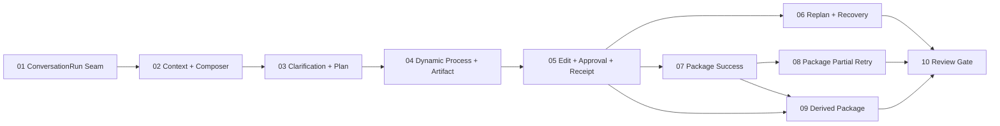

# WorkBuddy M4.1 Tracer-bullet Ticket 拆分提案

## 1. 拆分原则

- 每张票交付一段可在浏览器演示、可通过公开行为验收的纵向旅程；
- 不按 Timeline、卡片、Context 树、右栏、Adapter 等技术层横向拆票；
- 首票采用 expand–migrate 思路，把 ConversationRun Seam 放到现有 M4 旁边，保持旧链路绿色；
- 后续按教师真实旅程逐步迁移，最后一票才 contract 旧 Stage-only Surface；
- 每张票控制在一个全新上下文窗口可以完成的范围内；
- WorkBuddy 导航改版、Skills/Tools/内容页面和全局 Demo 文案不进入本 Ticket 集。

## 2. 拟议 Tickets

### 01 — 建立 ConversationRun Seam 并投影一个可恢复的 Run

**Blocked by:** None — can start immediately.

**What it delivers:** 教师打开一个现有课程生产 Run 时，页面可以通过统一 ConversationRun Interface 获得有序 Timeline、当前等待点、对象引用和允许命令；确定性 Experience Adapter 与未来真实 Agent Runtime 共享同一契约，现有 M4 Surface 在迁移期间继续可用。

**Acceptance outline:**

- `open / dispatch / subscribe` 与 cursor replay 的公开契约可测试；
- 事件拥有稳定 ID、sequence、状态、Run/Object 引用和允许命令；
- 重复命令不会产生重复事件或业务动作；
- 一个已完成单课件 Run 可在新 Projection 中恢复 Goal、Plan、Process、Artifact、Action 与 Receipt；
- 旧 Surface 与现有 M4 测试保持绿色。

### 02 — 从 Core Context 树和 Composer 创建动态智能课件 Run

**Blocked by:** 01 — 建立 ConversationRun Seam 并投影一个可恢复的 Run。

**What it delivers:** 教师在默认展开的 Context 树中选择班级、课程、单元和资源，看到与 Composer 双向同步的 Chip，发送智能课件 Goal，并在同一个 Run Timeline 中看到教师消息、整理状态和目标理解，最终停在需要补参的可操作状态。

**Acceptance outline:**

- Context 树、搜索、父子选择、最小祖先引用、权限和聚合学习者范围可操作；
- Tree 与 Chip 双向同步，Composer 显示 4 个高价值项和 `+N`；
- 发送后立即创建稳定 Run/历史条目并保持一个 URL；
- 初始动态事件经历 submitted → organizing → goal understood → requires teacher input；
- Context 默认展开且可收起，焦点和草稿不丢失。

### 03 — 在 Timeline 内完成补参、ContextSnapshot 与 Plan 确认

**Blocked by:** 02 — 从 Core Context 树和 Composer 创建动态智能课件 Run。

**What it delivers:** 教师在同一 Timeline 中完成 NineClaw 对标的结构化确认卡，冻结 ContextSnapshot，查看 Agent 的目标理解和具体计划，并批准、修改或取消计划，不发生 Stage 页面跳转。

**Acceptance outline:**

- 固定体验场景覆盖课时、时长、教材版本与风格；
- 确认卡具有步骤进度、单选、其他、跳过、提交和键盘行为；
- 已知 Context 不重复询问，提交后卡片收起为完成摘要；
- Plan 显示步骤、预期输出、Capability 摘要和等待点；
- 修改与取消保留 Goal、Context 和已完成证据。

### 04 — 动态执行 Skill/Tool 过程并交付可预览智能课件

**Blocked by:** 03 — 在 Timeline 内完成补参、ContextSnapshot 与 Plan 确认。

**What it delivers:** 教师批准计划后，可以看到步骤和 Capability Call 依次从等待、运行到完成；阶段结果最终产生稳定智能课件 Artifact，右侧统一辅助区按规则切到“产出”，同时保留左侧 Timeline。

**Acceptance outline:**

- 每一步至少可见一次 running，不用随机数或真实墙钟驱动测试；
- Skill/Tool 卡展示教师摘要、用途、ContextProjection、输入输出、耗时与结果；
- 当前/失败调用展开，完成的低层调用可折叠；
- 用户上滚时停止自动跟随并显示新增事件数；
- Artifact 到达先有来源事件，再更新右侧未读/预览；
- 产出标题、内容和完成总结始终是同一个智能课件，不残留 V04/V06 源任务语义。

### 05 — 完成课件全局只读预览、审批与成功 Receipt

**Blocked by:** 04 — 动态执行 Skill/Tool 过程并交付可预览智能课件。

**What it delivers:** 教师在右侧产出区逐页预览课件，在聚焦层通过完整页面目录浏览全局内容；文档修改明确转交专业第三方编辑器。随后从 Timeline 提出保存到 ClassIn 的 Action、完成低风险确认、等待执行，并在原 Run 获得成功 ExecutionReceipt。

**Acceptance outline:**

- 当前页、上一页、下一页、页码、全局页面目录和退出位置稳定且键盘可达；
- 预览明确标注为只读与 `[模拟]`，浏览页码不产生新的 Artifact 版本；
- “使用专业编辑器打开”代替内嵌编辑，未接入时给出明确反馈且不伪造外部打开成功；
- ProposedAction 显示目标、差异、风险、权限、版本与过期；
- Approval 与执行中明确分开；只有 Receipt 表示 ClassIn 保存成功；
- 刷新/重新打开可通过 Run ID 恢复 Timeline、Artifact、Inspector 和 Receipt。

### 06 — 交付停止、补充、Replanning 与写回异常恢复

**Blocked by:** 05 — 完成课件全局只读预览、审批与成功 Receipt。

**What it delivers:** 教师可以在原对话中补充普通要求、停止执行、改变教学范围、查看影响并 Replanning；保存时的权限拒绝、版本冲突、超时和临时失败均在同一 Timeline 中给出受治理恢复，而不丢失旧证据。

**Acceptance outline:**

- 普通补充只影响未开始步骤，重大变化进入影响确认；
- Replanning 产生新 Snapshot/Plan/Artifact 身份并保留 superseded 证据；
- 停止、取消和恢复具有显式事件与允许命令；
- 权限、冲突、超时、临时失败和重试保持既有领域不变量；
- 重试不重复已成功副作用，恢复后的 Action/Approval/Receipt 归属正确；
- 历史恢复不把旧 Artifact 的派生关系误投影到新版本。

### 07 — 在 Conversation Run 中完成课程方案包成功主链

**Blocked by:** 05 — 完成课件全局只读预览、审批与成功 Receipt。

**What it delivers:** 教师直接创建独立课程方案包 Run，在同一个 Timeline 中确认 Context 和四类产物，观察并行生成、边生成边预览、逐项复查、批量 ProposedAction、Approval 和全成功对象级 Receipt。

**Acceptance outline:**

- 方案包拥有独立 Run、Snapshot、Goal 和 Task Type；
- 课件、作业、测验、录播脚本的依赖和状态以事件方式连续更新；
- 已完成项可提前在右侧产出目录预览；
- 教师可修改、排除或选择待写回项；
- 批量审批保留实际选项；全成功 Receipt 展示四个对象结果；
- 单课件和方案包共享 Surface/Interface，但领域状态不合并。

### 08 — 交付方案包部分成功、等待依赖与安全重试

**Blocked by:** 07 — 在 Conversation Run 中完成课程方案包成功主链。

**What it delivers:** 教师可以在可控分支中看到对象级成功、失败、未执行和等待依赖，修改失败项并只重试符合条件的对象；已成功对象不重复执行，最终恢复 Receipt 追加在原 Timeline。

**Acceptance outline:**

- 部分成功、waiting dependency、not executed 和 failed 可复现；
- 失败项保留原因、允许命令与修改入口；
- retry Action、Approval、idempotency key 和 Receipt 使用独立且正确的身份；
- 首次 Receipt 保留，恢复 Receipt 追加而非改写历史；
- 已成功对象在重试中保持 stable replay，不产生第二次副作用。

### 09 — 交付课件派生方案包与双向 Run 恢复

**Blocked by:** 05 — 完成课件全局只读预览、审批与成功 Receipt；07 — 在 Conversation Run 中完成课程方案包成功主链。

**What it delivers:** 教师从已审阅智能课件创建关联但独立的方案包 Run，重新确认 Context 和产物范围；源 Run 与派生 Run 可以双向定位，且关系严格匹配源 Artifact ID 与版本。

**Acceptance outline:**

- 派生操作创建新 Run、独立 Snapshot、`parentRunRef` 和 `sourceArtifactRef`；
- 原课件 Run、Artifact、Action 和 Receipt 不被修改；
- 新旧 Run 可以往返并恢复各自 Timeline 和 Inspector；
- Replanning 后旧版本的派生关系只留在 superseded 证据，不误链当前 Artifact；
- 不创建隐藏的 Context 继承或重复业务副作用。

### 10 — 完成 NineClaw 还原、视觉与 M4.1 Review Gate

**Blocked by:** 06 — 停止、Replanning 与异常恢复；08 — 方案包部分成功与重试；09 — 派生方案包与双向恢复。

**What it delivers:** 把单课件、方案包、恢复和派生链组合成可稳定重置、可访问、可视觉复核的 M4.1；对照逐帧矩阵证明交互覆盖和智能课件语义连续，并在全量检查通过后移除不再使用的 Stage-only Projection。

**Acceptance outline:**

- 22 个 NineClaw 源事件全部有可验收去向或上下文边界；
- 确认卡、计划、运行调用、Artifact、编辑、Action、Approval、Receipt 关键视觉帧通过；
- 目标 Timeline 不含教学动画/课后练习源任务残留；
- 1440×900、紧凑桌面、Reduced Motion、键盘与 axe 验收通过；
- 现有 M4 Domain/Adapter 契约无回归；
- Typecheck、Lint、完整 Vitest、Build、E2E、Visual 和两轴 Code Review 通过；
- 新 Surface 全量接管后才删除 Stage-only UI，不删除领域证据或恢复能力。

## 3. Blocking Graph

## 4. Frontier

当前只有 Ticket 01 无阻塞。Ticket 01 完成并保持现有 M4 绿色后，Ticket 02 才进入 frontier。用户已于 2026-08-21 确认本提案，Tickets 已在本地 Tracker 中按依赖顺序发布为一票一文件。
