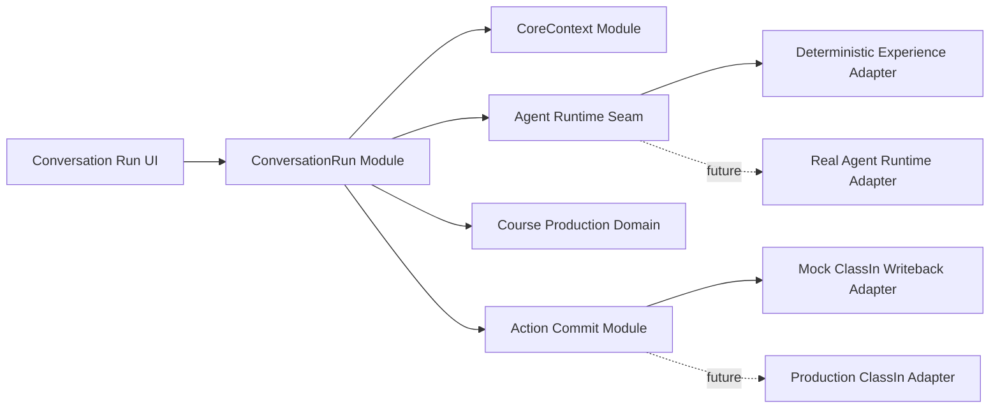

# WorkBuddy M4.1 体验差异、范围与 Runtime Seam

## 1. 问题不是缺功能，而是缺少 Agent Run 感知

M4 技术上已经创建 `WorkBuddyRun`，并使用稳定 ID、显式状态、Artifact、Action、Approval 和 Receipt。当前体验问题来自页面编排：

| 当前表达 | 教师感受 | M4.1 目标 |
| --- | --- | --- |
| 补参和计划是页面中的相邻阶段卡 | 像填写向导，不像 Agent 主动理解与追问 | Agent 消息后立即出现内嵌补参卡与计划卡 |
| 点击“确认计划并执行”后立即出现固定结果 | 看不到任务真的在推进 | 过程事件按确定性节奏逐条出现，并可暂停、补充或失败 |
| Skill、Tool、Context Projection 在独立执行详情面板 | 过程与对话割裂 | 调用卡位于对应计划步骤下，技术细节按需展开 |
| Artifact、Action、Receipt 各自替换右侧面板 | 教师容易失去任务上下文 | 对话时间线保留动作来源；右侧只负责 Context/产出对象查看 |
| 阶段按钮承担主要导航 | 任务像多个页面 | Run ID 只用于恢复同一时间线，不为每个阶段建立页面 |

## 2. 产品目标

教师在一个窗口中完成以下心智闭环：

```text
我提出目标
→ WorkBuddy 理解了什么
→ 它还需要我补什么
→ 它将怎么做
→ 它正在做什么、用了什么
→ 它产出了什么
→ 它准备改变什么业务对象
→ 我是否同意
→ 实际执行结果是什么
```

“对话式”不等于所有内容都变成聊天气泡。自然语言只承担目标理解、解释和协调；字段、计划、过程、产物和审批继续使用结构化卡片。

## 3. 不变项

M4.1 不改变：

- `WorkBuddyRun`、`ContextSnapshot`、`ArtifactDraft`、`ProposedAction`、`Approval`、`ExecutionReceipt` 的事实所有权；
- 单课件与课程方案包是独立 Task Type；
- 派生方案包创建独立 Run 和 Snapshot；
- Context Projection 只提供最小必要信息；
- 业务写回必须经过政策、教师审批、领域校验和 Adapter；
- 成功只能由 Receipt 证明；
- 权限拒绝、版本冲突、可恢复失败、超时、部分成功和 Replanning 语义；
- 固定、脱敏、可重置的数据基线。

## 4. 改变项

M4.1 改变：

1. Run 的主 Projection：从阶段页面改为连续事件时间线；
2. 补参：从独立阶段卡改为 Agent 追问后的内嵌结构化卡；
3. Plan：从页面步骤改为对话中的可确认计划卡；
4. Process：从静态列表改为逐步更新的执行事件和调用卡；
5. Artifact：在时间线产生稳定引用，右侧产出区打开预览；
6. Approval：由动作提案卡触发高关注确认窗口；
7. Receipt：回到原时间线形成最终业务结果事件；
8. Core Context：从说明型 Section 改为可勾选业务对象树；
9. 右侧区：只在 `上下文 / 产出` 之间切换，过程详情回到时间线渐进披露。

## 5. Deep Module 与替换 Seam

### 5.1 ConversationRun Module

页面只跨一个较小 Interface 使用 ConversationRun Module：

```text
open(runRef) -> ConversationRunProjection
dispatch(runRef, TeacherCommand) -> CommandReceipt
subscribe(runRef, cursor) -> RunEventStream
```

Interface 还包含以下不变量：

- 事件按稳定 `eventId`、`sequence` 和 `occurredAt` 排序；
- 同一 TeacherCommand 不因重复提交产生两条业务动作；
- `requires_teacher_input` 时不会继续执行受阻步骤；
- Artifact、Action、Approval 和 Receipt 只引用真实存在且属于该 Run 的对象；
- 断开订阅不终止 Run；重新订阅可以从 cursor 恢复；
- 页面不能自己编造完成事件或 Receipt。

### 5.2 内部协作



ConversationRun Module 是 Deep Module：页面只学习打开、下发命令和订阅事件；步骤顺序、等待条件、补参、事件合并、恢复、Artifact 归属和业务动作关联都留在 Module 内部。

### 5.3 当前与未来 Adapter

| Seam | 当前 Adapter | 未来 Adapter | 页面是否变化 |
| --- | --- | --- | --- |
| Agent Runtime | Deterministic Experience Adapter：按固定脚本和时间发出理解、计划、Skill/Tool、阶段结果和 Artifact 事件 | Real Agent Runtime Adapter：连接真实模型、Agent 编排与流式工具事件 | 不改变时间线 Interface，只增加真实事件来源 |
| ClassIn 写回 | 当前 Mock Writeback Adapter | 生产 ClassIn Adapter | 不改变 Approval/Receipt 页面语义 |
| Core Context | 固定业务对象与 Mock Context Adapter | 真实 ClassIn Business Context Adapter | 不改变树、选择、Snapshot 和 Projection 语义 |

模拟 Agent Runtime 只能模拟体验节奏，不能绕过领域 Module 直接生成 Action 或 Receipt。真实 Agent Runtime 接入后同样只能产生建议、过程和 Artifact；业务副作用仍由 Action Commit Module 负责。

## 6. NineClaw 证据采用

NineClaw 不再只是抽象模式参考，而是 M4.1 动态任务体验的逐帧还原基线。目标是 100% 覆盖目标录屏中可观察到的交互事实，同时把三段素材组织成一个上下文连续的“生成智能课件”任务：

- 页面和卡片中的全部可见元素；
- 用户输入、Agent 回复、字段、按钮、状态、提示与完成总结的源文案及其目标改写；
- 元素出现、更新、折叠、展开、消失和获得焦点的顺序；
- 等待、流式追加、进度更新、自动滚动、右侧预览打开和保存反馈等动态效果；
- Skill、Tool、文件、阶段输入输出和任务结果之间的可见关联。

### 6.1 主证据与组合方式

| 证据 | 复刻职责 | 采用规则 |
| --- | --- | --- |
| V05 生成智能教案 | Goal、缺参识别、确认卡、TaskCreate、Skill/工具轨迹、阶段输入输出、完成总结 | 作为唯一任务叙事和时间线主干；智能课件的目标、对象、Agent 口吻和上下文从开始延续到 Receipt |
| V04 生成教学动画 | 过程中的产物引用、左过程右预览、交互式 Artifact | 只提取产物产生、引用、预览和交互效果；教学动画名称、文件与说明改写为当前智能课件中的对应页面或课件内容 |
| V06 生成课后练习 | 产物选择、编辑、AI 修改与保存反馈 | 只参考产物聚焦层、工具位置和退出结构；按 D-044 不复刻内嵌编辑，改为只读全局预览与第三方专业编辑器衔接，再接入 ClassIn Action/Approval/Receipt 治理 |

三段素材不是三个并列 Task，也不能在 Timeline 中突然切换产物类型。教师从头到尾看到的是同一目标、同一 ContextSnapshot、同一智能课件 Artifact 及其连续版本。

这一语义统一约束针对由 V04/V05/V06 组合还原的单课件主流程，不取消已经独立定义的“生成课程方案包”Task Type；方案包仍按自己的 Run、Context 和多产物模型执行。

### 6.2 复刻规则

1. 录屏可见原文必须先逐字转录并保留来源；目标页面是否逐字复用，以智能课件上下文连续性为判断标准。
2. V05 中与智能课件一致的文案优先直接复用；V04/V06 中指向教学动画、课后练习或其他产物的文案必须采用同位置、同作用、近似信息密度的智能课件等位文案。
3. 同一 Artifact 的名称、版本、章节、页面和保存目标在跨素材引用时必须一致；任何卡片不得引用上一段素材的任务名、文件名或完成总结。
4. ClassIn 独有的 Core Context、ProposedAction、Approval、ExecutionReceipt 和异常恢复以增量方式插入，不覆盖 NineClaw 已证明的任务过程。
5. 录屏中的命令、路径和环境信息也进入证据清单；页面按录屏保留其调用事件、层级和展开入口。真实 Secret 或可识别本机信息只做等长脱敏，不删除整个元素。
6. “100% 复刻”指可观察交互结构与动态事实的覆盖率，以及源文案的完整登记；不要求把三个不同任务的原文机械拼进同一个流程，也不虚构录屏未证明的后台能力。

### 6.3 逐帧差异表

进入 To Spec 前必须建立逐帧对照表。每一个目标视频事件至少记录：

```text
videoRef / timestamp / sourceFrame
visibleElement / exactCopy / initialState / transition / finalState
targetSurface / targetEventId / targetTiming
targetCopy / narrativeRef / parityStatus / deviationType / deviationReason / verification
```

`parityStatus` 只能是 `EXACT` 或 `ADAPTED`。`ADAPTED` 必须进一步标为：

- `CLASSIN_ADAPTATION`：品牌、业务对象或任务内容的等位替换；
- `TASK_SEMANTIC_NORMALIZATION`：把 V04/V06 的教学动画或课后练习文案改写为同一智能课件任务语义；
- `SECURITY_REDACTION`：真实 Secret、账号、路径或可识别信息的脱敏；
- `ADDED_DOMAIN_GOVERNANCE`：为 Core Context、审批、Receipt 或恢复补充的 ClassIn 治理。

没有进入差异表的元素不得在实现中静默省略。视觉与 E2E 验收需要同时检查覆盖率、事件顺序和关键动态状态，而不只检查最终静态页面。

## 7. 非目标与后续边界

- 不在 M4.1 接入真实 LLM、MCP、文件生成或生产 API；
- 不在本规格中重做 AI Agent 导航；
- 不在本规格中锁定历史任务数量；
- 不在本规格中删除整个 ClassIn PC 的 Demo 文案；
- 不把确定性事件动画当作真实后台耗时或模型推理；
- 不展示模型隐藏思维链；“Agent 理解”只显示面向教师的目标摘要与可验证计划；
- 不把命令、代码或原始 JSON 默认暴露给教师。

## 8. 进入实现前的硬门槛

- 用户完成本规格包 Review；
- NineClaw V05/V04/V06 的逐帧转录、元素清单和差异表完成，并达到全部目标事件有去向；
- To Spec 明确 ConversationRun Interface、事件契约和恢复语义；
- To Tickets 按完整用户旅程拆纵向票，不按“聊天组件、卡片组件、右栏组件”横向拆票；
- 当前和未来 Adapter 都不能改变领域审批和 Receipt 不变量；
- 浏览器测试通过公开交互验证动态 Run，不使用内部 React state 或定时器实现细节作为断言。
