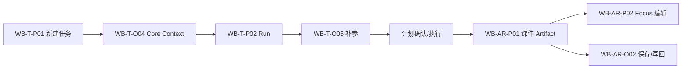
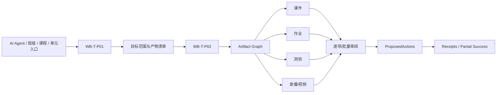
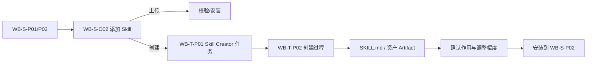
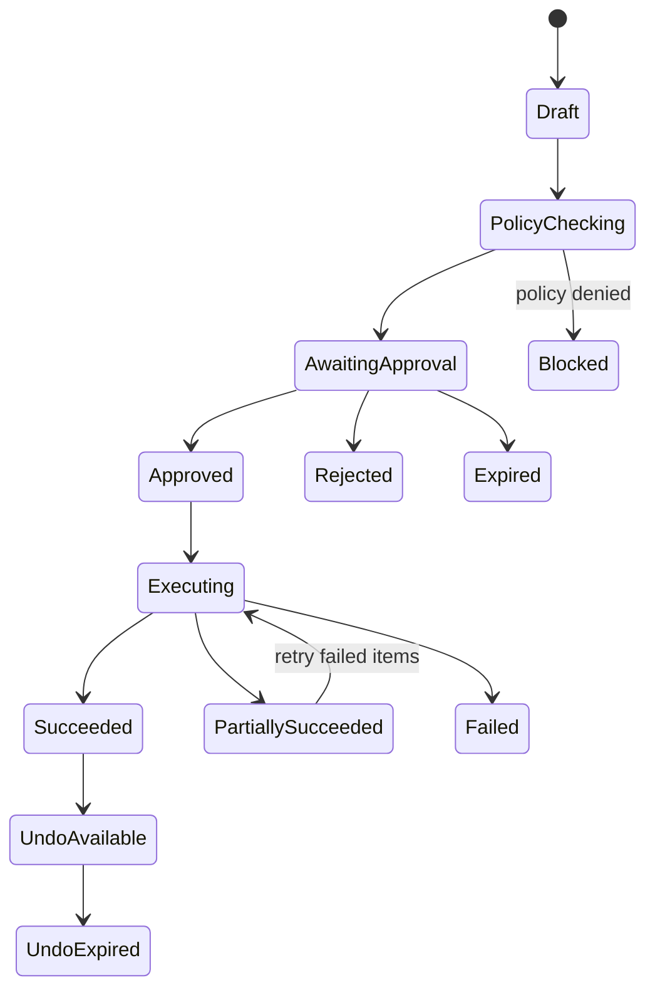

# WorkBuddy V1 关键流程与页面跳转

## 1. 流程一：直接生成单个课件



| 阶段 | 页面 | 必须显示 | 教师动作 | 异常/恢复 |
|---|---|---|---|---|
| 目标 | WB-T-P01 | Prompt、任务类型、资源、Context 摘要 | 输入/选择/发送 | 输入或资源问题就地修复 |
| Context | WB-T-O04 | 教师/机构、教学范围、资料、Knowledge | 应用/替换/排除 | 缺必需项但不当成系统错误 |
| 补参 | WB-T-O05 | 年级、学科、内容、课时、格式等缺失项 | 回答/跳过可选项 | 保留已答项 |
| 计划 | WB-T-P02 | 任务理解、步骤、预期主课件 | 确认/修改/停止 | 修改后 Replanning |
| 执行 | WB-T-P02 | 教师摘要、能力调用、阶段结果 | 查看/追加约束/停止 | 重试、换策略、保存现场 |
| 课件 | WB-AR-P01 | 版本、预览、编辑与保存状态 | 编辑/AI 修改/外部打开 | 预览失败不等于生成失败 |
| 写回 | WB-AR-O02 | 目标 Space/课程对象、差异与权限 | 批准/修改/取消 | Receipt、失败保留草稿 |

完成单课件不要求出现空课程方案包，也不要求写回 ClassIn 才能保存 WorkBuddy Artifact。

## 2. 流程二：直接生成课程方案包



关键规则：

1. 执行前显示默认产物清单，教师可添加、移除或调整优先级；
2. 计划显示依赖关系，不能把并行调用伪装成一条线性聊天；
3. 每个 Artifact 独立状态、版本与审阅结论；
4. 单项重做不会自动推翻不受影响产物；
5. 批量写回可展开为单项 ProposedAction；
6. `partially_succeeded` 明确成功、失败、未执行和可重试项。

## 3. 流程三：由课件创建关联方案包

| 步骤 | 页面/事件 | 规则 |
|---:|---|---|
| 1 | WB-AR-P01 课件完成 | 显示“基于此课件生成课程方案包” |
| 2 | 点击派生 | 创建新草稿 Run，不改变原 Run 状态 |
| 3 | WB-T-P01 预填 | Task Type=`course_package_generation`；课件为 `sourceArtifactRef` |
| 4 | WB-T-O04 | 原 Snapshot 只作为建议；重新确认班级、课程、时间和产物清单 |
| 5 | 提交 | 创建独立 Run ID 和 Context Snapshot |
| 6 | 新 Run Header | 显示“来源：课件《…》”，可返回原 Run/Artifact |
| 7 | 原 Run | 显示“已创建关联任务”，不进入执行中 |

取消第 3/4 步只丢弃新草稿，不影响原课件。

## 4. 流程四：运行中修改 Core Context

```text
Run executing
  → 打开 Core Context
  → 修改次要资料：应用后只影响未开始步骤
  → 修改主班级/课程：展示影响分析
  → 教师确认
  → old Snapshot / Plan / affected Artifacts = superseded
  → new Snapshot
  → replanning
  → continue execution
```

影响分析至少列出：清除的课程/单元/成员、受影响步骤、受影响 Artifact、待撤销 ProposedAction 和是否需要重新确认计划。权限失效不允许“继续使用最新数据”，只能使用仍被授权的历史证据或移除来源。

## 5. 流程五：创建 Skill



- Skill Creator 是任务类型/模板，不是 Tool 详情页动作；
- 任务必须说明预期作用、触发条件、输入输出、权限和测试方式；
- 安装前显示生成文件、版本、权限和来源；
- 同名 Skill 的覆盖/并存策略必须明确确认；
- 创建失败保留 Run 与生成文件，不产生“已安装”假状态。

## 6. 流程六：内容一键改编

1. WB-C-P02 点击“一键改编”；
2. 创建 WB-T-P01 草稿，带作品引用、作者、版本、授权状态和建议改编目标；
3. 教师确认任务类型、目标班级/课程和改编要求；
4. 作品作为 Context Item，不直接复制为教师自产 Artifact；
5. 提交后进入标准 Run；
6. 新 Artifact 保留来源关系与必要归属；
7. 返回内容详情时恢复预览页和筛选现场。

获取失败、授权不足或作品下架时，不创建可执行 Run；已有草稿显示来源失效并要求替换。

## 7. 流程七：定时触发 Run

| 阶段 | 行为 |
|---|---|
| 配置 | 保存目标模板、Task Type、触发规则、Context 选择规则、通知和执行策略 |
| 校验 | 检查时区、模型、Skill/Tool、资源位置、Actor/Tenant 和审批要求 |
| 触发 | 每次创建标准 WorkBuddyRun，并在触发时装配新的 Context Proposal/Snapshot |
| 执行 | 使用与手动 Run 相同的计划、事件、Artifact 和恢复状态 |
| 高影响动作 | 即使 Run 自动触发，业务写回仍按策略等待教师审批 |
| 历史 | WB-AU-P02 链接每次 Run、Artifact、失败和 Receipt |

错过执行、重叠执行、通知失败和任务执行失败分别表达，不能合并为一个红色失败状态。

## 8. 流程八：业务写回与部分成功



审批卡字段：动作、目标对象、当前值与建议值、影响范围、来源 Artifact、权限、风险、可逆性和过期时间。

Receipt 字段：实际对象 ID、执行结果、时间、服务端版本、失败码、安全说明、可撤销信息和返回对象入口。

部分成功示例：

```text
✓ 课件已保存到课程资源
✓ 作业草稿已创建
× 测验创建失败：题型规则不兼容 [修改后重试]
— 视频未执行：依赖素材仍在生成 [稍后继续]
```

## 9. 流程九：历史恢复与跨组织保护

- 打开历史 Run 恢复最后时间线位置、Context Snapshot、当前 Artifact 和面板模式；
- 若实时业务对象有更新，显示 `stale`，不静默替换历史 Snapshot；
- 若权限已变，隐藏敏感正文并显示失效原因与可用动作；
- 切换组织后，另一组织的任务不出现在可执行历史列表；若允许显示审计占位，也不能加载正文、Context 或 Artifact；
- 删除 Run 不删除已写回 ClassIn 对象，并在确认中明确列出保留项。

## 10. 跳转状态保存

| 来源 → 目标 | 需要保存 |
|---|---|
| 任务历史 → Run | 历史滚动、选中条目、搜索/筛选 |
| Run → Context | Run 滚动、未发送输入、当前面板 |
| Run → Artifact | Run 滚动、事件展开、当前 Artifact 版本 |
| Artifact → Focus | 面板宽度、选中产物、编辑/预览状态 |
| Run → Skill/Tool 详情 | Run ID、触发事件、返回 Focus |
| 内容 → 改编 Run | 内容筛选、详情预览页、作品版本 |
| Space → Run | 目录、选中文件、排序和来源 Route |
| ProposedAction → ClassIn 对象 | Run/Artifact/Receipt 与返回锚点 |
