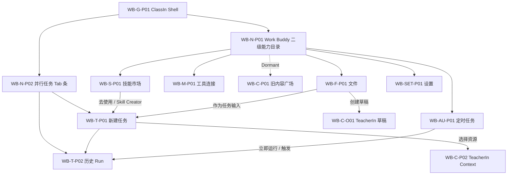
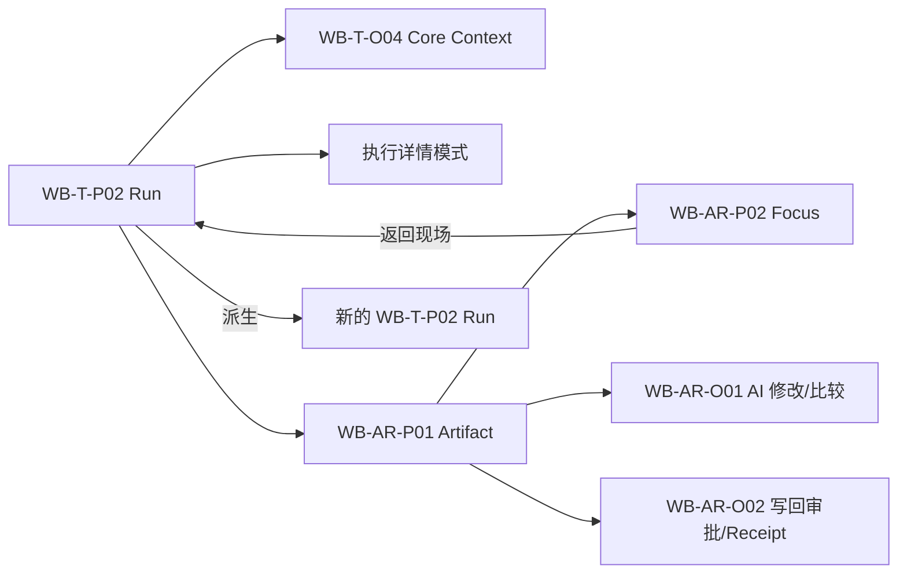

# ClassIn WorkBuddy V1 页面地图与导航

## 1. 页面 ID 规则

- `WB-G`：ClassIn 全局壳；
- `WB-N`：Work Buddy 二级导航与任务工作区导航；
- `WB-T`：新任务与 Run；
- `WB-AR`：Artifact、审批与写回；
- `WB-S`：Skill；`WB-M`：Tool/MCP；
- `WB-C`：内容；`WB-AU`：定时任务；
- `WB-F`：文件；`WB-SET`：设置；`WB-E`：授权与用量；
- `P` 为页面/持续 Surface，`O` 为 Overlay/Popover/Dialog/嵌入式交互层。

## 2. 全量页面清单

| ID | 页面/层 | 容器 | 主要入口 | 主要出口 | NineClaw 来源 |
|---|---|---|---|---|---|
| WB-G-P01 | ClassIn 共享应用壳 | 固定壳 | 应用启动 | 所有一级模块 | G-P01 |
| WB-G-O01 | 全局侧栏收起态 | 壳状态 | 收起按钮/快捷键 | 展开恢复 | G-O01 |
| WB-G-O02 | 账户与组织菜单 | Popover | 头像/组织名 | 账户、切换组织、退出 | G-O02 |
| WB-N-P01 | Work Buddy 二级能力目录 | ClassIn 左侧栏内嵌 Surface | 可展开/收起的 Work Buddy 一级入口 | 技能市场、工具连接、我的文件、定时任务、设置 | G-P01 + ClassIn 适配 |
| WB-N-P02 | 并行任务 Tab 条 | Work Surface 顶层 | Work Buddy / 当前任务 | 已打开任务、新建任务、全部任务选择器 | G-P01/G-O03 + ClassIn 适配 |
| WB-N-O01 | 全部任务选择器与操作菜单 | Popover | 当前任务 Tab | 在当前 Tab 切换任务、重命名、置顶、删除 | G-O03 |
| WB-T-P01 | 新建任务 | 主 Surface | 二级菜单/业务对象入口 | 创建 Run | T-P01 |
| WB-T-P02 | Agent Run 工作区 | 主 Surface | 新任务提交/历史/关联任务 | Artifact、Context、执行详情、Focus | T-P02/T-P03 |
| WB-T-O01 | 资源与位置选择器 | Popover/Dialog | 附件/资源/目标位置 | T-P01/T-P02 | T-O01 |
| WB-T-O02 | Skill 选择器 | Popover | 高级能力按钮 | T-P01/T-P02、Skill 广场 | T-O02 |
| WB-T-O03 | 模型选择器 | Popover | 模型按钮 | T-P01/T-P02、模型设置 | T-O03 |
| WB-T-O04 | Core Context 面板 | 右侧活动区 | Context Chip/Run Header | 应用 Context、返回 Run | ClassIn 新增 |
| WB-T-O05 | 结构化补参卡 | 会话内卡 | 缺少必要信息 | 同一 Run 继续 | T-O04 |
| WB-T-O06 | Run 更多操作 | Popover/Dialog | Run Header `…` | 改名、置顶、派生、导出、删除 | G-O03/T-P02 适配 |
| WB-AR-P01 | Artifact 活动面板 | 右侧活动区 | Artifact 卡/自动建议 | 预览、编辑、Focus、写回 | T-P04 |
| WB-AR-P02 | Artifact Focus Surface | 沉浸页面 | 扩展/全屏 | 返回原 Run | T-P05 + ClassIn 新增 |
| WB-AR-O01 | AI 修改与版本比较 | 面板/Overlay | AI 修改/比较版本 | 应用、拒绝、继续编辑 | T-P05 |
| WB-AR-O02 | ProposedAction 审批与 Receipt | 就地卡/右侧详情/Dialog | 保存到 ClassIn/发布 | 执行、部分成功、恢复 | ClassIn 新增 |
| WB-S-P01 | Skill 广场 | 主页面 | 二级菜单/选择器 | 详情、安装、我的技能 | S-P01 |
| WB-S-P02 | 我的 Skills | 主页面/Tab | Skill 广场 | 启停、更新、删除、去使用 | S-P02 |
| WB-S-O01 | Skill 详情 | Dialog/详情层 | Skill 卡 | 安装、去使用、关闭 | S-O01 |
| WB-S-O02 | 添加/上传/创建 Skill | Menu/Dialog | 添加 Skill | 上传或 Skill Creator Run | S-O02 |
| WB-M-P01 | Tool/MCP 广场 | 主页面 | 二级菜单 | 详情、安装、我的工具 | M-P01 |
| WB-M-P02 | 我的 Tools | 主页面/Tab | Tool 广场 | 启停、编辑、删除 | M-P02 |
| WB-M-O01 | Tool 详情/管理 | Dialog/详情层 | Tool 卡 | 安装、编辑、删除、关闭 | M-O01 |
| WB-M-O02 | 自定义 MCP | Dialog | 自定义/编辑 | 校验、测试、保存 | M-O02 |
| WB-C-P01 | 旧内容广场（Dormant） | 非公开 Module | 仅回归测试 | 未来决策后恢复 | C-P01 |
| WB-C-P02 | TeacherIn 资源选择 | Core Context 内嵌选择器 | 资源与教师输入 | ContextSnapshot、TeacherIn 详情 | ClassIn 适配 |
| WB-C-O01 | 创建 TeacherIn 草稿 | Artifact/文件动作 | 创建草稿到 TeacherIn | Receipt、TeacherIn 草稿 | ClassIn 新增 |
| WB-AU-P01 | 定时任务列表 | 主页面 | 二级菜单 | 创建、运行、编辑、历史 | A-P01 |
| WB-AU-O01 | 创建/编辑定时任务 | Dialog | 新建/编辑 | 保存、取消 | A-O01 |
| WB-AU-P02 | 定时任务历史 | 主页面/Tab | 列表历史 | 关联 Run、Artifact、Receipt | A-P02 |
| WB-F-P01 | WorkBuddy 文件视图 | 共享 Space 页面 | 二级菜单/Run | 预览、作为输入、回到来源 | F-P01 |
| WB-F-O01 | 文件预览与引用 | 右侧/Overlay | 文件条目 | 打开、作为 Context、定位来源 | F-P01 设计补全 |
| WB-SET-P01 | Work Buddy 设置壳/通用 | 主页面 | 二级菜单 | 各设置子页 | SET-P01 |
| WB-SET-P02 | 模型设置 | 设置子页 | 设置/模型选择器 | 添加、测试、设默认 | SET-P02 |
| WB-SET-P03 | WorkBuddy 数据与备份 | 设置子页 | 设置 | 备份、恢复、数据说明 | SET-P03 |
| WB-SET-P04 | 外部消息与通知 | 设置子页 | 设置 | 绑定、重绑、权限 | SET-P04 |
| WB-SET-P05 | 沙箱与执行环境 | 设置子页 | 设置 | 安装、模式、权限策略 | SET-P05 |
| WB-SET-P06 | 关于与能力真值 | 设置子页 | 设置 | 更新、协议、隐私 | SET-P06 |
| WB-SET-P07 | 反馈 | 设置子页 | 设置 | 提交反馈 | SET-P07 |
| WB-E-P01 | 授权/套餐位置 | 设置/账户页 | 用量提示/账户 | 授权说明/未来购买 | B-P01 |
| WB-E-P02 | 用量/额度与记录 | 设置/账户页 | 用量指示 | 明细、机构规则 | B-P02 |

## 3. 覆盖统计

- 目标页面/覆盖层：`43`；
- NineClaw 基线 ID：`38/38` 均有来源映射；
- ClassIn 新增或拆分：AI Agent 二级菜单、Core Context、Artifact Focus、ProposedAction/Receipt、文件引用预览等；
- 目标页面数增加不表示新增平行产品，所有运行型入口仍回流 `WB-T-P02`。

## 4. 主导航关系



## 5. Run 内导航关系



## 6. Work Buddy 导航顺序

左侧二级目录依次为：技能市场、工具连接、我的文件、定时任务、设置。旧“内容资源”保留为 Dormant Module，不进入默认导航。一级“Work Buddy”入口提供独立展开/收起按钮，不产生第三级菜单。

新建任务、已打开任务 Tab 与全部任务选择器位于右侧 Work Surface 顶层。通过当前 Tab 打开全部任务选择器并选择任务时，目标任务替换当前 Tab，不产生额外 Tab；只有点击 Tab 列表后的加号才新增并行 Tab。任务条目默认右侧显示相对时间；Hover、Focus 或选中时显示 `…`。置顶任务不因最新状态自动改变教师滚动位置，右侧 Stage 不为任务导航预留独立列。

## 7. Deep Link 与返回现场

所有业务入口记录：

```text
sourceRoute
sourceObjectRef(s)
sourceViewState: tab / filter / sort / scroll / selectedDate / anchor
returnPolicy
```

- 从业务对象打开 WorkBuddy：返回该对象现场；
- 从全部任务选择器打开 Run：返回选择器原搜索条件和滚动位置；
- 从 Artifact Focus 返回：恢复 Run 时间线位置、右侧模式、Artifact 版本和展开项；
- 切换组织后，不恢复另一组织的 Run 内容，只可显示无权限历史占位与安全说明；
- 浏览器/应用后退优先回来源现场，不默认回 AI Agent 首页。

## 8. 破坏性动作

| 动作 | 保护 |
|---|---|
| 删除历史 Run | 说明不会删除已写回对象；可恢复时 Toast + Undo，否则确认 Dialog |
| 删除 Skill/Tool | 说明受影响的定时任务和未来 Run；已有历史保留版本引用 |
| 删除 Artifact 草稿 | 说明关联 Run、版本和未执行 ProposedAction |
| 切换主班级/课程 | 展示受影响步骤和 Artifact，确认后 Replanning |
| 执行业务写回 | 显示目标对象、差异、权限、风险与可逆性，必须产生 Receipt |
| 危险命令/外部副作用 | 策略检查 + 显式审批；不可只依赖技术日志 |
