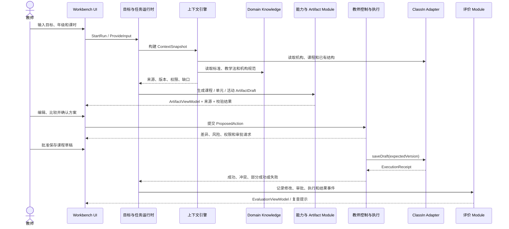
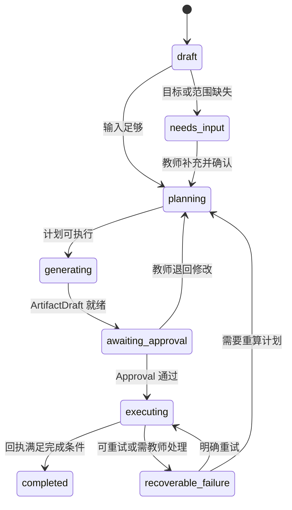
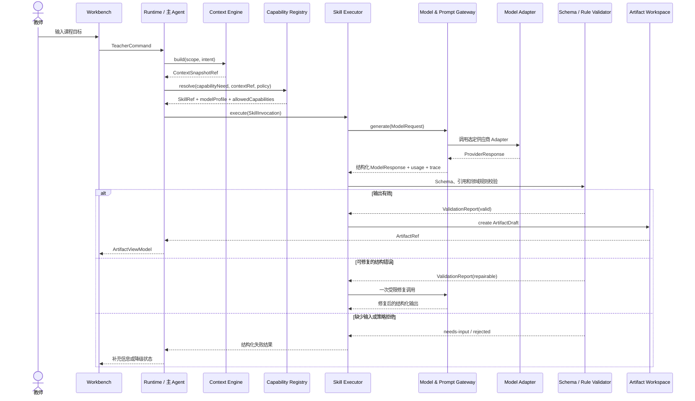
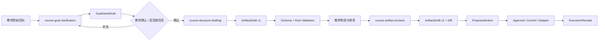

# 课程目标到课程对象六件套拆解

## 文档定位

本文把当前唯一纵向切片“课程目标 → 课程对象”拆成六份可以反复检查的架构材料：

1. 端到端纵向切片图；
2. 事实所有权矩阵；
3. Module / Interface / Adapter 清单；
4. 核心状态机；
5. 成功与失败场景矩阵；
6. 从 UI 点击到业务回执的代码追踪路径。

六件套之外，每一个功能还必须检查四类输入：产品逻辑、业务规则、Domain Knowledge、业务数据/API。四类输入不是四个串行模块，而是四种不同所有权的事实和约束来源；它们共同决定一个输出能否生成、如何展示、是否允许写回。

本文是当前架构实践基线，不把尚未实现的 Harness 能力写成事实。所有 ClassIn 对象、知识和执行结果均为固定、可重置的模拟数据。

## 0. 切片边界

| 项目 | 当前约定 |
| --- | --- |
| 教师目标 | 八年级英语四周叙事写作单元 |
| 第一版业务产物 | 可审教课程方案包，包含课程、单元、课时/活动结构、评价安排和资源建议 |
| 第二版扩展产物 | 从最终确认方案包派生的 PPT 课件 Artifact |
| WorkBuddy 拥有 | Run、计划、ContextSnapshot 引用、ArtifactDraft、ProposedAction、Approval、ExecutionReceipt、EvaluationEvent |
| ClassIn 拥有 | 教师身份、机构、课程、单元、活动、对象版本和正式发布状态 |
| Knowledge 拥有 | 课程标准、教学法、机构规范和量规版本 |
| 当前真值 | `simulated`；不连接真实 ClassIn API，不进行正式发布 |
| 第一版不包含 | 具体 PPT 文件生产、页面级视觉排版、多媒体素材制作、真实学生判断、消息外发、A2A 网络、第三方插件市场、跨天生产调度 |

第一版切片的完成标准不是“模型生成了文本”，而是教师能从目标输入走到一个经过多轮审教、最终确认、审批、模拟写回并带有稳定回执的可审教课程方案包；具体 PPT 课件属于第二版扩展。

## 1. 四类输入：每个功能都要过四道检查

### 1.1 四类输入的职责

| 输入维度 | 它回答什么问题 | 在本切片中的例子 | 所有者 | 典型版本化方式 |
| --- | --- | --- | --- | --- |
| 产品逻辑 | 教师如何完成任务，何时查看、修改、确认和恢复 | 先补目标，再看草稿，保存前看差异 | WorkBuddy 产品 / Runtime | Feature Spec、状态机、ViewModel |
| 业务规则 | 什么可以做、谁能做、对象如何合法变化 | 课程草稿权限、对象版本、机构课程设计要求 | ClassIn 领域 / 机构策略 | 领域规则、权限策略、对象状态机 |
| Domain Knowledge | 什么是好的课程设计、目标如何拆解 | 课程标准、叙事写作进阶、活动设计原则 | 教研 / 内容责任人 | 知识包、来源、版本、生效范围 |
| 业务数据/API | 当前真实对象和执行结果是什么 | 教师、机构、课程结构、对象 ID、版本、保存回执 | ClassIn 领域系统 | API Schema、事件、稳定 ID、版本 |

四类输入不能互相替代：

- 产品逻辑不能决定教师是否拥有某门课程；
- 业务规则不能替教师选择教学目标；
- Domain Knowledge 不能证明课程已经保存；
- 业务数据不能单独生成一套好的课程结构。

还要补充两个跨切片控制轴：

1. **教师意图与确认**：教师输入、修改和审批是控制信号，不应被模型推断替代；
2. **运行时信号**：工具结果、超时、权限变化和版本冲突是 Runtime 输入，但不是业务事实所有权。

### 1.2 四类输入到输出的矩阵

| 功能环节 | 产品逻辑 | 业务规则 | Domain Knowledge | 业务数据/API | 主要输出 |
| --- | --- | --- | --- | --- | --- |
| 目标澄清 | 缺口达到什么程度必须追问 | 哪些范围和约束是必填 | 什么是可观察的学习结果 | 教师、机构、课程范围 | `Intent`、`needs-input` 或可执行目标 |
| 上下文装配 | 默认使用范围和教师授权方式 | 角色、租户和对象权限 | 标准、教学法和机构规范 | 当前课程、已有结构、资料版本 | `ContextSnapshot` |
| 计划生成 | 展示哪些步骤和等待点 | 计划不能跳过的领域校验 | 单元进阶、活动顺序和课时方法 | 课时、已有对象和版本 | `Plan`、`WorkBuddyRun` |
| 课程草稿 | 草稿可编辑、可比较、可恢复 | 草稿与正式对象的状态边界 | 目标拆解和活动设计原则 | 现有课程结构、对象 ID 和版本 | `ArtifactDraft`、来源和校验结果 |
| 保存前校验 | 哪些风险必须展示和确认 | 权限、版本、幂等和写回条件 | 通常不再决定是否可写 | 目标对象当前版本和可写范围 | `ProposedAction`、`ApprovalRequest` |
| 模拟写回 | 成功、部分成功和失败如何反馈 | 写入顺序、冲突和部分失败语义 | 不应由知识库宣告保存成功 | 保存 API 和稳定回执 | `ExecutionReceipt` |
| 结果复查 | 什么叫本次任务完成、下一步是什么 | 业务状态是否真的满足完成条件 | 课程完整性和教学质量量规 | 教师修改、回执和后续使用事件 | `EvaluationEvent`、复查提示 |

## 2. 端到端纵向切片图

### 2.1 主链路



### 2.2 每一步的事实流

| 步骤 | 教师看到的内容 | 主要事实来源 | 状态拥有者 | 当前实现 |
| --- | --- | --- | --- | --- |
| 输入目标 | 目标、年级、课时 | 教师输入、模拟身份 | Run / 表单草稿 | UI 本地状态 |
| 形成计划 | 处理步骤和等待点 | Run、规则、知识 | Runtime | UI 定时器模拟 |
| 构建上下文 | 使用了哪些课程和资料 | Adapter、Knowledge | Context Engine | 尚未实现 |
| 生成草稿 | 课程结构、来源和缺口 | Artifact、知识、课程结构 | Capability / Artifact | UI 固定内容 |
| 审阅与编辑 | 可修改的方案和差异 | Artifact 版本 | Artifact Module | UI 展示，未持久化 |
| 保存前确认 | 对象范围、风险、版本 | ProposedAction、权限 | Control & Execution | UI 确认页 |
| 模拟写回 | 保存中、回执和异常 | ClassIn Adapter | Adapter / Receipt | Adapter 已有最小保存接口 |
| 结果复查 | 成功、部分成功和后续工作 | EvaluationEvent | Evaluation | 尚未实现 |

UI 可以先把状态演示出来，但只有拥有事实的 Module 才能宣告状态真实发生。例如“保存完成”必须来自 `ExecutionReceipt`，不能来自页面计时器结束。

## 3. 事实所有权矩阵

| 事实或对象 | 唯一所有者 | UI 能做什么 | 不能做什么 |
| --- | --- | --- | --- |
| 教师、机构、课程和对象权限 | ClassIn 领域 | 展示受授权的投影 | 自行推断或修改权限 |
| 课程、单元、活动的正式状态和版本 | ClassIn 领域 | 展示当前版本，提交草稿动作 | 把 AI 草稿直接当正式对象 |
| 教师原始目标、计划和 Run | WorkBuddy Runtime | 展示、补充、暂停、恢复 | 把模型私有历史当作 Run 事实 |
| ContextSnapshot | Context Engine | 展示来源、版本、授权和缺口 | 把未经授权的原文混入上下文 |
| ArtifactDraft | WorkBuddy Artifact Module | 编辑、比较、采纳和恢复版本 | 覆盖 ClassIn 正式对象 |
| 课程标准、教学法和机构规范 | Knowledge 系统 | 引用来源和适用范围 | 把建议冒充实时业务规则 |
| CapabilityManifest 和调用结果 | Capability Module | 展示能力状态和证据 | 直接依赖模型、MCP 或 SDK 私有事件 |
| ProposedAction / Approval | Control & Execution | 展示范围、风险、差异和审批 | 绕过审批直接写回 |
| ExecutionReceipt | Control / Adapter 协作 | 展示实际成功项、失败项和版本 | 依据模型自述判断保存成功 |
| EvaluationEvent | Evaluation Module | 展示采纳、修改、质量和复查 | 把一次生成自动算成教学效果 |

一个 Module 可以读取别人的事实，但不能因为读取了事实就取得所有权。

## 4. Module / Interface / Adapter 清单

### 4.1 运行时 Module

| Module | 小 Interface（目标形状） | 关键不变量 | 当前代码与下一步 |
| --- | --- | --- | --- |
| Workbench UI Projection | `open(runRef)`、`dispatch(command)` | 只消费稳定 Projection，不持有业务规则 | `src/features/ai-agent-workspace/ConversationRunSurface.tsx` 消费 `ConversationRun` 公开契约；页面阶段已退出主链 |
| Course Production Application | `create / confirm / execute / propose / approve / writeback` | 编排用例，不拥有 ClassIn 事实 | `workbuddy-courseware-controller.ts` 与 `workbuddy-package-controller.ts` 编排两条课程生产纵向闭环 |
| Domain State | 纯函数状态转换与校验 | 显式联合状态和不变量；不依赖 UI 或 Adapter | `src/domain/workbuddy/` 已拥有 Run、Context、Artifact、Action、Approval、Receipt 和 Evaluation 规则 |
| Contract | 稳定 DTO 与 Adapter Interface | 外部输入先校验；不泄漏供应商事件 | `src/contracts/workbuddy/` 定义 ConversationRun、写回、IM 和 TeacherIn 契约 |
| Context Engine | `propose / confirm / project` | 来源、版本、权限和缺口可追溯 | `core-context.ts` 生成冻结 Snapshot，并按 Capability Manifest 投影最小上下文 |
| Task Runtime | `open / dispatch / subscribe` | 计划、等待、重试和恢复集中管理 | `conversation-run-module.ts` 统一事件顺序、幂等命令、游标和 Presentation State |
| Capability / Artifact | Capability Manifest + versioned Artifact | 能力声明副作用；产物有来源、版本和校验结果 | M4.1 固定体验 Adapter 提供确定性能力事件与版本化课件/方案包 Artifact |
| Control & Execution | `prepare(action)`、`approve(action)`、`execute(action, approval)` | 所有副作用统一经过权限、风险、审批和幂等检查 | 单课件与方案包均已走 ProposedAction → Approval → Adapter → ExecutionReceipt |
| Evaluation | `recordExecutionOutcome(input)` | 记录教师采纳与执行结果，不代替业务事实或教学效果 | `src/domain/workbuddy/evaluation.ts` 已生成可追溯 EvaluationEvent，并进入课程生产与 IM Timeline |
| ClassIn Course Adapter | `execute(action, approval)` | 只负责领域事实和稳定回执，不拥有 Run、Artifact 或 Evaluation | `src/mocks/adapters/` 提供可重置成功、冲突、拒绝、部分成功与可恢复失败场景；生产 Adapter 未接入 |

### 4.2 Seam 与 Adapter

当前真正存在的课程写回 Seam 是 `ClassInWritebackAdapter` 与 `PackageWritebackAdapter`：

```ts
interface ClassInWritebackAdapter {
  execute(action: ProposedAction, approval: Approval): ExecutionReceipt;
}
```

它们位于 `src/contracts/workbuddy/`，由 `src/mocks/adapters/` 的确定性实现完成当前验证。未来增加真实 ClassIn Adapter 时，Controller 和页面仍只依赖这些 Interface。课程结构读取仍通过当前固定 Context 事实完成；在出现第二个真实实现前，不为假想供应商继续扩张 Interface。

## 5. 核心状态机

### 5.1 Run 状态



当前 `RunState` 已表达这组主要状态，但状态转换仍在 UI 中以 `setStage` 直接完成。下一步应把转换放入 Domain / Runtime Module，让页面只发送信号。

### 5.2 Action 与 Receipt 状态

| 对象 | 状态 | 进入条件 | 教师可见含义 |
| --- | --- | --- | --- |
| ProposedAction | `proposed` | 产物差异和目标对象已确定 | 等待查看范围和风险 |
| Approval | `pending` / `approved` / `rejected` | 教师完成审批 | 是否允许执行 |
| ExecutionReceipt | `saved` | 所有目标对象成功写回 | 可展示稳定对象 ID 和版本 |
| ExecutionReceipt | `conflict` | 目标版本已变化 | 先比较变化，不覆盖 |
| ExecutionReceipt | `permission-denied` | Adapter 拒绝当前范围 | 缩小范围或更换位置 |
| ExecutionReceipt | `partial` | 一部分对象成功 | 逐项显示，继续处理未完成项 |
| ExecutionReceipt | `recoverable-failure` | 临时错误或依赖不可用 | 保留草稿，允许重试 |

“保存中”是 Run / Action 的执行状态；“保存完成”必须是 Receipt 的结果，不能由 UI 动画推导。

## 6. 成功与失败场景矩阵

| 场景 | 入口条件 | 结果 | 恢复路径 | 当前原型 |
| --- | --- | --- | --- | --- |
| 默认成功 | 模拟租户正确，版本为 3 | 返回对象版本 4 的 `saved` 回执 | 进入完成并可继续完善 | UI 模拟；Adapter 已覆盖最小成功 |
| 目标缺口 | 没有可观察的学习结果或范围 | Run 停留 `needs-input` | 教师补充目标或取消 | 未实现，需从 UI 定时器移出 |
| 版本冲突 | `expectedVersion` 不等于 3 | `conflict`，不覆盖新版本 | 查看差异、重算或重新审批 | 评审模式可触发 |
| 权限拒绝 | 租户不是 `org-xinghe-001` | `permission-denied` | 缩小范围、切换课程或继续编辑 | 评审模式可触发 |
| 部分成功 | 课程结构成功，部分活动失败 | 每个对象独立 Receipt | 继续处理失败项，不汇报整体成功 | UI 可展示文案，Adapter 尚未返回此形状 |
| 临时失败 | 网络或依赖暂时不可用 | `recoverable-failure` | 保留 Artifact，明确重试 | UI 可触发，Adapter 尚未模拟 |
| 页面关闭 | Run 尚未完成 | Run 可通过稳定 ID 恢复 | 重新进入后继续等待或审批 | 未实现，当前状态在内存中 |
| 教师拒绝 | 教师不批准 ProposedAction | 不产生业务写入 | 修改 Artifact、保存为个人草稿或结束 | 未实现显式 Approval |

每一行都应最终有契约、测试和可见状态。只有成功路径被跑通，不能说明模块已经完成。

## 7. 代码追踪：保存课程方案

### 7.1 当前可运行路径

现在点击保存时，页面发送稳定命令并经过完整的受治理链路：

```text
ConversationRunSurface.dispatch({ type: "propose_action" })
  → WorkBuddy Courseware Controller 创建 ProposedAction
  → 教师 Approval
  → ClassInWritebackAdapter.execute(action, approval)
  → ExecutionReceipt
  → EvaluationModule.recordExecutionOutcome(...)
  → ConversationRun Projection 追加 Receipt 与 EvaluationEvent
```

对应代码在 `src/features/ai-agent-workspace/ConversationRunSurface.tsx`、`workbuddy-courseware-controller.ts`、`src/contracts/workbuddy/classin-writeback.ts` 和 `src/domain/workbuddy/evaluation.ts`。当前回执与评价事件均为固定模拟事实，证明 Demo 的契约和恢复路径成立，不证明生产 ClassIn 已接入。

### 7.2 目标代码路径

```text
教师点击保存
  → Workbench dispatch({ type: "propose-course-draft", runId })
  → Course Production Application 读取 ArtifactDraft 和 expectedVersion
  → Control & Execution.prepare(action)
  → 返回 ApprovalRequest
  → 教师批准
  → Control & Execution.commit(permit)
  → CourseDraftGateway.saveDraft(input)
  → MockClassIn / RealClassIn Adapter
  → CourseDraftReceipt / ExecutionReceipt
  → Runtime 推进 Run
  → Evaluation.record(events)
  → API 返回稳定 ViewModel
  → Workbench 投影 saved / conflict / partial / failure
```

当前 Adapter 的可验证行为在 [packages/adapters/mock-classin/src/index.ts](/Users/eeo/Documents/claudecode/classin-ai-buddy/packages/adapters/mock-classin/src/index.ts)：

- 租户不是 `org-xinghe-001` 时返回权限拒绝；
- `expectedVersion` 不是 `3` 时返回版本冲突；
- 条件满足时返回课程对象 ID 和版本 `4`。

因此，目前最有价值的下一条工程增量不是继续增加页面，而是把 `ConfirmView` 的本地转换替换成一次真实经过 Application → Control → Adapter 的调用，并把回执再投影回来。

## 8. 输出物的统一要求

四类输入最终要沉淀为不同类型的输出，不能都叫“模型结果”：

| 输出类型 | 作用 | 是否可以成为业务事实 | 必须携带 |
| --- | --- | --- | --- |
| `Intent` / `Plan` | 表达教师想完成什么、准备怎么完成 | 否，属于 WorkBuddy 任务事实 | 目标、范围、约束、缺口、确认状态 |
| `ContextSnapshot` | 表达本次使用了哪些事实和知识 | 否，是可追溯引用 | 来源、版本、权限、适用范围、过期信息 |
| `ArtifactDraft` | 表达可编辑的课程产物 | 否，仍是草稿 | 类型、版本、来源、差异、校验结果、真值标签 |
| `ProposedAction` / `Approval` | 表达准备对业务对象做什么以及是否获准 | 否，是待执行意图 | 目标对象、范围、风险、幂等、审批范围 |
| `ExecutionReceipt` | 表达业务系统实际做了什么 | 是执行证据，但不等同于教学效果 | 对象 ID、版本、逐项结果、失败原因、可撤销信息 |
| `EvaluationEvent` | 表达教师采纳、修改、质量和后续结果 | 是评价事件，不改写原始事实 | Run、Artifact、Approval、Receipt 引用和评价信号 |

所有输出都应带有 `truthLabel`、来源或事件引用。尤其要区分：模型生成的课程内容是推断，教师确认是控制事件，Adapter 回执是业务执行证据，Evaluation 是对过程和结果的观察。

## 9. 如何用六件套理解这个 Module

每次阅读或增加能力时，按下面顺序检查：

1. 教师究竟发出了什么意图？
2. 四类输入分别由谁提供，是否有版本和授权？
3. UI 展示的是谁拥有的事实？
4. 哪个 Module 接收意图并推进状态？
5. 哪个 Interface 是可替换的 Seam？
6. 哪一步会产生业务副作用，是否经过 Approval？
7. 失败时保留哪些事实，谁负责恢复？
8. 哪个事件能证明教师修改、审批和业务结果？

如果一个功能无法回答这八个问题，就还没有完成模块拆解。还要使用删除测试：删除某个 Module 后，如果复杂性立刻散落到多个页面和调用方，说明它正在提供真正的 Depth、Leverage 和 Locality。

## 10. 下一步实施顺序

1. 把 `Intent`、`Context`、`Artifact`、`Action`、`Evaluation` 加入稳定 Contracts。
2. 将 `RunState` 的状态转换和信号放进 Domain / Runtime，而不是由 React `setStage` 直接推进。
3. 在 Application 中实现“提出保存动作”和“提交批准动作”两个用例。
4. 扩展 `CourseDraftGateway` 到读取课程结构、幂等和逐项执行回执；只有出现真实第二个 Adapter 时再固定更完整的 Seam。
5. 在 API/BFF 组合真实依赖，Workbench 只消费 ViewModel 和发送 Command。
6. 用默认成功、目标缺口、冲突、权限拒绝、部分成功、可恢复失败和恢复场景验证同一条 Run。
7. 最后接入 Evaluation 事件，确认“生成完成”“保存成功”和“教师真正采纳”没有被混为一谈。

这六件套不是六份独立文档，而是同一条纵向切片的六个观察面；四类输入则是每个观察面都要经过的事实与约束检查。

## 11. Skill 在架构中的位置

### 11.1 Skill 是什么

Skill 是一个复用教育方法、任务步骤和结构化产出规则的深 Module。它把“怎样完成一类教学任务”的复杂性隐藏在小 Interface 后面，例如：

- 如何把模糊目标整理为可观察的学习结果；
- 如何依据课时、标准和已有课程结构拆分单元；
- 如何根据教师反馈修订 Artifact，并保留版本差异；
- 如何输出来源、假设、缺口和未满足约束。

Skill 不是以下对象：

| 容易混淆的对象 | 与 Skill 的区别 |
| --- | --- |
| Prompt | Prompt 只是 Skill Implementation 中可能使用的一份材料，不能表达完整输入、校验、错误和评价契约 |
| Model | Model 提供理解和生成能力，不拥有教学方法、业务事实或 Skill 生命周期 |
| Business Tool | Business Tool 读取或写入领域事实；Skill 不直接拥有课程、权限或正式状态 |
| Agent | Agent / Runtime 负责目标、计划、选择能力和推进状态；Skill 只完成一个有稳定输入输出的方法任务 |
| Domain Knowledge | Knowledge 是 Skill 使用的版本化内容来源；Skill 负责如何使用，不拥有标准原文 |
| Rule Validator | Validator 对业务不变量给出权威结果；Skill 可以解释规则，但不能替代领域校验 |

### 11.2 Skill 拥有与不拥有的内容

Skill 拥有：

- 任务目的、适用范围和明确非目标；
- 输入、输出和错误 Schema；
- 任务步骤与模型调用策略；
- Prompt 模板、示例和结构化输出要求；
- Domain Knowledge 的使用方式和引用要求；
- 输出校验、降级和修复策略；
- 质量、安全、成本和采纳评价契约。

Skill 不拥有：

- 教师身份、机构权限和课程当前版本；
- WorkBuddy Run 的持久状态和恢复；
- 真实 ClassIn 对象和业务执行回执；
- 模型供应商连接、限流、重试和计费；
- Approval、ExecutionPermit 或最终写回权限；
- 无治理的长期记忆。

## 12. Skill 的建议结构

### 12.1 CapabilityManifest

每个 Skill 首先作为一种 Capability 注册。Manifest 是 Runtime 选择和安全调用 Skill 的稳定 Interface：

| 字段 | 具体作用 |
| --- | --- |
| `id` / `version` / `owner` | 稳定身份、版本和责任人，支持审计与回放 |
| `kind` | 固定为 `skill`，避免与 AI Tool、Business Tool 或 Sub-agent 混淆 |
| `purpose` / `nonGoals` | 能完成什么，以及明确不做什么 |
| `inputSchema` / `outputSchema` | 进入和离开 Skill 的结构化契约 |
| `contextRequirements` | 必需的身份、业务事实、Artifact 和证据引用 |
| `knowledgeRequirements` | 必需的知识包类型、版本和适用范围 |
| `modelProfile` | 需要的模型能力，而不是供应商型号，例如结构化生成、长上下文或多模态 |
| `allowedCapabilities` | Skill 内部允许调用的只读 Tool；默认最小授权 |
| `sideEffectClass` | 本切片中的 Skill 应为 R0 只读或 R1 生成草稿，不能直接写业务系统 |
| `timeoutAndBudget` | 延迟、Token、费用和降级上限 |
| `evidenceBehavior` | 来源、引用、假设和不确定性如何进入输出 |
| `failureModes` | 缺少输入、结构错误、知识缺失、工具失败、超时和策略拒绝 |
| `evaluationContract` | Schema 通过率、教师采纳、修改量、规则错误、成本和延迟如何记录 |
| `truthLabel` | 当前为 `simulated`，不暗示真实 ClassIn 或生产模型已接入 |

### 12.2 目标代码组织

下面是目标形状，不表示当前仓库已经存在这些文件：

```text
packages/harness/src/skills/course-goal-clarification/
├── manifest.ts          # Skill 身份、能力要求、风险与评价契约
├── schemas.ts           # Input / Output / Error Schema
├── instructions.md      # 方法、约束、示例和 Prompt 材料
├── execute.ts           # Skill 的小 Interface 与执行编排
├── validate.ts          # 输出语义校验和引用完整性检查
└── scenarios.test.ts    # 正常、缺口、错误、降级和版本场景
```

文件结构不是对外 Interface。调用方只需要知道：

```ts
interface SkillExecutor {
  describe(skillRef: string): CapabilityManifest;
  execute<TInput, TOutput>(invocation: SkillInvocation<TInput>): Promise<SkillResult<TOutput>>;
}
```

`SkillInvocation` 只传稳定引用和本次允许范围，不传整段聊天历史、整个数据库对象或主 Agent 的全部权限。

### 12.3 Skill 输入与输出信封

```ts
interface SkillInvocation<TInput> {
  readonly skillRef: string;
  readonly runRef: string;
  readonly input: TInput;
  readonly contextSnapshotRef: string;
  readonly allowedCapabilityRefs: readonly string[];
  readonly budget: { readonly maxLatencyMs: number; readonly maxTokens: number };
}

type SkillResult<TOutput> =
  | {
      readonly status: "succeeded";
      readonly output: TOutput;
      readonly evidenceRefs: readonly string[];
      readonly assumptions: readonly string[];
      readonly warnings: readonly string[];
      readonly traceRef: string;
      readonly truthLabel: "simulated" | "integration-simulated" | "real";
    }
  | { readonly status: "needs-input"; readonly missing: readonly string[]; readonly traceRef: string }
  | { readonly status: "recoverable-failure"; readonly errorCode: string; readonly traceRef: string }
  | { readonly status: "rejected"; readonly policyReason: string; readonly traceRef: string };
```

Skill Result 不保存模型隐藏推理过程。对教师有用的是可审查的依据、假设、选择理由和未解决问题。

## 13. Agent 调用 Skill 与模型的完整链路

### 13.1 运行关系



核心关系是：

```text
Runtime 选择 Skill
→ Skill 组织方法、输入和输出要求
→ Model Gateway 选择并调用模型 Adapter
→ Validator 判断结果是否可进入 Artifact
→ Runtime 根据 SkillResult 推进 Run
```

主 Agent 不直接拼接供应商请求，Skill 不直接实例化模型 SDK，模型也不能直接推进 Run 或写入 ClassIn。

### 13.2 Model Gateway Interface

Skill 依赖结构化模型能力 Interface，而不是某个供应商：

```ts
interface ModelGateway {
  generate<TOutput>(request: ModelRequest<TOutput>): Promise<ModelResult<TOutput>>;
}

interface ModelRequest<TOutput> {
  readonly modelProfile: "structured-reasoning" | "fast-extraction" | "multimodal";
  readonly instructionsRef: string;
  readonly input: unknown;
  readonly contextRefs: readonly string[];
  readonly responseSchema: unknown;
  readonly allowedToolRefs: readonly string[];
  readonly budget: { readonly maxLatencyMs: number; readonly maxTokens: number };
  readonly trace: { readonly runRef: string; readonly skillRef: string; readonly skillVersion: string };
}
```

Model Adapter 隐藏供应商请求格式、认证、限流、模型版本、Token 计量、重试和响应解析。供应商切换不应改变 Skill 的输入输出 Schema，也不应改变 Workbench ViewModel。

### 13.3 模型输出进入系统前的处理

```text
Provider 原始响应
→ Model Adapter 标准化
→ responseSchema 解析
→ Skill 语义校验
→ 领域 Rule Validator 校验
→ 附加 evidenceRefs / assumptions / truthLabel / traceRef
→ 生成 ArtifactDraft 或 needs-input
```

模型返回 JSON 只代表“格式可能正确”，不代表业务有效。进入 Artifact 前至少要检查：

- 所有单元是否能追溯到目标或知识来源；
- 总课时是否满足输入约束；
- 是否引用了未授权资料；
- 是否把建议写成业务事实；
- 是否生成了超出 Skill 权限的 ProposedAction；
- 是否遗漏模型无法确定的假设和缺口。

## 14. 当前切片需要哪些 Skill

### 14.1 D1 最小 Skill 集合

| Skill | 作用 | 是否调用模型 | 主要输入 | 结构化输出 | 副作用 |
| --- | --- | --- | --- | --- | --- |
| `course-goal-clarification` | 把教师原始描述整理为目标、范围、成功标准和缺口 | 是；确定性必填检查应先于模型 | 原始目标、年级、课时、ContextSnapshot | `GoalIntentDraft` 或 `needs-input` | R1，仅生成 WorkBuddy 草稿 |
| `course-structure-drafting` | 把已确认目标拆成课程、单元和活动结构 | 是；D1 可先一次结构化生成 | 已确认 Intent、现有课程摘要、知识引用、约束 | `CourseStructureDraft`、来源、假设、警告 | R1，仅生成 ArtifactDraft |
| `course-artifact-revision` | 根据教师修改和校验结果生成新版本，并保留差异 | 是；只处理教师明确要求的范围 | 当前 Artifact、教师反馈、ValidationReport | 新 Artifact 版本、Diff、未解决警告 | R1，仅生成 ArtifactDraft |

首期不需要把“课程设计”包装成独立专业子 Agent。三个 Skill 由同一个主 Run 编排，已经足以验证方法复用、模型调用、Artifact 版本和教师控制。

### 14.2 不应该做成 Skill 的环节

| 环节 | 正确所有者 | 原因 |
| --- | --- | --- |
| 读取教师、课程和对象版本 | Context Engine + ClassIn Adapter | 这是业务事实，不是生成方法 |
| 判断教师是否有保存权限 | ClassIn 领域规则 / Control | 权限不能交给模型判断 |
| 检查 `expectedVersion` | Domain Adapter | 需要当前业务版本 |
| 推进 Run、暂停和恢复 | Runtime | Skill 不拥有任务生命周期 |
| 生成 ApprovalRequest | Control & Execution | 这是统一副作用控制入口 |
| 保存课程对象 | ClassIn Adapter | Skill 只能提出草稿或 ProposedAction |
| 宣告保存成功 | ExecutionReceipt | 模型或 Skill 自述不能成为执行事实 |
| 记录教师采纳和后续结果 | Evaluation Module | 评价需要跨调用和业务事件 |

### 14.3 三个 Skill 的输出衔接



这里 Skill 的终点是 `GoalIntentDraft` 或 `ArtifactDraft`，不是 `ExecutionReceipt`。这是模型生成链路和业务执行链路之间最重要的分界。

## 15. 一次课程结构 Skill 的具体模型调用

以 `course-structure-drafting` 为例：

### 15.1 输入

```text
CourseStructureDraftInput
  confirmedIntent
    learningGoal
    successCriteria[]
    grade
    totalLessons
  contextSnapshotRef
  existingCourseSummary
    courseId
    currentVersion
    existingUnits[]
  knowledgeRefs[]
    curriculumStandard
    pedagogyGuide
    organizationGuideline
  constraints[]
  requestedArtifactTypes = [course, unit, activity]
```

传给模型的是最小、授权、经过验证的投影，不是原始数据库记录，也不是整段聊天历史。

### 15.2 模型任务

模型只承担以下工作：

1. 理解已确认目标和成功标准；
2. 根据知识引用和课时约束形成单元进阶；
3. 为每个单元生成有限的活动候选；
4. 标出依据、假设、缺口和未满足约束；
5. 按 `CourseStructureDraftOutput` Schema 返回。

模型不承担权限判断、对象版本校验、Run 状态推进和保存动作。

### 15.3 输出

```text
CourseStructureDraftOutput
  title
  goalAlignment[]
  units[]
    title
    objectives[]
    lessonCount
    activities[]
    evidenceRefs[]
  totalLessons
  assumptions[]
  unmetConstraints[]
  warnings[]
```

Skill Executor 校验后，将有效输出包装成：

```text
ArtifactDraft
  artifactId
  artifactType = course-structure
  artifactVersion
  sourceSkillRef + sourceSkillVersion
  contextSnapshotRef
  content = CourseStructureDraftOutput
  evidenceRefs
  validationReport
  truthLabel = simulated
```

如果总课时不一致、来源不存在或内容违反领域规则，输出不能直接进入待审批状态。Skill 可以在预算内进行一次结构修复；仍失败则返回 `recoverable-failure` 或 `needs-input`，由 Runtime 决定下一步。

## 16. Skill 的评价与演进

一个 Skill 是否值得保留或升级，不能只看模型是否返回成功。当前切片至少记录：

| 指标 | 回答的问题 |
| --- | --- |
| Schema 首次通过率 | 模型输出能否稳定满足契约 |
| 知识引用覆盖率 | 重要结论是否有可追溯来源 |
| 规则校验通过率 | Skill 是否频繁违反确定性约束 |
| 教师采纳率 | Artifact 是否被教师接受或进入后续动作 |
| 教师修改量 | 哪些单元、活动和目标最常被重写 |
| 未解决缺口率 | Skill 是否在上下文不足时正确停止 |
| 延迟和 Token 成本 | 质量提升是否值得额外调用 |
| 错误与降级率 | 超时、结构修复和备用路径是否可靠 |
| ExecutionReceipt 关联率 | 被采纳 Artifact 是否真的进入业务草稿 |

只有当复杂课程设计形成独立目标、子计划、受限上下文、失败恢复和完成契约时，才考虑把多个 Skill 升级为专业子 Agent。仅仅因为一次任务调用了两次模型，不足以引入子 Agent。

通用的场景拆解、模块汇总和团队分工方法见：[WorkBuddy 系统理解与交付地图](./SYSTEM-UNDERSTANDING-AND-DELIVERY-MAP.md)。
