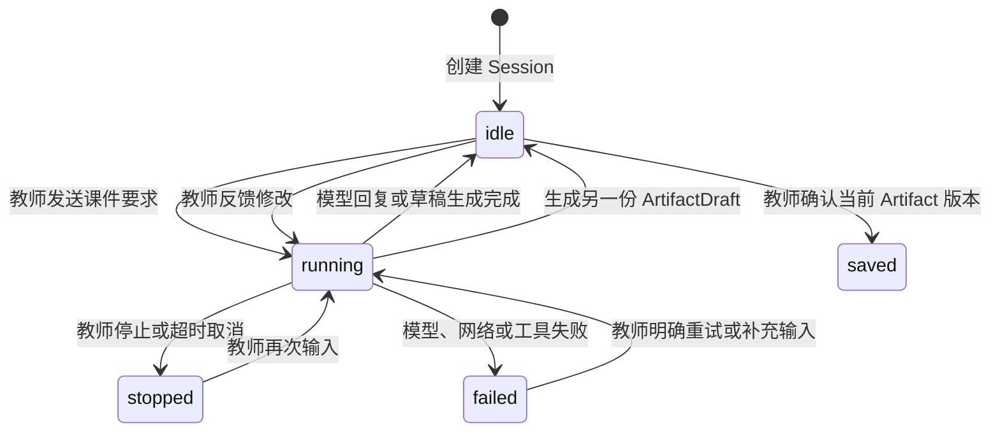

# TeachBuddy 课件生成 Version 1 基线

## 1. 文档定位

本文记录 TeachBuddy 当前第一版真实课件生成链路，作为后续持续迭代的比较基线。这里的 **Version 1** 专指 2026-09-05 已接入 DeepSeek Harness 的课件生成方式，不等同于仓库历史文档中的 WorkBuddy V1 页面规划或早期确定性课程生产 Demo。

用户将当前能力水平定位为 **20 分**，希望经过持续迭代达到 **75 分**。这两个分数是阶段性成熟度坐标：20 分表示当前已经跑通最小生成闭环，75 分表示未来希望达到稳定、可评价、适配真实教学需求的可用水平。它们不是经过量表测量得到的教学质量得分，也不是对某一模型的 Benchmark 结论。

本文锁定当前事实与版本命名，不提前锁定 Version 2 的技术方案。后续每次迭代都应记录触发问题、改动 Module、评价方法、证据和相对 V1 的实际提升。

## 2. V1 的一句话定义

> 教师用自然语言说明课件要求；通用教学 Persona 和会话历史组成模型输入；模型直接生成完整 HTML / CSS 并调用唯一允许的 `create_teaching_draft` 工具；工具校验并持久化草稿；文件自动进入当前 Session 的“我的文件”；教师预览后可以反馈重做，或确认当前版本并取得本地保存回执。

V1 的生成方法是 **Prompt 驱动的单 Agent 模型生成 + 一个受控落稿工具**。当前没有串联课件分析 Skill、教学设计 Skill、视觉设计 Skill、质量检查 Skill，也没有课件专用的结构化 Workflow。

## 3. 事实边界

| 事项 | V1 当前事实 | 不能据此宣称 |
| --- | --- | --- |
| 输入 | 教师主动用自然语言提供学段、学科、主题、课时、页数、格式及内容要求 | 已自动读取真实课程、学生或机构数据 |
| 生成 | 模型根据 Persona、会话历史、教师要求和工具 Schema 直接生成内容 | 已按固定教学方法分阶段规划和校验 |
| 文件 | 支持 Markdown、HTML、TXT、JSON；本场景使用自包含 HTML | 已生成真正的 PPTX、PDF、图片或视频课件 |
| Tool | `create_teaching_draft` 校验并可靠保存模型提交的完整内容 | Tool 自己完成教学设计、排版或质量优化 |
| Skill | DeepSeek Harness 上游具备 Skill 扩展能力 | 当前课件链路已经调用课件专用 Skill |
| 审阅 | 教师可以预览产物、在对话中反馈并再次生成 | 系统已经自动评价知识正确性、教学适配性或视觉质量 |
| 保存 | 教师确认当前 Artifact 版本后产生本地 Approval 与 Receipt | 已发布到 ClassIn 课程、Space 或 TeacherIn |
| 恢复 | Session、命令状态、Artifact 和文件可在刷新及正常服务重启后恢复 | 已具备生产多租户、跨设备云同步或跨天 Durable Workflow |

## 4. 操作链路

```mermaid
flowchart LR
    T[教师自然语言要求] --> U[TeachBuddy 工作台]
    U --> A[AgentRuntimeAdapter]
    A --> B[TeachBuddy 本机 BFF]
    B --> H[DeepSeek Harness]
    H --> P[Persona + 会话历史 + Tool Schema]
    P --> L[Agent Loop]
    L --> M[LLM 直接生成完整课件内容]
    M -->|Tool Call| G[Tool Registry + Guard]
    G --> D[create_teaching_draft]
    D --> R[ArtifactDraft]
    R --> F[SessionFileLibrary 自动入库]
    F --> V[预览与下载]
    V -->|反馈修改| T
    V -->|确认当前版本| C[本地 Approval + Receipt]
```



这条链中，模型拥有“如何组织这一份内容”的生成责任；工具拥有“这次调用能否安全、幂等地形成草稿”的执行责任；TeachBuddy 拥有产品会话、Artifact、文件和本地审批语义。模型说“完成了”不能替代工具结果或业务回执。

## 5. 模块与关键 Feature

### 5.1 教师任务输入 Module

**作用**：把教师的自然语言意图送入一个稳定 Session，并持续显示运行状态。

三个关键 Feature：

1. 教师可以说明学段、学科、主题、课时、页数、教学目标、练习和答案等要求；
2. 同一个 Session 保留后续补充和修改意见，模型可读取前文；
3. 每次发送携带稳定 `commandId`，避免网络重试重复执行同一条教师命令。

当前输入是开放文本，没有课件专用字段表、必填字段规则或完整性评分。Persona 只要求模型在信息不足时用自然语言追问，是否追问以及追问哪些内容仍由模型判断。

### 5.2 Prompt 与上下文装配 Module

**作用**：向模型提供教学身份、教师对话、历史消息和当前可用工具说明。

三个关键 Feature：

1. Persona 将 Agent 定义为 ClassIn TeachBuddy，并要求使用教师所用语言；
2. 会话历史让模型继承教师已经说明的目标和约束；
3. Tool Schema 告诉模型何时以及如何提交教学 Artifact。

V1 的 Prompt 是通用教学 Persona，不包含课件专用的逐步方法。例如它没有强制执行“目标分析 → 内容结构 → 页面脚本 → 视觉系统 → 练习设计 → 最终检查”。因此当前产物很大程度上依赖模型自身已有能力和教师 Prompt 的清晰程度。

### 5.3 Agent Loop 与模型生成 Module

**作用**：接收输入、调用模型、执行工具，并在工具结果需要模型继续处理时进入下一 Step。

三个关键 Feature：

1. 一个 Turn 可以包含一个或多个模型 Step；
2. 模型直接生成课件正文、HTML 结构和 CSS 样式；
3. 模型决定何时调用教学草稿工具，工具结果返回后由 Agent Loop 决定继续或结束。

当前不存在独立的课件规划对象。即使模型在内部先思考页面结构，TeachBuddy 也没有稳定的 `CoursewarePlan` Interface、可审阅计划、逐页生成状态或计划一致性检查。页面上看到的一次成功 HTML，主要是一次模型生成结果，不是多个专业 Module 协作的证据。

### 5.4 Tool Registry、Guard 与教学草稿 Tool

**作用**：约束模型可执行的能力，并把模型已经生成的完整内容可靠落盘。

三个关键 Feature：

1. 全局 Guard 只允许 `create_teaching_draft`，拒绝其他工具名；
2. Tool 校验标题、完整内容、格式、无路径文件名、内容长度和 Session ID；
3. 以 Session ID 和 Call ID 持久化，重复的相同调用幂等成功，不同内容不能覆盖同一调用标识。

Tool 支持 `markdown`、`html`、`text` 和 `json`。HTML 由模型作为完整字符串传入；Tool 不编写页面、不理解教学结构、不渲染 PPTX，也不评价产物质量。

### 5.5 Artifact 与 Session 文件库 Module

**作用**：把工具草稿转换成教师可持续访问的用户文件。

三个关键 Feature：

1. Artifact 生成后自动物化到当前 Product Profile 和 Session 的独立目录；
2. “我的文件”按来源 Session 分组，提供预览、下载和返回原对话；
3. HTML 在受限预览环境中打开，不授予脚本、任意网络或产品同源权限。

自动入库发生在教师 Approval 之前，表示系统已经拥有一份可查看的生成结果。它不等于教师已经采纳，也不等于内容已经发布。

### 5.6 教师审阅与本地保存 Module

**作用**：让教师决定继续修改还是确认当前 Artifact 版本。

三个关键 Feature：

1. 教师人工检查内容、结构、练习、答案和页面可读性；
2. 修改意见作为同一个 Session 中的新一轮自然语言输入，再由模型生成另一份草稿；
3. 教师确认当前 `artifactId + version` 后，BFF 持久化本地 ProposedAction、Approval 和 Receipt。

V1 的修改机制是“反馈后重新生成一份草稿”，没有确定的局部页面编辑、原文件自动升版或语义 Diff。当前本地 Receipt 只证明批准版本已保存，不证明教学质量或 ClassIn 发布成功。

### 5.7 Session、状态与恢复 Module

**作用**：让任务执行可以被观察、停止、对账和恢复。

三个关键 Feature：

1. DeepSeek Harness Session 日志记录输入、模型输出和工具调用事实；
2. BFF 将官方事件投影成 TeachBuddy 的 `ConversationRunEvent`，并持久化 scope、命令和取消意图；
3. 系统处理重复命令、结果未知、停止、10 分钟超时、刷新恢复和正常进程重启恢复。

该 Module 保障一次生成链路不会因为页面刷新就完全丢失，但它不构成生产级任务队列、账号授权、跨设备同步或跨天可靠工作流。

## 6. V1 输入与输出契约

### 6.1 教师输入

V1 没有强制表单 Schema。为了获得相对可用的课件，推荐教师至少说明：

| 输入维度 | 示例 | 当前处理方式 |
| --- | --- | --- |
| 教学对象 | 初二英语学生 | 作为自然语言进入模型上下文 |
| 主题范围 | 一般过去时 | 作为生成主题，不经过课程数据校验 |
| 课时约束 | 40 分钟 | 模型自行映射到页面和活动安排 |
| 课件规模 | 8 页 | 模型自行遵守，没有页数校验器 |
| 教学目标 | 理解结构并能完成句型转换 | 模型自行组织内容覆盖 |
| 练习要求 | 包含课堂练习与答案 | 模型自行设计和核对 |
| 输出格式 | 自包含 HTML | Persona 与 Tool Schema 共同约束 |
| 视觉偏好 | 适合投屏、减少长段文字 | 模型自行落实，没有视觉规则引擎 |

缺少字段时，模型可能追问，也可能根据已有信息直接生成。V1 没有把“输入是否充分”变成确定性业务规则。

### 6.2 Tool 输入

模型调用教学草稿 Tool 时提交：

```json
{
  "title": "一般过去时课件",
  "content": "<完整、自包含的 HTML 内容>",
  "format": "html",
  "fileName": "一般过去时课件.html"
}
```

`title` 和 `content` 必填；`format` 与 `fileName` 可选。HTML 不得依赖脚本或外部网络资源，这是 Persona 对模型的生成约束；Tool 主要校验参数形状、格式、文件名和长度，不承担完整 HTML 安全审计或教学质量校验。

### 6.3 生成输出

Tool 成功后返回 `RuntimeArtifact` 所需的核心事实：

- 稳定 Artifact ID；
- 标题、完整内容和文件名；
- 格式、MIME、字节数；
- `version: 1` 与 `status: draft`；
- 来源 Call ID（当安全 Artifact ID 与原 Call ID 不同时保留）。

文件库再生成稳定 `fileRef`，页面不接触本机文件路径。

## 7. 状态和反馈闭环



`saved` 在当前实现中是 Artifact 治理状态，不是 Runtime Session 的独立状态。图中将它画成教师闭环的结果，便于解释业务语义。

教师反馈目前没有被解析成结构化评价事件。它同时承担两个作用：向模型说明下一版要怎样改，以及向团队暴露 V1 的不足。后续应区分“修改指令”和“质量评价”，否则无法稳定比较不同版本的方法效果。

## 8. 失败与恢复语义

| 情况 | V1 行为 | 不允许的推断 |
| --- | --- | --- |
| 未配置模型凭据 | 工作台显示未配置并禁用执行 | 静默切换到模拟模型 |
| Harness 离线 | 显示离线，允许重新连接 | 把旧快照当作新执行结果 |
| 相同 commandId 重试 | 复用原命令事实，不重复发送 | 因前端超时而盲目再执行 |
| 发送结果未知 | 标记无法确认，先读取历史对账 | 等待一段时间后推断成功 |
| 任务运行过久 | 10 分钟请求停止，保留已有内容 | 把停止等同于没有生成任何文件 |
| Tool 参数非法 | Tool 失败，不产生成功草稿 | 从模型文字中推断文件已经保存 |
| Artifact 版本变化 | 拒绝批准旧版本 | 保存未经重新审阅的新内容 |
| 一个本地索引项损坏 | 尽量保留其他有效文件 | 因一个坏条目删除全部文件 |

## 9. 为什么当前定位为 20 分

20 分不是说链路没有价值。V1 已经证明以下基础成立：

- 教师可以用自然语言启动真实模型任务；
- Agent Loop 可以调用受控教学 Tool；
- 生成内容可以成为持久 Artifact 和用户文件；
- 教师可以预览、反馈、停止、恢复和确认保存；
- 命令、会话和文件具备基本幂等与隔离语义。

它距离稳定可用的高质量课件生产仍有明显差距：

- 没有显式、可审阅的教学设计方法；
- 没有课件专用 Skill、规划 Interface 或分阶段生成；
- 没有对事实正确性、目标覆盖、难度、页数、练习答案和视觉质量的自动评价；
- 教师反馈还是自然语言，无法形成可比较的质量数据；
- 产物目前是 HTML 文本文件，不是完整 PPTX 与多媒体生产能力；
- 没有真实业务数据和 ClassIn 生产发布；
- 没有通过真实业务样本证明稳定性、质量提升或教师节省时间。

因此，20 分更准确地表达为：**最小工程闭环已经跑通，专业课件生产方法和质量体系还处于起点。**

## 10. 75 分目标的含义

75 分是演进方向，不是本文件直接批准的实现范围。达到这一水平至少应有以下可验证特征：

| 能力维度 | 75 分期望状态 | 必须取得的证据 |
| --- | --- | --- |
| 需求理解 | 能稳定识别缺失信息，保留教师约束并减少无效追问 | 真实课件任务集上的需求满足率 |
| 教学设计 | 有明确、可解释的课件设计方法，适配学科、学段和课型 | 教研量规与教师审阅结果 |
| 结构与生成 | 页面结构先于最终渲染，可局部修改并保持全局一致 | 结构契约、局部重生成和版本对比 |
| 视觉与媒介 | 投屏可读、版式稳定，按需支持可信图片、图表和 PPTX | 视觉验收、导出检查和版权/来源记录 |
| 质量评价 | 自动检查只负责可定义的规则，教师评价负责专业判断 | 固定评价集、人工校准和回归报告 |
| 反馈学习 | 修改指令与评价分离，能解释哪些方法确实减少返工 | 教师修改量、采纳率和任务完成时间 |
| 业务适配 | 需要时接入授权业务 Context 与 ClassIn 草稿动作 | 权限、版本、幂等和正式 Receipt |
| 运行保障 | 基础设施由实际负载和失败场景驱动，具备足够恢复能力 | 可复现的可靠性、时延与成本指标 |

75 分不要求系统消灭教师审阅，也不意味着所有课件都由多个 Agent 完成。它表示系统在明确的业务范围内，能够稳定地产出大部分可用内容，教师主要做专业取舍和定向修改，而不是从头重做。

## 11. V1 到后续版本的迭代原则

1. **先观察实际产物与反馈**：以真实课件任务暴露问题，不从上游能力清单倒推需求；
2. **先定义问题，再选择机制**：Prompt、结构化生成、Skill、Tool、专业 Agent 或基础设施分别解决不同问题；
3. **一个改动对应一项可评价结果**：例如页数遵守率、目标覆盖率、教师修改量或渲染稳定性；
4. **保持现有 Seam**：页面继续依赖 `AgentRuntimeAdapter`，文件继续依赖 `SessionFileLibrary`，供应商事件不进入产品 Domain；
5. **只有真实变化点才新建 Interface**：没有第二种实现或独立责任时，不提前拆出空壳 Module；
6. **保留教师控制**：自动评价不能取代教师采纳，工具成功不能冒充业务发布；
7. **版本可比较、可回退**：保留 V1 Prompt、配置、工具契约和固定任务样本，避免迭代后失去基准。

## 12. 后续版本记录模板

每次形成 Version 1.x 或 Version 2 时，至少记录：

| 字段 | 说明 |
| --- | --- |
| 触发问题 | 哪个真实课件案例暴露了什么不足 |
| 证据 | 原始输入、V1 产物、教师反馈和失败状态 |
| 改动位置 | Prompt、Module、Interface、Adapter、Tool、Skill、模型或基础设施 |
| 明确不改 | 防止一次迭代无边界扩大 |
| 评价方法 | 固定任务、量规、人工复核、性能或成本指标 |
| 相对 V1 结果 | 改善、无变化、退化及其证据 |
| 风险与回退 | 兼容性、数据、权限、质量和恢复路径 |
| 决策状态 | Experiment、Recommendation、Accepted 或 Locked |

## 13. 源码与材料索引

- [课件生成 V2 内容优先实施计划](./COURSEWARE-GENERATION-V2-IMPLEMENTATION-PLAN.md)
- [DeepSeek Harness 总体实现结构盘点](./HARNESS-STRUCTURE-INVENTORY-2026-09-05.md)
- [DeepSeek Harness 接入边界](./DEEPSEEK-HARNESS-INTEGRATION.md)
- [TeachBuddy Agent Runtime Spec](../04-specs/features/teachbuddy-agent-runtime/README.md)
- [TeachBuddy Session 文件库 Spec](../04-specs/features/teachbuddy-session-files/FEATURE-SPEC.md)
- [课件生产架构演示页](../../prototype/architecture/deepseek-harness-overview.html)
- Persona：`runtime/harness/presets/teachbuddy/agent.cordis.yml`
- Harness 配置：`runtime/harness/cordis.patch.yml`
- 教学草稿 Tool：`runtime/harness/teaching-tools.mjs`
- Runtime Interface：`src/contracts/workbuddy/agent-runtime.ts`
- BFF 与本地 Approval：`server/teachbuddy-runtime.ts`
- 事件投影：`server/harness-event-projection.ts`
- 文件 Interface 与实现：`src/contracts/workbuddy/session-files.ts`、`server/session-file-library.ts`

## 14. 版本记录

| 版本 | 日期 | 说明 |
| --- | --- | --- |
| Version 1 | 2026-09-05 | 用户确认当前 Prompt 驱动、单 Agent、单 Tool 的 HTML 课件生成方式为最初期基线；当前成熟度参考为 20 分，持续迭代目标参考为 75 分 |
