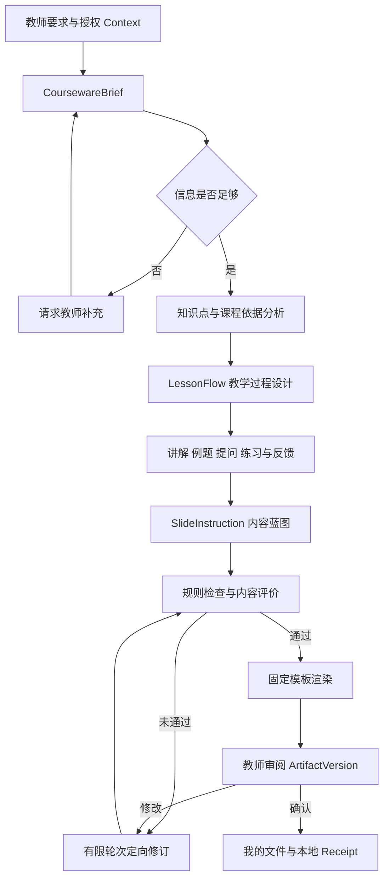
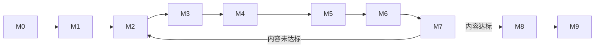

# TeachBuddy 课件生成 V2 内容优先实施计划

## 1. 文档定位

本文承接 [TeachBuddy 课件生成 Version 1 基线](./COURSEWARE-GENERATION-V1-BASELINE.md) 与 [TeachBuddy LUI 调研](../../prototype/lui/LUI-DISCUSSION-AND-RESEARCH.md)，记录用户在 2026-09-05 确认的下一阶段共识、实施顺序和里程碑。

本计划只批准分阶段研究、规格与纵向切片，不表示所有技术方案已经锁定。每个里程碑通过自身 Gate 后，才能进入下一阶段；未通过时优先回到内容、证据和评价问题，不用视觉包装掩盖教学质量缺口。

## 2. 核心共识

### 2.1 产品对象

TeachBuddy 要生产的核心不是一个排版漂亮的 PPT 文件，而是：

> 一套符合教学目标、学科规律、学生认知水平和正式课堂约束的教学方案；PPT / HTML 只是该方案的一种表达与交付载体。

因此必须区分：

1. **教学内容结构**：知识关系、前置知识、重难点、常见误区、讲解顺序、例题、提问、练习、反馈和课堂闭环；
2. **视觉表达结构**：页面类型、版式、字体、配色、图示、动效和导出质量。

从当前约 20-30 分推进到 60-70 分，主要依赖第一类能力。视觉与 PPTX 工程先保持最低可用，待内容内核通过 Gate 后再进入系统性优化。

### 2.2 初始业务范围

- 学科：数学；
- 学段与年级：中国公立小学三年级；
- 使用场景：教师正式课堂授课，不以兴趣课、培训机构专题课或纯自学材料作为首条样板；
- 课堂约束：以实际公立校单课时为准，初始研究可用 40 分钟作为工作假设；
- 产物：结构化教学内容、页面级教学指令、质量报告和一个可预览课件；
- 教材版本、上下册、课题与课时：`OPEN`，在 M0 由用户确认。推荐首个候选为人教版小学数学三年级上册《分数的初步认识》第一课时，但当前不把推荐写成既定事实。

### 2.3 架构策略

- 第一阶段采用 **Skill 规定方法 + 有状态 Tool 约束顺序 + Harness 统一运行 + LUI 投影真实事件**；
- 不立即建设自由协作的多 Agent 群；
- 不从零重写所有能力。各阶段先研究和运行成熟案例，以 Adapter、Sidecar 或受控移植方式验证；
- 优先借鉴教学内容组织、知识表示、题目生成和质量评价方法；PPTAgent、Presenton 等演示文稿系统放在表达层阶段；
- 后续只有在固定任务集证明某一阶段存在稳定瓶颈时，才把该阶段替换为专业 Agent；前端协议与产物模型保持不变。

## 3. 目标与非目标

### 3.1 本阶段目标

1. 建立一个可复现的三年级数学正式课堂课件样板；
2. 把教师自然语言稳定转成结构化教学方案，而不是直接跳到完整 HTML；
3. 建立 Education Knowledge Pack、Instructional Rules 与 Courseware Skill 的分工；
4. 建立内容优先的评价量规、固定任务集和版本对比；
5. 让 Harness 产生真实、可恢复、可投影的阶段事件和中间 Artifact；
6. 让 LUI 展示需求分析、教学规划、内容生成、质量检查、版本与教师审阅；
7. 在内容达到 60-70 分 Gate 后，验证 PPTAgent / Presenton 等表达层能力是否带来额外收益。

### 3.2 明确不做

- 不在首条样板中覆盖所有年级、教材版本、学科和课型；
- 不把整本教材、教师用书或无授权题库复制进仓库；
- 不用模型自评直接替代教研人员或教师评价；
- 不把更漂亮的版式解释为教学质量提升；
- 不先建设多 Agent 平台、通用工作流平台或新的模型 Runtime；
- 不改变现有 `AgentRuntimeAdapter`、`SessionFileLibrary`、Approval、Receipt 和 Product Profile 隔离边界；
- 不在本阶段接入真实 ClassIn 业务 API、生产发布或学生个人敏感数据。

## 4. 能力模型

### 4.1 三类核心资产

| 资产 | 回答的问题 | 首版内容 | 所有权 |
| --- | --- | --- | --- |
| Education Knowledge Pack | 应该教什么、学生可能怎样理解或误解 | 课程标准摘录、知识关系、前置知识、典型例题、常见误区、术语和来源 | Domain Knowledge Module |
| Instructional Rules | 什么样才算合格 | 目标对齐、难度递进、课堂时长、讲练比例、提问与反馈、题目可解性、内容安全 | Business Rule / Policy Module |
| Courseware Skill | 应该怎样完成 | 需求补全、知识分析、教学设计、内容生产、检查和修订步骤 | Harness Skill / Method Module |

Knowledge Pack 必须记录来源、版本、适用教材、适用范围与未知边界。Rule 应尽量结构化并可被确定性检查。Skill 引用 Knowledge 与 Rule，但不拥有长期业务事实、运行状态或文件保存。

### 4.2 稳定中间产物

V2 首条切片拟建立以下领域对象，具体字段在 M3 Feature Spec 中锁定：

```text
CoursewareBrief
  -> KnowledgePointMap
  -> LearningObjective[]
  -> LessonFlow
  -> ExplanationSpec[]
  -> QuestionSpec[]
  -> SlideInstruction[]
  -> ContentQualityReport
  -> CoursewareArtifactVersion
```

`SlideInstruction` 是教学内容内核与页面渲染之间的主要 Seam。它至少需要表达本页学习目的、知识点、教学策略、教师讲解、学生动作、示例、问题、常见误区和预期结果；它不直接规定像素级布局。

### 4.3 目标运行链路



## 5. 质量评价基线

### 5.1 分数解释

当前 20-30、60-70、75-80 均是产品成熟度参考区间。M1 完成前，不把这些数字宣称为已经测量的教学质量分数。M1 后使用固定任务、同一量规和人工复核形成可比较得分。

### 5.2 初始 Rubric v0.1

| 维度 | 初始权重 | 主要问题 |
| --- | ---: | --- |
| 知识与题目正确性 | 25 | 概念、计算、例题、答案和解析是否正确 |
| 教学目标对齐 | 20 | 内容和活动是否服务本课可观察目标 |
| 认知与难度递进 | 15 | 是否尊重前置知识并从具体到抽象、从理解到应用 |
| 讲解、示例与反例质量 | 15 | 是否帮助三年级学生建立概念并处理误区 |
| 课堂活动与反馈 | 15 | 是否有有效提问、学生动作、练习和即时反馈 |
| 完整性与时间可执行性 | 10 | 是否形成一节正式课堂可完成的闭环 |

首阶段视觉只设合格门槛：可读、无溢出、信息密度适合投屏、图文不产生错误暗示。Rubric 权重必须经过至少一轮教师或教研人员试评后再锁定。

### 5.3 60-70 分 Gate

进入表达层系统优化前，至少满足：

- 固定任务集中的知识和答案无阻断级错误；
- 结构化中间产物可以解释最终每页内容的教学目的；
- 人工评价证明内容较 V1 有稳定提升，不只是个别样例变好；
- 教师主要做定向修改，而不是推翻后从头重写；
- 同一输入可复现运行阶段、质量报告和 Artifact 版本；
- 固定模板下已经达到课堂投屏的最低可用标准。

## 6. 开源借鉴与引入规则

### 6.1 借鉴优先级

1. 教学设计、Lesson Plan、课程知识表示；
2. 数学题目生成、答案验证和常见错误诊断；
3. 教育评价 Rubric、Benchmark 与教师反馈方法；
4. 结构化内容生成与受控修订；
5. 演示文稿规划、模板、渲染和视觉评价；
6. Generative UI、Human-in-the-loop 和运行事件表达。

### 6.2 引入状态

所有外部方案必须标记为以下之一：

| 状态 | 含义 |
| --- | --- |
| `REFERENCE_ONLY` | 只借鉴方法、Schema 或评价维度 |
| `SPIKE_ADAPTER` | 通过 CLI、API、MCP 或 Sidecar 隔离试跑 |
| `ADOPTED` | 通过质量、许可证、安全和维护 Gate 后成为正式依赖 |
| `REJECTED_WITH_EVIDENCE` | 记录不采用原因和测试证据 |

禁止在未核对许可证、依赖、数据去向、模型调用、维护活跃度和产物质量前，把第三方仓库整包并入主工程。

### 6.3 当前候选的位置

- PPTAgent / DeepPresenter：`REFERENCE_ONLY`，先借鉴页面功能类型、内容 Schema、渲染后评价和修订方法；达到内容 Gate 后再考虑 `SPIKE_ADAPTER`；
- Presenton：`REFERENCE_ONLY`，作为后期模板化 PPTX 输出与编辑能力候选；
- assistant-ui / CopilotKit：`REFERENCE_ONLY`，借鉴 Tool、Activity、Artifact 与 Human-in-the-loop 交互；不替换现有 ClassIn Shell 与 TeachBuddy Runtime Contract；
- 教育领域项目与数据集：在 M0 先导调研中逐项标记来源、许可证和适用性；M1 以后只验证通过 M0 Gate 的候选，不以 GitHub Star 直接代表教学有效性。

## 7. 里程碑路线

### M0：首条样板基础资料建设

**状态**：`COMPLETE_USER_REVIEWED_100_PERCENT`。M0-A 至 M0-J 的四类 Gate 已全部关闭；用户于 2026-09-06 完成 M0-C-02 Review，并授权后续 M0 Review 默认通过。正式同版教师用书缺口保持 `LIMITED_SOURCE`，第三方教材/平台资源许可缺口保持 `UNKNOWN_BLOCKED`。M1 已直接消费 [M0 Readiness Report](../04-specs/features/courseware-v2-grade3-math/M0-READINESS-REPORT.md)完成首轮基线，未从历史聊天补猜。详见 [M0 基础资料建设地图](../04-specs/features/courseware-v2-grade3-math/M0-FOUNDATION-MATERIAL-MAP.md)。

**目标**：把“三年级数学正式课堂”收窄到可复现的一节课，并建立后续生成可直接消费的可信内容基础。

**产物**：

- 教材版本、上下册、单元、课题、课时和课堂时长；
- 课程标准证据、教材内容地图和教师用书编写意图；
- 学生认知与误区、优秀课例模式、题目与评价蓝图；
- 首个样板班级的脱敏画像、素材清单及授权边界；
- M0 Readiness Report、明确非目标和未关闭事项。

**完成 Gate**：十个资料子里程碑全部关闭并通过用户 Review；任何参与者都能追溯“为谁、依据什么、教什么、怎样组织、如何检查、哪些材料可用”，不需要从历史聊天补猜事实。

### M1：固定任务、评价与 V1 基线

**状态**：`COMPLETE_USER_AUTHORIZED`。8 个固定 Case、Rubric v0.1、真实 V1 Session/Artifact/失败快照、Agent 试评与 1440×900 检查已完成。3/4 生成型 Case 成功，1/4 超时停止；4/4 澄清型 Case 停在无 Artifact 状态，但 0/4 完全满足最少追问与事实准确。两个产物包含阻断数学图形错误，三个产物均未通过视觉 Gate。用户授权 M1 过程 Review 默认确认并在最终交付后统一复审，M1 Gate 据此关闭；详见 [M1 V1 Baseline Report](../04-specs/features/courseware-v2-grade3-math/M1-V1-BASELINE-REPORT.md)。M2 已解锁但尚未启动。

**目标**：先建立比较依据，再修改生成方法。

**产物**：

- 5-8 个首轮固定任务，覆盖完整输入、缺失输入和冲突输入；
- Rubric v0.1、评分说明和至少一轮试评记录；
- 当前 Harness V1 的输入、输出、失败和人工评分快照。

**完成 Gate**：评价者能够用同一量规解释 V1 的主要失分点，并区分内容问题与视觉问题。

### M2：三年级数学 Knowledge Pack 与 Instructional Rules

**目标**：把课程依据、学科经验和硬规则从通用 Prompt 中分离。

**产物**：

- `KnowledgePackManifest` 与来源、版本、适用范围；
- 知识点、前置关系、重难点、典型例题和常见误区；
- 正式课堂节奏、目标对齐、难度、题目和反馈规则；
- 可确定检查项与必须由人工判断项的边界表。

**完成 Gate**：任一知识或规则可追溯到来源；未知内容不被模型补写成课程事实；未授权教材内容不进入仓库。

### M3：内容领域模型与 Workflow Spec

**目标**：建立从需求到内容蓝图的稳定 Interface。

**产物**：

- `CoursewareBrief`、`KnowledgePointMap`、`LessonFlow`、`QuestionSpec`、`SlideInstruction`、`ContentQualityReport` Schema；
- 阶段状态机、失败、重试、停止、恢复和版本语义；
- Tool 输入输出、幂等、校验和 Artifact 关系；
- Feature Spec、契约测试计划和 Write Set。

**完成 Gate**：不生成最终页面也能完整审阅教学方案；React、Harness 供应商事件和本机路径不进入 Domain Contract。

### M4：Courseware Skill 与内容质量闭环

**目标**：让单一 Harness 主 Agent 按稳定方法完成内容生产。

**产物**：

- 项目级 Courseware Skill；
- `Brief -> Knowledge -> LessonFlow -> Content -> QA` 的有状态 Tool 协议；
- 正确性、目标覆盖、难度、答案和时间约束检查；
- 至多 1-2 轮的定向修订策略，保留每轮报告和版本。

**完成 Gate**：固定任务不会跳过关键阶段；Tool 结果而非模型文字决定阶段完成；失败可恢复且不会伪造成功。

### M5：真实 Harness 纵向切片

**目标**：把内容内核接入现有 Session、Artifact 与“我的文件”。

**产物**：

- 真实 DeepSeek Harness 执行；
- 中间 Artifact、最终课件和质量报告按 Session 自动留存；
- 稳定 `CoursewareRun` 业务事件；
- 停止、刷新、服务重启、重复命令和版本审批回归证据。

**完成 Gate**：同一 Session 中可追溯输入、知识依据、计划、QA、修订和最终版本；现有 Profile 隔离与文件安全不退化。

### M6：LUI Progressive Timeline 与 Artifact Studio

**目标**：用真实运行事实升级教师界面。

**产物**：

- Teacher Message、Activity Group、Tool、Context Request、Artifact、Quality Report、Approval、Receipt 和 Error 投影；
- 安全 Markdown 与未知事件降级；
- 生成课件后进入同一 Run 的 Artifact Studio；
- 面向版本、页面和教学区块的修改入口。

**完成 Gate**：前端不使用计时器或静态文案伪造步骤；教师能理解当前阶段、依据、问题、产物版本和下一步操作；桌面与紧凑视口通过浏览器和视觉验收。

### M7：内容 60-70 分评审 Gate

**目标**：判断内容内核是否已经值得进入表达层优化。

**产物**：

- V1 与 V2 在固定任务上的盲评或弱提示对比；
- 各维度得分、教师修改量、完成时间、失败率和成本；
- 失分聚类与阻断问题清单；
- `GO / ITERATE_CONTENT / STOP` 决策记录。

**完成 Gate**：只有达到第 5.3 节条件才进入 M8；未达到则回到 M2-M4 定向改进。

### M8：PPTAgent / Renderer 表达层 Spike

**目标**：在内容已可用的前提下，验证成熟演示文稿能力能否提高表达质量。

**产物**：

- 当前固定模板、PPTAgent / DeepPresenter、Presenton 或其他候选的同内容对比；
- `CoursewareRenderer` Adapter Spike；
- PPTX / PDF / 页面截图与渲染错误报告；
- 许可证、部署、数据、成本和维护评估；
- 是否正式采用第三方方案的决策。

**完成 Gate**：候选方案不能改变或丢失 `SlideInstruction` 的教学目的，且必须证明视觉、可编辑性或教师节省时间的增益。

### M9：75-80 分路线与专业 Agent 决策

**目标**：依据真实瓶颈决定下一阶段，而不是预设多 Agent。

**产物**：

- 60-70 分之后的主要失分来源；
- 教师必须提供的 Artifact、应保留的审批点和可自动化步骤；
- 是否拆分教学规划、题目设计、视觉设计或评价 Agent 的逐项证据；
- 第二学科、第二课型或真实 ClassIn Context 的扩展建议。

**完成 Gate**：每项新增复杂度都对应一个可测量问题、明确 Interface、回退方案和教师价值。

## 8. 里程碑依赖与 Review Gate



每个里程碑至少执行三类 Review：

1. **产品与教学 Review**：教师目标、教学合理性、审阅成本；
2. **契约与架构 Review**：Interface、状态、事实所有权、失败与恢复；
3. **工程与体验 Review**：自动化检查、浏览器操作、视觉和可访问性。

M0、M1、M3、M7、M8 是必须经过用户确认的显式 Gate。

## 9. 第一轮 Todo

- [x] M0-01 确认教材版本、上下册、课题、课时和课堂时长。
- [x] M0-02 明确首个样板允许使用的教材、教案、课件与课程标准来源。
- [x] M0-C-01 建立教材内容地图和页面级事实索引。
- [x] M0-C-02 完成纵向知识衔接地图用户 Review。
- [x] M0-B-01 完成课程标准 Evidence Pack。
- [x] M0-D-01 建立教师用书与教材解析获取清单。
- [x] M0-E～I 完成学生认知、课例、题目、课堂约束和素材治理资料线。
- [x] M0-J-01 完成 M0 Readiness Report 与用户 Review。
- [x] M1-02 设计 8 个固定教师任务及预期教学约束。
- [x] M1-03 使用 V1 运行全部任务并保存 Session、Artifact 与失败证据。
- [x] M1-04 组织 Rubric v0.1 Agent 试评，校准评分说明与分歧项，并依据用户委托授权关闭 M1 Review Gate。
- [ ] M2-01 建立首课题 Knowledge Pack Manifest。
- [ ] M2-02 整理知识关系、重难点、误区、例题与课堂规则。
- [ ] M3-01 形成领域 Schema、状态机、Tool Contract 与 Feature Spec。
- [ ] M4-01 实现 Courseware Skill 和有状态内容生产 Tool。
- [ ] M5-01 完成真实 Harness 到 Session 文件库的纵向闭环。
- [ ] M6-01 将真实阶段事件接入 LUI Timeline 和 Artifact Studio。
- [ ] M7-01 完成 V1/V2 固定任务对比并作出内容 Gate 决策。
- [ ] M8-01 内容达标后再运行 PPTAgent / Renderer 表达层 Spike。

## 10. 风险与控制

| 风险 | 早期信号 | 控制方式 |
| --- | --- | --- |
| 把教材常识写成无来源事实 | 不同版本知识范围冲突 | Manifest、适用范围、来源和人工复核 |
| 只优化一个课件样例 | 换题后明显退化 | 固定任务集覆盖缺失与冲突输入 |
| 模型评价偏爱自己的输出 | 自评高但教师重写多 | 人工评分、修改量和版本证据 |
| Skill 退化为超长 Prompt | 难测试、规则互相冲突 | Knowledge、Rule、Method、Tool 分离 |
| 开源系统污染主架构 | Session、Artifact 或 UI 依赖其私有模型 | Adapter / Sidecar 隔离与退出标准 |
| 视觉提升掩盖内容错误 | 漂亮但知识或答案错误 | 内容 Gate 前视觉只做最低可用 |
| 过早多 Agent 化 | 时延和失败增加但质量不变 | 只有 M9 证据允许拆分 |
| 未授权教学资料进入仓库 | 出现整书扫描或来源不明题库 | 只存授权材料、结构化事实和引用索引 |

## 11. 成功指标

首个 60-70 分阶段至少跟踪：

- 知识与答案阻断错误率；
- 教学目标覆盖率；
- Rule 检查通过率及人工误报率；
- 教师删除、重写和定向修改的比例；
- 首稿到可用稿的修订轮数；
- 单次任务成功率、恢复率、耗时与模型成本；
- Artifact 版本、评价和教师确认的可追溯完整率。

75-80 分阶段再增加视觉质量、PPTX 可编辑性、模板适配、素材来源和跨课题泛化指标。

## 12. 开放决策

| ID | 问题 | 最迟决策点 |
| --- | --- | --- |
| O-01 | `RESOLVED`：人教版小学数学三年级上册，2022 年 8 月第 2 版，ISBN `978-7-107-36924-7`；《分数的初步认识》第一课时，40 分钟 | M0-A 已关闭范围与教材身份；M0-D/F/H 审阅课时取舍 |
| O-02 | `RESOLVED_FOR_M1`：首轮由 Codex 按 M0 合同做 Agent 试评，用户授权接受其作为 M1 比较基线；当前没有教师/教研样本，人数和招募方式仍须在 M7 前另行决定 | M1 已关闭；专业校准 M7 前 |
| O-03 | 可合法使用的优秀课例、教师用书和题目来源有哪些 | M0-D/F/G/I |
| O-04 | `SlideInstruction` 的首版修改颗粒度是整页还是教学区块 | M3 |
| O-05 | 规则检查、模型评价与人工评价怎样分工 | M3 |
| O-06 | 首版固定模板继续使用 HTML，还是同步生成演示文稿文件 | M3；表达层优化仍在 M8 |
| O-07 | 哪一项瓶颈足以触发专业 Agent | M9 |

## 13. 版本记录

| 版本 | 日期 | 说明 |
| --- | --- | --- |
| v1.2 | 2026-09-06 | 用户授权 M1 过程 Review 默认确认；M1 Gate 关闭，M2 解锁，教师/教研校准明确后移且不伪装完成 |
| v1.1 | 2026-09-06 | M0 完成状态回填；M1 固定任务、真实 V1 基线与 Agent 试评完成，保留显式用户 Gate 和教师/教研校准缺口 |
| v1.0 | 2026-09-05 | 用户确认内容优先，以中国公立小学三年级数学正式课堂为首条范围；先建设 Knowledge、Rule、Skill、结构化内容与评价闭环，达到 60-70 分 Gate 后再系统引入 PPTAgent / Renderer，并基于证据决定专业 Agent |
