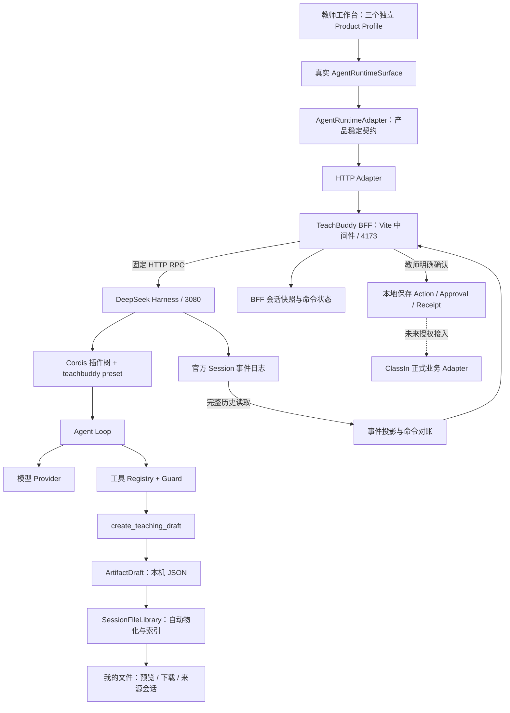
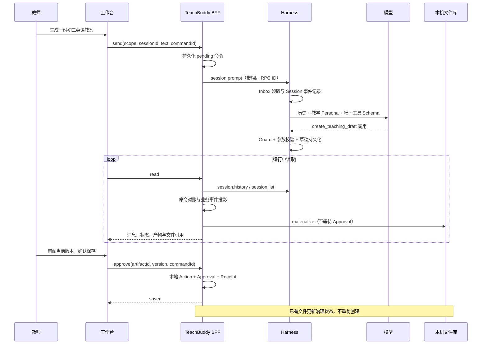

# TeachBuddy 与 DeepSeek Harness 实现结构盘点

## 1. 阅读范围与结论

这是对 2026-09-05 当前工作区（包括未提交实现）的盘点，不代表已发布版本。官方名称为 DeepSeek Harness，命令为 `dsh`；本次没有发现 DVC / DBC 是独立实现或官方名称的证据。

本次 Write Set 只有本盘点与配套的一手研究记录。不修改业务代码、运行配置、已有决策或用户未提交内容。完成条件是：核心模块均有源码指针、运行关系与事实所有权清晰、实现与规划分开、演进建议有可验收的结果。

当前基本盘是 **React 教师工作台 + TeachBuddy 本机 BFF + Cordis 插件化 DeepSeek Agent 引擎 + 本机持久化**。它已经有真实模型运行切片；ClassIn 其他业务页仍有确定性 Demo，但按 D-114，“我的任务”不再公开固定课程任务 Demo。它不是完整的生产教学 Agent 平台。

| 层次 | 当前事实 | 不能据此推断 |
| --- | --- | --- |
| 产品 | 教师集成版、班级 MVP、独立教师版三个 Profile | 生产账号和租户隔离已经完成 |
| Agent | 专用 preset、多轮对话、工具调用、取消与历史恢复 | 原有所有业务任务已经改为真实模型驱动 |
| 产物 | MD / HTML / TXT / JSON 自动进入本机文件库 | PPT / PDF / 图片 / 视频生成已经接通 |
| 控制 | 教师确认本地保存，持久化 Action / Approval / Receipt | 已创建真实 ClassIn 课程、作业或群消息 |
| 上游 | submodule 固定 `b150a551b8d465e31e418e1b2eaf5e79bbb7d28e`，`0.1.1-rc.2` | 自动跟随上游最新或协议已稳定 |

源码固定与运行包固定是两件事：`vendor/deepseek-harness` 提供源码参照；正常启动器通过 pnpm dlx 执行固定发布包，并非默认运行 vendor 构建结果。修改 vendor 不会自动改变产品正在执行的包。

## 2. 总体结构

产品浏览器当前以运行中约 1.5 秒轮询读取 BFF 快照；BFF 通过 HTTP RPC 获取官方历史并重建投影。官方提供 WebSocket 事件下行，但目前产品观察链没有接入它。BFF 的后台维护每 10 秒检查未完成任务，连续运行 10 分钟请求停止；没有独立分布式任务队列。

## 3. 官方引擎的框架与职责

官方采用 Cordis：通过配置装配插件树，插件注册服务、事件和可撤销副作用。模型、Agent Loop、工具和会话日志本身都可替换；不需要把教学逻辑直接写进官方 Loop。

| Module | 作用 | 当前产品的关系 |
| --- | --- | --- |
| Boot / Profile / Bundle / Patch | 决定启动哪些插件、使用什么配置 | 官方 web Profile 加本项目 `cordis.patch.yml` |
| Agent / Agent Loop / Inbox | 领取输入，组织多步模型与工具循环，管理取消与停止 | 实际驱动新对话；BFF 对账官方 inbox 事件 |
| Session | 追加事件、恢复历史、从日志导出模型上下文 | 官方执行事实来源，独立于 BFF 快照 |
| System Prompt / Persona | 装配身份、提示段、工具 Schema | 独立 teachbuddy 身份，只依据对话提供的信息 |
| LLM | 稳定模型消息与流 Interface，接具体 Provider | 验收记录使用 DeepSeek 官方 Provider |
| Tools / Guard | 注册工具、Schema 校验与执行策略 | 只允许一个教学草稿工具执行 |
| Persistence / Projection | 会话落盘、恢复与显示投影 | 官方记录落入隔离的 Harness Home |
| Host / API Proxy | 把会话、命令与事件能力提供给客户端 | 本机 BFF 只代理固定产品操作 |
| 可选能力插件 | Skills、MCP、子 Agent、Web、终端、定时与遥测等 | 上游可扩展能力不等于 TeachBuddy 已开放能力 |

官方源码：[架构说明](../../vendor/deepseek-harness/docs/architecture.md)。版本与线上一手资料见 [上游研究](../01-research/DEEPSEEK-HARNESS-UPSTREAM-REVIEW-2026-09-05.md)。

## 4. TeachBuddy 自有模块与源码入口

| Module / Interface | 已实现作用 | 关键入口 |
| --- | --- | --- |
| Product Profile | `ideal-full`、`classin-mvp`、`standalone-teacher` 分开路由与数据 scope | `src/features/ai-agent-workspace/workbuddy-experience-profile.ts` |
| AgentRuntimeSurface | 输入、运行消息、产物审阅、停止、重连与错误呈现 | `src/features/agent-runtime/AgentRuntimeSurface.tsx` |
| Runtime 状态协调 | 轮询、并发命令锁、旧响应失效、防止导航卸载被当取消 | `src/features/agent-runtime/use-agent-runtime.ts` |
| AgentRuntimeAdapter | `health/list/create/read/send/cancel/approve`；隔离页面与供应商协议 | `src/contracts/workbuddy/agent-runtime.ts` |
| HTTP Adapter | 请求超时、响应结构校验、错误归一化；相同命令复用 commandId | `src/features/agent-runtime/http-agent-runtime.ts` |
| 本机 BFF | 会话拥有关系、固定 RPC、输入上限、命令去重、排队对账、取消、维护和本地审批 | `server/teachbuddy-runtime.ts` |
| 事件投影 | 完整官方历史转 `ConversationRunEvent`；稳定 ID、去重、工具/文本/结束状态；不向页面暴露推理 | `server/harness-event-projection.ts` |
| 运行装配 | 固定发布包、Node 版本探测、隔离 Home/cwd、服务端凭据读取与进程启动 | `scripts/start-harness.mjs`、`scripts/dev.mjs` |
| 能力约束 | 唯一 preset；禁用 Code Runtime 与通用文件引用；全局工具 Guard | `runtime/harness/cordis.patch.yml`、`runtime/harness/presets/teachbuddy/agent.cordis.yml` |
| 教学产物工具 | 校验名称/内容/格式，以 Session 与 Call ID 生成幂等草稿；不接收任意路径 | `runtime/harness/teaching-tools.mjs` |
| SessionFileLibrary | `materialize/list/read` 隐藏文件名规范化、MIME、限额、原子写入、Manifest 与安全引用 | `src/contracts/workbuddy/session-files.ts`、`server/session-file-library.ts` |
| 文件库 HTTP 与 UI | Profile 隔离的目录、预览、下载和返回来源 Session | `src/features/session-files/`、`src/features/ai-agent-workspace/FileLibrary.tsx` |
| 本地审批 | 锁定 Artifact 版本、保存批准快照、生成 local-runtime Receipt、防止重复保存 | `server/teachbuddy-runtime.ts` 的 `approve` |
| 既有业务 Domain 与 Mock | 课程方案、测验、IM 等业务模型及模拟写回 | `src/domain/`、`src/contracts/workbuddy/`、`src/mocks/` |

当前 BFF 通过 `vite.config.ts` 挂载在开发/预览服务器上，并非独立部署的生产后端。将前端静态包单独上传不会自动带走这段后端运行能力。

## 5. 一次教学任务如何流转

模型选用工具，Guard 决定是否允许执行；工具返回成功后，业务层再决定是否形成可审阅产物、是否已批准以及是否完成具体业务动作。这些责任不能合并成“模型说完成了”。

## 6. 状态与数据所有权

| 数据 | 当前所有者与位置 | 恢复意义 |
| --- | --- | --- |
| 原始 Session 事件、模型上下文历史 | 官方 Harness：`.runtime/harness-home/` | 重建官方执行历史与模型上下文 |
| 产品 Session 快照、scope、命令与取消意图 | TeachBuddy：`.runtime/sessions/` | 前端恢复、隔离和消息结果对账 |
| 工具生成草稿 | 教学工具：`.runtime/artifacts/<sessionId>/` | 生成成功的内容证据 |
| 用户文件及 Manifest | 文件库：`.runtime/files/<scope>/<sessionId>/` | 持续可见、下载、按来源分组 |
| 批准快照与本地保存回执 | BFF：`.runtime/saved/<scope>/<sessionId>/` | 审批事实与本地执行证据 |
| Agent 执行工作目录 | `.runtime/workspace/` | 不直接作为用户文件库 |
| 真实课程、作业、消息、身份和权限 | ClassIn；当前仍为 Demo Adapter | 不能由模型文本或本地 saved 状态替代 |

三项关键区分：

1. **Session 历史不等于长期教学记忆**：会话恢复已经有；跨任务、跨学期且可撤回治理的记忆未接通。
2. **Profile scope 不等于生产租户权限**：当前面向本机单操作者；scope 校验不能替代身份认证与授权。
3. **持久日志不等于 Durable Workflow**：正常重启恢复已经有证据；跨天审批、分布式重试与恰好一次业务效果还需要单独设计。

## 7. 与既有五个 Harness Module 的映射

[全局架构基线](./ARCHITECTURE-BASELINE.md) 中的五个 Module 是责任蓝图，不是五个已经完整部署的服务。

| 蓝图 Module | 当前真实链路做到什么 | 仍需补齐 |
| --- | --- | --- |
| 上下文引擎 | 教师主动输入文本 + 官方会话历史 + Persona | 已授权业务 ContextSnapshot、知识检索、版本/来源/权限/保留治理 |
| 目标与任务运行时 | Agent Loop、会话与命令状态、取消、恢复 | 业务 Task 与多轮 Session 的关系、显式计划、跨时间任务 |
| 能力与业务工具系统 | 一个教学草稿 Tool、真实 Registry 和 Guard | 教学 Skill、业务查询/写回 Adapter、按权限动态工具目录 |
| 教师控制与执行 | 本地版本审阅、保存审批与回执 | ClassIn 正式 Action、策略校验、过期审批、冲突与补偿 |
| 评价与持续学习 | 契约、后端、浏览器与模型验收记录 | 教学质量基准集、线上反馈、成本/时延对比、回归驱动迭代 |

原有课程与测验 Demo 已覆盖其中更丰富的业务状态，但这不代表这些能力已经迁入真实 Harness 链路。技能市场、工具连接或定时入口的存在也不构成对应真实运行能力的证据。

## 8. 可持续迭代的方向

以下均为 RECOMMENDATION，不替代 LOCKED 决策，不自动开启工具或改变权限。

| 优先级 | 演进方向 | 适用场景与设计方法 | 验收结果 |
| --- | --- | --- | --- |
| P0 | 固化运行基线与版本升级门禁 | 固定包/源码/配置/事件契约；升级先跑协议替身，再做小规模真实模型验收 | 原会话可恢复，取消与审批不变，工具目录没有意外扩大 |
| P1 | 受治理的上下文装配 | 先接一条只读课程查询；按任务检索，携带对象版本、来源、权限、Token 预算；需要时再引入 RAG | 模型只见授权对象，答案能回到来源，撤权后不继续读取 |
| P1 | 结构化教学 Artifact | 工具产出教学内容结构，按量规校验，再渲染为文件；限定纠错重试次数 | 目标、活动、时长、题目和答案可检查；失败不给伪成功 |
| P1 | 评价与观测 | 建立脱敏固定任务集，记录成功率、教师修改量、工具错误、首字/总时延和单任务成本 | 每次 Prompt / Tool / 模型升级可比较，有可执行回退门槛 |
| P2 | 真实业务 Action Commit | 从一个“创建测验活动草稿”动作开始；绑定批准版本、授权、幂等键与业务 Receipt | 重复请求无重复对象，权限或版本变化拒绝执行，发布仍需独立命令 |
| P2 | BFF 的 Deep Module 拆分 | 按真实变化点提取 History Reconciliation、Command Lifecycle、Artifact Approval；UI 仍只使用 Runtime Interface | 升级事件协议不影响文件规则，修改审批不影响输入排队 |
| P2 | 增量事件与存储 | 当前全历史重复读取/排序/投影；长会话场景再引入事件游标、断线全量重建、查询索引和外部存储 Adapter | 长会话成本可测，断线不丢事件，不靠易变展示标题做主键 |
| P2 | 生产身份与隔离 | 独立 BFF 部署，认证身份导出授权范围；密钥、配额、速率限制、租户存储与审计 | 两个真实账号无法跨读任务/文件，不能伪造 scope 越权 |
| P3 | 长任务与定时 | 跨天准备、延迟发布、等教师确认时再引入 Durable Workflow，持久化计时器与执行意图 | 服务重启/重试不重复发布，等待状态可取消和到期 |
| P3 | 专业子 Agent 与多模态 | 当不同任务确有不同生命周期、权限和交付格式时，再开放专业执行者与可信媒体工具 | 有输入输出契约、预算、失败恢复；优于单 Agent 基线 |

最有价值的下一条纵向切片建议是：**授权课程上下文 → 结构化教案/测验 → 教师审阅 → 单个 ClassIn 草稿动作 → 回执 → 评价**。这条链可以验证新功能能否接入业务，而不是只证明模型会调用更多工具。

新增一个功能时，先明确“谁拥有事实、输入是什么、产物是什么、是否有外部副作用、由谁批准、怎样证明完成”，再选择 Prompt、Tool、Skill、Workflow 或专业 Agent。保持 Interface 小而稳定，把复杂校验和重试藏在对应 Module 内；只有真实可替换点才建立 Seam。

## 9. 当前证据、文档差异与限制

- 本次重新运行 5 个相关 Vitest 文件，61 项通过：BFF、SessionFileLibrary、事件投影、Runtime HTTP 与文件 HTTP 契约。
- 本次没有重跑真实模型、重启用户服务或全仓视觉验收。此前真实模型和浏览器结果来自 [Runtime 验收记录](../04-specs/features/teachbuddy-agent-runtime/ACCEPTANCE.md)，不作为本次实测。
- `runtime/harness/README.md` 顶部仍写早期“live model unverified / 无 Key”状态，而集成文档和较新的验收记录已经记载真实模型通过。该 README 的工具参数示例也早于 filename/format 扩展。此处记录差异，不覆盖其他工作中的文档；代码与当前 Feature Spec 用于判定接口，验收结果标明来源与时间。
- 接入文档关于 Context 与业务治理部分是目标契约；当前 `send` 真实输入仍为教师文本，本地 `approve` 只完成保存。不能据“接口覆盖”措辞推断全量业务集成。
- 上游原生工具批准与 TeachBuddy 本地业务批准不同；官方待交互 answerer 的进程内状态不能直接当跨重启的业务审批 Workflow。
- 本机文件原子操作、Profile 校验与模型工具 Guard，不等同于抵抗恶意宿主进程的内核沙箱或多租户生产安全。
- HTML 当前为无脚本、无任意网络的受限预览；“HTML 文件生成”不等于可运行任意交互网页。

## 10. 持续维护入口

本文件是当前结构快照；既有事实所有权继续以 [架构基线](./ARCHITECTURE-BASELINE.md)、[接入边界](./DEEPSEEK-HARNESS-INTEGRATION.md)、[Runtime Spec](../04-specs/features/teachbuddy-agent-runtime/README.md) 与 [文件库 Spec](../04-specs/features/teachbuddy-session-files/FEATURE-SPEC.md) 为准。

当前 Prompt 驱动、单 Agent、单教学草稿 Tool 的课件生成方式已锁定为 [Courseware Generation Version 1](./COURSEWARE-GENERATION-V1-BASELINE.md)。后续课件能力迭代以该文档记录的输入、生成机制、产物、评价缺口和成熟度参考为比较基线。

每次扩展更新对应 Spec 与验收记录，并按需刷新本盘点。上游跟踪使用 [一手研究记录](../01-research/DEEPSEEK-HARNESS-UPSTREAM-REVIEW-2026-09-05.md)，不将营销能力清单直接升级为当前实现事实。
