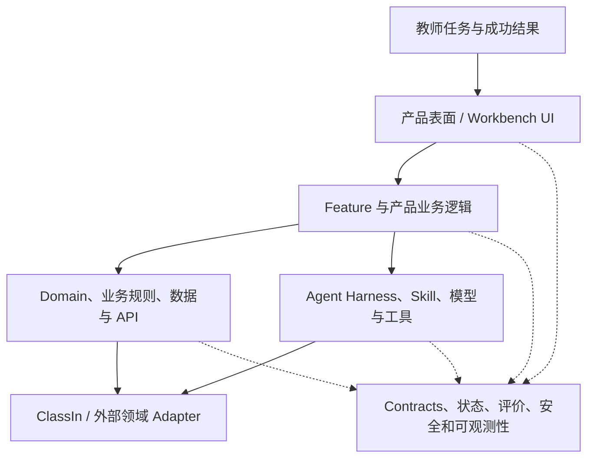

# WorkBuddy 系统理解与交付地图

> 当前“产品设计 → 研发实现”的统一入口见：[WorkBuddy 业务流程驱动的实现架构蓝图](./WORKBUDDY-IMPLEMENTATION-ARCHITECTURE-BLUEPRINT.md)。本文继续承担系统边界、团队协作和交付顺序说明。

## 文档定位

本项目的核心不是把功能列表拆得更细，而是建立一张共同地图，让团队能够从同一个教师场景同时理解：

- 教师看见什么、如何操作；
- WorkBuddy 的产品逻辑和状态如何推进；
- ClassIn 的业务规则、领域对象和 API 如何参与；
- Agent Harness、Skill、模型和工具如何协作；
- 哪些 Module 由哪个团队拥有；
- 后续如何把一条场景链路落成可验证的工程纵向切片。

因此，场景拆解不是设计文档的附属工作，而是产品理解、架构设计、组织分工和项目计划的共同基础。

## 1. 系统理解的五层地图

一个教师场景应同时放在五层中理解。五层不是五个相互独立的系统，而是同一个业务意图的不同观察面。



### 1.1 五层各自回答的问题

| 层 | 核心问题 | 典型产物 | 主要 Module |
| --- | --- | --- | --- |
| 产品表面 | 教师从哪里进入、看到什么、做什么决定 | 页面、ViewModel、Command、可访问状态 | Workbench、Design System |
| Feature / 产品逻辑 | 任务如何被组织，什么条件下追问、生成、确认和恢复 | Use Case、Plan、Run、交互状态 | Application、Feature、Runtime |
| Domain / 数据与 API | 什么是真实业务事实，谁能看、谁能改、对象如何合法变化 | Domain Object、Rule、DTO、Adapter、Receipt | Domain、Contracts、ClassIn Adapter |
| Harness / AI 能力 | 如何装配上下文、选择 Skill、调用模型和工具、校验结果 | ContextSnapshot、Capability、Artifact、SkillResult | Context、Capability、Control、Evaluation |
| 横向治理 | 如何保证状态、权限、版本、审计和评价贯穿所有层 | 状态机、事件、Policy、Trace、Evaluation | Contracts、Observability、Security |

页面、Feature、Domain 和 Harness 不是同义词。一个页面可能编排多个 Harness Module，一个 Feature 可能同时读取 Domain 事实和 Domain Knowledge，但每个事实仍只能有一个所有者。

## 2. 场景是系统理解和交付的基本单位

不要先按目录或团队拆系统，再去寻找业务意义。应先选一个教师场景，沿着一条完整意图链路拆到底；多个场景完成后，再把重复的 Module、Interface 和 Adapter 提取为共享系统能力。

当前切片“课程目标 → 课程对象”就是这种单位。它不只是课程设计功能，而是同时证明：

```text
教师输入
→ UI 状态
→ Intent / Run
→ ContextSnapshot
→ Skill / Model
→ ArtifactDraft
→ ProposedAction / Approval
→ ClassIn Adapter
→ ExecutionReceipt
→ EvaluationEvent
```

### 2.1 每个场景的 6+4+1 拆解协议

每个场景固定产出以下材料：

| 组成 | 要回答的问题 | 对项目的作用 |
| --- | --- | --- |
| 六件套 1：纵向链路图 | 一个教师意图如何穿过 UI、Feature、Domain、Harness 和 Adapter | 形成端到端共同理解 |
| 六件套 2：事实所有权矩阵 | 哪个 Module 拥有什么事实，谁只能读取或提出动作 | 划清产品、业务和系统责任 |
| 六件套 3：Module / Interface / Adapter | 哪些 Module 存在，Seam 在哪里，如何替换和测试 | 形成工程边界和团队边界 |
| 六件套 4：状态机 | Run、Artifact、Approval、Receipt 如何变化 | 防止页面布尔值替代真实状态 |
| 六件套 5：场景矩阵 | 空、加载、权限、冲突、部分成功和恢复如何处理 | 把异常变成实现范围 |
| 六件套 6：代码追踪 | 从 UI 命令到业务回执对应哪些文件和调用 | 连接文档与代码 |
| 四类输入 | 产品逻辑、业务规则、Domain Knowledge、业务数据/API 分别来自哪里 | 防止把所有内容塞进 Prompt |
| Skill / 模型链 | 哪些步骤调用 Skill、模型或工具，输出如何校验 | 解释 Agent 的真实运行方式 |

这不是八份孤立材料。它们最终要汇总为：Module 清单、Interface 清单、事件清单、团队责任清单和实施依赖图。

## 3. 从场景拆解到 Module 清单

### 3.1 场景拆解表

每个场景都应填写下面的最小表格：

| 字段 | 示例：课程目标 → 课程对象 |
| --- | --- |
| 业务场景名称 | 课程目标 → 课程对象 |
| 内部追踪 ID | `EDU-01`（仅工程定位，不作为产品名称） |
| 教师任务 | 把教学目标和班级约束整理成可审阅、可保存的课程方案 |
| 成功结果 | 有来源、版本和规则校验的课程对象草稿 |
| UI 入口 | Workbench / 新建目标 |
| 业务对象 | Course、Unit、Activity |
| WorkBuddy 对象 | Run、ContextSnapshot、ArtifactDraft、ProposedAction、Approval、Receipt |
| 只读输入 | 教师范围、课程结构、课程标准、机构规范 |
| 生成步骤 | 目标澄清、结构草稿、教师修订 |
| 业务副作用 | 保存课程草稿 |
| 审批要求 | 教师确认后执行 |
| 主要异常 | 信息缺口、版本冲突、权限拒绝、部分成功、临时失败 |
| 真值标签 | `SIMULATED` |
| 纵向切片负责人 | 负责从 UI 到 Receipt 的端到端结果 |

### 3.2 从功能点反推 Module

不要把“一个页面”直接当成一个 Module。应根据它拥有的复杂性反推：

| 观察到的复杂性 | 应归入的 Module | 不应放在哪里 |
| --- | --- | --- |
| 页面布局、表单、ViewModel 投影 | Workbench UI | 不放业务规则和 API 调用 |
| 目标澄清、计划、等待和恢复 | Application / Runtime | 不放在 React `setState` |
| 课程对象、版本、权限和领域校验 | Domain / Adapter | 不让模型自由判断 |
| 上下文装配、Skill 选择和模型调用 | Harness | 不让页面拼 Provider 请求 |
| 草稿版本、差异和来源 | Artifact Workspace | 不直接覆盖 ClassIn 正式对象 |
| 风险、审批、幂等和写回顺序 | Control & Execution | 不让 Skill 直接写业务系统 |
| 采纳、修改、成本和后续结果 | Evaluation | 不把模型返回成功当成教学成功 |

模块设计应使用 Deep Module 语言：接口尽量小，复杂性集中在实现内部；Seam 放在真正变化或可替换的位置；Adapter 只承担接口角色，不夺取事实所有权。

## 4. 从 Module 清单反推团队分工

团队不应按“前端团队只做页面、后端团队只做接口”简单切分。更合理的方式是：按稳定 Module 形成能力归属，同时为每条场景建立纵向负责人。

### 4.1 建议的能力团队

| 团队 / 责任域 | 拥有的 Module | 主要交付物 | 不拥有的事实 |
| --- | --- | --- | --- |
| 产品与教学体验 | 教师任务、成功标准、状态文案、审批体验 | Feature Spec、场景验收、ViewModel 需求 | 不拥有 ClassIn 实时权限和对象版本 |
| Workbench / UI | Shell、路由、Feature UI、UI Projection、Design System | 页面、Command、ViewModel、可访问性和视觉验收 | 不拥有业务规则和模型供应商协议 |
| Feature / Application | 教师用例、任务编排、Artifact 变更、ProposedAction 生成 | Application Interface、用例、应用级测试 | 不拥有 ClassIn 正式对象 |
| Domain / ClassIn Integration | Domain Object、业务规则、API Port、Mock/Real Adapter | 领域校验、读取/写回 Adapter、稳定 Receipt | 不拥有 WorkBuddy Run 和 Skill 方法 |
| Harness / AI Platform | Context、Runtime、Capability、Skill Executor、Model Gateway、Control、Evaluation | Harness Interface、Skill、调用追踪、审批执行和评价事件 | 不把模型推断升级为业务事实 |
| Platform / Quality / Security | Contracts、身份租户、持久化、可观测性、测试基座和策略治理 | Schema、事件、权限、E2E、审计、成本和安全检查 | 不替业务 Module 做产品决策 |

### 4.2 组织原则

1. **共享 Module 有明确单一 Owner**：例如 `CourseDraftGateway` 只能有一个契约 Owner，避免多个团队各自定义相似接口。
2. **场景必须有纵向负责人**：负责把各团队的 Module 串成可操作、可恢复、可验收的一条链路。
3. **团队通过 Interface 协作**：协作内容是契约、状态、错误和验收，不是互相读取内部实现。
4. **先用一个场景验证边界，再抽共享能力**：只有两个真实实现或两个真实场景需要替换时，才建立新的 Seam。
5. **产品、工程和领域 Owner 共同评审事实所有权**：不能由技术团队单独决定业务事实归属。

## 5. 场景之间如何汇总成整体架构

### 5.1 不同场景重复出现的共享 Module

当多个场景拆解完成后，对它们的 Module 清单做合并：

| 多场景反复出现的能力 | 适合沉淀为共享 Module |
| --- | --- |
| 所有场景都要读取教师、机构和课程权限 | Identity / Tenant Policy + Context Engine |
| 所有生成产物都要有来源、版本和差异 | Artifact Workspace |
| 所有写回都要审批、幂等和回执 | Control & Execution |
| 所有 Skill 都要调用模型、校验和追踪 | Skill Executor + Model Gateway |
| 所有长任务都要暂停、恢复和复查 | Task Runtime / Durable State |
| 所有场景都要记录采纳、修改和结果 | Evaluation / Observability |

共享 Module 的成立标准是：删除它后，复杂性会在多个场景和团队之间重复出现；保留它能给多个调用方提供明显 Leverage，并集中维护 Locality。

### 5.2 从场景矩阵形成系统依赖图

```text
场景 Spec
  → 稳定 Contracts
  → Feature / Application 用例
  → Domain Port + Harness Interface
  → Mock Adapter 与固定 Fixture
  → API/BFF 组合根
  → Workbench ViewModel / Command
  → 场景行为、异常和视觉验收
```

这条依赖顺序与现有目录方向一致：

```text
workbench → ui + contracts
api → application + harness + adapters
harness → application + contracts + domain
adapters → application ports + contracts + domain
domain/contracts → 不依赖 UI、浏览器、服务器或 Adapter
```

## 6. 其他场景的推荐拆解顺序

不是所有场景都适合立即实现。需要同时区分战略业务优先级和工程实施顺序。战略上优先关注三条核心结果链：作业到订正、备课演练到改进、诊断到干预；工程上先以课程生产基础链建立可复用的 Harness 样板，再逐步引入学生数据、媒体证据和跨对象副作用。

| 工程顺序 | 业务场景名称 | 主要新增理解 | 推荐原因 |
| --- | --- | --- | --- |
| 1 | 课程目标 → 课程对象 | 目标、上下文、可审教课程方案包、审教迭代、审批、写回、评价的统一骨架 | 已由 D-002 锁定，第一版不生产 PPT；作为所有后续场景的架构样板 |
| 2 | 作业批改 → 错因分析 → 订正 | 学生数据、评分标准、答案保护、二次结果证据 | 直接验证第一条核心业务结果链，业务写回仍可限制在草稿和教师确认 |
| 3 | 备课演练 → 教学改进 | 媒体证据、时间戳、口径说明、Artifact 版本比较 | 验证证据链和改进闭环，不把演练指标升级为绩效事实 |
| 4 | 学情诊断 → 个性化干预 | 多对象计划、白名单工具、审批、部分成功、复查和撤销 | 最适合验证有限 Agent，但先以 Copilot 计划和逐项写回开始 |
| 5 | 教学方案生成与比较 | 多 Artifact、候选比较、Evaluation | 在已有课程产物链上增加选择和评价，不马上引入高风险写回 |
| 6 | 教案、课件与活动材料生产 | 一个业务对象派生多个教学产物 | 验证 Artifact Workspace 和 Skill 组合 |
| 7 | 作业与评价标准生成 | 目标到任务、规则和量规对齐 | 验证 Domain Knowledge 与领域规则协同 |
| 8 | 课堂准备完整性检查 | 确定性规则、待办和依赖 | 增加规则优先、模型可选的场景 |
| 9 | 批改与个性化反馈草稿 | 学生证据、敏感信息、外发前审批 | 验证高敏感内容但仍保持草稿态 |
| 10 | 学情证据摘要与诊断假设 | 事实、推断、证据链和不确定性 | 验证 AI 不能把推断改成学生事实 |
| 11 | 学生/家长沟通草稿 | 外部接收者、批量风险和发送控制 | 验证更高副作用但可先停在草稿 |
| 12 | 课堂记录与实时提示 | 事件流、延迟、低打扰和实时 Context | 需要新的运行时和可用性约束 |
| 13 | 活动节奏与分组建议 | 实时业务动作、强审批、部分执行和撤销 | 风险高，应在控制系统成熟后实现 |

完整的业务时刻、单点/组合/闭环能力和四条优先工程切片见[核心业务闭环与能力优先矩阵](../02-product/CORE-BUSINESS-LOOP-PRIORITY-MATRIX.md)。

这个顺序不是产品路线的最终承诺，而是理解和证明架构的推荐顺序；正式优先级仍需结合业务价值、数据可用性和领域团队确认。

## 7. 场景拆解的完成定义

一个场景只有同时满足以下条件，才算足以进入团队排期：

- 明确教师目标、成功结果和不包含范围；
- 四类输入有来源、所有者、版本和授权方式；
- 六件套材料完整，且能从 UI 追踪到业务回执；
- Skill、模型、Tool 和业务 API 的职责没有混淆；
- Module、Interface、Seam、Adapter 和 Owner 已确认；
- Run、Artifact、Approval、Receipt 的状态和恢复路径已定义；
- 空白、加载、错误、权限、部分成功和真值标签已列入验收；
- 至少有一个可重置的模拟 Adapter 或测试替身；
- 产品、UI、Feature、Domain、Harness 和 Quality 团队都知道自己的写入范围；
- 未验证的生产假设单独列出，没有被 Demo 文案掩盖。

## 8. 当前建议

接下来按四条优先工程纵向切片推进：

1. **课程目标 → 课程对象**：建立统一 Run、Context、Artifact、Approval、Receipt 和 Evaluation 样板；
2. **作业批改 → 错因分析 → 订正**：验证学生数据、答案保护和二次结果证据；
3. **备课演练 → 教学改进**：验证媒体证据、时间戳和 Artifact 版本比较；
4. **学情诊断 → 个性化干预**：验证跨对象计划、审批、部分成功、复查和撤销。

四条切片完成对照后，再决定哪些是业务域特有 Module，哪些应上升为 WorkBuddy 共享 Harness；同时确定团队边界、Interface Owner、纵向切片负责人和后续工程排期。
