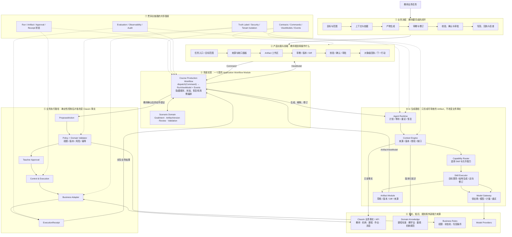

# WorkBuddy 业务流程驱动的实现架构蓝图

## 1. 文档定位

本文是已确认产品设计与后续 Feature Spec、tickets、代码实施之间的架构事实源草案。它不重新回答“WorkBuddy 是什么”或“要做哪些业务场景”，而是回答：

> 一个教师业务流程，如何逐层映射到产品功能、前端、Application Workflow、Domain、Agent Harness、Skill、模型、业务数据、知识、规则、Adapter、审批、回执和评价。

当前状态为 `D0 review draft`。图中的 Module、Interface、Seam 和团队 Owner 需要经过首条场景实现卡片及另外三个优先场景的交叉验证后，才能升级为实现基线。

## 2. 一张图读懂实现架构

下面这张图采用“业务流程驱动、共享架构承载、生成与执行分流”的阅读方式。主线以“课程目标 → 课程对象”为样板；更换业务场景时，主要替换场景 Workflow、Domain Object 和 Skill，共享 Workbench、Harness、Control、Adapter 契约和 Evaluation 骨架。



## 3. 这张图如何回答四个实现问题

### 3.1 包含什么业务流程

业务流程位于第一层。每条流程必须从教师可观察的业务结果出发，并走到回执与复查；不能以“模型生成完成”结束。

首条样板流程是：

```text
目标与范围
→ 上下文与依据
→ 产物生成
→ 审教与修订
→ 校验、确认与审批
→ 写回、回执与复查
```

作业订正、备课演练和个性化干预沿用这六个阶段的阅读方式，但拥有不同的 Scenario Workflow、Domain Object、Skill、业务 Adapter 和风险策略。

### 3.2 每个业务流程下包含什么功能模块

每个业务阶段先映射到教师可见的产品功能，再由一个场景 Application Workflow 统一编排：

| 业务阶段 | 产品功能 | 主要实现 Module | 主要业务输出 |
| --- | --- | --- | --- |
| 目标与范围 | 任务入口、目标范围 | Workbench + Scenario Workflow + Goal Domain | `GoalIntentDraft` |
| 上下文与依据 | 来源、授权、缺口 | Context Engine + Business/Knowledge Adapter | `ContextSnapshot` |
| 产物生成 | Artifact 工作区 | Capability Router + Skill Executor + Artifact Module | `ArtifactDraft v1` |
| 审教与修订 | 审教、版本、Diff | Review Domain + Revision Skill + Artifact Module | `ReviewComment`、`ArtifactDraft v2...` |
| 校验、确认与审批 | 规则校验、最终确认、审批 | Domain Validator + Control | `ValidationReport`、`ProposedAction`、`Approval` |
| 写回、回执与复查 | 对象级结果、恢复、下一行动 | Business Adapter + Evaluation | `ExecutionReceipt`、`EvaluationEvent` |

### 3.3 基础业务逻辑、前端、服务端和 AI 如何分工

- **前端 Workbench**：只展示稳定 ViewModel、收集教师 Command、表达状态和控制点；不拥有业务规则或模型调用顺序。
- **Application Workflow**：是每个业务场景的主 Module；隐藏用例顺序、允许命令、状态推进、失败恢复和下层协作。
- **Scenario Domain**：拥有场景对象、不变量和确定性状态转换；不依赖 React、浏览器、模型或具体 Adapter。
- **Agent Harness**：装配 Context、选择 Skill、调用模型、管理运行时与评价；不拥有 ClassIn 正式业务事实。
- **Skill**：封装一种可复用的教育方法和结构化输入输出；只生成或修订 Artifact，不能审批或写回业务系统。
- **Control & Execution**：集中处理权限、版本、风险、幂等、教师审批和执行顺序。
- **Adapter**：在 Seam 上连接 ClassIn、Knowledge 和 Model Provider；把外部结果转成稳定契约。
- **Evaluation**：连接教师修改、Artifact 版本、审批和实际回执；不把模型成功率冒充业务价值。

内容生产采用 [TeacherIn 内容兼容与独立产品边界](./TEACHERIN-CONTENT-COMPATIBILITY.md)：Standalone 与 ClassIn 的 Product Module、账号和数据继续隔离，但内容 Artifact 从生成开始就遵循 TeacherIn 权威内容契约。TeacherIn Adapter 负责身份、权限、对象映射和回执，不承担二次内容转换。

### 3.4 AI 端的架构设计

AI 端不是一个直接连接所有业务 API 的大 Agent，而是六个协作 Module：

```text
Agent Runtime
→ Context Engine
→ Capability Router
→ Skill Executor
→ Model Gateway
→ Artifact Module
```

其中：

- Runtime 拥有 Run 的计划、等待、重试和恢复；
- Context Engine 只装配已授权、带来源和版本的输入；
- Capability Router 根据需要、风险和能力声明选择 Skill；
- Skill Executor 执行结构化方法 Pipeline 并校验输入输出；
- Model Gateway 隐藏供应商、模型版本、限流、计量、重试和响应解析；
- Artifact Module 拥有草稿、版本、Diff、来源和可恢复编辑状态。

模型不能直接推进 Run，Skill 不能直接调用 ClassIn 写接口，生成成功不能直接进入 `completed`。

## 4. 每个 Skill 的标准 Pipeline

```text
SkillInvocation
→ 输入 Schema 校验
→ Context 引用解析
→ 方法步骤与 Prompt 装配
→ Model Gateway 调用（可选）
→ 输出 Schema 校验
→ Skill 语义校验
→ 确定性 Domain Rule 校验
→ SkillResult + 来源 + 假设 + 警告
→ Artifact 新版本或 needs-input / recoverable-failure
```

首条切片只需要三个生成型 Skill：

| Skill | 负责什么 | 输入 | 输出 | 副作用 |
| --- | --- | --- | --- | --- |
| `goal-clarification` | 把模糊目标整理成可观察目标与成功标准 | 教师输入、范围、知识引用 | `GoalIntentDraft`、缺口 | R1，只生成草稿 |
| `course-structure-drafting` | 把已确认目标拆成课程、单元和活动结构 | Intent、Context、课时、知识 | `ArtifactDraft v1` | R1，只生成草稿 |
| `course-plan-revision` | 只针对教师选中的意见修订指定范围 | 当前 Artifact、意见、范围 | 新版本、Diff、未解决项 | R1，只生成草稿 |

完整性校验、权限判断、版本冲突、审批和保存不做成 Skill，它们分别属于 Domain Validator、Control 和 Business Adapter。

## 5. 从图转成工程交付物

实现架构确定后，工程不按“前端票、后端票、AI 票”横向拆分，而按一条可运行的业务结果纵向交付。首条切片的最小落地顺序是：

1. **稳定契约**：Command、ViewModel、Run、Artifact、Approval、Receipt 和 Event；
2. **Scenario Workflow**：一个小 Interface 隐藏状态、顺序、恢复和用例编排；
3. **Domain 状态与规则**：目标、Artifact 版本、审教、校验、动作和回执；
4. **可重置 Adapter**：业务事实读取、知识读取、模型调用和模拟写回；
5. **三个 Skill**：目标澄清、课程结构生成、定向修订；
6. **Workbench 纵向闭环**：目标到对象级回执，同一 Run 覆盖成功和恢复路径；
7. **Evaluation**：关联教师修改、版本、审批、回执与后续使用。

每一步都必须通过同一个场景 Workflow Interface 验证，不让 UI、测试或 BFF 直接跨过主 Seam 操作下层 Module。

## 6. 架构不变量

1. 教师只面对统一 WorkBuddy，不选择内部 Agent、Skill、MCP 或模型；
2. 页面只发 Command、读 ViewModel，不直接推进业务状态；
3. WorkBuddy 拥有 Run、Context、Artifact、ProposedAction、Approval、Receipt 和 Evaluation；
4. ClassIn 继续拥有教师、机构、课程、课堂、作业、消息和正式发布状态；
5. Skill 只产生 R0/R1 结果，不能直接执行有业务副作用的动作；
6. 所有写回经过 ProposedAction、Policy、Domain Validation、Teacher Approval 和 Adapter；
7. 保存成功只能由 ExecutionReceipt 证明；
8. 外部输入先通过 Contracts 校验，再进入 Application 或 Domain；
9. 模拟、集成模拟、真实和未来能力始终显示真值标签；
10. 只有两个合理 Adapter 或明确测试替身时才固定 Seam，避免空包装。

## 7. 下一步决策门

这张主图通过评审后，下一步不是立即写代码，而是：

1. 完成“课程目标到课程对象”场景实现卡片；
2. 用作业订正、备课演练、个性化干预三个场景检查共享 Module 是否成立；
3. 确认 Module、Interface、Adapter、事实所有者和团队 Owner；
4. 再恢复 Feature Spec、纵向 tickets 和代码实施。

主图若不能让一个产品功能追踪到业务输出、Skill、规则、外部来源、审批和回执，就还不能作为研发共同语言。
