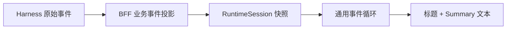
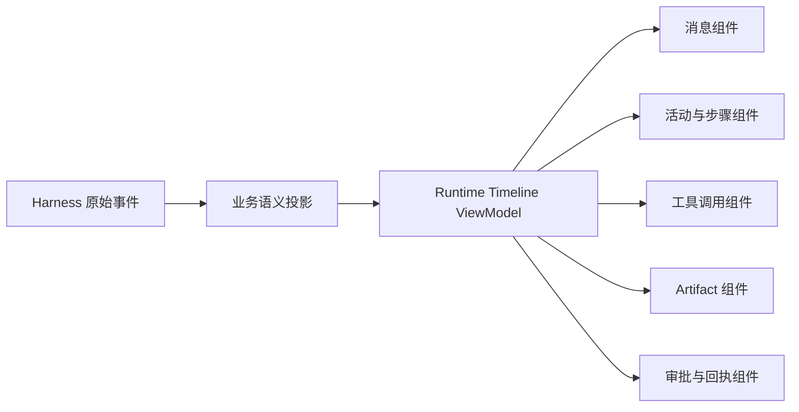
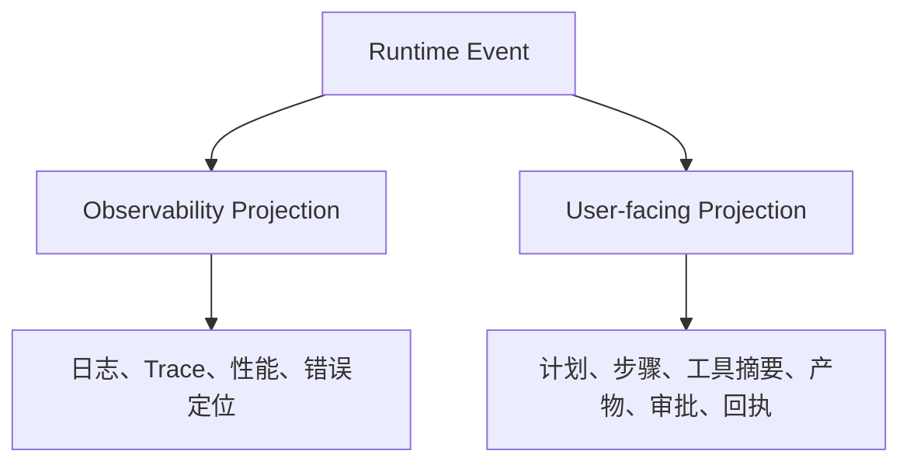

# TeachBuddy LUI 讨论、现状分析与行业调研

## 1. 文档目的

本文沉淀本轮关于 Language User Interface（LUI）的讨论、当前 TeachBuddy Runtime 的实现事实、行业优秀实践和可用于后续升级的设计判断。它提供研究与判断依据，不直接替代 Feature Spec、架构决策或工程实施方案。

本文严格区分三类信息：

- **当前事实**：由项目决策、代码、测试和验收记录支持；
- **设计判断**：基于当前业务场景和外部实践形成的建议；
- **未来方向**：尚未实现，需要通过独立 Spec、实现与验收才能成为项目事实。

配套材料：

- [LUI 交互原型](./teachbuddy-lui-redesign-prototype.html)
- [LUI 原型高清截图](./teachbuddy-lui-redesign-prototype.png)
- [TeachBuddy LUI Demo 升级 PRD](./TEACHBUDDY-LUI-DEMO-REDESIGN-PRD.md)

## 2. 本轮讨论形成的核心结论

### 2.1 这里讨论的确实是 LUI，但 LUI 不等于聊天框

截图中的界面已经具备 LUI 的最基本形态：教师通过自然语言表达目标，Agent 在同一个任务窗口中持续反馈，产物由对话触发并回到当前会话。

它距离成熟 LUI 仍有明显差距。成熟 LUI 不是“把模型文本逐字显示出来”，而是把语言理解、运行状态、工具行为、业务对象、产物、确认和回执投影成教师能够理解和控制的界面。

本项目更适合采用以下定义：

> TeachBuddy LUI 是一个由自然语言驱动、以结构化运行事件为证据、以教学产物为工作对象、由教师保留最终控制权的持续任务界面。

### 2.2 当前最突出的问题不是颜色和圆角，而是信息没有被正确投影

原始截图中的主要问题包括：

1. 模型输出中的 `**`、`##`、Markdown 表格分隔符以纯文本形式出现；
2. 教师消息、Agent 回复、工具调用和运行状态缺少明确的视觉类型；
3. 长段文本承担了过程说明、结果总结和产物描述三种不同职责；
4. 生成的 HTML 课件埋在文本末尾，教师看不到“产物正在形成”；
5. “正在处理”只表达忙碌，没有表达正在处理什么、完成到哪里、下一步是什么；
6. 缺少与当前对象紧密关联的修改、暂停、恢复、审阅和保存入口；
7. 页面虽然是对话形态，但尚未形成 `Goal → Process → Artifact → Approval → Receipt` 的清晰业务闭环。

因此，本轮设计把问题定义为 **Runtime Event Projection 不够深**，而不是单纯的视觉粗糙。

### 2.3 不应展示模型私有思维链

教师需要的是可验证的业务过程，例如“已解析教学目标”“正在生成第 6 页”“HTML 自包含检查已通过”，而不是模型内部逐 token 推理或未经治理的 Chain of Thought。

建议展示：

- 对教师有意义的计划和步骤；
- 工具名称、输入摘要、状态和可读结果；
- 产物版本、校验结果、保存状态和回执；
- 失败原因、影响范围和恢复动作。

不建议展示：

- 原始模型推理文本；
- Provider、模型、Skill、MCP 等内部选择过程；
- 无法解释其业务意义的底层事件和日志；
- 伪造的“实时思考”文案。

## 3. 当前项目基本盘

### 3.1 已锁定的产品原则

根据 [项目简报](../../docs/00-project/PROJECT-BRIEF.md) 和 [决策账本](../../docs/00-project/DECISION-LEDGER.md)，LUI 升级必须遵守以下边界：

1. TeachBuddy 是统一主 Agent 工作台，教师不需要选择内部 Agent、Skill、MCP 或模型；
2. 标准 Agent Run 是一个持续存在的对话式任务窗口；
3. `Goal → Core Context → Plan → Process → Artifact → ProposedAction → Approval → ExecutionReceipt` 在同一 Run 内表达；
4. 页面保留一个可选右侧辅助区，桌面宽度为 360px，窄屏转为 Overlay 或独立视图；
5. 页面根面不滚动，时间线和辅助区分别拥有自己的滚动责任，Header 与 Composer 保持稳定；
6. 普通产品界面不显示“模拟”“仿真”等开发标签，但内部证据必须保留真值；
7. 文件型 Artifact 生成成功后自动进入当前 Product Profile 的“我的文件”，无需 Approval；
8. 保存到本机不代表写入 ClassIn、TeacherIn 或正式发布；
9. 未来任何业务写回仍需 `ProposedAction → Approval → Domain Validation → ExecutionReceipt`；
10. 当前没有真实 ClassIn 业务数据 API，教师主动输入仍是主要上下文来源。

### 3.2 当前运行链路已经是真实 Harness，不应再称为纯 Mock

根据 [Runtime 验收记录](../../docs/04-specs/features/teachbuddy-agent-runtime/ACCEPTANCE.md)，当前本机链路已经完成以下验收：

- Vite/React 前端、BFF 和固定版本 DeepSeek Harness 可以共同启动；
- 实际 DeepSeek Provider 与模型调用通过；
- 多轮上下文、教学工具调用、停止、重启恢复通过；
- Markdown 和自包含 HTML Artifact 可以生成、预览、保存和下载；
- Artifact Approval 产生本地 Receipt；
- 生成文件自动进入 Session 文件库；
- 桌面与窄屏浏览器验收、运行时无障碍检查通过。

仍需保留的边界：

- ClassIn 课程、学生、课堂和作业数据仍是 Demo 事实；
- 当前没有生产身份认证、多租户隔离或云端后台运行保障；
- 当前文件库是本地 Adapter，不是 ClassIn Space 或 TeacherIn；
- 一次真实模型验收不等于长期 SLA 或教学质量证明。

### 3.3 当前前端实现

当前 [AgentRuntimeSurface](../../src/features/agent-runtime/AgentRuntimeSurface.tsx) 已经具备：

- Session 创建、URL 恢复与历史会话；
- 发送、停止、失败恢复、重复命令保护；
- 接入健康状态和离线状态；
- 时间线尾部跟随；
- Artifact 列表、审阅、保存和下载；
- 固定 Composer；
- 右侧 Artifact Review；
- 桌面与窄屏适配。

当前浏览器侧通过 [use-agent-runtime](../../src/features/agent-runtime/use-agent-runtime.ts) 在运行期间每 1.5 秒读取一次 Session 快照。Harness 与 BFF 内部可以处理 WebSocket 事件，但当前浏览器页面不直接消费 WebSocket 或 SSE 流。

### 3.4 当前投影的主要技术限制

页面当前将每个 `ConversationRunEvent` 统一渲染为：

```text
Actor/Title
Summary 文本
```

这意味着领域层已经存在的 `actor`、`kind`、`state`、`turn`、`step` 等信息没有进一步形成深层 UI 结构。Artifact 内容也主要通过 `<pre>` 以转义后的原文显示，所以 Markdown 标记和 HTML 源码会直接进入用户视野。

现状可以概括为：



建议演进为：



## 4. LUI 涉及的专业技术主题

### 4.1 Agent–UI 协议与事件语义

传输层只负责“如何把字节送到浏览器”，LUI 还必须约定“发生了什么”。常见语义包括：

- Run 生命周期：started、finished、failed、cancelled；
- Message 生命周期：start、delta、end；
- Tool 生命周期：call、arguments delta、result、error；
- Activity：plan、search、generation、validation 等结构化过程；
- State：snapshot、delta、reconciliation；
- Artifact：created、updated、versioned、saved；
- Human-in-the-loop：input requested、approval requested、approved、rejected；
- Recovery：reconnect、resume、retry、expired。

[AG-UI](https://github.com/ag-ui-protocol/ag-ui) 是值得关注的公开协议。它把 Agent 与前端之间的交互定义为开放、轻量、事件驱动的协议，覆盖生命周期、文本、工具、状态、Activity 和扩展事件。对本项目最有价值的不是直接替换现有 Harness 协议，而是借鉴其“传输与交互语义分离”的做法。

### 4.2 流式渲染与增量协调

流式 LUI 需要解决的不只是逐字显示，还包括：

- 稳定 Message/Step ID；
- Delta 顺序、重复和丢失处理；
- 快照与增量事件合并；
- 页面刷新后的恢复；
- 断线重连与部分完成；
- 停止生成后的最终一致状态；
- 用户向上阅读时停止自动滚动；
- 当前消息完成后重新获得稳定布局。

当前 1.5 秒轮询可以支持“分阶段刷新”和可靠恢复，不必为了视觉升级立刻改成 SSE。若未来需要 token 级流式体验，应把它作为独立 Transport Seam，引入稳定增量协议，而不是让组件直接依赖 WebSocket 帧。

[Vercel AI SDK 的 `UIMessage`](https://ai-sdk.dev/docs/reference/ai-sdk-core/ui-message) 将 UI 消息定义为由多个 typed parts 组成的应用状态，并区分文本、推理、工具等 part；其 [Streaming Custom Data](https://ai-sdk.dev/docs/ai-sdk-ui/streaming-data) 允许通过 SSE 发送可以按 ID 协调更新的结构化 data parts。这证明“消息是结构化部件集合”比“消息是一段字符串”更适合复杂 LUI。

### 4.3 Generative UI

Generative UI 不是让模型任意生成未经治理的 HTML，而是让模型或 Agent 选择一组产品预先注册、受类型约束、可访问、可测试的 UI 组件。

例如：

```text
tool: create_quiz_draft
state: awaiting_approval
payload: { title, questions, duration }
```

前端将其映射成“测验草稿审批卡”，而不是显示 JSON 或一段 Markdown。

[CopilotKit](https://github.com/CopilotKit/CopilotKit) 把 Generative UI、共享状态和 Human-in-the-loop 作为核心能力；它适合参考 Agent 状态如何驱动前端组件以及用户如何在组件内反馈。TeachBuddy 应借鉴其模式，但仍由自身 Domain Contract 和业务审批规则决定允许渲染与执行什么。

### 4.4 Human-in-the-loop

专业 Agent 产品不能只提供“发送”和“等待”。人工介入至少包括：

- 补充缺失上下文；
- 修改 Agent 计划；
- 暂停、停止和恢复；
- 审阅生成物；
- 同意或拒绝业务动作；
- 修订后重新执行；
- 对结果进行评价。

在 TeachBuddy 中，“保存本地 Artifact”和“写回业务系统”是两类不同动作：

- Artifact 生成成功后可以自动进入“我的文件”；
- ClassIn/TeacherIn/课程对象的变化必须先形成 ProposedAction，再审批和执行。

### 4.5 Artifact-first Interaction

课件、教案和测验不是普通聊天附件，而是教师持续修改的工作对象。产物型任务应允许界面从 Chat-first 动态转为 Artifact-first：

- 对话负责表达目标和修改意图；
- 过程区负责展示可验证的运行证据；
- Artifact Studio 负责预览、选页、修改、版本和检查；
- Inspector 负责上下文、结构、质量和回执。

[Vercel Chatbot](https://github.com/vercel/chatbot) 是高关注度的开源参考，其 AI SDK 架构支持动态聊天与生成式 UI；仓库还提供独立 Artifact 处理结构。它说明复杂产物需要从普通消息气泡中分离出来。

### 4.6 结构化内容渲染与安全

模型输出不能直接使用 `innerHTML`。建议按内容类型选择受控渲染器：

- Markdown：安全 Markdown AST → 允许组件白名单；
- 数学公式：受控公式渲染器；
- HTML Artifact：项目现有受限 iframe、CSP 和无权限 sandbox；
- Tool payload：Schema 校验后映射注册组件；
- 普通文本：React 转义文本；
- 未知类型：退化为安全的摘要与下载入口。

渲染器必须把内容正确呈现与安全执行分离。Markdown 可视化不代表允许 Markdown 内任意 HTML；HTML 预览也不代表允许脚本、网络访问或同源权限。

### 4.7 前端状态机

LUI 状态不能依赖多个互相矛盾的布尔值。至少应有以下显式状态：

```text
idle
creating_session
running
awaiting_input
awaiting_approval
stopping
stopped
recovering
failed_recoverable
failed_terminal
completed_pending_review
completed
```

当前 Runtime Contract 只有 Session 的 `idle/running/stopped/failed`，复杂 UI 状态可以先在 Projection ViewModel 中派生，但涉及持久恢复和跨端一致性的状态最终应进入稳定领域契约。

### 4.8 可观察性与用户可见证据

工程日志与教师看到的过程不是同一套信息。建议形成两条投影：



用户投影需要稳定、克制和业务可读；工程投影需要完整、可追踪且保留原始 ID。二者通过 Run ID、Turn ID、Step ID、Tool Call ID、Artifact ID 和 Command ID 建立关联。

## 5. 行业项目与可借鉴模式

### 5.1 AG-UI

来源：[ag-ui-protocol/ag-ui](https://github.com/ag-ui-protocol/ag-ui)

可借鉴：

- 用事件类型表达生命周期、消息、工具、状态和 Activity；
- Snapshot 与 Delta 并存，支持增量更新和重新同步；
- Agent Runtime 与具体 UI 框架解耦；
- Custom Event 只作为扩展机制，不替代核心语义。

对 TeachBuddy 的启发：

- 保留 DeepSeek Harness 和现有 BFF；
-在 BFF 到前端之间建立稳定、业务可读的 Timeline Projection；
- 不让 React 组件直接解析底层 Harness 事件。

### 5.2 assistant-ui

来源：[assistant-ui/assistant-ui](https://github.com/assistant-ui/assistant-ui)

其公开能力覆盖 streaming、自动滚动、重试、附件、Markdown、代码高亮、快捷键、无障碍、工具调用 UI、Generative UI 和内联人工审批。

可借鉴：

- 把 Message Part、Tool Schema、Runtime Adapter 做成强类型接口；
- 自动滚动尊重用户阅读位置；
- 回复操作、重试和错误恢复属于消息生命周期；
- 工具和审批有专用组件，不以纯文本模拟。

不建议直接照搬：

- 通用聊天组件库的默认视觉；
- 面向开发者的 Tool/JSON 展示密度；
- 与 TeachBuddy 领域模型不一致的线程、云存储和后端抽象。

### 5.3 CopilotKit

来源：[CopilotKit/CopilotKit](https://github.com/CopilotKit/CopilotKit)

可借鉴：

- Agent 与 UI 共享受控状态；
- 工具调用可以渲染为前端组件；
- Human-in-the-loop 可以暂停运行，接收用户修改后继续；
- 同一 Agent 可以进入不同前端表面。

对 TeachBuddy 的启发：

- 教师对大纲、页面和活动参数的修改可以成为结构化反馈；
- 页面组件只暴露允许修改的字段；
- 教师确认结果应回到同一 Run，而不是跳到无上下文的新页面。

### 5.4 Vercel AI Elements

来源：[vercel/ai-elements](https://github.com/vercel/ai-elements)

其组件目录包括 conversation、message、reasoning、tool、agent、artifact、checkpoint、confirmation、attachments、inline citation 等。

可借鉴：

- 按 Message Part 类型选择渲染器；
- `tool`、`artifact`、`confirmation` 分离；
- 通用交互如自动滚动、复制、重新生成和 Stop 由基础组件统一处理；
- 组件源码归应用所有，可以按现有 Design System 调整。

对本项目的限制：

- 项目当前使用 React/Vite 和自有 Design System，不宜为快速改版强制迁入完整 shadcn/Tailwind 体系；
- 更适合借鉴组件分类和状态模型，再用现有技术栈实现。

### 5.5 Vercel Chatbot

来源：[vercel/chatbot](https://github.com/vercel/chatbot)

可借鉴：

- 将可持续编辑的 Artifact 从普通聊天内容中分离；
- 对话和产物仍共享同一任务上下文；
- 产物更新可以通过结构化流式事件驱动；
- 预览、版本和下载围绕 Artifact 建立，而不是塞进气泡菜单。

## 6. 成熟 LUI 的四层结构

建议使用以下分层理解 TeachBuddy LUI：

| 层 | 责任 | 当前状态 | 建议 |
| --- | --- | --- | --- |
| Transport | HTTP、轮询、SSE、WebSocket、重连 | 浏览器轮询；Harness 内部 WebSocket | 保留当前恢复能力，未来按需增加增量流 |
| Semantic Event | Run、Message、Tool、Activity、Artifact、Approval | 已有通用 Event 和 Artifact | 丰富业务语义，保持协议稳定 |
| Projection/ViewModel | 聚合事件、派生状态、生成 UI 所需数据 | 当前较薄 | 建立 Deep Module，隐藏合并和退化逻辑 |
| UI Components | 时间线、工具、产物、审批、错误恢复 | 多数统一为文本 | 使用 typed component registry |

页面不应理解底层协议细节。页面只消费稳定 ViewModel，并向 Runtime Adapter 发出明确命令。

## 7. 建议的用户可见事件分类

| 类型 | 教师看到什么 | 默认展开 | 典型操作 |
| --- | --- | --- | --- |
| Teacher Message | 教师原始要求与附件 | 展开 | 编辑失败消息、复制 |
| Agent Message | 结论、说明、问题 | 展开 | 复制、评价、重试 |
| Activity Group | 当前目标与步骤进度 | 当前步骤展开 | 折叠、停止 |
| Tool Invocation | 工具目的、对象、状态、摘要结果 | 成功折叠，失败展开 | 查看详情、重试 |
| Context Request | 缺失字段或业务对象 | 展开 | 填写、跳过、取消 |
| Artifact | 文件名、类型、版本、状态、预览 | 展开摘要 | 预览、继续编辑、下载 |
| Proposed Action | 将要改变的业务对象和影响 | 展开 | 修改、拒绝、批准 |
| Receipt | 执行结果、时间、对象和恢复入口 | 展开摘要 | 定位对象、撤销（若支持） |
| Error/Recovery | 原因、影响范围、保存情况 | 展开 | 重试、修改请求、恢复 |

## 8. 关键交互方法

### 8.1 Progressive Disclosure

默认显示：当前目标、当前步骤、已完成数量、最终结论和主要产物。

按需展开：完整计划、工具参数、校验详情、低层日志和历史版本。

这样可以同时满足教师的低认知负担与调试时的证据需求。

### 8.2 Stable Streaming Layout

- 同一逻辑消息使用稳定 ID 原位更新；
- 不为每个文本 Delta 创建新气泡；
- 当前 Activity 原位更新状态；
- Artifact 创建后保持固定入口，版本更新不重复插卡；
- 用户靠近底部时自动跟随，向上滚动后停止抢夺位置；
- 用“回到最新”按钮恢复跟随。

### 8.3 Optimistic Interaction with Truthful Recovery

发送消息可以先显示教师气泡，但必须标明 pending/failed。写操作不能因未知网络结果自动重复；项目现有 Command ID 与显式重试逻辑应继续保留。

### 8.4 Artifact-first Mode Switch

当 Run 尚无产物时，以 Timeline 为主；当课件 Artifact 出现后，桌面端可以展开 Split Studio：左侧保留精简对话和进度，主区显示课件，右侧显示页面大纲或检查项。

这个切换应是同一 Run 内的视图变化，不创建新任务，也不丢失输入草稿和滚动现场。

## 9. 当前 Demo 与目标体验差距

| 维度 | 当前实现 | 目标体验 | 优先级 |
| --- | --- | --- | --- |
| 文本渲染 | 转义纯文本，Markdown 标记可见 | 受控 Markdown/数学表达渲染 | P0 |
| 事件区分 | Actor + Title + Summary | Typed Timeline Item | P0 |
| 生成过程 | 通用“正在处理” | Activity Group + 当前步骤 | P0 |
| 工具调用 | 通用处理记录 | 工具目的、对象、状态、结果 | P0 |
| Artifact | 独立按钮和 `<pre>` | 产物卡 + 受限预览 + Studio | P0/P1 |
| 人工介入 | 发送、停止、保存 | 补参、修改计划、审阅、审批、恢复 | P1 |
| 自动滚动 | 接近底部时跟随 | 保留并增加“回到最新”提示 | P1 |
| 传输 | 1.5 秒快照轮询 | 先保留；必要时增加 SSE 增量 | P2 |
| 评价 | 当前 Runtime Surface 未突出 | 产物与运行结果评价 | P2 |
| 可观察性 | 工程与用户投影边界较薄 | Trace 与用户证据双投影 | P2 |

## 10. 本轮三个原型方向

### A. 渐进时间线

适合作为通用 TeachBuddy Run 默认视图。

特点：

- 教师消息与 Agent 消息保持对话连续性；
- 多个过程事件聚合成一个 Activity Group；
- 当前步骤显示进度，完成步骤自动降噪；
- 工具调用用紧凑行表达；
- Artifact 在时间线内出现，同时打开右侧预览；
- Composer 固定在底部。

### B. 产物工作室

适合课件、测验、教案等 Artifact-heavy 任务，是课件场景的推荐方向。

特点：

- 左侧是教学任务和精简过程；
- 中间是课件主画布；
- 右侧是页面大纲或质量检查；
- 修改意见直接绑定当前课件或当前页；
- 对话仍存在，但不再占据整个工作区。

### C. 运行账本

适合开发调试、审计和专家模式。

特点：

- 每一行表达时间、事件类型、处理内容、证据和状态；
- 容易发现停顿、失败、错误工具和缺失产物；
- 不建议作为普通教师默认界面；
- 可以成为未来 Inspector 的“运行详情”页。

## 11. 推荐设计原则

1. **语言负责表达意图，组件负责表达状态。**
2. **一个 Run 内完成任务，不以页面跳转模拟阶段推进。**
3. **教师先看到结果和当前状态，再按需查看技术细节。**
4. **产物是一级对象，不是消息附件。**
5. **业务动作必须显示影响对象、确认和回执。**
6. **失败要说明影响范围，并提供可恢复命令。**
7. **展示业务可读过程，不展示私有思维链。**
8. **所有流式更新都必须有稳定 ID 和可恢复快照。**
9. **未知事件安全退化，不能让整条时间线崩溃。**
10. **视觉层服从现有 ClassIn Shell、Token、无障碍和响应式规范。**

## 12. 建议的演进顺序

### 第一阶段：修复表达层

- 建立 Runtime Timeline ViewModel；
- 引入受控 Markdown 渲染；
- 实现 Message、Activity、Tool、Artifact、Error 五类基础组件；
- 保留当前轮询和 Runtime Adapter；
- 让课件结果进入右侧受限预览。

### 第二阶段：建立产物工作区

- 课件场景支持 Artifact-first Studio；
- 支持页面大纲、当前页和质量检查；
- 修改指令绑定 Artifact ID、Version 和可选页面 ID；
- 保留返回完整时间线的入口。

### 第三阶段：完善人机闭环

- 结构化补参；
- ProposedAction 和 Approval；
- ExecutionReceipt；
- 评价与纠错；
- 失败恢复和撤销/过期状态。

### 第四阶段：按实际体验决定是否升级传输

- 测量轮询下的可感知延迟；
- 只有当 Activity/文本更新明显受限时再引入 SSE 或浏览器 WebSocket；
- 增量流必须保留 Snapshot 恢复路径；
- Transport 升级不能改变页面组件接口。

## 13. 需要后续验证的问题

1. 教师更关注“Agent 正在做什么”，还是“课件当前长什么样”？
2. 课件出现后是否应自动打开 Studio，还是只显示低噪入口？
3. 页面级修改是否需要选区、批注或直接编辑？
4. 工具调用需要显示到什么粒度，才能建立信任但不增加负担？
5. 轮询下的阶段刷新是否已足够，是否真的需要 token 级 streaming？
6. 课件质量检查由规则、模型评价还是专业 Agent 共同完成？
7. 教师对 Artifact 的评价应该绑定整个 Run、版本还是具体页面？
8. 未来接入业务 API 后，哪些上下文默认注入，哪些必须由教师选择？

这些问题应通过可运行纵向切片、教师测试和评价事件回答，而不是仅凭行业案例决定。

## 14. 外部资料索引

- [AG-UI Protocol](https://github.com/ag-ui-protocol/ag-ui)
- [assistant-ui](https://github.com/assistant-ui/assistant-ui)
- [CopilotKit](https://github.com/CopilotKit/CopilotKit)
- [Vercel AI Elements](https://github.com/vercel/ai-elements)
- [Vercel Chatbot](https://github.com/vercel/chatbot)
- [Vercel AI SDK UIMessage](https://ai-sdk.dev/docs/reference/ai-sdk-core/ui-message)
- [Vercel AI SDK Streaming Custom Data](https://ai-sdk.dev/docs/ai-sdk-ui/streaming-data)
- [Vercel AI SDK useChat](https://ai-sdk.dev/docs/reference/ai-sdk-ui/use-chat)

## 15. 研究边界

- 本文基于公开代码仓库和官方文档总结模式，没有对第三方项目进行生产环境压测；
- GitHub Star 数量只能反映社区关注度，不能代替架构适配性评估；
- 外部组件库提供的是通用模式，不应直接覆盖 TeachBuddy 已锁定的领域状态、审批和真值边界；
- 本轮 HTML 原型用于比较信息架构与视觉方向，不代表生产实现已经完成。
