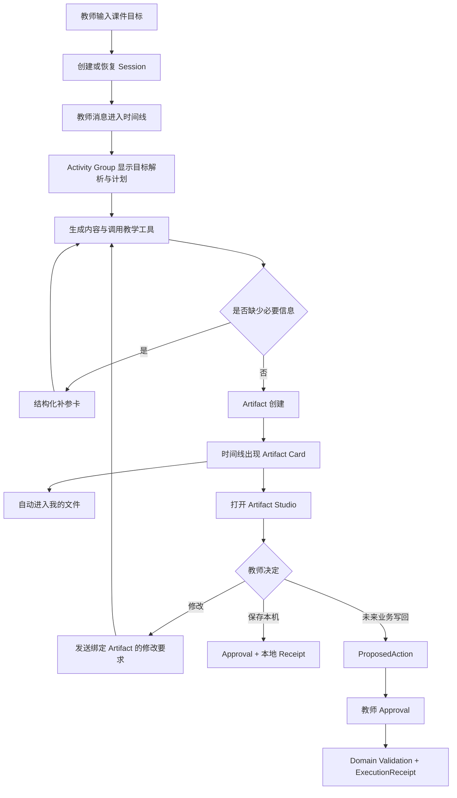

# TeachBuddy LUI Demo 升级产品需求文档

## 1. 文档定位

本文将 [LUI 讨论与行业调研](./LUI-DISCUSSION-AND-RESEARCH.md) 转换为当前 TeachBuddy Runtime Demo 的产品与交互升级要求，供后续大模型、产品设计和工程实现共同使用。

本文是待评审 PRD，不自动修改 [决策账本](../../docs/00-project/DECISION-LEDGER.md) 或现有 [Runtime Feature Spec](../../docs/04-specs/features/teachbuddy-agent-runtime/README.md)。实施前如发现与 `LOCKED` 决策冲突，以决策账本为准，并记录差异。

配套视觉参考：

- [可交互 LUI 原型](./teachbuddy-lui-redesign-prototype.html)
- [默认方案高清截图](./teachbuddy-lui-redesign-prototype.png)

## 2. 背景与问题

当前 TeachBuddy 已能通过真实本机 DeepSeek Harness 完成多轮对话、调用教学工具、生成 Markdown/HTML Artifact、停止、恢复、审阅、保存和下载。但运行界面仍采用较通用的消息投影：多数事件显示为 Actor、Title 和 Summary 文本，Artifact 内容以转义原文为主。

这导致用户看到的是“模型输出和日志”，而不是“一个可理解、可控制的教学任务”。在课件生成场景中，典型问题为：

- 原始 Markdown 标记暴露；
- 长文本缺乏标题、段落、表格和数学表达层级；
- 当前处理步骤不清楚；
- 工具调用没有业务意义；
- 课件出现太晚，预览与修改不够突出；
- 失败、停止、继续、保存等状态缺乏统一的状态语言；
- 通用对话布局无法充分承载课件这种持续编辑的 Artifact。

## 3. 产品目标

### 3.1 核心目标

将当前 Runtime Surface 升级为一个自然语言驱动、结构化过程可见、Artifact 可持续审阅、教师可以随时干预的教学任务工作台。

### 3.2 用户结果

完成升级后，教师应能在 2 秒内回答：

1. 我让 TeachBuddy 做什么？
2. 它现在做到哪一步？
3. 已经产生了什么结果？
4. 我现在可以做什么？
5. 结果保存在哪里，是否已经发布？

### 3.3 业务结果

- 提高课件、测验、教案等产物型任务的可理解性；
- 降低教师对模型原始输出和内部技术概念的认知负担；
- 为补参、审批、执行和评价建立统一的 UI 容器；
- 为未来业务 API、专业 Agent 和更多 Artifact 类型留下稳定扩展点；
- 保持当前真实 Harness、恢复机制、幂等命令和文件库能力。

## 4. 非目标

本次升级不包括：

- 接入真实 ClassIn 业务数据 API；
- 新建模型选择器、API Key 输入或内部 Agent 选择器；
- 向教师展示模型私有 Chain of Thought；
- 替换 DeepSeek Harness；
- 建设完整 PPT 编辑器或生产级课件排版引擎；
- 将本地 Artifact 保存解释为 ClassIn/TeacherIn 正式发布；
- 为追求 token 级动画立即重写为 SSE/WebSocket；
- 修改学生端页面；
- 重做 ClassIn 全局 Shell 或导航体系。

## 5. 目标用户与核心场景

### 5.1 主要用户

备课中的教师。用户理解教学目标、课程内容和课堂节奏，但不要求理解 Agent、Skill、MCP、Provider 或模型运行细节。

### 5.2 核心任务

教师通过自然语言要求 TeachBuddy 生成一份九年级二次函数 HTML 课件，并在同一任务中观察过程、预览课件、提出修改、保存文件。

### 5.3 后续兼容任务

- 生成测验试卷；
- 生成教案或课程方案；
- 生成课堂活动；
- 基于已有 Artifact 继续修改；
- 未来基于授权业务上下文生成并提出写回动作。

## 6. 产品设计决策

### 6.1 默认使用“渐进时间线”

无 Artifact 或普通对话任务使用方案 A：

```text
Header
├── Task Identity / Runtime Status
Timeline
├── Teacher Message
├── Activity Group
├── Tool Invocation
├── Agent Message
├── Artifact Card
└── Approval / Receipt / Error
Composer
```

### 6.2 产物出现后允许进入“产物工作室”

课件、测验或教案出现后，教师可以打开方案 B：

```text
┌────────────────┬──────────────────────────┬───────────────┐
│ Brief / Process│ Artifact Canvas          │ Outline / QA  │
│ Conversation   │ Preview / Current Page   │ Context       │
└────────────────┴──────────────────────────┴───────────────┘
```

Studio 是同一 Run 的另一种 Projection，不创建新 Session，不丢失输入草稿、当前 Artifact、版本、页面选择和运行状态。

### 6.3 “运行账本”作为调试视图

方案 C 不作为普通教师默认视图。它可作为开发环境、内部 Inspector 或未来专家模式，显示时间、事件类型、处理内容、业务证据和状态。

## 7. 核心用户链路



## 8. 信息架构

### 8.1 Header

Header 负责回答：当前是什么任务、处于什么状态、有哪些全局视图入口。

必须包含：

- Session 标题；
- Runtime 状态；
- 返回入口（适用时）；
- 历史会话；
- 新建会话；
- Context/Artifact Inspector 开关；
- 当前运行时的停止或恢复入口可以放在 Run Header 或 Composer，不重复堆叠。

不得包含：

- 模型选择；
- Provider；
- Skill/MCP/内部 Agent 列表；
- 无业务意义的连接帧或 token 数。

### 8.2 Timeline

Timeline 是同一 Run 的连续事实投影。它包含消息、Activity、工具、Artifact、审批、回执和错误，但不把每个底层 Event 都渲染成独立消息。

### 8.3 Inspector

桌面端只保留一个活动辅助区，按内容在以下视图间切换：

- Context；
- Artifact Preview；
- Artifact Outline/QA；
- Run Detail（内部或高级模式）。

面板关闭后主区回收空间；重新打开保留选择、滚动和草稿现场。

### 8.4 Composer

Composer 始终属于当前 Run。它需要感知当前上下文：

- 普通 Run：向 TeachBuddy 输入要求；
- 当前有 Artifact：继续调整当前产物；
- 当前选中课件页面：修改第 N 页；
- Awaiting Input：提交结构化补参；
- Awaiting Approval：输入区可保留，但主要操作转到审批卡。

## 9. 功能需求

### FR-01：Runtime Timeline ViewModel

前端 Feature 层必须建立独立 Projection，将 RuntimeSession 转换为稳定的 `RuntimeTimelineItemVM[]`。React 页面不得继续直接按通用 Event 循环决定所有显示。

建议的 ViewModel：

```ts
type RuntimeTimelineItemVM =
  | TeacherMessageVM
  | AgentMessageVM
  | ActivityGroupVM
  | ToolInvocationVM
  | ContextRequestVM
  | ArtifactVM
  | ProposedActionVM
  | ApprovalVM
  | ReceiptVM
  | RuntimeErrorVM
  | UnknownEventVM;
```

要求：

- 每个 Item 有稳定 `id`；
- 支持同一 Item 原位更新；
- 支持从完整 Session 快照重建；
- 未知 Event 安全退化；
- Projection 是纯函数或可单测 Deep Module；
- Domain Contract 不依赖 React、DOM 或具体组件。

### FR-02：教师消息

- 显示教师原始输入；
- 保留换行；
- 发送 pending、completed、failed 状态可区分；
- 明确失败时可以返回 Composer 修改；
- 未知写结果不能自动重复发送；
- 消息过长时允许折叠，但复制得到完整内容。

### FR-03：Agent 文本渲染

- 使用安全 Markdown 渲染器；
- 支持标题、段落、列表、表格、代码和链接；
- 数学表达可进入受控公式渲染器；
- 禁止任意 HTML 执行；
- 未完成文本显示 streaming 状态；
- 完成后布局稳定，不闪动重排；
- 不渲染模型私有 Reasoning；
- 原始 `**`、`##`、表格管线符不应作为正常结果暴露。

### FR-04：Activity Group

将相邻、属于同一 Turn/Goal 的过程 Event 聚合成一个可折叠 Activity Group。

显示内容：

- 当前目标；
- 已完成步骤数 / 总步骤数；
- 当前步骤；
- 完成步骤；
- 失败或等待步骤；
- 可选耗时；
- 停止入口。

默认策略：

- Running：展开当前步骤；
- Completed：折叠为摘要；
- Failed：自动展开失败步骤；
- 恢复 Session 后保持语义正确，不要求保持浏览器临时展开状态。

不得使用伪造思考语句，例如“我正在认真思考……”。步骤必须来自稳定事件或可验证的业务 Projection。

### FR-05：Tool Invocation

Tool 组件必须显示：

- 对教师可理解的动作名称；
- 目标对象或输入摘要；
- running/completed/failed/awaiting_approval 状态；
- 可读结果摘要；
- 失败时的恢复动作。

默认折叠规则：

- 成功工具折叠成单行；
- 运行中显示当前动作；
- 失败自动展开；
- 参数 JSON 和底层日志进入“详情”，不作为默认内容。

工具名称需要通过 Manifest 映射为业务文案，不能直接显示内部函数名。

### FR-06：Artifact Card

Artifact 首次创建时在 Timeline 中产生稳定卡片，后续版本在原卡片更新。

显示内容：

- 标题；
- 文件名和格式；
- 当前版本；
- draft/saved 状态；
- 创建或更新时间；
- 是否已进入“我的文件”；
- 主要动作：预览、继续编辑；
- 次要动作：下载、查看来源 Session。

文案必须区分：

- “已保存到本机”；
- “已进入我的文件”；
- “已创建 ClassIn 草稿”；
- “已正式发布”。

当前 Demo 只允许前两种事实。

### FR-07：Artifact Preview

- Markdown 使用安全文档渲染；
- HTML 使用现有受限 iframe、CSP 和无权限 sandbox；
- TXT/JSON 使用可读文本或结构视图；
- Preview 加载、失败、格式不支持均有明确状态；
- 原始内容仍可下载；
- 预览失败不能破坏 Timeline；
- 关闭再打开保留当前 Artifact 选择。

### FR-08：Artifact Studio

对于 `html-courseware` 或其他产物型 Task Type，提供 Artifact-first 布局。

第一阶段功能：

- 主画布预览完整课件；
- 页面大纲；
- 当前页选择；
- 当前生成/校验状态；
- 针对整个课件或当前页继续输入修改；
- 保存、下载、回到完整 Timeline。

第一阶段不要求：

- 直接拖拽式 PPT 编辑；
- 富文本所见即所得；
- 任意 DOM 选区改写；
- 多人实时协作。

### FR-09：Composer Context

Composer 上方或内部用低噪 Chip 表示当前作用对象：

```text
[二次函数互动课件.html · v2] [第 5 页]
```

提交命令至少关联：

- Session ID；
- 文本；
- Command ID；
- 可选 Artifact ID；
- 可选 Artifact Version；
- 可选 Page/Section Reference。

后端尚不支持结构化 Artifact Target 时，前端可以先把可读引用加入文本，但不能伪装成已经绑定的稳定业务引用。

### FR-10：滚动与增量更新

- 用户距离底部小于既定阈值时跟随最新内容；
- 用户主动向上滚动后停止自动跟随；
- 新内容到达时显示“回到最新”；
- 点击后恢复跟随；
- 当前 Message/Activity 原位更新；
- 切换 Session 时恢复到合理位置；
- Header 和 Composer 不随 Timeline 滚动；
- `prefers-reduced-motion` 下关闭非必要运动。

### FR-11：停止、失败与恢复

必须覆盖：

- 发送失败；
- Session 创建失败；
- 读取失败；
- Tool 失败；
- Artifact 预览失败；
- 停止中；
- 已停止；
- 断线恢复；
- 后端仍在运行但页面暂时离线；
- 未知写结果；
- 终止后保留已有消息和 Artifact。

错误组件必须回答：

1. 什么没有完成；
2. 已完成内容是否保留；
3. 用户可以执行什么恢复动作；
4. 重试是否会产生重复副作用。

### FR-12：Approval 与 Receipt

保存本机 Artifact 时：

- 审批绑定 Artifact ID 和 Version；
- Pending 时禁止重复提交；
- 成功后显示本地 Receipt；
- 重复相同 Command ID 不产生重复副作用；
- Receipt 明确 `local-runtime` 真值。

未来业务写回时：

- 先显示 ProposedAction；
- 显示将改变的业务对象、字段和影响；
- 教师可修改、拒绝或批准；
- 执行后显示领域对象和 ExecutionReceipt；
- 不能用普通“确认”按钮绕过领域校验。

### FR-13：历史会话

- 保留当前 Profile Scope 隔离；
- 标题、状态和更新时间可见；
- Running Session 有明确状态；
- 切换历史不会取消后台任务；
- 当前浏览器草稿按 Session 隔离；
- 恢复失败不覆盖已有服务器快照。

### FR-14：评价入口

评价至少区分：

- 对 Agent 回复的评价；
- 对 Artifact 当前版本的评价；
- 对整个任务结果的评价；
- 对业务执行结果的评价。

第一版可以只实现 Artifact/Run 两个低噪入口，但数据事件必须带 Session ID、Artifact ID/Version 和评价对象类型。

### FR-15：未知事件退化

当 Runtime 返回前端未识别的事件类型时：

- 时间线不崩溃；
- 显示安全摘要；
- 不执行 payload 中的 HTML 或脚本；
- 保留 Event ID 供调试；
- 开发环境可以在 Run Detail 查看原始 JSON；
- 普通教师界面不显示内部堆栈。

## 10. 建议的组件结构

```text
AgentRuntimeSurface
├── RuntimeHeader
├── RuntimeBody
│   ├── SessionHistory
│   ├── RuntimeConversation
│   │   ├── RuntimeTimeline
│   │   │   ├── TeacherMessage
│   │   │   ├── AgentMessage
│   │   │   ├── ActivityGroup
│   │   │   │   └── ActivityStep
│   │   │   ├── ToolInvocation
│   │   │   ├── ContextRequest
│   │   │   ├── ArtifactCard
│   │   │   ├── ProposedActionCard
│   │   │   ├── ApprovalCard
│   │   │   ├── ReceiptCard
│   │   │   └── RuntimeErrorCard
│   │   └── RuntimeComposerDock
│   └── RuntimeInspector
│       ├── ContextInspector
│       ├── ArtifactPreview
│       ├── ArtifactOutline
│       └── RunDetail
└── RuntimeOverlayHost
```

建议新增 Deep Module：

```text
runtime-timeline-projection/
├── project-runtime-session.ts
├── group-activity-events.ts
├── resolve-event-copy.ts
├── resolve-tool-presentation.ts
└── project-runtime-session.test.ts
```

页面组件只消费 ViewModel，不处理 Harness 原始事件、轮询协调、命令幂等或文件物化。

## 11. 事件到组件的映射建议

| 当前字段/对象 | Projection 判断 | UI 组件 |
| --- | --- | --- |
| `teacher_message` | 教师消息 | `TeacherMessage` |
| `process` + agent | Agent 可见文本或 Activity | `AgentMessage` / `ActivityGroup` |
| `capability_call` + running | 工具运行 | `ToolInvocation` |
| `capability_call` + completed | 工具结果摘要 | 折叠 `ToolInvocation` |
| `capability_call` + failed | 工具失败 | 展开 `RuntimeErrorCard` |
| `RuntimeArtifact` | Artifact 创建/版本更新 | `ArtifactCard` |
| `operation approve pending` | 本地保存中 | `ApprovalCard` 或 Artifact 状态 |
| `artifact.receipt` | 本地保存成功 | `ReceiptCard` |
| `session.status=stopped` | 已停止，可继续 | `RuntimeNotice` |
| `session.status=failed` | 失败与恢复 | `RuntimeErrorCard` |
| 未识别事件 | 安全退化 | `UnknownEvent` |

现有 `process` 语义不足以稳定区分 Agent Message 与 Activity。实现时优先在 BFF Projection 增加稳定 discriminator；短期可使用受测试保护的规则派生，不允许在 React JSX 中散落字符串判断。

## 12. 页面状态模型

| 状态 | Timeline | Composer | Inspector | 主操作 |
| --- | --- | --- | --- | --- |
| Empty | 欢迎与能力示例 | 可输入 | Context 可选 | 发送 |
| Creating | 教师消息 pending | 禁用 | 保持 | 等待/取消（若支持） |
| Running | 当前 Activity 展开 | 可停止；发送策略按 Runtime 决定 | 可看产物/上下文 | 停止 |
| Awaiting Input | 补参卡展开 | 辅助输入 | Context 可联动 | 提交信息 |
| Awaiting Approval | Action/Approval 卡展开 | 普通发送降级 | 显示影响对象 | 修改/拒绝/批准 |
| Stopping | 当前步骤显示停止中 | 禁用重复停止 | 保持 | 等待 |
| Stopped | 已有内容保留 | 可继续发送 | 保持 | 继续 |
| Recovering | 显示恢复状态 | 禁用写操作 | 保留缓存快照 | 重连 |
| Failed Recoverable | 错误与影响范围 | 视命令决定 | 保留 | 重试/修改 |
| Completed Pending Review | 结论和 Artifact | 可继续修改 | 自动建议打开 Artifact | 审阅 |
| Completed | Receipt/结果稳定 | 可继续新一轮 | 保持 | 新建/继续 |

## 13. 视觉与交互规范

### 13.1 视觉层级

层级从高到低：

1. 当前 Artifact 或当前需要教师决定的事项；
2. 当前运行步骤；
3. Agent 结论；
4. 已完成过程；
5. 工具详情和底层证据。

不得让每个事件都使用相同卡片、边框、字号和留白。

### 13.2 颜色

- ClassIn 品牌绿：主操作、运行节点、成功状态；
- 中性灰：Shell、文字、分隔和完成后降噪；
- 蓝/紫等辅助色：不同内容层级或工具类型，面积受限；
- 黄色：待审阅或草稿；
- 红色：失败与危险动作；
- 不只依赖颜色表达状态，必须配合图标和文案。

### 13.3 动效

- Current Step 可以使用低幅度脉冲或旋转；
- Step 完成使用一次状态过渡，不庆祝；
- Artifact 出现使用 opacity/transform；
- 面板开关不造成主内容跳跃；
- Reduced Motion 下保留状态文案，移除旋转和脉冲；
- 不使用逐字动画制造虚假进度。

### 13.4 文案

推荐：

- “正在生成第 6 页，共 8 页”；
- “已完成 HTML 自包含检查”；
- “草稿已进入‘我的文件’，尚未发布到 ClassIn”；
- “生成已停止，已完成的内容仍然保留”；
- “请求结果暂时未知，请先恢复会话后再决定是否重试”。

避免：

- “AI 正在思考”；
- “调用 create_teaching_draft”；
- “MCP 执行成功”；
- “保存成功”但不说明保存到哪里；
- “发布成功”用于本地文件保存。

## 14. 响应式要求

### 桌面宽屏

- Timeline + 360px Inspector；
- Studio 可以使用三栏；
- Header、Timeline、Inspector、Composer 各自滚动责任明确。

### 中等宽度

- 全局 Sidebar 可按既有规则收窄；
- Studio 收起 Outline，只保留对话/产物双栏；
- Inspector 宽度不得挤压主区到不可读。

### 窄屏

- 单栏 Timeline 为默认；
- Inspector 与 Studio 使用全屏子视图或 Overlay；
- Composer 固定但不得遮挡最后一条内容；
- 所有操作可触摸，按钮文案不折行；
- 320、375、414、768 CSS px 无横向溢出；
- 隐藏区域不能被键盘聚焦。

## 15. 无障碍要求

- Timeline 使用语义列表；
- 流式状态使用克制的 `role=status`，避免每个 token 播报；
- 错误使用 `role=alert`；
- 可折叠 Activity 使用 `aria-expanded` 和 `aria-controls`；
- Tool、Artifact 和审批按钮有明确可访问名称；
- 预览区域可键盘进入和退出；
- Focus Ring 对比度达标；
- 状态不只依赖颜色；
- 动画支持 `prefers-reduced-motion`；
- 运行时范围 axe 无违规。

## 16. 安全与真值

### 16.1 内容安全

- Markdown 禁止未经治理的 HTML；
- HTML Artifact 继续使用现有 sandbox 和 CSP；
- Tool payload 在进入组件前必须 Schema 校验；
- 外部链接明确来源，按产品策略打开；
- 未知内容退化为纯文本或下载。

### 16.2 业务真值

- 普通页面不显示开发用 Mock Badge；
- Adapter、Receipt、测试和 Evidence 保留 truth label；
- “已保存到本机”不能写成“已发布”；
- 没有业务 API 时不能声称读取了课程、班级或学生数据；
- 预计耗时不能表述为生产 SLA；
- 静态原型中的流程数据不得被当成真实 Runtime 证据。

## 17. 数据与评价事件

本次不设未经验证的成功指标数值。建议先建立基线，再确定目标。

建议采集：

| 事件 | 关键字段 | 用途 |
| --- | --- | --- |
| `runtime_message_sent` | sessionId, commandId, targetType | 任务开始与修改意图 |
| `runtime_activity_viewed` | activityType, expanded | 过程信息是否有用 |
| `runtime_tool_detail_opened` | toolPresentationId, state | 工具透明度需求 |
| `artifact_opened` | artifactId, version, source | 产物发现能力 |
| `artifact_target_selected` | artifactId, sectionRef | 页面级修改使用情况 |
| `runtime_stopped` | stepRef, reason | 停止行为和误操作 |
| `runtime_recovered` | failureType, elapsedBucket | 恢复能力 |
| `approval_decided` | actionType, decision, version | 人工审批闭环 |
| `artifact_feedback_submitted` | artifactId, version, ratingType | 产物质量评价 |
| `run_feedback_submitted` | sessionId, outcome | 整体任务评价 |

不得将教师输入全文、学生事实或 Artifact 正文默认写入未经治理的分析日志。

## 18. 实施阶段与 Write Set 建议

### Phase 0：Projection 与安全渲染

目标：在不改 Transport 的情况下解决原始文本和事件同质化。

建议范围：

- `src/features/agent-runtime/runtime-timeline-projection/*`
- `src/features/agent-runtime/components/*`
- `src/features/agent-runtime/AgentRuntimeSurface.tsx`
- `src/features/agent-runtime/AgentRuntimeSurface.module.css`
- 对应单元测试和 E2E

交付：

- Timeline ViewModel；
- 安全 Markdown；
- Message、Activity、Tool、Artifact、Error 组件；
- 当前轮询链路保持不变。

### Phase 1：Artifact Studio

目标：让课件成为主工作对象。

交付：

- Artifact-first 视图；
- 课件预览与页面大纲；
- Artifact/Version Target；
- 修改后回到同一 Run；
- 窄屏全屏预览。

### Phase 2：补参与审批闭环

目标：支持需要用户输入、业务动作和回执的专业 Agent 体验。

交付：

- Context Request；
- ProposedAction；
- Approval；
- ExecutionReceipt；
- Artifact 与 Run 评价。

### Phase 3：传输体验优化

目标：基于实际测量决定是否引入浏览器增量流。

交付候选：

- SSE 或 WebSocket Adapter；
- Snapshot + Delta 协调；
- 断点恢复；
- Token/Part 级稳定更新。

该阶段不能破坏现有 HTTP Adapter 和 Runtime Timeline ViewModel。

## 19. 验收标准

### AC-01：Markdown 不再裸露

Given 模型返回标题、粗体、列表和表格，When 页面显示回复，Then 用户看到排版后的结构，不看到用于排版的 `**`、`##` 和表格分隔行。

### AC-02：过程可理解

Given Session 正在生成课件，When 教师查看 Timeline，Then 页面显示当前目标、当前步骤和已完成步骤，且不显示模型私有推理。

### AC-03：事件原位更新

Given 同一 Step 收到多个快照或 Delta，When UI 更新，Then 原有 Activity Item 原位变化，不创建重复消息。

### AC-04：工具状态清晰

Given 教学工具运行、成功或失败，When UI 投影事件，Then 三种状态使用同一 Tool Item 更新，失败自动显示恢复入口。

### AC-05：Artifact 可发现

Given Artifact 生成成功，When Session 快照更新，Then Timeline 出现 Artifact Card，“我的文件”可以找到它，右侧可以安全预览。

### AC-06：事实边界正确

Given Artifact 已自动进入文件库但未批准保存或发布，When 页面显示状态，Then 文案明确为本地文件/我的文件，不声称 ClassIn 发布。

### AC-07：停止保留现场

Given Run 正在生成，When 教师停止，Then实际 Runtime Cancel 被调用，已完成消息和 Artifact 保留，Composer 允许继续提出要求。

### AC-08：未知写结果不重复

Given写请求网络结果未知，When页面恢复，Then系统先重新读取 Session，不自动重复写操作，并提供符合现有 Command ID 语义的恢复选项。

### AC-09：滚动不抢夺

Given 教师正在查看较早消息，When新事件到达，Then页面不强制跳到底部，并显示“回到最新”；教师位于底部时则自动跟随。

### AC-10：Studio 不创建新任务

Given 当前 Run 已有课件，When教师打开 Artifact Studio，Then Session ID、Artifact ID、Version、输入草稿和运行状态保持不变。

### AC-11：窄屏可用

Given 320、375、414、768 CSS px 视口，When使用 Timeline、打开预览和发送修改，Then无横向溢出、无内容遮挡、无不可达操作。

### AC-12：无障碍

Given运行时主要状态，When执行自动无障碍检查和键盘操作，Then Runtime 范围 axe 无违规，所有交互可聚焦、可操作、可理解。

### AC-13：回归保护

Given现有真实 Runtime 能力，When完成 UI 升级，Then多轮、刷新、历史、停止、离线、审阅、保存、下载、Profile Scope 隔离和冷重启恢复仍通过原有测试。

## 20. 测试策略

### 单元测试

- Event → ViewModel 映射；
- Activity 聚合；
- 稳定 ID；
- 未知事件退化；
- Tool Presentation Manifest；
- Artifact 状态与 Receipt；
- Markdown 安全策略；
- 失败恢复命令。

### 组件测试

- Activity 展开/折叠；
- Stop/Retry/Approve Disabled 状态；
- Message streaming/done；
- Artifact Card 原位版本更新；
- “回到最新”；
- Inspector 保留现场；
- 键盘和 Screen Reader 标签。

### E2E

- 新 Session 第一轮；
- 第二轮上下文；
- 课件生成和 Artifact Studio；
- 停止与继续；
- 刷新恢复；
- 离线与重连；
- 保存和下载；
- 失败与未知写结果；
- 1440×900 与 390×844；
- 320/375/414/768 布局扫描；
- axe 与页面错误检查。

### 视觉验收

- 无 Markdown 语法裸露；
- 当前状态在 2 秒内可识别；
- Artifact 的视觉优先级高于完成后的工具记录；
- Header/Composer 固定且不遮挡；
- 长中文标题、长文件名、长工具结果不溢出；
- Running、Awaiting Input、Awaiting Approval、Failed、Stopped、Completed Pending Review 均有样例。

## 21. 对下一位实现模型的约束

1. 先读取仓库根 `AGENTS.md`、项目简报、决策账本、Runtime Spec 和目标代码；
2. 不覆盖用户现有修改；
3. 保留当前 AgentRuntimeAdapter、Session 恢复、Command ID 和本地文件库能力；
4. 不把静态原型内容硬编码进生产页面；
5. 不以随机定时器伪造真实运行进度；
6. 不直接渲染模型 HTML；
7. 不引入模型选择、Skill/MCP 暴露或内部日志作为普通教师界面；
8. 优先实现 Deep Projection Module，再拆 UI 组件；
9. 先交付一条可运行的课件纵向闭环，再扩展所有事件类型；
10. 运行范围内单测、E2E、视觉和无障碍检查，并更新唯一事实源。

## 22. 建议实施优先级

| 优先级 | 内容 | 原因 |
| --- | --- | --- |
| P0 | Timeline Projection | 解决所有组件的共同数据入口 |
| P0 | 安全 Markdown/数学表达 | 直接修复当前截图中的裸语法 |
| P0 | Activity Group | 让教师理解正在做什么 |
| P0 | Tool Invocation | 区分运行证据与回复文本 |
| P0 | Artifact Card + Preview | 课件任务的核心结果 |
| P1 | Artifact Studio | 提升产物型任务效率 |
| P1 | 回到最新与精细滚动 | 支持真实长任务阅读 |
| P1 | Context Request/Approval UI | 建立专业 Agent 人工闭环 |
| P2 | 评价事件 | 支持后续效果优化 |
| P2 | Run Detail/账本 | 支持调试与审计 |
| P2 | 浏览器 SSE/WebSocket | 由延迟测量决定 |

## 23. 开放问题

以下问题不阻塞 Phase 0，但应在 Artifact Studio 前确认：

1. HTML 课件能否稳定解析页面大纲，还是需要生成工具同时输出 Manifest？
2. Artifact 修改的最小定位单位是文件、页面、区块还是 DOM Selection？
3. 当 Agent 同时生成课件和测验时，Studio 如何切换多个 Artifact？
4. 页面质量检查哪些是确定性规则，哪些是模型评价？
5. Artifact 自动打开是否会打断正在阅读 Timeline 的教师？
6. Studio 是否只属于特定 Task Type，还是由 Artifact Renderer Manifest 决定？
7. 当前 `ConversationRunEvent.kind=process` 是否扩展，或新建稳定 UI Projection Contract？
8. 未来业务 API 接入时，Core Context 的默认选择和权限边界如何定义？

推荐对第 1、2、5、7 项先制作可运行纵向切片，再由教师体验和工程证据决定。

## 24. 完成定义

本次 LUI Demo 升级只有同时满足以下条件才算完成：

- 符合所有相关 `LOCKED` 决策；
- 课件生成纵向链路可从自然语言输入走到 Artifact 审阅和本地保存；
- 普通教师界面不暴露模型内部实现；
- 不再裸露常见 Markdown 语法；
- 运行、停止、失败、恢复、待审阅和完成状态清楚；
- Artifact 自动进入“我的文件”，真值文案正确；
- 当前真实 Harness 能力和恢复能力无回归；
- 桌面与窄屏无溢出、遮挡和不可达操作；
- Runtime 范围无障碍检查通过；
- 实现、测试、Spec 和验收记录同步更新；
- 未实现能力和剩余风险明确记录。
